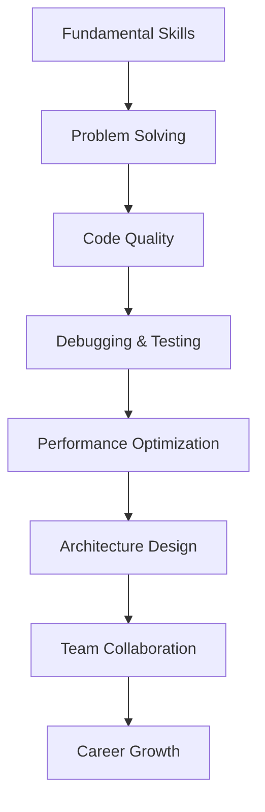

# Dev Insights & Career 2025

Chào mừng bạn đến với category **Dev Insights & Career 2025**! Đây là nơi bạn sẽ tìm thấy những insights quý giá về development, career tips, và best practices cho developers.

## 🎯 Mục tiêu category

Category này tập trung vào:
- **Development Insights**: Những bài học từ thực tế
- **Career Development**: Tips phát triển sự nghiệp
- **Best Practices**: Coding standards và methodologies
- **Industry Trends**: Xu hướng công nghệ 2025
- **Problem Solving**: Cách tiếp cận và giải quyết vấn đề

## 📚 Các bài viết trong category

### 🔥 Bài viết nổi bật

- [Debugging Java & JavaScript: Common Bugs và Solutions](/posts/debugging-java-js-common-bugs/)

### 📖 Tất cả bài viết

Các bài viết trong category này sẽ được hiển thị tự động bởi Hugo taxonomy system.

## 🚀 Roadmap phát triển

## 🎯 Ai nên theo dõi category này?

- ✅ **Junior Developers** muốn học từ kinh nghiệm thực tế
- ✅ **Mid-level Developers** muốn nâng cao kỹ năng
- ✅ **Senior Developers** muốn chia sẻ insights
- ✅ **Career Changers** muốn hiểu về development career
- ✅ **Students** muốn chuẩn bị cho sự nghiệp IT

## 📈 Cập nhật thường xuyên

Category này sẽ được cập nhật thường xuyên với:
- Debugging tips và techniques
- Career development advice
- Industry insights và trends
- Best practices từ real projects
- Problem-solving methodologies

---

*Theo dõi category này để phát triển sự nghiệp development một cách hiệu quả!* 🚀
