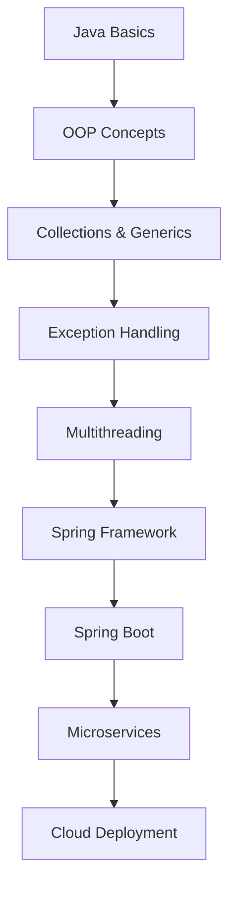

# Java Mastery 2025

Chào mừng bạn đến với category **Java Mastery 2025**! Đây là nơi bạn sẽ học Java từ cơ bản đến nâng cao với các modern features, Spring Boot framework, và best practices cho năm 2025.

## 🎯 Mục tiêu category

Category này tập trung vào:
- **Java Fundamentals**: Core concepts và syntax
- **Modern Java Features**: Java 17/21 LTS, Records, Pattern Matching
- **Spring Framework**: Spring Boot, Spring Security, Spring Data
- **Best Practices**: Clean code, design patterns, performance optimization
- **Enterprise Development**: Microservices, cloud-native applications

## 📚 Các bài viết trong category

### 🔥 Bài viết nổi bật

- [Java Development Environment Setup 2025](/posts/java-setup-tutorial/)
- [Java OOP Tutorial: Từ cơ bản đến nâng cao](/posts/java-oop-tutorial/)
- [Spring Boot REST API Development](/posts/spring-boot-rest-api/)

### 📖 Tất cả bài viết

Các bài viết trong category này sẽ được hiển thị tự động bởi Hugo taxonomy system.

## 🚀 Roadmap phát triển

## 🎯 Ai nên theo dõi category này?

- ✅ **Beginners** muốn học Java từ đầu
- ✅ **Junior Developers** muốn nâng cao kỹ năng Java
- ✅ **Backend Developers** muốn master Spring Boot
- ✅ **Career Changers** muốn chuyển sang Java development
- ✅ **Students** muốn chuẩn bị cho sự nghiệp Java

## 📈 Cập nhật thường xuyên

Category này sẽ được cập nhật thường xuyên với:
- Modern Java features và syntax
- Spring Boot tutorials và best practices
- Performance optimization techniques
- Enterprise development patterns
- Cloud-native Java applications

---

*Theo dõi category này để trở thành Java expert và xây dựng sự nghiệp backend development thành công!* 🚀
