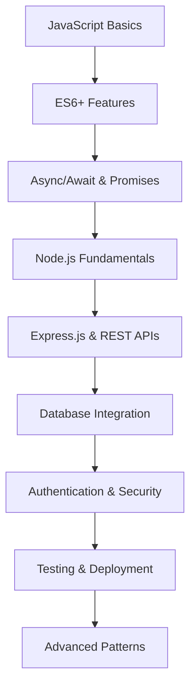

# Modern JavaScript 2025

Chào mừng bạn đến với category **Modern JavaScript 2025**! Đây là nơi bạn sẽ tìm thấy những kiến thức mới nhất về JavaScript và các công nghệ liên quan.

## 🎯 Mục tiêu category

Category này tập trung vào:
- **ES6+ Features**: Các tính năng JavaScript hiện đại
- **Node.js Development**: Server-side JavaScript
- **Modern Frameworks**: React, Vue, Angular
- **Best Practices**: Code quality, performance, security
- **Real-world Projects**: Ứng dụng thực tế

## 📚 Các bài viết trong category

### 🔥 Bài viết nổi bật

- [JavaScript ES6+ Features Nâng Cao: Generators, Proxies và Symbols](/posts/javascript-es6-features/)
- [Node.js Server Tutorial: Xây dựng REST API từ cơ bản đến nâng cao](/posts/nodejs-server-tutorial/)

### 📖 Tất cả bài viết

Các bài viết trong category này sẽ được hiển thị tự động bởi Hugo taxonomy system.

## 🚀 Roadmap học tập

## 🎯 Ai nên theo dõi category này?

- ✅ **Frontend Developers** muốn nâng cao kỹ năng JavaScript
- ✅ **Backend Developers** muốn học Node.js
- ✅ **Full-stack Developers** muốn master JavaScript ecosystem
- ✅ **Career Changers** từ ngôn ngữ khác sang JavaScript
- ✅ **Students** muốn học modern web development

## 📈 Cập nhật thường xuyên

Category này sẽ được cập nhật thường xuyên với:
- Bài viết mới về JavaScript features
- Tutorials thực tế
- Best practices và tips
- Case studies từ các project thực tế

---

*Theo dõi category này để không bỏ lỡ những kiến thức JavaScript mới nhất!* 🚀
