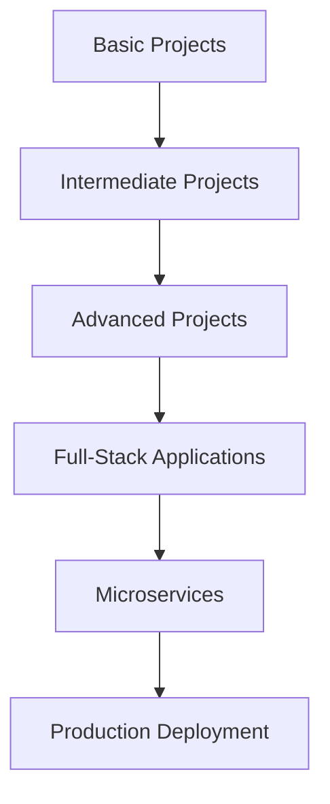

# Thực Chiến Projects

Chào mừng bạn đến với category **Thực Chiến Projects**! Đây là nơi bạn sẽ tìm thấy các dự án thực tế, code examples chi tiết, và hands-on tutorials để áp dụng kiến thức lý thuyết vào thực tế.

## 🎯 Mục tiêu category

Category này tập trung vào:
- **Real-world Projects**: Các dự án thực tế từ cơ bản đến nâng cao
- **Code Examples**: Ví dụ code chi tiết và có thể chạy được
- **Hands-on Tutorials**: Hướng dẫn từng bước thực hiện
- **Best Practices**: Áp dụng best practices trong thực tế
- **Problem Solving**: Giải quyết các vấn đề thực tế

## 📚 Các bài viết trong category

### 🔥 Bài viết nổi bật

Các bài viết trong category này sẽ được hiển thị tự động bởi Hugo taxonomy system.

### 📖 Tất cả bài viết

Các dự án thực tế sẽ bao gồm:
- Web applications với Spring Boot và React
- Mobile apps với React Native
- API development và integration
- Database design và implementation
- DevOps và deployment

## 🚀 Roadmap phát triển

## 🎯 Ai nên theo dõi category này?

- ✅ **Junior Developers** muốn thực hành với dự án thực tế
- ✅ **Students** muốn áp dụng kiến thức vào project
- ✅ **Career Changers** muốn build portfolio
- ✅ **Experienced Developers** muốn tham khảo implementation
- ✅ **Anyone** muốn học qua thực hành

## 📈 Cập nhật thường xuyên

Category này sẽ được cập nhật thường xuyên với:
- New project tutorials
- Code examples và best practices
- Real-world case studies
- Step-by-step implementation guides
- Deployment và DevOps tutorials

---

*Theo dõi category này để học lập trình qua thực hành và xây dựng portfolio ấn tượng!* 🚀
