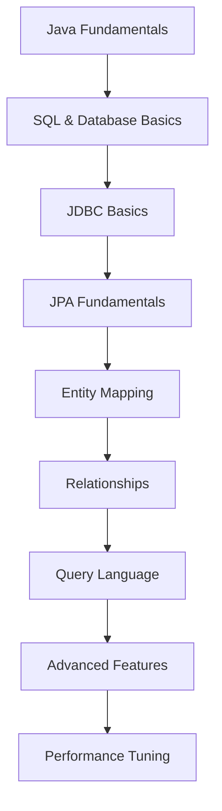

# Java Database với JPA: Từ Cơ Bản đến Nâng Cao

## 🚀 JPA là gì và tại sao quan trọng trong 2025?

**JPA (Java Persistence API)** là một specification Java cho Object-Relational Mapping (ORM) giúp lập trình viên làm việc với database một cách dễ dàng và hiệu quả. Trong năm 2025, JPA vẫn là standard cho Java database programming với hơn 80% thị phần.

### 🎯 Tại sao JPA quan trọng trong 2025?

- **Industry Standard**: Được sử dụng bởi hầu hết các công ty Java
- **Productivity**: Giảm 70% code so với JDBC thuần
- **Maintainability**: Code dễ đọc, dễ maintain hơn
- **Performance**: Hibernate và các implementation khác được optimize tốt
- **Enterprise Ready**: Hỗ trợ transactions, caching, connection pooling
- **Cloud Native**: Tương thích với microservices và cloud databases

### 📚 Roadmap học JPA cho người mới



**Lưu ý**: Bài viết này tập trung vào **Intermediate to Advanced Level** (cấp độ 4-9). Bạn cần có kiến thức cơ bản về Java và SQL.

## 🎯 Mục tiêu bài viết

Sau khi đọc xong bài viết này, bạn sẽ hiểu:
- **JPA Fundamentals**: Entity, EntityManager, Persistence Context
- **Entity Mapping**: Annotations, relationships, inheritance
- **Query Language**: JPQL, Criteria API, Native SQL
- **Advanced Features**: Caching, batch processing, lazy loading
- **Performance Optimization**: Best practices và tuning
- **Real-world Examples**: Practical applications

### 👥 Ai nên đọc bài viết này?

- ✅ **Sinh viên IT**: Có kiến thức Java cơ bản, muốn học database programming
- ✅ **Junior Developers**: Đã biết JDBC, muốn nâng cao với JPA
- ✅ **Career Changers**: Chuyển đổi sang Java Backend development
- ✅ **Full-stack Developers**: Muốn hiểu sâu về data layer
- ✅ **Experienced Developers**: Muốn cập nhật kiến thức JPA hiện đại

### 🎯 Khi nào sử dụng JPA?

**JPA** rất phù hợp khi bạn cần:
- **Complex Object Mapping**: Objects với nhiều relationships
- **Rapid Development**: Prototype nhanh với database
- **Enterprise Applications**: Large-scale applications với complex data
- **Team Development**: Standardized approach cho team
- **Maintainable Code**: Code dễ đọc và maintain

**Ví dụ thực tế**: E-commerce systems, banking applications, CRM systems, content management

## 📚 Kiến thức nền tảng về Database

### 🎯 Database là gì?

**Database** là một collection có tổ chức của data được lưu trữ và truy cập electronically. Database giúp lưu trữ, quản lý và truy xuất thông tin một cách hiệu quả.

**Tại sao cần Database?**
- **Data Persistence**: Lưu trữ data lâu dài
- **Data Integrity**: Đảm bảo tính toàn vẹn của data
- **Data Security**: Bảo mật thông tin
- **Data Sharing**: Chia sẻ data giữa applications
- **Data Consistency**: Đảm bảo tính nhất quán

### 🎯 SQL là gì?

**SQL (Structured Query Language)** là ngôn ngữ standard cho managing relational databases. SQL được sử dụng để:
- **CREATE**: Tạo tables, databases
- **INSERT**: Thêm data vào tables
- **SELECT**: Truy vấn data từ tables
- **UPDATE**: Cập nhật data
- **DELETE**: Xóa data

### Basic SQL Examples

```sql
-- Tạo table
CREATE TABLE users (
    id BIGINT PRIMARY KEY AUTO_INCREMENT,
    username VARCHAR(50) NOT NULL UNIQUE,
    email VARCHAR(100) NOT NULL UNIQUE,
    password_hash VARCHAR(255) NOT NULL,
    first_name VARCHAR(50),
    last_name VARCHAR(50),
    created_at TIMESTAMP DEFAULT CURRENT_TIMESTAMP,
    updated_at TIMESTAMP DEFAULT CURRENT_TIMESTAMP ON UPDATE CURRENT_TIMESTAMP
);

-- Thêm data
INSERT INTO users (username, email, password_hash, first_name, last_name) 
VALUES ('john_doe', 'john@example.com', 'hashed_password', 'John', 'Doe');

-- Truy vấn data
SELECT * FROM users WHERE email = 'john@example.com';

-- Cập nhật data
UPDATE users SET first_name = 'Johnny' WHERE id = 1;

-- Xóa data
DELETE FROM users WHERE id = 1;
```

### 🎯 JDBC vs JPA

**JDBC (Java Database Connectivity)** là Java API để connect và execute queries với database. **JPA** là higher-level abstraction built trên JDBC.

**So sánh JDBC vs JPA:**

| Aspect | JDBC | JPA |
|--------|------|-----|
| **Code Complexity** | Verbose, nhiều boilerplate | Concise, ít code hơn |
| **Object Mapping** | Manual mapping | Automatic mapping |
| **SQL Queries** | Native SQL required | JPQL, Criteria API |
| **Relationships** | Manual handling | Automatic handling |
| **Caching** | No built-in caching | Built-in caching |
| **Learning Curve** | Steeper | Gentler |

**JDBC Example:**
```java
// JDBC - Manual approach
public class UserDaoJDBC {
    public User findById(Long id) {
        String sql = "SELECT * FROM users WHERE id = ?";
        try (Connection conn = DriverManager.getConnection(url, username, password);
             PreparedStatement stmt = conn.prepareStatement(sql)) {
            
            stmt.setLong(1, id);
            ResultSet rs = stmt.executeQuery();
            
            if (rs.next()) {
                User user = new User();
                user.setId(rs.getLong("id"));
                user.setUsername(rs.getString("username"));
                user.setEmail(rs.getString("email"));
                // ... manual mapping
                return user;
            }
        } catch (SQLException e) {
            e.printStackTrace();
        }
        return null;
    }
}
```

**JPA Example:**
```java
// JPA - Automatic approach
@Entity
@Table(name = "users")
public class User {
    @Id
    @GeneratedValue(strategy = GenerationType.IDENTITY)
    private Long id;
    
    @Column(name = "username")
    private String username;
    
    @Column(name = "email")
    private String email;
    
    // Getters and setters
}

@Repository
public class UserRepository {
    @PersistenceContext
    private EntityManager entityManager;
    
    public User findById(Long id) {
        return entityManager.find(User.class, id);
    }
}
```

## 🏗️ Project Setup

### Maven Dependencies

```xml
<!-- pom.xml -->
<dependencies>
    <!-- JPA API -->
    <dependency>
        <groupId>jakarta.persistence</groupId>
        <artifactId>jakarta.persistence-api</artifactId>
        <version>3.1.0</version>
    </dependency>
    
    <!-- Hibernate Implementation -->
    <dependency>
        <groupId>org.hibernate</groupId>
        <artifactId>hibernate-core</artifactId>
        <version>6.4.0.Final</version>
    </dependency>
    
    <!-- H2 Database (for testing) -->
    <dependency>
        <groupId>com.h2database</groupId>
        <artifactId>h2</artifactId>
        <version>2.2.224</version>
        <scope>runtime</scope>
    </dependency>
    
    <!-- MySQL Driver -->
    <dependency>
        <groupId>mysql</groupId>
        <artifactId>mysql-connector-java</artifactId>
        <version>8.0.33</version>
    </dependency>
    
    <!-- Connection Pool -->
    <dependency>
        <groupId>com.zaxxer</groupId>
        <artifactId>HikariCP</artifactId>
        <version>5.0.1</version>
    </dependency>
</dependencies>
```

### Persistence Configuration

```xml
<!-- src/main/resources/META-INF/persistence.xml -->
<?xml version="1.0" encoding="UTF-8"?>
<persistence xmlns="https://jakarta.ee/xml/ns/persistence"
             xmlns:xsi="http://www.w3.org/2001/XMLSchema-instance"
             xsi:schemaLocation="https://jakarta.ee/xml/ns/persistence
             https://jakarta.ee/xml/ns/persistence/persistence_3_1.xsd"
             version="3.1">

    <persistence-unit name="jpa-tutorial" transaction-type="RESOURCE_LOCAL">
        <provider>org.hibernate.jpa.HibernatePersistenceProvider</provider>
        
        <!-- Entity Classes -->
        <class>com.devnetinsights.entity.User</class>
        <class>com.devnetinsights.entity.Product</class>
        <class>com.devnetinsights.entity.Order</class>
        
        <!-- Database Properties -->
        <properties>
            <!-- Database Connection -->
            <property name="jakarta.persistence.jdbc.driver" value="com.mysql.cj.jdbc.Driver"/>
            <property name="jakarta.persistence.jdbc.url" value="jdbc:mysql://localhost:3306/jpa_tutorial"/>
            <property name="jakarta.persistence.jdbc.user" value="root"/>
            <property name="jakarta.persistence.jdbc.password" value="password"/>
            
            <!-- Hibernate Properties -->
            <property name="hibernate.dialect" value="org.hibernate.dialect.MySQLDialect"/>
            <property name="hibernate.hbm2ddl.auto" value="update"/>
            <property name="hibernate.show_sql" value="true"/>
            <property name="hibernate.format_sql" value="true"/>
            
            <!-- Connection Pool -->
            <property name="hibernate.connection.provider_class" value="com.zaxxer.hikari.hibernate.HikariConnectionProvider"/>
            <property name="hibernate.hikari.maximumPoolSize" value="10"/>
            <property name="hibernate.hikari.minimumIdle" value="5"/>
        </properties>
    </persistence-unit>
</persistence>
```

## 🏛️ JPA Fundamentals

### 🎯 Entity là gì?

**Entity** là một Java class được đánh dấu với `@Entity` annotation, đại diện cho một table trong database. Mỗi instance của Entity tương ứng với một row trong table.

**Key Concepts:**
- **Entity Class**: Java class với `@Entity` annotation
- **Entity Instance**: Object của entity class
- **Entity Identity**: Primary key của entity
- **Entity State**: Transient, Persistent, Detached, Removed

### 🎯 Step-by-Step Tutorial: Tạo Entity đầu tiên

**Bước 1: Tạo Simple Entity**
```java
// src/main/java/com/devnetinsights/entity/Student.java
package com.devnetinsights.entity;

import jakarta.persistence.*;

@Entity
@Table(name = "students")
public class Student {
    
    @Id
    @GeneratedValue(strategy = GenerationType.IDENTITY)
    private Long id;
    
    @Column(name = "name")
    private String name;
    
    @Column(name = "email")
    private String email;
    
    // Constructors
    public Student() {}
    
    public Student(String name, String email) {
        this.name = name;
        this.email = email;
    }
    
    // Getters and Setters
    public Long getId() { return id; }
    public void setId(Long id) { this.id = id; }
    
    public String getName() { return name; }
    public void setName(String name) { this.name = name; }
    
    public String getEmail() { return email; }
    public void setEmail(String email) { this.email = email; }
    
    @Override
    public String toString() {
        return "Student{id=" + id + ", name='" + name + "', email='" + email + "'}";
    }
}
```

**Bước 2: Tạo Repository**
```java
// src/main/java/com/devnetinsights/repository/StudentRepository.java
package com.devnetinsights.repository;

import com.devnetinsights.entity.Student;
import jakarta.persistence.EntityManager;
import jakarta.persistence.PersistenceContext;
import org.springframework.stereotype.Repository;

import java.util.List;

@Repository
public class StudentRepository {
    
    @PersistenceContext
    private EntityManager entityManager;
    
    public Student save(Student student) {
        entityManager.persist(student);
        return student;
    }
    
    public Student findById(Long id) {
        return entityManager.find(Student.class, id);
    }
    
    public List<Student> findAll() {
        return entityManager.createQuery("SELECT s FROM Student s", Student.class)
                          .getResultList();
    }
    
    public void deleteById(Long id) {
        Student student = entityManager.find(Student.class, id);
        if (student != null) {
            entityManager.remove(student);
        }
    }
}
```

**Bước 3: Tạo Service**
```java
// src/main/java/com/devnetinsights/service/StudentService.java
package com.devnetinsights.service;

import com.devnetinsights.entity.Student;
import com.devnetinsights.repository.StudentRepository;
import org.springframework.beans.factory.annotation.Autowired;
import org.springframework.stereotype.Service;

import java.util.List;

@Service
public class StudentService {
    
    @Autowired
    private StudentRepository studentRepository;
    
    public Student createStudent(String name, String email) {
        Student student = new Student(name, email);
        return studentRepository.save(student);
    }
    
    public Student getStudentById(Long id) {
        return studentRepository.findById(id);
    }
    
    public List<Student> getAllStudents() {
        return studentRepository.findAll();
    }
    
    public void deleteStudent(Long id) {
        studentRepository.deleteById(id);
    }
}
```

**Bước 4: Test Application**
```java
// src/main/java/com/devnetinsights/JpaTutorialApplication.java
package com.devnetinsights;

import com.devnetinsights.entity.Student;
import com.devnetinsights.service.StudentService;
import org.springframework.beans.factory.annotation.Autowired;
import org.springframework.boot.CommandLineRunner;
import org.springframework.boot.SpringApplication;
import org.springframework.boot.autoconfigure.SpringBootApplication;

@SpringBootApplication
public class JpaTutorialApplication implements CommandLineRunner {
    
    @Autowired
    private StudentService studentService;
    
    public static void main(String[] args) {
        SpringApplication.run(JpaTutorialApplication.class, args);
    }
    
    @Override
    public void run(String... args) throws Exception {
        // Tạo student mới
        Student student1 = studentService.createStudent("John Doe", "john@example.com");
        System.out.println("Created: " + student1);
        
        Student student2 = studentService.createStudent("Jane Smith", "jane@example.com");
        System.out.println("Created: " + student2);
        
        // Lấy tất cả students
        System.out.println("All students:");
        studentService.getAllStudents().forEach(System.out::println);
        
        // Lấy student theo ID
        Student foundStudent = studentService.getStudentById(student1.getId());
        System.out.println("Found student: " + foundStudent);
    }
}
```

### Basic Entity Example

```java
// src/main/java/com/devnetinsights/entity/User.java
package com.devnetinsights.entity;

import jakarta.persistence.*;
import java.time.LocalDateTime;
import java.util.ArrayList;
import java.util.List;

@Entity
@Table(name = "users")
public class User {
    
    @Id
    @GeneratedValue(strategy = GenerationType.IDENTITY)
    private Long id;
    
    @Column(name = "username", nullable = false, unique = true, length = 50)
    private String username;
    
    @Column(name = "email", nullable = false, unique = true, length = 100)
    private String email;
    
    @Column(name = "password_hash", nullable = false)
    private String passwordHash;
    
    @Column(name = "first_name", length = 50)
    private String firstName;
    
    @Column(name = "last_name", length = 50)
    private String lastName;
    
    @Enumerated(EnumType.STRING)
    @Column(name = "status")
    private UserStatus status = UserStatus.ACTIVE;
    
    @Column(name = "created_at", nullable = false)
    private LocalDateTime createdAt;
    
    @Column(name = "updated_at")
    private LocalDateTime updatedAt;
    
    // One-to-Many relationship với Order
    @OneToMany(mappedBy = "user", cascade = CascadeType.ALL, fetch = FetchType.LAZY)
    private List<Order> orders = new ArrayList<>();
    
    // Constructors
    public User() {}
    
    public User(String username, String email, String passwordHash) {
        this.username = username;
        this.email = email;
        this.passwordHash = passwordHash;
        this.createdAt = LocalDateTime.now();
    }
    
    // Lifecycle Callbacks
    @PrePersist
    protected void onCreate() {
        createdAt = LocalDateTime.now();
        updatedAt = LocalDateTime.now();
    }
    
    @PreUpdate
    protected void onUpdate() {
        updatedAt = LocalDateTime.now();
    }
    
    // Getters and Setters
    public Long getId() { return id; }
    public void setId(Long id) { this.id = id; }
    
    public String getUsername() { return username; }
    public void setUsername(String username) { this.username = username; }
    
    public String getEmail() { return email; }
    public void setEmail(String email) { this.email = email; }
    
    public String getPasswordHash() { return passwordHash; }
    public void setPasswordHash(String passwordHash) { this.passwordHash = passwordHash; }
    
    public String getFirstName() { return firstName; }
    public void setFirstName(String firstName) { this.firstName = firstName; }
    
    public String getLastName() { return lastName; }
    public void setLastName(String lastName) { this.lastName = lastName; }
    
    public UserStatus getStatus() { return status; }
    public void setStatus(UserStatus status) { this.status = status; }
    
    public LocalDateTime getCreatedAt() { return createdAt; }
    public void setCreatedAt(LocalDateTime createdAt) { this.createdAt = createdAt; }
    
    public LocalDateTime getUpdatedAt() { return updatedAt; }
    public void setUpdatedAt(LocalDateTime updatedAt) { this.updatedAt = updatedAt; }
    
    public List<Order> getOrders() { return orders; }
    public void setOrders(List<Order> orders) { this.orders = orders; }
    
    // Helper methods
    public void addOrder(Order order) {
        orders.add(order);
        order.setUser(this);
    }
    
    public void removeOrder(Order order) {
        orders.remove(order);
        order.setUser(null);
    }
    
    @Override
    public String toString() {
        return "User{" +
                "id=" + id +
                ", username='" + username + '\'' +
                ", email='" + email + '\'' +
                ", status=" + status +
                '}';
    }
}

// Enum for User Status
enum UserStatus {
    ACTIVE, INACTIVE, SUSPENDED, DELETED
}
```

### EntityManager và Persistence Context

```java
// src/main/java/com/devnetinsights/util/JpaUtil.java
package com.devnetinsights.util;

import jakarta.persistence.EntityManager;
import jakarta.persistence.EntityManagerFactory;
import jakarta.persistence.Persistence;

public class JpaUtil {
    private static final String PERSISTENCE_UNIT_NAME = "jpa-tutorial";
    private static EntityManagerFactory entityManagerFactory;
    
    static {
        try {
            entityManagerFactory = Persistence.createEntityManagerFactory(PERSISTENCE_UNIT_NAME);
        } catch (Exception e) {
            throw new RuntimeException("Failed to create EntityManagerFactory", e);
        }
    }
    
    public static EntityManager getEntityManager() {
        return entityManagerFactory.createEntityManager();
    }
    
    public static void close() {
        if (entityManagerFactory != null) {
            entityManagerFactory.close();
        }
    }
}
```

## 🔗 Entity Relationships

### 🎯 Relationships trong JPA

JPA hỗ trợ 4 loại relationships:
- **@OneToOne**: Một entity liên kết với một entity khác
- **@OneToMany**: Một entity liên kết với nhiều entities
- **@ManyToOne**: Nhiều entities liên kết với một entity
- **@ManyToMany**: Nhiều entities liên kết với nhiều entities

### One-to-Many Relationship

```java
// src/main/java/com/devnetinsights/entity/Order.java
package com.devnetinsights.entity;

import jakarta.persistence.*;
import java.math.BigDecimal;
import java.time.LocalDateTime;
import java.util.ArrayList;
import java.util.List;

@Entity
@Table(name = "orders")
public class Order {
    
    @Id
    @GeneratedValue(strategy = GenerationType.IDENTITY)
    private Long id;
    
    @Column(name = "order_number", unique = true, nullable = false)
    private String orderNumber;
    
    @Column(name = "total_amount", precision = 10, scale = 2)
    private BigDecimal totalAmount;
    
    @Enumerated(EnumType.STRING)
    @Column(name = "status")
    private OrderStatus status = OrderStatus.PENDING;
    
    @Column(name = "created_at", nullable = false)
    private LocalDateTime createdAt;
    
    // Many-to-One relationship với User
    @ManyToOne(fetch = FetchType.LAZY)
    @JoinColumn(name = "user_id", nullable = false)
    private User user;
    
    // One-to-Many relationship với OrderItem
    @OneToMany(mappedBy = "order", cascade = CascadeType.ALL, fetch = FetchType.LAZY)
    private List<OrderItem> orderItems = new ArrayList<>();
    
    // Constructors
    public Order() {}
    
    public Order(String orderNumber, User user) {
        this.orderNumber = orderNumber;
        this.user = user;
        this.createdAt = LocalDateTime.now();
    }
    
    // Lifecycle Callbacks
    @PrePersist
    protected void onCreate() {
        createdAt = LocalDateTime.now();
    }
    
    // Getters and Setters
    public Long getId() { return id; }
    public void setId(Long id) { this.id = id; }
    
    public String getOrderNumber() { return orderNumber; }
    public void setOrderNumber(String orderNumber) { this.orderNumber = orderNumber; }
    
    public BigDecimal getTotalAmount() { return totalAmount; }
    public void setTotalAmount(BigDecimal totalAmount) { this.totalAmount = totalAmount; }
    
    public OrderStatus getStatus() { return status; }
    public void setStatus(OrderStatus status) { this.status = status; }
    
    public LocalDateTime getCreatedAt() { return createdAt; }
    public void setCreatedAt(LocalDateTime createdAt) { this.createdAt = createdAt; }
    
    public User getUser() { return user; }
    public void setUser(User user) { this.user = user; }
    
    public List<OrderItem> getOrderItems() { return orderItems; }
    public void setOrderItems(List<OrderItem> orderItems) { this.orderItems = orderItems; }
    
    // Helper methods
    public void addOrderItem(OrderItem orderItem) {
        orderItems.add(orderItem);
        orderItem.setOrder(this);
    }
    
    public void removeOrderItem(OrderItem orderItem) {
        orderItems.remove(orderItem);
        orderItem.setOrder(null);
    }
    
    public void calculateTotalAmount() {
        totalAmount = orderItems.stream()
                .map(OrderItem::getSubtotal)
                .reduce(BigDecimal.ZERO, BigDecimal::add);
    }
}

enum OrderStatus {
    PENDING, CONFIRMED, SHIPPED, DELIVERED, CANCELLED
}
```

### Many-to-Many Relationship

```java
// src/main/java/com/devnetinsights/entity/Product.java
package com.devnetinsights.entity;

import jakarta.persistence.*;
import java.math.BigDecimal;
import java.time.LocalDateTime;
import java.util.HashSet;
import java.util.Set;

@Entity
@Table(name = "products")
public class Product {
    
    @Id
    @GeneratedValue(strategy = GenerationType.IDENTITY)
    private Long id;
    
    @Column(name = "name", nullable = false, length = 100)
    private String name;
    
    @Column(name = "description", columnDefinition = "TEXT")
    private String description;
    
    @Column(name = "price", precision = 10, scale = 2, nullable = false)
    private BigDecimal price;
    
    @Column(name = "stock_quantity", nullable = false)
    private Integer stockQuantity;
    
    @Column(name = "sku", unique = true, nullable = false, length = 50)
    private String sku;
    
    @Column(name = "created_at", nullable = false)
    private LocalDateTime createdAt;
    
    @Column(name = "updated_at")
    private LocalDateTime updatedAt;
    
    // Many-to-Many relationship với Category
    @ManyToMany(fetch = FetchType.LAZY, cascade = {CascadeType.PERSIST, CascadeType.MERGE})
    @JoinTable(
        name = "product_categories",
        joinColumns = @JoinColumn(name = "product_id"),
        inverseJoinColumns = @JoinColumn(name = "category_id")
    )
    private Set<Category> categories = new HashSet<>();
    
    // One-to-Many relationship với OrderItem
    @OneToMany(mappedBy = "product", cascade = CascadeType.ALL, fetch = FetchType.LAZY)
    private Set<OrderItem> orderItems = new HashSet<>();
    
    // Constructors
    public Product() {}
    
    public Product(String name, String description, BigDecimal price, Integer stockQuantity, String sku) {
        this.name = name;
        this.description = description;
        this.price = price;
        this.stockQuantity = stockQuantity;
        this.sku = sku;
        this.createdAt = LocalDateTime.now();
    }
    
    // Lifecycle Callbacks
    @PrePersist
    protected void onCreate() {
        createdAt = LocalDateTime.now();
        updatedAt = LocalDateTime.now();
    }
    
    @PreUpdate
    protected void onUpdate() {
        updatedAt = LocalDateTime.now();
    }
    
    // Getters and Setters
    public Long getId() { return id; }
    public void setId(Long id) { this.id = id; }
    
    public String getName() { return name; }
    public void setName(String name) { this.name = name; }
    
    public String getDescription() { return description; }
    public void setDescription(String description) { this.description = description; }
    
    public BigDecimal getPrice() { return price; }
    public void setPrice(BigDecimal price) { this.price = price; }
    
    public Integer getStockQuantity() { return stockQuantity; }
    public void setStockQuantity(Integer stockQuantity) { this.stockQuantity = stockQuantity; }
    
    public String getSku() { return sku; }
    public void setSku(String sku) { this.sku = sku; }
    
    public LocalDateTime getCreatedAt() { return createdAt; }
    public void setCreatedAt(LocalDateTime createdAt) { this.createdAt = createdAt; }
    
    public LocalDateTime getUpdatedAt() { return updatedAt; }
    public void setUpdatedAt(LocalDateTime updatedAt) { this.updatedAt = updatedAt; }
    
    public Set<Category> getCategories() { return categories; }
    public void setCategories(Set<Category> categories) { this.categories = categories; }
    
    public Set<OrderItem> getOrderItems() { return orderItems; }
    public void setOrderItems(Set<OrderItem> orderItems) { this.orderItems = orderItems; }
    
    // Helper methods
    public void addCategory(Category category) {
        categories.add(category);
        category.getProducts().add(this);
    }
    
    public void removeCategory(Category category) {
        categories.remove(category);
        category.getProducts().remove(this);
    }
    
    public boolean isInStock() {
        return stockQuantity > 0;
    }
    
    public void reduceStock(int quantity) {
        if (stockQuantity >= quantity) {
            stockQuantity -= quantity;
        } else {
            throw new IllegalArgumentException("Insufficient stock");
        }
    }
}
```

## 🔍 Query Language

### 🎯 JPQL (Java Persistence Query Language)

JPQL là ngôn ngữ query hướng đối tượng của JPA, tương tự như SQL nhưng làm việc với entities thay vì tables.

### Basic JPQL Queries

```java
// src/main/java/com/devnetinsights/dao/UserDao.java
package com.devnetinsights.dao;

import com.devnetinsights.entity.User;
import com.devnetinsights.entity.UserStatus;
import jakarta.persistence.EntityManager;
import jakarta.persistence.TypedQuery;
import java.util.List;
import java.util.Optional;

public class UserDao {
    private EntityManager entityManager;
    
    public UserDao(EntityManager entityManager) {
        this.entityManager = entityManager;
    }
    
    // Find all users
    public List<User> findAll() {
        String jpql = "SELECT u FROM User u";
        TypedQuery<User> query = entityManager.createQuery(jpql, User.class);
        return query.getResultList();
    }
    
    // Find user by username
    public Optional<User> findByUsername(String username) {
        String jpql = "SELECT u FROM User u WHERE u.username = :username";
        TypedQuery<User> query = entityManager.createQuery(jpql, User.class);
        query.setParameter("username", username);
        
        try {
            User user = query.getSingleResult();
            return Optional.of(user);
        } catch (Exception e) {
            return Optional.empty();
        }
    }
    
    // Find active users
    public List<User> findActiveUsers() {
        String jpql = "SELECT u FROM User u WHERE u.status = :status";
        TypedQuery<User> query = entityManager.createQuery(jpql, User.class);
        query.setParameter("status", UserStatus.ACTIVE);
        return query.getResultList();
    }
    
    // Find users with orders
    public List<User> findUsersWithOrders() {
        String jpql = "SELECT DISTINCT u FROM User u JOIN u.orders o";
        TypedQuery<User> query = entityManager.createQuery(jpql, User.class);
        return query.getResultList();
    }
    
    // Count users by status
    public Long countUsersByStatus(UserStatus status) {
        String jpql = "SELECT COUNT(u) FROM User u WHERE u.status = :status";
        TypedQuery<Long> query = entityManager.createQuery(jpql, Long.class);
        query.setParameter("status", status);
        return query.getSingleResult();
    }
    
    // Find users with pagination
    public List<User> findUsersWithPagination(int page, int size) {
        String jpql = "SELECT u FROM User u ORDER BY u.createdAt DESC";
        TypedQuery<User> query = entityManager.createQuery(jpql, User.class);
        query.setFirstResult(page * size);
        query.setMaxResults(size);
        return query.getResultList();
    }
}
```

### Criteria API

```java
// src/main/java/com/devnetinsights/dao/ProductDao.java
package com.devnetinsights.dao;

import com.devnetinsights.entity.Product;
import jakarta.persistence.EntityManager;
import jakarta.persistence.criteria.*;
import java.math.BigDecimal;
import java.util.List;

public class ProductDao {
    private EntityManager entityManager;
    private CriteriaBuilder criteriaBuilder;
    
    public ProductDao(EntityManager entityManager) {
        this.entityManager = entityManager;
        this.criteriaBuilder = entityManager.getCriteriaBuilder();
    }
    
    // Find products by price range
    public List<Product> findByPriceRange(BigDecimal minPrice, BigDecimal maxPrice) {
        CriteriaQuery<Product> query = criteriaBuilder.createQuery(Product.class);
        Root<Product> product = query.from(Product.class);
        
        Predicate pricePredicate = criteriaBuilder.between(
            product.get("price"), minPrice, maxPrice
        );
        
        query.where(pricePredicate);
        query.orderBy(criteriaBuilder.asc(product.get("price")));
        
        return entityManager.createQuery(query).getResultList();
    }
    
    // Find products by name pattern
    public List<Product> findByNamePattern(String pattern) {
        CriteriaQuery<Product> query = criteriaBuilder.createQuery(Product.class);
        Root<Product> product = query.from(Product.class);
        
        Predicate namePredicate = criteriaBuilder.like(
            criteriaBuilder.lower(product.get("name")),
            "%" + pattern.toLowerCase() + "%"
        );
        
        query.where(namePredicate);
        
        return entityManager.createQuery(query).getResultList();
    }
    
    // Find products in stock
    public List<Product> findInStock() {
        CriteriaQuery<Product> query = criteriaBuilder.createQuery(Product.class);
        Root<Product> product = query.from(Product.class);
        
        Predicate stockPredicate = criteriaBuilder.gt(
            product.get("stockQuantity"), 0
        );
        
        query.where(stockPredicate);
        
        return entityManager.createQuery(query).getResultList();
    }
    
    // Complex query with multiple conditions
    public List<Product> findProductsWithComplexCriteria(
            String namePattern, 
            BigDecimal minPrice, 
            BigDecimal maxPrice, 
            Integer minStock) {
        
        CriteriaQuery<Product> query = criteriaBuilder.createQuery(Product.class);
        Root<Product> product = query.from(Product.class);
        
        Predicate namePredicate = criteriaBuilder.like(
            criteriaBuilder.lower(product.get("name")),
            "%" + namePattern.toLowerCase() + "%"
        );
        
        Predicate pricePredicate = criteriaBuilder.between(
            product.get("price"), minPrice, maxPrice
        );
        
        Predicate stockPredicate = criteriaBuilder.ge(
            product.get("stockQuantity"), minStock
        );
        
        Predicate finalPredicate = criteriaBuilder.and(
            namePredicate, pricePredicate, stockPredicate
        );
        
        query.where(finalPredicate);
        query.orderBy(criteriaBuilder.desc(product.get("createdAt")));
        
        return entityManager.createQuery(query).getResultList();
    }
}
```

## 🚀 Advanced Features

### 🎯 Caching trong JPA

JPA hỗ trợ 2 levels của caching:
- **First Level Cache**: EntityManager cache (automatic)
- **Second Level Cache**: Shared cache across EntityManagers

### Second Level Cache Configuration

```java
// Entity với Second Level Cache
@Entity
@Table(name = "products")
@Cacheable
@org.hibernate.annotations.Cache(usage = CacheConcurrencyStrategy.READ_WRITE)
public class Product {
    // ... entity code
}

// Cache configuration trong persistence.xml
<property name="hibernate.cache.use_second_level_cache" value="true"/>
<property name="hibernate.cache.region.factory_class" value="org.hibernate.cache.jcache.JCacheRegionFactory"/>
<property name="hibernate.javax.cache.provider" value="org.ehcache.jsr107.EhcacheCachingProvider"/>
<property name="hibernate.javax.cache.uri" value="ehcache.xml"/>
```

### Batch Processing

```java
// src/main/java/com/devnetinsights/service/BatchService.java
package com.devnetinsights.service;

import com.devnetinsights.entity.Product;
import jakarta.persistence.EntityManager;
import jakarta.persistence.EntityTransaction;
import java.util.List;

public class BatchService {
    private EntityManager entityManager;
    private static final int BATCH_SIZE = 50;
    
    public BatchService(EntityManager entityManager) {
        this.entityManager = entityManager;
    }
    
    public void batchInsertProducts(List<Product> products) {
        EntityTransaction transaction = entityManager.getTransaction();
        transaction.begin();
        
        try {
            for (int i = 0; i < products.size(); i++) {
                entityManager.persist(products.get(i));
                
                if (i % BATCH_SIZE == 0 && i > 0) {
                    entityManager.flush();
                    entityManager.clear();
                }
            }
            
            transaction.commit();
        } catch (Exception e) {
            transaction.rollback();
            throw e;
        }
    }
    
    public void batchUpdateProducts(List<Product> products) {
        EntityTransaction transaction = entityManager.getTransaction();
        transaction.begin();
        
        try {
            for (int i = 0; i < products.size(); i++) {
                entityManager.merge(products.get(i));
                
                if (i % BATCH_SIZE == 0 && i > 0) {
                    entityManager.flush();
                    entityManager.clear();
                }
            }
            
            transaction.commit();
        } catch (Exception e) {
            transaction.rollback();
            throw e;
        }
    }
}
```

## 🏋️ Bài tập thực hành

### Bài tập 1: Tạo Simple Entity (Cơ bản)
Tạo Book entity với các fields cơ bản.

```java
// TODO: Implement Book entity
@Entity
@Table(name = "books")
public class Book {
    // Your code here
    // Fields: id, title, author, isbn, price
    // Annotations: @Id, @GeneratedValue, @Column
    // Methods: constructors, getters, setters, toString
}

// Test your implementation
public class BookTest {
    public static void main(String[] args) {
        // Create Book objects
        Book book1 = new Book("Java Programming", "John Doe", "123456789", 29.99);
        Book book2 = new Book("Spring Framework", "Jane Smith", "987654321", 39.99);
        
        // Test toString method
        System.out.println(book1);
        System.out.println(book2);
    }
}
```

### Bài tập 2: Tạo Repository và Service (Trung bình)
Tạo BookRepository và BookService với CRUD operations.

```java
// TODO: Implement BookRepository
@Repository
public class BookRepository {
    @PersistenceContext
    private EntityManager entityManager;
    
    // Your code here
    // Methods: save, findById, findAll, deleteById
    // Bonus: findByAuthor, findByTitleContaining
}

// TODO: Implement BookService
@Service
public class BookService {
    @Autowired
    private BookRepository bookRepository;
    
    // Your code here
    // Methods: createBook, getBookById, getAllBooks, deleteBook
    // Bonus: findBooksByAuthor, searchBooksByTitle
}
```

### Bài tập 3: Tạo Category Entity (Nâng cao)
Tạo Category entity với Many-to-Many relationship với Product.

```java
// TODO: Implement Category entity
@Entity
@Table(name = "categories")
public class Category {
    // Your code here
    // Fields: id, name, description, createdAt, updatedAt
    // Relationship: @ManyToMany với Product
    // Lifecycle: @PrePersist, @PreUpdate
}
```

### Bài tập 2: Implement OrderItem Entity
Tạo OrderItem entity làm bridge table giữa Order và Product.

```java
// TODO: Implement OrderItem entity
@Entity
@Table(name = "order_items")
public class OrderItem {
    // Your code here
    // Fields: id, quantity, unitPrice, subtotal
    // Relationships: @ManyToOne với Order và Product
}
```

### Bài tập 3: Create Custom Repository
Tạo custom repository với complex queries.

```java
// TODO: Implement CustomRepository
public interface CustomUserRepository {
    List<User> findUsersWithOrderCount();
    List<User> findTopSpenders(int limit);
    Map<UserStatus, Long> getUserStatusStatistics();
}
```

### Bài tập 4: Implement Audit Trail
Thêm audit trail để track changes.

```java
// TODO: Create AuditEntity
@MappedSuperclass
public abstract class AuditEntity {
    // Your code here
    // Fields: createdBy, createdAt, updatedBy, updatedAt
    // Lifecycle callbacks: @PrePersist, @PreUpdate
}
```

## 🚨 Troubleshooting và Common Mistakes

### Common JPA Mistakes cho Beginners

1. **Missing @Entity Annotation**
```java
// ❌ Wrong - missing @Entity annotation
public class User {
    @Id
    private Long id;
    private String name;
}

// ✅ Correct - with @Entity annotation
@Entity
public class User {
    @Id
    private Long id;
    private String name;
}
```

2. **Missing No-Argument Constructor**
```java
// ❌ Wrong - no default constructor
@Entity
public class User {
    @Id
    private Long id;
    private String name;
    
    public User(String name) {
        this.name = name;
    }
    // Missing no-argument constructor
}

// ✅ Correct - with no-argument constructor
@Entity
public class User {
    @Id
    private Long id;
    private String name;
    
    public User() {} // Required by JPA
    
    public User(String name) {
        this.name = name;
    }
}
```

3. **Incorrect Primary Key Configuration**
```java
// ❌ Wrong - missing @GeneratedValue
@Entity
public class User {
    @Id
    private Long id; // No generation strategy
    private String name;
}

// ✅ Correct - with @GeneratedValue
@Entity
public class User {
    @Id
    @GeneratedValue(strategy = GenerationType.IDENTITY)
    private Long id;
    private String name;
}
```

### Common JPA Mistakes cho Intermediate

4. **LazyInitializationException**
```java
// ❌ Wrong - accessing lazy collection outside session
public List<Order> getUserOrders(Long userId) {
    User user = entityManager.find(User.class, userId);
    return user.getOrders(); // LazyInitializationException
}

// ✅ Correct - use JOIN FETCH
public List<Order> getUserOrders(Long userId) {
    String jpql = "SELECT u FROM User u JOIN FETCH u.orders WHERE u.id = :userId";
    TypedQuery<User> query = entityManager.createQuery(jpql, User.class);
    query.setParameter("userId", userId);
    return query.getSingleResult().getOrders();
}
```

2. **N+1 Query Problem**
```java
// ❌ Wrong - N+1 queries
public List<User> getUsersWithOrders() {
    List<User> users = entityManager.createQuery("SELECT u FROM User u", User.class)
                                   .getResultList();
    // This will trigger N additional queries for each user's orders
    return users;
}

// ✅ Correct - use JOIN FETCH
public List<User> getUsersWithOrders() {
    String jpql = "SELECT DISTINCT u FROM User u JOIN FETCH u.orders";
    return entityManager.createQuery(jpql, User.class).getResultList();
}
```

3. **Transaction Management**
```java
// ❌ Wrong - no transaction
public void saveUser(User user) {
    entityManager.persist(user); // No transaction
}

// ✅ Correct - with transaction
public void saveUser(User user) {
    EntityTransaction transaction = entityManager.getTransaction();
    transaction.begin();
    try {
        entityManager.persist(user);
        transaction.commit();
    } catch (Exception e) {
        transaction.rollback();
        throw e;
    }
}
```

## 📚 Tài liệu tham khảo

- [JPA Specification](https://jakarta.ee/specifications/persistence/)
- [Hibernate Documentation](https://hibernate.org/orm/documentation/)
- [Spring Data JPA](https://spring.io/projects/spring-data-jpa)
- [JPA Best Practices](https://www.baeldung.com/jpa-hibernate-persistence-context)

## 🎉 Kết luận

Chúng ta đã tìm hiểu về JPA từ cơ bản đến nâng cao:

- ✅ **Database Fundamentals**: SQL basics, JDBC vs JPA comparison
- ✅ **JPA Fundamentals**: Entity, EntityManager, Persistence Context
- ✅ **Step-by-Step Tutorial**: Từ simple entity đến complete application
- ✅ **Entity Mapping**: Annotations, relationships, inheritance
- ✅ **Query Language**: JPQL, Criteria API, Native SQL
- ✅ **Advanced Features**: Caching, batch processing, lazy loading
- ✅ **Performance Optimization**: Best practices và tuning
- ✅ **Troubleshooting**: Common mistakes và solutions

### 🚀 Ứng dụng thực tế trong 2025

JPA là **essential skill** cho:
- **Sinh viên IT**: Nền tảng vững chắc cho database programming
- **Junior Developers**: Core skill cho Java Backend development
- **Career Changers**: Chuyển đổi sang Java với modern database techniques
- **Backend Developers**: Essential cho enterprise applications
- **Full-stack Developers**: Understanding data layer architecture
- **System Architects**: Database design và optimization

### 📈 Learning Path

**Cho Sinh viên/Junior:**
1. **Bắt đầu**: Làm bài tập 1-2 (Simple Entity, Repository)
2. **Thực hành**: Tạo complete CRUD application
3. **Mở rộng**: Học relationships (One-to-Many, Many-to-Many)
4. **Nâng cao**: Học JPQL và advanced features

**Cho Experienced Developers:**
1. **Thực hành**: Làm bài tập 3-4 (Advanced features)
2. **Performance**: Tuning và optimization
3. **Mở rộng**: Học Spring Data JPA
4. **Advanced**: JPA với microservices, cloud databases

### 🎯 Key Takeaways

- **JPA simplifies database programming** - 70% less code than JDBC
- **Entity mapping is powerful** - Automatic object-relational mapping
- **Relationships are handled automatically** - No manual JOIN queries
- **Performance can be optimized** - Caching, lazy loading, batch processing
- **Best practices matter** - Proper entity design, query optimization

### 📚 Next Steps

1. **Thực hành**: Làm các bài tập từ cơ bản đến nâng cao
2. **Mở rộng**: Học Spring Data JPA cho rapid development
3. **Performance**: Học database optimization và tuning
4. **Advanced**: Học JPA với microservices architecture
5. **Cloud**: Học JPA với cloud databases (AWS RDS, Azure SQL)

Trong bài viết tiếp theo, chúng ta sẽ tìm hiểu về **Spring Boot REST API** để tạo web services với JPA. Hãy theo dõi để không bỏ lỡ!

---

*Bạn có câu hỏi nào về JPA không? Hãy để lại comment hoặc liên hệ với mình!* 🚀

**Tags**: #java #jpa #hibernate #database #orm #2025 #enterprise-java #beginners
