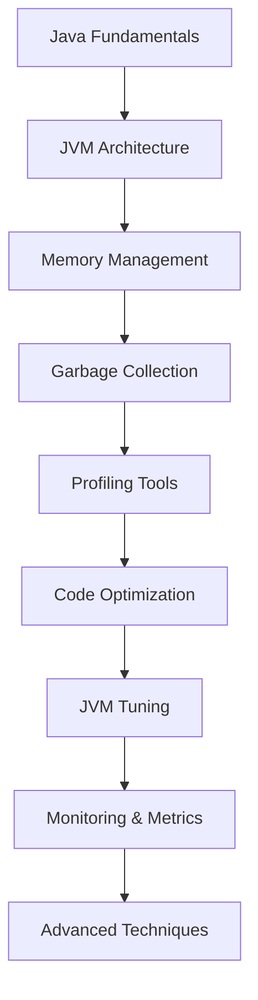
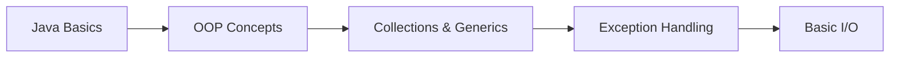
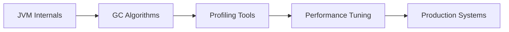

# Java Performance Optimization: Tuning và Best Practices

## 🚀 Java Performance là gì và tại sao quan trọng trong 2025?

**Java Performance Optimization** là process của improving application performance thông qua various techniques như JVM tuning, code optimization, memory management, và profiling. Trong năm 2025, với increasing demand cho high-performance applications, Java performance optimization trở thành critical skill cho developers.

### 🎯 Tại sao Java Performance quan trọng trong 2025?

- **Cloud Costs**: Better performance = lower cloud costs
- **User Experience**: Faster applications = better user satisfaction
- **Scalability**: Optimized applications scale better
- **Resource Efficiency**: Better resource utilization
- **Competitive Advantage**: Performance là key differentiator
- **Modern Workloads**: Microservices, real-time systems need high performance

### 📚 Roadmap học Java Performance cho người mới



**Lưu ý**: Bài viết này tập trung vào **Advanced Level** (cấp độ 8-10). Bạn cần có kiến thức vững về Java và JVM.

## 📋 Prerequisites - Yêu cầu kiến thức chuyên sâu

### 🎯 Kiến thức bắt buộc (Required)

**1. Java Programming (3-5 năm kinh nghiệm)**
- ✅ Thành thạo Java core concepts (OOP, Collections, Concurrency)
- ✅ Hiểu sâu về Java memory model
- ✅ Kinh nghiệm với multi-threading và synchronization
- ✅ Familiarity với Java 8+ features (Streams, Optional, CompletableFuture)
- ✅ Kinh nghiệm với enterprise Java frameworks (Spring, Hibernate)

**2. JVM Internals Knowledge**
- ✅ Hiểu về JVM architecture và memory areas
- ✅ Kiến thức về class loading và bytecode
- ✅ Hiểu về garbage collection algorithms
- ✅ Familiarity với JIT compilation
- ✅ Kinh nghiệm với JVM tuning parameters

**3. Production Systems Experience**
- ✅ Kinh nghiệm với production Java applications
- ✅ Hiểu về performance bottlenecks trong thực tế
- ✅ Kinh nghiệm với high-load systems
- ✅ Familiarity với monitoring và alerting
- ✅ Kinh nghiệm với performance troubleshooting

**4. Profiling Tools Familiarity**
- ✅ Sử dụng JProfiler, VisualVM, hoặc similar tools
- ✅ Kinh nghiệm với heap dumps analysis
- ✅ Hiểu về thread dumps và analysis
- ✅ Familiarity với GC logs analysis
- ✅ Kinh nghiệm với APM tools (New Relic, AppDynamics)

### 🔧 Kiến thức khuyến nghị (Recommended)

**5. System Administration**
- ✅ Linux/Unix system administration
- ✅ Network và database performance
- ✅ Cloud platforms (AWS, Azure, GCP)
- ✅ Container orchestration (Docker, Kubernetes)

**6. Advanced Concepts**
- ✅ Distributed systems performance
- ✅ Microservices performance patterns
- ✅ Caching strategies và implementations
- ✅ Database optimization techniques

### ⚠️ Nếu bạn chưa có đủ kiến thức

**Hãy đọc các bài viết này trước:**
1. [Java JVM OOP Cơ Bản: Complete Guide](../java-jvm-oop-co-ban.md)
2. [Spring Boot REST API: Hướng Dẫn Toàn Diện](../spring-boot-rest-api.md)
3. [Java Database JPA: Complete Guide](../java-database-jpa.md)

**Hoặc tham khảo learning path bên dưới:**

## 🛤️ Learning Path - Lộ trình học tập

### 📚 Level 1: Foundation (Beginner - 6-12 tháng)


**Mục tiêu:** Nắm vững Java fundamentals
- Java syntax và core concepts
- Object-oriented programming
- Collections framework
- Exception handling
- Basic file I/O operations

### 📚 Level 2: Intermediate (12-24 tháng)


**Mục tiêu:** Hiểu Java advanced features và frameworks
- Multi-threading và concurrency
- JVM memory model cơ bản
- Spring Framework basics
- Database integration với JPA
- Basic performance concepts

### 📚 Level 3: Advanced (24-36 tháng)


**Mục tiêu:** Master JVM và performance optimization
- JVM architecture và internals
- Garbage collection algorithms
- Profiling và monitoring tools
- Performance tuning techniques
- Production system optimization

### 📚 Level 4: Expert (36+ tháng)


**Mục tiêu:** Become performance expert
- Advanced JVM tuning
- Distributed systems performance
- Cloud-native optimization
- Specialized profiling tools
- High-performance architecture design

### 🎯 Bài viết này phù hợp với Level 4

## 🎯 Mục tiêu bài viết

Sau khi đọc xong bài viết này, bạn sẽ hiểu:
- **JVM Architecture**: Memory model, garbage collection, class loading
- **Memory Management**: Heap, stack, method area, native memory
- **Garbage Collection**: GC algorithms, tuning, monitoring
- **Profiling**: Tools và techniques cho performance analysis
- **Code Optimization**: Best practices, anti-patterns
- **JVM Tuning**: Parameters, flags, monitoring
- **Advanced Techniques**: JIT compilation, AOT compilation

### 👥 Ai nên đọc bài viết này?

**✅ Phù hợp:**
- **Senior Developers**: Có kinh nghiệm Java 3-5 năm, muốn optimize performance
- **Performance Engineers**: Specialize trong performance optimization và tuning
- **DevOps Engineers**: Tune JVM parameters cho production environments
- **System Architects**: Design high-performance systems và architectures
- **Tech Leads**: Lead performance optimization projects và teams

**❌ Không phù hợp:**
- **Sinh viên IT**: Cần học Java fundamentals trước
- **Junior Developers**: Cần kinh nghiệm thực tế với Java và JVM
- **Career Changers**: Cần foundation knowledge về Java performance
- **Frontend Developers**: Quá chuyên sâu về JVM internals

### 🚀 Bài viết bổ sung được khuyến nghị

**Nếu bạn chưa đủ kinh nghiệm, hãy đọc:**

1. **"Java Performance Basics for Beginners"** (Sẽ được tạo)
   - Java performance fundamentals
   - Basic JVM concepts
   - Simple optimization techniques
   - Performance measurement basics

2. **"JVM Fundamentals for Junior Developers"** (Sẽ được tạo)
   - JVM architecture overview
   - Memory management basics
   - Garbage collection introduction
   - Basic profiling techniques

3. **"Performance Optimization for Career Changers"** (Sẽ được tạo)
   - Performance concepts for experienced developers
   - Java-specific optimization techniques
   - Tools và methodologies
   - Best practices và common pitfalls

### 🎯 Khi nào cần Java Performance Optimization?

**Java Performance Optimization** cần thiết khi:
- **Slow Application**: Application response time quá chậm
- **High Memory Usage**: Memory consumption quá cao
- **Frequent GC**: Garbage collection ảnh hưởng performance
- **Scalability Issues**: Application không scale được
- **High CPU Usage**: CPU utilization quá cao
- **Production Issues**: Performance problems trong production

**Ví dụ thực tế**: High-frequency trading systems, real-time analytics, gaming applications, IoT platforms

## 🏗️ JVM Architecture

### 🎯 JVM Memory Model

```java
// JVM Memory Areas
public class JVMMemoryModel {
    // Method Area (Metaspace in Java 8+)
    // - Class metadata
    // - Static variables
    // - Method bytecode
    
    // Heap Memory
    private Object heapObject = new Object(); // Stored in heap
    
    // Stack Memory
    public void method() {
        int localVariable = 10; // Stored in stack
        String localString = "Hello"; // Reference in stack, object in heap
    }
    
    // Native Memory
    // - Direct memory (ByteBuffer)
    // - JNI calls
    // - JVM internal structures
}
```

### Memory Areas Deep Dive

```java
// src/main/java/com/devnetinsights/performance/MemoryAnalysis.java
package com.devnetinsights.performance;

import java.lang.management.ManagementFactory;
import java.lang.management.MemoryMXBean;
import java.lang.management.MemoryUsage;
import java.nio.ByteBuffer;

public class MemoryAnalysis {
    
    public static void analyzeMemory() {
        MemoryMXBean memoryBean = ManagementFactory.getMemoryMXBean();
        
        // Heap Memory
        MemoryUsage heapUsage = memoryBean.getHeapMemoryUsage();
        System.out.println("Heap Memory:");
        System.out.println("  Used: " + formatBytes(heapUsage.getUsed()));
        System.out.println("  Committed: " + formatBytes(heapUsage.getCommitted()));
        System.out.println("  Max: " + formatBytes(heapUsage.getMax()));
        
        // Non-Heap Memory
        MemoryUsage nonHeapUsage = memoryBean.getNonHeapMemoryUsage();
        System.out.println("Non-Heap Memory:");
        System.out.println("  Used: " + formatBytes(nonHeapUsage.getUsed()));
        System.out.println("  Committed: " + formatBytes(nonHeapUsage.getCommitted()));
        System.out.println("  Max: " + formatBytes(nonHeapUsage.getMax()));
    }
    
    public static void demonstrateMemoryAreas() {
        // Stack Memory - Local variables
        int stackVariable = 42;
        String stackString = "Stack String";
        
        // Heap Memory - Objects
        Object heapObject = new Object();
        String heapString = new String("Heap String");
        
        // Method Area - Static variables
        staticVariable = "Static String";
        
        // Native Memory - Direct ByteBuffer
        ByteBuffer directBuffer = ByteBuffer.allocateDirect(1024);
        
        System.out.println("Stack variable: " + stackVariable);
        System.out.println("Heap object: " + heapObject);
        System.out.println("Direct buffer: " + directBuffer);
    }
    
    private static String staticVariable;
    
    private static String formatBytes(long bytes) {
        if (bytes < 1024) return bytes + " B";
        if (bytes < 1024 * 1024) return String.format("%.2f KB", bytes / 1024.0);
        if (bytes < 1024 * 1024 * 1024) return String.format("%.2f MB", bytes / (1024.0 * 1024.0));
        return String.format("%.2f GB", bytes / (1024.0 * 1024.0 * 1024.0));
    }
}
```

## 🗑️ Garbage Collection

### 🎯 GC Algorithms

```java
// src/main/java/com/devnetinsights/performance/GarbageCollectionDemo.java
package com.devnetinsights.performance;

import java.util.ArrayList;
import java.util.List;
import java.util.Random;

public class GarbageCollectionDemo {
    
    public static void demonstrateGC() {
        List<Object> objects = new ArrayList<>();
        Random random = new Random();
        
        // Create objects to trigger GC
        for (int i = 0; i < 100000; i++) {
            objects.add(new LargeObject(random.nextInt(1000)));
            
            // Remove some objects to create garbage
            if (i % 1000 == 0) {
                objects.clear();
                System.gc(); // Suggest GC (not guaranteed)
            }
        }
    }
    
    public static void measureGCTime() {
        long startTime = System.currentTimeMillis();
        
        // Create and destroy objects
        for (int i = 0; i < 10000; i++) {
            List<String> list = new ArrayList<>();
            for (int j = 0; j < 1000; j++) {
                list.add("String " + j);
            }
            // list goes out of scope, becomes garbage
        }
        
        long endTime = System.currentTimeMillis();
        System.out.println("Time taken: " + (endTime - startTime) + " ms");
    }
}

class LargeObject {
    private byte[] data;
    
    public LargeObject(int size) {
        this.data = new byte[size * 1024]; // KB
    }
}
```

### GC Tuning Parameters

```bash
# JVM GC Tuning Parameters
java -Xms2g -Xmx4g \
     -XX:+UseG1GC \
     -XX:MaxGCPauseMillis=200 \
     -XX:G1HeapRegionSize=16m \
     -XX:+UseStringDeduplication \
     -XX:+PrintGC \
     -XX:+PrintGCDetails \
     -XX:+PrintGCTimeStamps \
     -Xloggc:gc.log \
     -jar application.jar

# G1GC Specific Parameters
-XX:+UseG1GC                    # Use G1 Garbage Collector
-XX:MaxGCPauseMillis=200        # Target max GC pause time
-XX:G1HeapRegionSize=16m        # G1 heap region size
-XX:G1NewSizePercent=30         # Percentage of heap for young generation
-XX:G1MaxNewSizePercent=40      # Maximum percentage for young generation
-XX:G1MixedGCCountTarget=8      # Target number of mixed GC cycles
-XX:+UseStringDeduplication     # Enable string deduplication

# ZGC Parameters (Java 11+)
-XX:+UseZGC                     # Use Z Garbage Collector
-XX:+UnlockExperimentalVMOptions # Required for ZGC
-XX:+UseLargePages              # Use large pages for better performance

# Shenandoah Parameters (Java 12+)
-XX:+UseShenandoahGC            # Use Shenandoah Garbage Collector
-XX:+UnlockExperimentalVMOptions # Required for Shenandoah
-XX:ShenandoahGCHeuristics=adaptive # Adaptive heuristics
```

## 🔍 Profiling và Monitoring

### JVM Monitoring

```java
// src/main/java/com/devnetinsights/performance/JVMMonitoring.java
package com.devnetinsights.performance;

import java.lang.management.*;
import java.util.List;

public class JVMMonitoring {
    
    public static void monitorJVM() {
        // Memory Monitoring
        monitorMemory();
        
        // Thread Monitoring
        monitorThreads();
        
        // GC Monitoring
        monitorGarbageCollection();
        
        // Class Loading Monitoring
        monitorClassLoading();
    }
    
    private static void monitorMemory() {
        MemoryMXBean memoryBean = ManagementFactory.getMemoryMXBean();
        MemoryUsage heapUsage = memoryBean.getHeapMemoryUsage();
        MemoryUsage nonHeapUsage = memoryBean.getNonHeapMemoryUsage();
        
        System.out.println("=== Memory Monitoring ===");
        System.out.println("Heap Used: " + formatBytes(heapUsage.getUsed()));
        System.out.println("Heap Max: " + formatBytes(heapUsage.getMax()));
        System.out.println("Non-Heap Used: " + formatBytes(nonHeapUsage.getUsed()));
        System.out.println("Non-Heap Max: " + formatBytes(nonHeapUsage.getMax()));
    }
    
    private static void monitorThreads() {
        ThreadMXBean threadBean = ManagementFactory.getThreadMXBean();
        int threadCount = threadBean.getThreadCount();
        int peakThreadCount = threadBean.getPeakThreadCount();
        long totalStartedThreadCount = threadBean.getTotalStartedThreadCount();
        
        System.out.println("=== Thread Monitoring ===");
        System.out.println("Current Thread Count: " + threadCount);
        System.out.println("Peak Thread Count: " + peakThreadCount);
        System.out.println("Total Started Threads: " + totalStartedThreadCount);
        
        // Thread details
        long[] threadIds = threadBean.getAllThreadIds();
        ThreadInfo[] threadInfos = threadBean.getThreadInfo(threadIds);
        
        for (ThreadInfo threadInfo : threadInfos) {
            if (threadInfo != null) {
                System.out.println("Thread: " + threadInfo.getThreadName() + 
                                 " State: " + threadInfo.getThreadState());
            }
        }
    }
    
    private static void monitorGarbageCollection() {
        List<GarbageCollectorMXBean> gcBeans = ManagementFactory.getGarbageCollectorMXBeans();
        
        System.out.println("=== GC Monitoring ===");
        for (GarbageCollectorMXBean gcBean : gcBeans) {
            System.out.println("GC Name: " + gcBean.getName());
            System.out.println("Collection Count: " + gcBean.getCollectionCount());
            System.out.println("Collection Time: " + gcBean.getCollectionTime() + " ms");
        }
    }
    
    private static void monitorClassLoading() {
        ClassLoadingMXBean classBean = ManagementFactory.getClassLoadingMXBean();
        
        System.out.println("=== Class Loading Monitoring ===");
        System.out.println("Loaded Classes: " + classBean.getLoadedClassCount());
        System.out.println("Total Loaded Classes: " + classBean.getTotalLoadedClassCount());
        System.out.println("Unloaded Classes: " + classBean.getUnloadedClassCount());
    }
    
    private static String formatBytes(long bytes) {
        if (bytes < 1024) return bytes + " B";
        if (bytes < 1024 * 1024) return String.format("%.2f KB", bytes / 1024.0);
        if (bytes < 1024 * 1024 * 1024) return String.format("%.2f MB", bytes / (1024.0 * 1024.0));
        return String.format("%.2f GB", bytes / (1024.0 * 1024.0 * 1024.0));
    }
}
```

### Performance Profiling

```java
// src/main/java/com/devnetinsights/performance/PerformanceProfiler.java
package com.devnetinsights.performance;

import java.util.ArrayList;
import java.util.List;
import java.util.Random;
import java.util.concurrent.TimeUnit;

public class PerformanceProfiler {
    
    public static void profileMethodExecution() {
        // Warm up JIT
        for (int i = 0; i < 1000; i++) {
            performExpensiveOperation();
        }
        
        // Measure execution time
        long startTime = System.nanoTime();
        for (int i = 0; i < 10000; i++) {
            performExpensiveOperation();
        }
        long endTime = System.nanoTime();
        
        long duration = TimeUnit.NANOSECONDS.toMillis(endTime - startTime);
        System.out.println("Total execution time: " + duration + " ms");
        System.out.println("Average execution time: " + (duration / 10000.0) + " ms");
    }
    
    private static void performExpensiveOperation() {
        List<Integer> list = new ArrayList<>();
        Random random = new Random();
        
        for (int i = 0; i < 1000; i++) {
            list.add(random.nextInt(1000));
        }
        
        // Sort the list
        list.sort(Integer::compareTo);
        
        // Find maximum
        int max = list.stream().mapToInt(Integer::intValue).max().orElse(0);
        
        // Create some garbage
        if (random.nextBoolean()) {
            list.clear();
        }
    }
    
    public static void profileMemoryUsage() {
        Runtime runtime = Runtime.getRuntime();
        
        // Before operation
        long beforeMemory = runtime.totalMemory() - runtime.freeMemory();
        System.out.println("Memory before: " + formatBytes(beforeMemory));
        
        // Perform memory-intensive operation
        List<byte[]> memoryList = new ArrayList<>();
        for (int i = 0; i < 1000; i++) {
            memoryList.add(new byte[1024 * 1024]); // 1MB each
        }
        
        // After operation
        long afterMemory = runtime.totalMemory() - runtime.freeMemory();
        System.out.println("Memory after: " + formatBytes(afterMemory));
        System.out.println("Memory used: " + formatBytes(afterMemory - beforeMemory));
        
        // Clean up
        memoryList.clear();
        System.gc();
        
        // After cleanup
        long afterCleanup = runtime.totalMemory() - runtime.freeMemory();
        System.out.println("Memory after cleanup: " + formatBytes(afterCleanup));
    }
    
    private static String formatBytes(long bytes) {
        if (bytes < 1024) return bytes + " B";
        if (bytes < 1024 * 1024) return String.format("%.2f KB", bytes / 1024.0);
        if (bytes < 1024 * 1024 * 1024) return String.format("%.2f MB", bytes / (1024.0 * 1024.0));
        return String.format("%.2f GB", bytes / (1024.0 * 1024.0 * 1024.0));
    }
}
```

## ⚡ Code Optimization

### 🎯 Performance Best Practices

```java
// src/main/java/com/devnetinsights/performance/CodeOptimization.java
package com.devnetinsights.performance;

import java.util.*;
import java.util.stream.Collectors;

public class CodeOptimization {
    
    // 1. String Optimization
    public static void optimizeStringOperations() {
        // ❌ Wrong - String concatenation in loop
        String result = "";
        for (int i = 0; i < 1000; i++) {
            result += "String " + i; // Creates new String object each time
        }
        
        // ✅ Correct - Use StringBuilder
        StringBuilder sb = new StringBuilder();
        for (int i = 0; i < 1000; i++) {
            sb.append("String ").append(i);
        }
        String optimizedResult = sb.toString();
    }
    
    // 2. Collection Optimization
    public static void optimizeCollections() {
        // ❌ Wrong - ArrayList with default capacity
        List<String> list = new ArrayList<>();
        for (int i = 0; i < 10000; i++) {
            list.add("Item " + i); // Resizes array multiple times
        }
        
        // ✅ Correct - Pre-allocate capacity
        List<String> optimizedList = new ArrayList<>(10000);
        for (int i = 0; i < 10000; i++) {
            optimizedList.add("Item " + i);
        }
        
        // ❌ Wrong - HashMap with default capacity
        Map<String, Integer> map = new HashMap<>();
        for (int i = 0; i < 1000; i++) {
            map.put("Key" + i, i); // Resizes multiple times
        }
        
        // ✅ Correct - Pre-allocate capacity
        Map<String, Integer> optimizedMap = new HashMap<>(1000);
        for (int i = 0; i < 1000; i++) {
            optimizedMap.put("Key" + i, i);
        }
    }
    
    // 3. Loop Optimization
    public static void optimizeLoops() {
        List<Integer> numbers = Arrays.asList(1, 2, 3, 4, 5, 6, 7, 8, 9, 10);
        
        // ❌ Wrong - Enhanced for loop with method calls
        for (Integer number : numbers) {
            System.out.println(number.toString()); // Method call in loop
        }
        
        // ✅ Correct - Traditional for loop
        for (int i = 0; i < numbers.size(); i++) {
            System.out.println(numbers.get(i));
        }
        
        // ✅ Better - Stream API for complex operations
        numbers.stream()
               .filter(n -> n % 2 == 0)
               .mapToInt(Integer::intValue)
               .sum();
    }
    
    // 4. Object Creation Optimization
    public static void optimizeObjectCreation() {
        // ❌ Wrong - Creating objects in loop
        List<Date> dates = new ArrayList<>();
        for (int i = 0; i < 1000; i++) {
            dates.add(new Date()); // Creates new Date object each time
        }
        
        // ✅ Correct - Reuse objects when possible
        Date currentDate = new Date();
        List<Date> optimizedDates = new ArrayList<>();
        for (int i = 0; i < 1000; i++) {
            optimizedDates.add(currentDate); // Reuse same object
        }
    }
    
    // 5. Exception Handling Optimization
    public static void optimizeExceptionHandling() {
        // ❌ Wrong - Exception in normal flow
        public int parseInteger(String str) {
            try {
                return Integer.parseInt(str);
            } catch (NumberFormatException e) {
                return -1; // Exception used for control flow
            }
        }
        
        // ✅ Correct - Check before parsing
        public int parseIntegerOptimized(String str) {
            if (str == null || str.isEmpty()) {
                return -1;
            }
            
            try {
                return Integer.parseInt(str);
            } catch (NumberFormatException e) {
                return -1; // Exception only for unexpected cases
            }
        }
    }
}
```

### Advanced Optimization Techniques

```java
// src/main/java/com/devnetinsights/performance/AdvancedOptimization.java
package com.devnetinsights.performance;

import java.util.concurrent.*;
import java.util.concurrent.atomic.AtomicLong;
import java.util.concurrent.locks.ReentrantReadWriteLock;

public class AdvancedOptimization {
    
    // 1. Lock Optimization
    private final ReentrantReadWriteLock lock = new ReentrantReadWriteLock();
    private final ReentrantReadWriteLock.ReadLock readLock = lock.readLock();
    private final ReentrantReadWriteLock.WriteLock writeLock = lock.writeLock();
    
    private volatile String sharedData = "Initial Data";
    
    public String readData() {
        readLock.lock();
        try {
            return sharedData; // Multiple readers can access simultaneously
        } finally {
            readLock.unlock();
        }
    }
    
    public void writeData(String data) {
        writeLock.lock();
        try {
            sharedData = data; // Only one writer at a time
        } finally {
            writeLock.unlock();
        }
    }
    
    // 2. Atomic Operations
    private final AtomicLong counter = new AtomicLong(0);
    
    public long incrementCounter() {
        return counter.incrementAndGet(); // Lock-free atomic operation
    }
    
    public long getCounter() {
        return counter.get(); // Lock-free read
    }
    
    // 3. Thread Pool Optimization
    private final ExecutorService executorService = Executors.newFixedThreadPool(
        Runtime.getRuntime().availableProcessors()
    );
    
    public CompletableFuture<String> processAsync(String data) {
        return CompletableFuture.supplyAsync(() -> {
            // Simulate processing
            try {
                Thread.sleep(100);
            } catch (InterruptedException e) {
                Thread.currentThread().interrupt();
            }
            return "Processed: " + data;
        }, executorService);
    }
    
    // 4. Memory Pool Pattern
    private final Queue<ExpensiveObject> objectPool = new ConcurrentLinkedQueue<>();
    
    public ExpensiveObject borrowObject() {
        ExpensiveObject obj = objectPool.poll();
        if (obj == null) {
            obj = new ExpensiveObject();
        }
        return obj;
    }
    
    public void returnObject(ExpensiveObject obj) {
        obj.reset(); // Reset object state
        objectPool.offer(obj);
    }
    
    // 5. Lazy Initialization
    private volatile ExpensiveResource expensiveResource;
    
    public ExpensiveResource getExpensiveResource() {
        if (expensiveResource == null) {
            synchronized (this) {
                if (expensiveResource == null) {
                    expensiveResource = new ExpensiveResource();
                }
            }
        }
        return expensiveResource;
    }
}

class ExpensiveObject {
    private byte[] data = new byte[1024 * 1024]; // 1MB
    
    public void reset() {
        // Reset object state
        Arrays.fill(data, (byte) 0);
    }
}

class ExpensiveResource {
    public ExpensiveResource() {
        // Expensive initialization
        try {
            Thread.sleep(1000);
        } catch (InterruptedException e) {
            Thread.currentThread().interrupt();
        }
    }
}
```

## 🏋️ Bài tập thực hành

### Bài tập 1: Optimize String Processing
Optimize string processing code để improve performance.

```java
// TODO: Optimize this method
public String processStrings(List<String> strings) {
    String result = "";
    for (String str : strings) {
        result += str.toUpperCase() + " ";
    }
    return result;
}
```

### Bài tập 2: Implement Object Pool
Tạo object pool cho expensive objects.

```java
// TODO: Implement ObjectPool
public class ObjectPool<T> {
    // Your code here
    // Methods: borrow(), return(), create()
}
```

### Bài tập 3: Optimize Database Queries
Optimize database query performance.

```java
// TODO: Optimize query performance
@Service
public class UserService {
    public List<User> getUsersWithOrders() {
        // Your optimized code here
    }
}
```

### Bài tập 4: Implement Caching Strategy
Tạo caching strategy cho frequently accessed data.

```java
// TODO: Implement CacheManager
@Component
public class CacheManager {
    // Your code here
    // Methods: get(), put(), evict(), clear()
}
```

## 🚨 Troubleshooting và Common Mistakes

### Common Performance Mistakes

1. **Memory Leaks**
```java
// ❌ Wrong - Memory leak
public class MemoryLeak {
    private static List<Object> cache = new ArrayList<>();
    
    public void addToCache(Object obj) {
        cache.add(obj); // Objects never removed from cache
    }
}

// ✅ Correct - Bounded cache
public class BoundedCache {
    private static final int MAX_SIZE = 1000;
    private static Queue<Object> cache = new ConcurrentLinkedQueue<>();
    
    public void addToCache(Object obj) {
        cache.offer(obj);
        if (cache.size() > MAX_SIZE) {
            cache.poll(); // Remove oldest object
        }
    }
}
```

2. **Inefficient Collections**
```java
// ❌ Wrong - Using LinkedList for random access
List<String> list = new LinkedList<>();
for (int i = 0; i < 10000; i++) {
    list.get(i); // O(n) operation
}

// ✅ Correct - Use ArrayList for random access
List<String> list = new ArrayList<>();
for (int i = 0; i < 10000; i++) {
    list.get(i); // O(1) operation
}
```

3. **Synchronization Issues**
```java
// ❌ Wrong - Synchronized method
public synchronized void processData() {
    // Heavy processing
    Thread.sleep(1000);
}

// ✅ Correct - Synchronize only critical section
public void processData() {
    // Non-critical processing
    prepareData();
    
    synchronized (this) {
        // Critical section only
        updateSharedState();
    }
    
    // Non-critical processing
    cleanup();
}
```

## 📚 Tài liệu tham khảo

- [Oracle JVM Tuning Guide](https://docs.oracle.com/javase/8/docs/technotes/guides/vm/gctuning/)
- [Java Performance Tuning](https://www.oracle.com/java/technologies/javase/performance.html)
- [JProfiler Documentation](https://www.ej-technologies.com/resources/jprofiler/help/doc/)
- [VisualVM Documentation](https://visualvm.github.io/)

## 🎉 Kết luận

Chúng ta đã tìm hiểu về Java Performance Optimization từ cơ bản đến nâng cao:

- ✅ **JVM Architecture**: Memory model, garbage collection, class loading
- ✅ **Memory Management**: Heap, stack, native memory optimization
- ✅ **Garbage Collection**: GC algorithms, tuning, monitoring
- ✅ **Profiling**: Tools và techniques cho performance analysis
- ✅ **Code Optimization**: Best practices, anti-patterns
- ✅ **JVM Tuning**: Parameters, flags, monitoring
- ✅ **Advanced Techniques**: Lock optimization, atomic operations

### 🚀 Ứng dụng thực tế trong 2025

Java Performance Optimization là **critical skill** cho:
- **Senior Developers**: High-performance application development
- **Performance Engineers**: Specialize trong performance optimization
- **DevOps Engineers**: Production JVM tuning
- **System Architects**: High-performance system design

### 📈 Next Steps

1. **Thực hành**: Làm các bài tập ở trên
2. **Tools**: Học JProfiler, VisualVM, Async Profiler
3. **Advanced**: Học JIT compilation, AOT compilation
4. **Monitoring**: Học APM tools, metrics collection
5. **Cloud**: Học cloud-native performance optimization

---

*Bạn có câu hỏi nào về Java Performance Optimization không? Hãy để lại comment hoặc liên hệ với mình!* 🚀

**Tags**: #java #performance #jvm #optimization #tuning #profiling #2025 #high-performance
