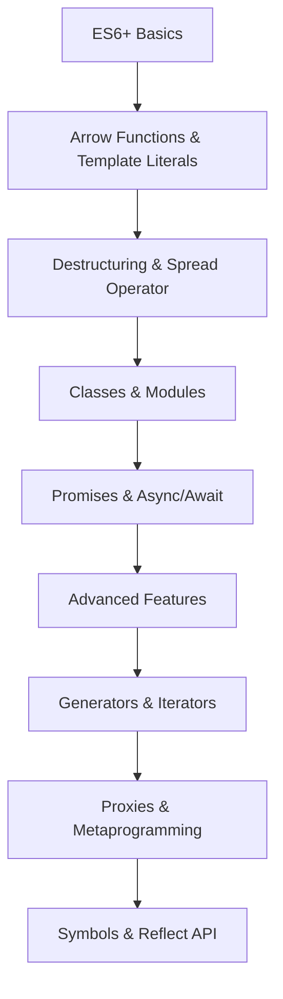

# JavaScript ES6+ Features Nâng Cao: Generators, Proxies và Symbols

## 🚀 ES6+ là gì và tại sao cần học?

**ES6 (ECMAScript 2015)** là một bước ngoặt lớn trong lịch sử JavaScript, mang đến những tính năng mạnh mẽ giúp code trở nên sạch sẽ, dễ đọc và hiệu quả hơn. **ES6+** bao gồm tất cả các phiên bản từ ES6 trở đi (ES7, ES8, ES9, ES10, ES11, ES12...).

### 🎯 Tại sao ES6+ quan trọng trong 2025?

- **Modern JavaScript**: Tất cả framework hiện đại (React, Vue, Angular) đều sử dụng ES6+
- **Better Developer Experience**: Code ngắn gọn, dễ maintain hơn
- **Performance**: Nhiều tính năng được optimize tốt hơn
- **Industry Standard**: Được sử dụng rộng rãi trong các công ty công nghệ

### 📚 Roadmap học ES6+ cho người mới



**Lưu ý**: Bài viết này tập trung vào **Advanced Features** (cấp độ 6-9). Nếu bạn chưa quen với ES6+ cơ bản, hãy tham khảo các bài viết trước đó.

## 🎯 Mục tiêu bài viết

Sau khi đọc xong bài viết này, bạn sẽ hiểu:
- **Generators và Iterators**: Lazy evaluation và custom iteration
- **Proxies và Metaprogramming**: Intercept và customize object behavior
- **Symbols và Unique Identifiers**: Tạo unique keys và customize object behavior
- **Reflect API**: Reflection capabilities cho metaprogramming
- **WeakMap và WeakSet**: Memory-efficient collections
- **Typed Arrays**: Xử lý binary data hiệu quả
- **Array/String Methods mới**: Utility methods mạnh mẽ hơn

### 👥 Ai nên đọc bài viết này?

- ✅ **Lập trình viên có kinh nghiệm** muốn nâng cao kỹ năng JavaScript
- ✅ **Backend developers** muốn chuyển sang Frontend
- ✅ **Career changers** từ ngôn ngữ khác sang JavaScript
- ⚠️ **Sinh viên/Junior**: Nên học ES6+ cơ bản trước khi đọc bài này

## 🔄 Generators và Iterators

### 🎯 Khi nào sử dụng Generators?

**Generators** rất hữu ích khi bạn cần:
- **Lazy Evaluation**: Tạo dữ liệu chỉ khi cần thiết (tiết kiệm memory)
- **Infinite Sequences**: Tạo chuỗi vô hạn như Fibonacci, prime numbers
- **Async Iteration**: Xử lý dữ liệu từ API theo từng batch
- **Custom Iteration Logic**: Tạo iterator với logic phức tạp

**Ví dụ thực tế**: Pagination API, file processing, data streaming

### Generator Functions

```javascript
// Generator function cơ bản
function* numberGenerator() {
    yield 1;
    yield 2;
    yield 3;
}

const generator = numberGenerator();
console.log(generator.next()); // { value: 1, done: false }
console.log(generator.next()); // { value: 2, done: false }
console.log(generator.next()); // { value: 3, done: false }
console.log(generator.next()); // { value: undefined, done: true }

// Generator với parameters
function* fibonacciGenerator() {
    let a = 0, b = 1;
    while (true) {
        yield a;
        [a, b] = [b, a + b];
    }
}

const fib = fibonacciGenerator();
console.log(fib.next().value); // 0
console.log(fib.next().value); // 1
console.log(fib.next().value); // 1
console.log(fib.next().value); // 2
console.log(fib.next().value); // 3
```

### Generator với yield*

```javascript
function* innerGenerator() {
    yield 'a';
    yield 'b';
}

function* outerGenerator() {
    yield 'start';
    yield* innerGenerator();
    yield 'end';
}

const generator = outerGenerator();
console.log([...generator]); // ['start', 'a', 'b', 'end']
```

### Generator với return và throw

```javascript
function* generatorWithReturn() {
    yield 1;
    yield 2;
    return 'finished';
    yield 3; // This will never execute
}

const gen = generatorWithReturn();
console.log(gen.next()); // { value: 1, done: false }
console.log(gen.next()); // { value: 2, done: false }
console.log(gen.next()); // { value: 'finished', done: true }
console.log(gen.next()); // { value: undefined, done: true }

// Generator với throw
function* generatorWithThrow() {
    try {
        yield 1;
        yield 2;
    } catch (error) {
        console.log('Caught error:', error);
        yield 'error handled';
    }
}

const gen = generatorWithThrow();
console.log(gen.next()); // { value: 1, done: false }
console.log(gen.throw('Something went wrong')); // { value: 'error handled', done: false }
```

### Custom Iterators

```javascript
class Range {
    constructor(start, end) {
        this.start = start;
        this.end = end;
    }
    
    *[Symbol.iterator]() {
        for (let i = this.start; i <= this.end; i++) {
            yield i;
        }
    }
}

const range = new Range(1, 5);
for (const num of range) {
    console.log(num); // 1, 2, 3, 4, 5
}

// Sử dụng với spread operator
console.log([...range]); // [1, 2, 3, 4, 5]
```

### 💡 So sánh với ES5: Custom Iterators

**ES5 (cách cũ)**:
```javascript
function createRange(start, end) {
    var result = [];
    for (var i = start; i <= end; i++) {
        result.push(i);
    }
    return result;
}

var range = createRange(1, 5);
for (var i = 0; i < range.length; i++) {
    console.log(range[i]);
}
```

**ES6+ (cách mới)**:
```javascript
class Range {
    constructor(start, end) {
        this.start = start;
        this.end = end;
    }
    
    *[Symbol.iterator]() {
        for (let i = this.start; i <= this.end; i++) {
            yield i;
        }
    }
}

const range = new Range(1, 5);
for (const num of range) {
    console.log(num);
}
```

**Lợi ích**: ES6+ tiết kiệm memory, lazy evaluation, có thể tạo infinite sequences.

## 🎭 Proxies và Metaprogramming

### 🎯 Khi nào sử dụng Proxies?

**Proxies** rất mạnh mẽ khi bạn cần:
- **Validation**: Kiểm tra dữ liệu trước khi gán
- **Logging**: Theo dõi thay đổi object
- **Virtual Properties**: Tạo properties không tồn tại thực sự
- **Access Control**: Kiểm soát quyền truy cập
- **State Management**: Reactive state như Vue.js, MobX

**Ví dụ thực tế**: Form validation, state management, API mocking, debugging tools

### Proxy cơ bản

```javascript
const target = {
    name: 'John',
    age: 30
};

const proxy = new Proxy(target, {
    get(target, property) {
        console.log(`Getting property: ${property}`);
        return target[property];
    },
    
    set(target, property, value) {
        console.log(`Setting property: ${property} = ${value}`);
        target[property] = value;
        return true;
    },
    
    has(target, property) {
        console.log(`Checking if property exists: ${property}`);
        return property in target;
    },
    
    deleteProperty(target, property) {
        console.log(`Deleting property: ${property}`);
        delete target[property];
        return true;
    }
});

console.log(proxy.name); // Getting property: name, John
proxy.age = 31; // Setting property: age = 31
console.log('name' in proxy); // Checking if property exists: name, true
delete proxy.age; // Deleting property: age
```

### Proxy với Validation

```javascript
function createValidatedObject(validationRules) {
    return new Proxy({}, {
        set(target, property, value) {
            if (validationRules[property]) {
                const validator = validationRules[property];
                if (!validator(value)) {
                    throw new Error(`Invalid value for ${property}: ${value}`);
                }
            }
            target[property] = value;
            return true;
        }
    });
}

const user = createValidatedObject({
    name: (value) => typeof value === 'string' && value.length > 0,
    age: (value) => typeof value === 'number' && value >= 0,
    email: (value) => /^[^\s@]+@[^\s@]+\.[^\s@]+$/.test(value)
});

user.name = 'John'; // OK
user.age = 30; // OK
user.email = 'john@example.com'; // OK
// user.age = -5; // Error: Invalid value for age: -5
```

### Proxy với Function Calls

```javascript
function createLoggingFunction(fn) {
    return new Proxy(fn, {
        apply(target, thisArg, argumentsList) {
            console.log(`Calling function with arguments:`, argumentsList);
            const result = target.apply(thisArg, argumentsList);
            console.log(`Function returned:`, result);
            return result;
        }
    });
}

const add = createLoggingFunction((a, b) => a + b);
console.log(add(2, 3)); // Calling function with arguments: [2, 3], Function returned: 5, 5
```

### 💡 So sánh với ES5: Object Validation

**ES5 (cách cũ)**:
```javascript
function createValidatedObject() {
    var obj = {};
    
    Object.defineProperty(obj, 'name', {
        set: function(value) {
            if (typeof value !== 'string' || value.length === 0) {
                throw new Error('Name must be a non-empty string');
            }
            this._name = value;
        },
        get: function() {
            return this._name;
        }
    });
    
    return obj;
}
```

**ES6+ (cách mới)**:
```javascript
function createValidatedObject(validationRules) {
    return new Proxy({}, {
        set(target, property, value) {
            if (validationRules[property]) {
                const validator = validationRules[property];
                if (!validator(value)) {
                    throw new Error(`Invalid value for ${property}: ${value}`);
                }
            }
            target[property] = value;
            return true;
        }
    });
}
```

**Lợi ích**: ES6+ linh hoạt hơn, có thể validate nhiều properties cùng lúc, dễ maintain.

## 🔑 Symbols

### 🎯 Khi nào sử dụng Symbols?

**Symbols** hữu ích khi bạn cần:
- **Unique Keys**: Tạo keys không bao giờ bị conflict
- **Private Properties**: Tạo properties "private" (không hoàn toàn private)
- **Well-known Symbols**: Customize behavior của objects (iterator, toString, etc.)
- **Library Development**: Tránh conflict với user code

**Ví dụ thực tế**: Library development, private data storage, custom iteration logic

### Symbol cơ bản

```javascript
// Tạo Symbol
const sym1 = Symbol();
const sym2 = Symbol('description');
const sym3 = Symbol('description');

console.log(sym1); // Symbol()
console.log(sym2); // Symbol(description)
console.log(sym2 === sym3); // false - mỗi Symbol là unique

// Symbol trong object
const obj = {
    [sym1]: 'value1',
    [sym2]: 'value2',
    regularProperty: 'value3'
};

console.log(obj[sym1]); // value1
console.log(Object.getOwnPropertySymbols(obj)); // [Symbol(), Symbol(description)]
```

### Well-known Symbols

```javascript
// Symbol.iterator
const iterable = {
    [Symbol.iterator]() {
        let step = 0;
        return {
            next() {
                step++;
                if (step === 1) return { value: 'hello', done: false };
                if (step === 2) return { value: 'world', done: false };
                return { done: true };
            }
        };
    }
};

for (const value of iterable) {
    console.log(value); // hello, world
}

// Symbol.toPrimitive
const obj = {
    [Symbol.toPrimitive](hint) {
        if (hint === 'number') return 42;
        if (hint === 'string') return 'forty-two';
        return 'default';
    }
};

console.log(+obj); // 42
console.log(String(obj)); // forty-two
console.log(obj + ''); // default

// Symbol.toStringTag
class MyClass {
    get [Symbol.toStringTag]() {
        return 'MyClass';
    }
}

const instance = new MyClass();
console.log(instance.toString()); // [object MyClass]
```

### Symbol.for và Symbol.keyFor

```javascript
// Symbol.for - tạo hoặc lấy Symbol từ global registry
const sym1 = Symbol.for('key');
const sym2 = Symbol.for('key');
console.log(sym1 === sym2); // true

// Symbol.keyFor - lấy key của Symbol từ global registry
console.log(Symbol.keyFor(sym1)); // key

// Symbol không có trong global registry
const sym3 = Symbol('key');
console.log(Symbol.keyFor(sym3)); // undefined
```

## 🔍 Reflect API

### 🎯 Khi nào sử dụng Reflect API?

**Reflect API** hữu ích khi bạn cần:
- **Metaprogramming**: Thao tác với objects một cách programmatic
- **Proxy Integration**: Làm việc với Proxies một cách nhất quán
- **Function Calls**: Gọi functions với control tốt hơn
- **Property Operations**: Thao tác properties một cách an toàn

**Ví dụ thực tế**: Framework development, testing utilities, dynamic object manipulation

### Reflect Methods

```javascript
const obj = {
    name: 'John',
    age: 30
};

// Reflect.get
console.log(Reflect.get(obj, 'name')); // John

// Reflect.set
Reflect.set(obj, 'name', 'Jane');
console.log(obj.name); // Jane

// Reflect.has
console.log(Reflect.has(obj, 'age')); // true

// Reflect.deleteProperty
Reflect.deleteProperty(obj, 'age');
console.log(obj.age); // undefined

// Reflect.ownKeys
console.log(Reflect.ownKeys(obj)); // ['name']

// Reflect.construct
class Person {
    constructor(name) {
        this.name = name;
    }
}

const person = Reflect.construct(Person, ['John']);
console.log(person.name); // John

// Reflect.apply
function greet(greeting, punctuation) {
    return `${greeting} ${this.name}${punctuation}`;
}

const result = Reflect.apply(greet, { name: 'John' }, ['Hello', '!']);
console.log(result); // Hello John!
```

## 🗺️ WeakMap và WeakSet

### 🎯 Khi nào sử dụng WeakMap và WeakSet?

**WeakMap/WeakSet** rất hữu ích khi bạn cần:
- **Private Data**: Lưu trữ dữ liệu private cho objects
- **Memory Management**: Tự động cleanup khi objects bị garbage collected
- **Caching**: Cache dữ liệu liên quan đến objects
- **Event Listeners**: Lưu trữ event listeners không làm leak memory

**Ví dụ thực tế**: Private class data, DOM element metadata, caching systems

### WeakMap

```javascript
// WeakMap - keys phải là objects
const weakMap = new WeakMap();
const obj1 = { id: 1 };
const obj2 = { id: 2 };

weakMap.set(obj1, 'value1');
weakMap.set(obj2, 'value2');

console.log(weakMap.get(obj1)); // value1

// WeakMap không thể iterate
// for (const [key, value] of weakMap) { } // Error

// WeakMap không có size property
// console.log(weakMap.size); // undefined

// Keys sẽ bị garbage collected khi không còn reference
obj1 = null; // obj1 có thể bị garbage collected
```

### WeakSet

```javascript
// WeakSet - chỉ chứa objects
const weakSet = new WeakSet();
const obj1 = { id: 1 };
const obj2 = { id: 2 };

weakSet.add(obj1);
weakSet.add(obj2);

console.log(weakSet.has(obj1)); // true

// WeakSet không thể iterate
// for (const value of weakSet) { } // Error

// WeakSet không có size property
// console.log(weakSet.size); // undefined
```

### Sử dụng WeakMap cho Private Data

```javascript
const privateData = new WeakMap();

class Person {
    constructor(name, age) {
        privateData.set(this, { name, age });
    }
    
    getName() {
        return privateData.get(this).name;
    }
    
    getAge() {
        return privateData.get(this).age;
    }
    
    setName(name) {
        privateData.get(this).name = name;
    }
}

const person = new Person('John', 30);
console.log(person.getName()); // John
console.log(person.getAge()); // 30

// Không thể truy cập private data trực tiếp
console.log(person.name); // undefined
console.log(person.age); // undefined
```

## 📊 Typed Arrays

### Typed Arrays cơ bản

```javascript
// Tạo typed array
const buffer = new ArrayBuffer(16); // 16 bytes
const int32View = new Int32Array(buffer);
const uint8View = new Uint8Array(buffer);

// Ghi dữ liệu
int32View[0] = 42;
int32View[1] = 100;

console.log(int32View[0]); // 42
console.log(uint8View[0]); // 42 (same data, different view)

// Tạo typed array từ array
const numbers = [1, 2, 3, 4, 5];
const typedArray = new Int32Array(numbers);
console.log(typedArray); // Int32Array [1, 2, 3, 4, 5]

// Tạo typed array với size
const floatArray = new Float64Array(5);
floatArray[0] = 3.14;
floatArray[1] = 2.71;
console.log(floatArray); // Float64Array [3.14, 2.71, 0, 0, 0]
```

### Typed Arrays với Binary Data

```javascript
// Tạo binary data
const buffer = new ArrayBuffer(8);
const view = new DataView(buffer);

// Ghi dữ liệu với different endianness
view.setInt32(0, 0x12345678, true); // little endian
view.setInt32(4, 0x12345678, false); // big endian

console.log(view.getInt32(0, true)); // 0x12345678
console.log(view.getInt32(4, false)); // 0x12345678

// Đọc dữ liệu
const uint8View = new Uint8Array(buffer);
console.log(uint8View); // Uint8Array [120, 86, 52, 18, 18, 52, 86, 120]
```

## 🔧 Array Methods mới

### Array.from và Array.of

```javascript
// Array.from - tạo array từ iterable
const set = new Set([1, 2, 3]);
const array = Array.from(set);
console.log(array); // [1, 2, 3]

// Array.from với mapping function
const doubled = Array.from(set, x => x * 2);
console.log(doubled); // [2, 4, 6]

// Array.from với string
const chars = Array.from('hello');
console.log(chars); // ['h', 'e', 'l', 'l', 'o']

// Array.of - tạo array từ arguments
const arr1 = Array.of(1, 2, 3);
const arr2 = Array.of(7);
console.log(arr1); // [1, 2, 3]
console.log(arr2); // [7]
```

### Array Methods: find, findIndex, includes

```javascript
const numbers = [1, 2, 3, 4, 5];

// find - tìm phần tử đầu tiên thỏa mãn điều kiện
const even = numbers.find(num => num % 2 === 0);
console.log(even); // 2

// findIndex - tìm index của phần tử đầu tiên thỏa mãn điều kiện
const evenIndex = numbers.findIndex(num => num % 2 === 0);
console.log(evenIndex); // 1

// includes - kiểm tra phần tử có tồn tại không
console.log(numbers.includes(3)); // true
console.log(numbers.includes(6)); // false
```

### Array Methods: fill và copyWithin

```javascript
// fill - điền giá trị vào array
const arr = [1, 2, 3, 4, 5];
arr.fill(0, 2, 4); // fill với 0 từ index 2 đến 4 (không bao gồm 4)
console.log(arr); // [1, 2, 0, 0, 5]

// copyWithin - copy phần tử trong cùng array
const arr2 = [1, 2, 3, 4, 5];
arr2.copyWithin(0, 3, 5); // copy từ index 3-5 vào index 0
console.log(arr2); // [4, 5, 3, 4, 5]
```

## 📝 String Methods mới

### String Methods: startsWith, endsWith, includes

```javascript
const str = 'Hello, World!';

// startsWith - kiểm tra chuỗi bắt đầu với
console.log(str.startsWith('Hello')); // true
console.log(str.startsWith('World')); // false

// endsWith - kiểm tra chuỗi kết thúc với
console.log(str.endsWith('World!')); // true
console.log(str.endsWith('Hello')); // false

// includes - kiểm tra chuỗi có chứa
console.log(str.includes('World')); // true
console.log(str.includes('JavaScript')); // false
```

### String Methods: repeat và padStart/padEnd

```javascript
// repeat - lặp lại chuỗi
const str = 'Hello';
console.log(str.repeat(3)); // HelloHelloHello

// padStart - thêm ký tự vào đầu chuỗi
const num = '5';
console.log(num.padStart(3, '0')); // 005

// padEnd - thêm ký tự vào cuối chuỗi
const text = 'Hello';
console.log(text.padEnd(10, '.')); // Hello.....
```

## 🧪 Ví dụ thực tế: Ứng dụng trong React và Node.js

### 🚀 React: Custom Hook với Generators

```javascript
// useInfiniteScroll.js - Custom hook sử dụng Generators
import { useState, useEffect, useCallback } from 'react';

function* createPaginationGenerator(initialPage = 1) {
    let page = initialPage;
    while (true) {
        yield page++;
    }
}

export function useInfiniteScroll(fetchData, initialPage = 1) {
    const [data, setData] = useState([]);
    const [loading, setLoading] = useState(false);
    const [hasMore, setHasMore] = useState(true);
    
    const paginationGen = useCallback(() => 
        createPaginationGenerator(initialPage), [initialPage]);
    
    const loadMore = useCallback(async () => {
        if (loading || !hasMore) return;
        
        setLoading(true);
        const gen = paginationGen();
        const currentPage = gen.next().value;
        
        try {
            const newData = await fetchData(currentPage);
            if (newData.length === 0) {
                setHasMore(false);
            } else {
                setData(prev => [...prev, ...newData]);
            }
        } catch (error) {
            console.error('Error loading data:', error);
        } finally {
            setLoading(false);
        }
    }, [fetchData, loading, hasMore, paginationGen]);
    
    return { data, loading, hasMore, loadMore };
}

// Sử dụng trong component
function InfiniteList() {
    const fetchPosts = async (page) => {
        const response = await fetch(`/api/posts?page=${page}`);
        return response.json();
    };
    
    const { data, loading, hasMore, loadMore } = useInfiniteScroll(fetchPosts);
    
    return (
        <div>
            {data.map(post => <div key={post.id}>{post.title}</div>)}
            {hasMore && (
                <button onClick={loadMore} disabled={loading}>
                    {loading ? 'Loading...' : 'Load More'}
                </button>
            )}
        </div>
    );
}
```

### 🖥️ Node.js: API Validation với Proxies

```javascript
// api-validator.js - API validation middleware
class APIValidator {
    constructor() {
        this.rules = new Map();
    }
    
    addRule(endpoint, validationRules) {
        this.rules.set(endpoint, validationRules);
    }
    
    createValidatedHandler(handler) {
        return new Proxy(handler, {
            apply: async (target, thisArg, argumentsList) => {
                const [req, res] = argumentsList;
                const endpoint = req.route.path;
                const rules = this.rules.get(endpoint);
                
                if (rules) {
                    const validationResult = this.validateRequest(req.body, rules);
                    if (!validationResult.isValid) {
                        return res.status(400).json({
                            error: 'Validation failed',
                            details: validationResult.errors
                        });
                    }
                }
                
                return target.apply(thisArg, argumentsList);
            }
        });
    }
    
    validateRequest(data, rules) {
        const errors = [];
        
        for (const [field, validator] of Object.entries(rules)) {
            if (!validator(data[field])) {
                errors.push(`Invalid ${field}`);
            }
        }
        
        return {
            isValid: errors.length === 0,
            errors
        };
    }
}

// Sử dụng trong Express.js
const express = require('express');
const app = express();
const validator = new APIValidator();

// Định nghĩa validation rules
validator.addRule('/api/users', {
    name: (value) => typeof value === 'string' && value.length > 0,
    email: (value) => /^[^\s@]+@[^\s@]+\.[^\s@]+$/.test(value),
    age: (value) => typeof value === 'number' && value >= 0
});

// Tạo validated handler
const createUserHandler = validator.createValidatedHandler(async (req, res) => {
    // Logic tạo user
    const user = await User.create(req.body);
    res.json(user);
});

app.post('/api/users', createUserHandler);
```

### 🎯 Vue.js: Reactive State với Proxies

```javascript
// reactive-state.js - Simple reactive state như Vue.js
class ReactiveState {
    constructor(initialState = {}) {
        this.state = { ...initialState };
        this.watchers = new Map();
        
        this.proxy = new Proxy(this.state, {
            set: (target, property, value) => {
                const oldValue = target[property];
                target[property] = value;
                
                // Trigger watchers
                if (this.watchers.has(property)) {
                    this.watchers.get(property).forEach(callback => {
                        callback(value, oldValue);
                    });
                }
                
                return true;
            }
        });
    }
    
    watch(property, callback) {
        if (!this.watchers.has(property)) {
            this.watchers.set(property, new Set());
        }
        this.watchers.get(property).add(callback);
        
        // Return unwatch function
        return () => {
            this.watchers.get(property).delete(callback);
        };
    }
    
    getState() {
        return this.proxy;
    }
}

// Sử dụng
const state = new ReactiveState({ count: 0, name: 'John' });

// Watch changes
const unwatchCount = state.watch('count', (newVal, oldVal) => {
    console.log(`Count changed from ${oldVal} to ${newVal}`);
});

const unwatchName = state.watch('name', (newVal, oldVal) => {
    console.log(`Name changed from ${oldVal} to ${newVal}`);
});

// Update state
state.getState().count = 1; // Count changed from 0 to 1
state.getState().name = 'Jane'; // Name changed from John to Jane

// Stop watching
unwatchCount();
```

## 🧪 Ví dụ thực tế: State Management với Proxy

```javascript
class StateManager {
    constructor(initialState = {}) {
        this.state = { ...initialState };
        this.listeners = new Set();
        
        // Tạo proxy để intercept state changes
        this.proxy = new Proxy(this.state, {
            set: (target, property, value) => {
                const oldValue = target[property];
                target[property] = value;
                
                // Notify listeners
                this.listeners.forEach(listener => {
                    listener(property, value, oldValue);
                });
                
                return true;
            }
        });
    }
    
    getState() {
        return this.proxy;
    }
    
    subscribe(listener) {
        this.listeners.add(listener);
        
        // Return unsubscribe function
        return () => {
            this.listeners.delete(listener);
        };
    }
    
    setState(updates) {
        Object.assign(this.proxy, updates);
    }
}

// Sử dụng StateManager
const stateManager = new StateManager({
    count: 0,
    name: 'John'
});

// Subscribe to state changes
const unsubscribe = stateManager.subscribe((property, newValue, oldValue) => {
    console.log(`${property} changed from ${oldValue} to ${newValue}`);
});

// Update state
stateManager.setState({ count: 1 }); // count changed from 0 to 1
stateManager.setState({ name: 'Jane' }); // name changed from John to Jane

// Unsubscribe
unsubscribe();
stateManager.setState({ count: 2 }); // No output
```

## 🏋️ Bài tập thực hành

### Bài tập 1: Tạo Fibonacci Generator
Tạo một generator function tạo ra dãy Fibonacci vô hạn và sử dụng nó để tìm 10 số Fibonacci đầu tiên.

```javascript
// TODO: Implement fibonacciGenerator
function* fibonacciGenerator() {
    // Your code here
}

// Test
const fib = fibonacciGenerator();
for (let i = 0; i < 10; i++) {
    console.log(fib.next().value);
}
// Expected: 0, 1, 1, 2, 3, 5, 8, 13, 21, 34
```

### Bài tập 2: Tạo Form Validator với Proxy
Tạo một form validator sử dụng Proxy để validate dữ liệu form.

```javascript
// TODO: Implement FormValidator
class FormValidator {
    constructor(validationRules) {
        // Your code here
    }
    
    createValidatedForm() {
        // Your code here
    }
}

// Test
const validator = new FormValidator({
    name: (value) => typeof value === 'string' && value.length >= 2,
    email: (value) => /^[^\s@]+@[^\s@]+\.[^\s@]+$/.test(value),
    age: (value) => typeof value === 'number' && value >= 18
});

const form = validator.createValidatedForm();
form.name = 'John'; // Should work
form.email = 'john@example.com'; // Should work
// form.age = 15; // Should throw error
```

### Bài tập 3: Tạo Private Class với WeakMap
Tạo một class với private properties sử dụng WeakMap.

```javascript
// TODO: Implement private data storage
const privateData = new WeakMap();

class BankAccount {
    constructor(accountNumber, balance) {
        // Your code here
    }
    
    deposit(amount) {
        // Your code here
    }
    
    withdraw(amount) {
        // Your code here
    }
    
    getBalance() {
        // Your code here
    }
}

// Test
const account = new BankAccount('12345', 1000);
account.deposit(500);
console.log(account.getBalance()); // Should be 1500
// console.log(account.balance); // Should be undefined
```

### Bài tập 4: Tạo Custom Iterator
Tạo một custom iterator cho một class Range có thể iterate qua các số trong khoảng.

```javascript
// TODO: Implement Range class with custom iterator
class Range {
    constructor(start, end, step = 1) {
        // Your code here
    }
    
    [Symbol.iterator]() {
        // Your code here
    }
}

// Test
const range = new Range(1, 10, 2);
for (const num of range) {
    console.log(num);
}
// Expected: 1, 3, 5, 7, 9

console.log([...new Range(0, 5)]); // Expected: [0, 1, 2, 3, 4, 5]
```

### 🎯 Gợi ý giải bài tập

<details>
<summary>Click để xem gợi ý</summary>

**Bài tập 1 - Fibonacci Generator:**
```javascript
function* fibonacciGenerator() {
    let a = 0, b = 1;
    while (true) {
        yield a;
        [a, b] = [b, a + b];
    }
}
```

**Bài tập 2 - Form Validator:**
```javascript
class FormValidator {
    constructor(validationRules) {
        this.rules = validationRules;
    }
    
    createValidatedForm() {
        return new Proxy({}, {
            set: (target, property, value) => {
                if (this.rules[property] && !this.rules[property](value)) {
                    throw new Error(`Invalid ${property}: ${value}`);
                }
                target[property] = value;
                return true;
            }
        });
    }
}
```

**Bài tập 3 - Private Class:**
```javascript
const privateData = new WeakMap();

class BankAccount {
    constructor(accountNumber, balance) {
        privateData.set(this, { accountNumber, balance });
    }
    
    deposit(amount) {
        const data = privateData.get(this);
        data.balance += amount;
    }
    
    withdraw(amount) {
        const data = privateData.get(this);
        if (data.balance >= amount) {
            data.balance -= amount;
        } else {
            throw new Error('Insufficient funds');
        }
    }
    
    getBalance() {
        return privateData.get(this).balance;
    }
}
```

**Bài tập 4 - Custom Iterator:**
```javascript
class Range {
    constructor(start, end, step = 1) {
        this.start = start;
        this.end = end;
        this.step = step;
    }
    
    *[Symbol.iterator]() {
        for (let i = this.start; i <= this.end; i += this.step) {
            yield i;
        }
    }
}
```

</details>

## 📚 Tài liệu tham khảo

- [MDN Web Docs - ES6 Features](https://developer.mozilla.org/en-US/docs/Web/JavaScript/Guide)
- [ES6 Features](https://es6-features.org/)
- [JavaScript.info - Advanced ES6+](https://javascript.info/)

## 🎉 Kết luận

Chúng ta đã tìm hiểu về các tính năng ES6+ nâng cao:

- ✅ **Generators**: Lazy evaluation và custom iterators - hoàn hảo cho pagination và data streaming
- ✅ **Proxies**: Metaprogramming và interception - mạnh mẽ cho validation và state management
- ✅ **Symbols**: Unique identifiers và well-known symbols - hữu ích cho library development
- ✅ **Reflect API**: Reflection capabilities - cần thiết cho metaprogramming
- ✅ **WeakMap/WeakSet**: Memory-efficient collections - giải pháp cho memory leaks
- ✅ **Typed Arrays**: Binary data handling - quan trọng cho performance-critical applications
- ✅ **Array/String Methods**: New utility methods - cải thiện developer experience

### 🚀 Ứng dụng thực tế trong 2025

Những tính năng này không chỉ là "nice to have" mà là **essential skills** cho:

- **React Developers**: Generators cho infinite scroll, Proxies cho state management
- **Node.js Developers**: Proxies cho API validation, WeakMap cho caching
- **Full-stack Developers**: Tất cả tính năng trên đều hữu ích
- **Career Changers**: Hiểu sâu JavaScript sẽ giúp chuyển đổi dễ dàng hơn

### 📈 Next Steps

1. **Thực hành**: Làm các bài tập ở trên
2. **Áp dụng**: Sử dụng trong project thực tế
3. **Mở rộng**: Tìm hiểu thêm về Async/Await và Modern JavaScript Patterns

Trong bài viết tiếp theo, chúng ta sẽ tìm hiểu về **JavaScript Async/Await** và cách xử lý asynchronous programming hiệu quả. Hãy theo dõi để không bỏ lỡ!

---

*Bạn có câu hỏi nào về ES6+ features nâng cao không? Hãy để lại comment hoặc liên hệ với mình!* 🚀

**Tags**: #javascript #es6 #advanced #generators #proxies #symbols #2025 #modern-javascript
