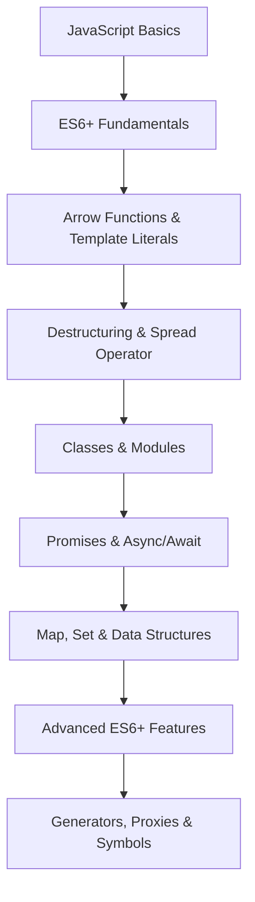

# JavaScript ES6+ Nền Tảng: Những Tính Năng Cần Biết

## 🚀 ES6+ là gì và tại sao cần học?

**ES6 (ECMAScript 2015)** là một bước ngoặt lớn trong lịch sử JavaScript, mang đến những tính năng mạnh mẽ giúp code trở nên sạch sẽ, dễ đọc và hiệu quả hơn. **ES6+** bao gồm tất cả các phiên bản từ ES6 trở đi (ES7, ES8, ES9, ES10, ES11, ES12...).

### 🎯 Tại sao ES6+ quan trọng trong 2025?

- **Modern JavaScript**: Tất cả framework hiện đại (React, Vue, Angular) đều sử dụng ES6+
- **Better Developer Experience**: Code ngắn gọn, dễ maintain hơn
- **Performance**: Nhiều tính năng được optimize tốt hơn
- **Industry Standard**: Được sử dụng rộng rãi trong các công ty công nghệ
- **Career Growth**: Essential skills cho mọi lập trình viên JavaScript

### 📚 Roadmap học ES6+ cho người mới



**Lưu ý**: Bài viết này tập trung vào **Fundamentals** (cấp độ 2-7). Đây là nền tảng cần thiết trước khi học các tính năng nâng cao.

## 🎯 Mục tiêu bài viết

Sau khi đọc xong bài viết này, bạn sẽ hiểu:
- **Arrow Functions**: Lexical scoping và cú pháp ngắn gọn
- **Destructuring Assignment**: Trích xuất dữ liệu từ arrays và objects
- **Template Literals**: String interpolation và multiline strings
- **Spread Operator & Rest Parameters**: Thao tác với arrays và objects
- **Classes**: OOP trong JavaScript hiện đại
- **Modules**: Import/Export system
- **Promises & Async/Await**: Asynchronous programming
- **Map, Set**: Cấu trúc dữ liệu mới mạnh mẽ

### 👥 Ai nên đọc bài viết này?

- ✅ **Sinh viên ngành IT**: Học JavaScript hiện đại từ cơ bản
- ✅ **Junior Developers**: Nắm vững ES6+ fundamentals
- ✅ **Career Changers**: Chuyển đổi từ ngôn ngữ khác sang JavaScript
- ✅ **Backend Developers**: Học Frontend với JavaScript hiện đại
- ✅ **Experienced Developers**: Ôn lại và cập nhật kiến thức ES6+

## 🏹 Arrow Functions

### 🎯 Khi nào sử dụng Arrow Functions?

**Arrow Functions** rất hữu ích khi bạn cần:
- **Array Methods**: `map`, `filter`, `reduce`, `forEach` - code ngắn gọn hơn
- **Event Handlers**: Trong React, Vue - tránh binding issues
- **Callbacks**: Trong Promises, setTimeout, setInterval
- **Lexical `this`**: Khi cần `this` trỏ đến outer scope

**Lưu ý**: Không dùng arrow functions cho:
- Object methods (mất `this` binding)
- Constructor functions
- Methods cần `arguments` object

### Cú pháp cơ bản

```javascript
// ES5 - Function expression
const add = function(a, b) {
    return a + b;
};

// ES6 - Arrow function
const add = (a, b) => {
    return a + b;
};

// Arrow function với return ngầm định
const add = (a, b) => a + b;

// Arrow function với một tham số
const square = x => x * x;

// Arrow function không có tham số
const greet = () => console.log('Hello!');
```

### Lexical Scoping

```javascript
class Counter {
    constructor() {
        this.count = 0;
    }
    
    // ES5 - this binding issue
    incrementES5() {
        setTimeout(function() {
            this.count++; // this không trỏ đến Counter instance
            console.log(this.count);
        }, 1000);
    }
    
    // ES6 - lexical this binding
    incrementES6() {
        setTimeout(() => {
            this.count++; // this trỏ đến Counter instance
            console.log(this.count);
        }, 1000);
    }
}

const counter = new Counter();
counter.incrementES6(); // Hoạt động đúng
```

### Arrow Functions với Array Methods

```javascript
const numbers = [1, 2, 3, 4, 5];

// ES5
const doubled = numbers.map(function(num) {
    return num * 2;
});

// ES6
const doubled = numbers.map(num => num * 2);

// Filter với arrow function
const evens = numbers.filter(num => num % 2 === 0);

// Reduce với arrow function
const sum = numbers.reduce((acc, num) => acc + num, 0);

console.log(doubled); // [2, 4, 6, 8, 10]
console.log(evens);   // [2, 4]
console.log(sum);     // 15
```

## 🎭 Destructuring Assignment

### 🎯 Khi nào sử dụng Destructuring?

**Destructuring** rất hữu ích khi bạn cần:
- **API Responses**: Trích xuất dữ liệu từ JSON objects
- **Function Parameters**: Truyền objects thay vì nhiều parameters
- **Array Processing**: Lấy first/last elements, skip elements
- **State Management**: Trong React, Vue - destructure props/state
- **Configuration Objects**: Trích xuất config từ objects

**Ví dụ thực tế**: React props, API data processing, configuration management

### Array Destructuring

```javascript
// Cơ bản
const colors = ['red', 'green', 'blue'];
const [first, second, third] = colors;
console.log(first, second, third); // red green blue

// Bỏ qua phần tử
const [primary, , tertiary] = colors;
console.log(primary, tertiary); // red blue

// Giá trị mặc định
const [a, b, c, d = 'yellow'] = colors;
console.log(d); // yellow

// Rest operator
const [head, ...tail] = colors;
console.log(head); // red
console.log(tail); // ['green', 'blue']

// Hoán đổi biến
let x = 1, y = 2;
[x, y] = [y, x];
console.log(x, y); // 2 1
```

### Object Destructuring

```javascript
const person = {
    name: 'John Doe',
    age: 30,
    city: 'New York',
    hobbies: ['reading', 'coding']
};

// Cơ bản
const { name, age, city } = person;
console.log(name, age, city); // John Doe 30 New York

// Đổi tên biến
const { name: fullName, age: years } = person;
console.log(fullName, years); // John Doe 30

// Giá trị mặc định
const { name, age, country = 'USA' } = person;
console.log(country); // USA

// Rest operator
const { name, ...rest } = person;
console.log(rest); // { age: 30, city: 'New York', hobbies: [...] }

// Nested destructuring
const { hobbies: [firstHobby, secondHobby] } = person;
console.log(firstHobby, secondHobby); // reading coding
```

### Destructuring trong Function Parameters

```javascript
// Object destructuring trong parameters
function greet({ name, age, city = 'Unknown' }) {
    return `Hello, ${name}! You are ${age} years old and live in ${city}.`;
}

const person = { name: 'Alice', age: 25 };
console.log(greet(person)); // Hello, Alice! You are 25 years old and live in Unknown.

// Array destructuring trong parameters
function getFirstAndLast([first, ...rest]) {
    const last = rest[rest.length - 1];
    return { first, last };
}

const numbers = [1, 2, 3, 4, 5];
console.log(getFirstAndLast(numbers)); // { first: 1, last: 5 }
```

## 📝 Template Literals

### 🎯 Khi nào sử dụng Template Literals?

**Template Literals** rất hữu ích khi bạn cần:
- **String Interpolation**: Thay thế string concatenation
- **Multiline Strings**: HTML templates, SQL queries, JSON strings
- **Dynamic Content**: Tạo messages với variables
- **Tagged Templates**: Custom string processing (styled-components, i18n)

**Ví dụ thực tế**: React JSX, API URLs, error messages, HTML templates

### Cú pháp cơ bản

```javascript
const name = 'World';
const age = 25;

// ES5 - String concatenation
const message = 'Hello, ' + name + '! You are ' + age + ' years old.';

// ES6 - Template literals
const message = `Hello, ${name}! You are ${age} years old.`;

console.log(message); // Hello, World! You are 25 years old.
```

### Multiline Strings

```javascript
// ES5 - String concatenation với \n
const html = '<div>\n' +
             '  <h1>Title</h1>\n' +
             '  <p>Content</p>\n' +
             '</div>';

// ES6 - Template literals
const html = `
<div>
  <h1>Title</h1>
  <p>Content</p>
</div>
`;

console.log(html);
```

### Tagged Template Literals

```javascript
// Tag function
function highlight(strings, ...values) {
    return strings.reduce((result, string, i) => {
        const value = values[i] ? `<mark>${values[i]}</mark>` : '';
        return result + string + value;
    }, '');
}

const name = 'John';
const age = 30;
const message = highlight`Hello, ${name}! You are ${age} years old.`;

console.log(message); // Hello, <mark>John</mark>! You are <mark>30</mark> years old.
```

## 🔄 Spread Operator và Rest Parameters

### 🎯 Khi nào sử dụng Spread & Rest?

**Spread Operator** rất hữu ích khi bạn cần:
- **Array/Object Copying**: Tạo shallow copies
- **Array/Object Merging**: Combine multiple arrays/objects
- **Function Arguments**: Pass array elements as arguments
- **State Updates**: Trong React - immutable updates

**Rest Parameters** rất hữu ích khi bạn cần:
- **Variable Arguments**: Functions với số lượng parameters không cố định
- **Destructuring**: Lấy remaining elements
- **Function Overloading**: Handle multiple parameter patterns

**Ví dụ thực tế**: React state management, API calls, utility functions

### Spread Operator

```javascript
// Array spreading
const arr1 = [1, 2, 3];
const arr2 = [4, 5, 6];
const combined = [...arr1, ...arr2];
console.log(combined); // [1, 2, 3, 4, 5, 6]

// Object spreading
const obj1 = { a: 1, b: 2 };
const obj2 = { c: 3, d: 4 };
const combined = { ...obj1, ...obj2 };
console.log(combined); // { a: 1, b: 2, c: 3, d: 4 }

// Function arguments
function sum(a, b, c) {
    return a + b + c;
}

const numbers = [1, 2, 3];
console.log(sum(...numbers)); // 6

// Copy arrays và objects
const originalArray = [1, 2, 3];
const copiedArray = [...originalArray];

const originalObject = { x: 1, y: 2 };
const copiedObject = { ...originalObject };
```

### Rest Parameters

```javascript
// Rest parameters trong function
function sum(...numbers) {
    return numbers.reduce((total, num) => total + num, 0);
}

console.log(sum(1, 2, 3, 4, 5)); // 15

// Rest parameters với other parameters
function greet(greeting, ...names) {
    return `${greeting}, ${names.join(', ')}!`;
}

console.log(greet('Hello', 'John', 'Jane', 'Bob')); // Hello, John, Jane, Bob!

// Rest trong destructuring
const [first, second, ...rest] = [1, 2, 3, 4, 5];
console.log(first, second, rest); // 1 2 [3, 4, 5]
```

## 🏗️ Classes

### Cú pháp cơ bản

```javascript
// ES5 - Constructor function
function Person(name, age) {
    this.name = name;
    this.age = age;
}

Person.prototype.greet = function() {
    return `Hello, I'm ${this.name}`;
};

// ES6 - Class
class Person {
    constructor(name, age) {
        this.name = name;
        this.age = age;
    }
    
    greet() {
        return `Hello, I'm ${this.name}`;
    }
    
    // Getter
    get info() {
        return `${this.name} is ${this.age} years old`;
    }
    
    // Setter
    set age(newAge) {
        if (newAge >= 0) {
            this._age = newAge;
        }
    }
    
    get age() {
        return this._age;
    }
    
    // Static method
    static createAdult(name) {
        return new Person(name, 18);
    }
}

const person = new Person('Alice', 25);
console.log(person.greet()); // Hello, I'm Alice
console.log(person.info); // Alice is 25 years old

const adult = Person.createAdult('Bob');
console.log(adult.info); // Bob is 18 years old
```

### Inheritance

```javascript
class Animal {
    constructor(name) {
        this.name = name;
    }
    
    speak() {
        return `${this.name} makes a sound`;
    }
}

class Dog extends Animal {
    constructor(name, breed) {
        super(name); // Gọi constructor của parent class
        this.breed = breed;
    }
    
    speak() {
        return `${this.name} barks`;
    }
    
    getInfo() {
        return `${this.name} is a ${this.breed}`;
    }
}

const dog = new Dog('Buddy', 'Golden Retriever');
console.log(dog.speak()); // Buddy barks
console.log(dog.getInfo()); // Buddy is a Golden Retriever
```

## 📦 Modules

### Export và Import

```javascript
// math.js - Named exports
export const PI = 3.14159;
export function add(a, b) {
    return a + b;
}

export function multiply(a, b) {
    return a * b;
}

// Default export
export default function subtract(a, b) {
    return a - b;
}

// utils.js - Mixed exports
const API_URL = 'https://api.example.com';

export function fetchData() {
    return fetch(API_URL);
}

export default class Utils {
    static formatDate(date) {
        return date.toISOString();
    }
}
```

### Import trong file khác

```javascript
// main.js
// Named imports
import { PI, add, multiply } from './math.js';

// Default import
import subtract from './math.js';

// Mixed imports
import Utils, { fetchData } from './utils.js';

// Import all
import * as Math from './math.js';

// Dynamic import
async function loadModule() {
    const module = await import('./math.js');
    console.log(module.PI);
}

console.log(add(2, 3)); // 5
console.log(Math.PI); // 3.14159
```

## 🔄 Promises và Async/Await

### Promises

```javascript
// Tạo Promise
function fetchUserData(userId) {
    return new Promise((resolve, reject) => {
        setTimeout(() => {
            if (userId > 0) {
                resolve({ id: userId, name: 'John Doe', email: 'john@example.com' });
            } else {
                reject(new Error('Invalid user ID'));
            }
        }, 1000);
    });
}

// Sử dụng Promise
fetchUserData(1)
    .then(user => {
        console.log('User:', user);
        return fetchUserData(2);
    })
    .then(user => {
        console.log('Second user:', user);
    })
    .catch(error => {
        console.error('Error:', error.message);
    });

// Promise.all
Promise.all([
    fetchUserData(1),
    fetchUserData(2),
    fetchUserData(3)
])
.then(users => {
    console.log('All users:', users);
})
.catch(error => {
    console.error('Error:', error);
});
```

### Async/Await

```javascript
// Async function
async function getUserData(userId) {
    try {
        const user = await fetchUserData(userId);
        console.log('User:', user);
        return user;
    } catch (error) {
        console.error('Error:', error.message);
        throw error;
    }
}

// Sử dụng async/await
async function main() {
    try {
        const user1 = await getUserData(1);
        const user2 = await getUserData(2);
        console.log('Both users loaded');
    } catch (error) {
        console.error('Failed to load users');
    }
}

main();

// Parallel execution với Promise.all
async function loadAllUsers() {
    try {
        const users = await Promise.all([
            getUserData(1),
            getUserData(2),
            getUserData(3)
        ]);
        console.log('All users loaded:', users);
    } catch (error) {
        console.error('Error loading users:', error);
    }
}
```

## 🗺️ Map, Set và Cấu Trúc Dữ Liệu Mới

### Map

```javascript
// Tạo Map
const userMap = new Map();

// Thêm key-value pairs
userMap.set('user1', { name: 'John', age: 30 });
userMap.set('user2', { name: 'Jane', age: 25 });

// Lấy giá trị
console.log(userMap.get('user1')); // { name: 'John', age: 30 }

// Kiểm tra key tồn tại
console.log(userMap.has('user1')); // true

// Xóa key
userMap.delete('user1');

// Kích thước
console.log(userMap.size); // 1

// Iterate qua Map
for (const [key, value] of userMap) {
    console.log(key, value);
}

// Chuyển đổi từ Object
const obj = { a: 1, b: 2 };
const map = new Map(Object.entries(obj));
console.log(map); // Map { 'a' => 1, 'b' => 2 }
```

### Set

```javascript
// Tạo Set
const uniqueNumbers = new Set([1, 2, 3, 3, 4, 4, 5]);
console.log(uniqueNumbers); // Set { 1, 2, 3, 4, 5 }

// Thêm phần tử
uniqueNumbers.add(6);

// Kiểm tra phần tử tồn tại
console.log(uniqueNumbers.has(3)); // true

// Xóa phần tử
uniqueNumbers.delete(3);

// Kích thước
console.log(uniqueNumbers.size); // 5

// Iterate qua Set
for (const number of uniqueNumbers) {
    console.log(number);
}

// Chuyển đổi thành Array
const array = [...uniqueNumbers];
console.log(array); // [1, 2, 4, 5, 6]
```

### WeakMap và WeakSet

```javascript
// WeakMap - keys phải là objects
const weakMap = new WeakMap();
const obj1 = {};
const obj2 = {};

weakMap.set(obj1, 'value1');
weakMap.set(obj2, 'value2');

console.log(weakMap.get(obj1)); // 'value1'

// WeakSet - chỉ chứa objects
const weakSet = new WeakSet();
weakSet.add(obj1);
weakSet.add(obj2);

console.log(weakSet.has(obj1)); // true
```

## 🧪 Ví dụ thực tế: Ứng dụng ES6+ trong React, Vue và Node.js

### 🚀 React: Modern Component với ES6+

```javascript
// UserProfile.jsx - React component sử dụng ES6+
import React, { useState, useEffect } from 'react';

// Arrow function component
const UserProfile = ({ userId, onUserUpdate }) => {
    // Destructuring props
    const [user, setUser] = useState(null);
    const [loading, setLoading] = useState(true);
    const [error, setError] = useState(null);

    // Async/await với arrow function
    const fetchUser = async (id) => {
        try {
            setLoading(true);
            const response = await fetch(`/api/users/${id}`);
            const userData = await response.json();
            setUser(userData);
        } catch (err) {
            setError(err.message);
        } finally {
            setLoading(false);
        }
    };

    // useEffect với arrow function
    useEffect(() => {
        fetchUser(userId);
    }, [userId]);

    // Event handler với arrow function
    const handleUpdate = async (updates) => {
        try {
            const response = await fetch(`/api/users/${userId}`, {
                method: 'PUT',
                headers: { 'Content-Type': 'application/json' },
                body: JSON.stringify(updates)
            });
            const updatedUser = await response.json();
            setUser(updatedUser);
            onUserUpdate?.(updatedUser);
        } catch (err) {
            setError(err.message);
        }
    };

    // Destructuring user object
    const { name, email, avatar, bio } = user || {};

    if (loading) return <div>Loading...</div>;
    if (error) return <div>Error: {error}</div>;
    if (!user) return <div>User not found</div>;

    return (
        <div className="user-profile">
            
            <h2>{name}</h2>
            <p>{email}</p>
            <p>{bio}</p>
            <button onClick={() => handleUpdate({ bio: 'Updated bio' })}>
                Update Bio
            </button>
        </div>
    );
};

export default UserProfile;
```

### 🎯 Vue.js: Composition API với ES6+

```javascript
// UserProfile.vue - Vue component sử dụng ES6+
<template>
  <div class="user-profile">
    
    <h2>{{ user?.name }}</h2>
    <p>{{ user?.email }}</p>
    <p>{{ user?.bio }}</p>
    <button @click="updateBio">Update Bio</button>
  </div>
</template>

<script>
import { ref, onMounted, computed } from 'vue';

export default {
  name: 'UserProfile',
  props: {
    userId: {
      type: Number,
      required: true
    }
  },
  emits: ['user-updated'],
  setup(props, { emit }) {
    // Reactive state với ref
    const user = ref(null);
    const loading = ref(true);
    const error = ref(null);

    // Computed property với arrow function
    const userDisplayName = computed(() => 
      user.value?.name || 'Unknown User'
    );

    // Async function với arrow function
    const fetchUser = async (id) => {
      try {
        loading.value = true;
        const response = await fetch(`/api/users/${id}`);
        const userData = await response.json();
        user.value = userData;
      } catch (err) {
        error.value = err.message;
      } finally {
        loading.value = false;
      }
    };

    // Event handler với arrow function
    const updateBio = async () => {
      try {
        const response = await fetch(`/api/users/${props.userId}`, {
          method: 'PUT',
          headers: { 'Content-Type': 'application/json' },
          body: JSON.stringify({ bio: 'Updated bio' })
        });
        const updatedUser = await response.json();
        user.value = updatedUser;
        emit('user-updated', updatedUser);
      } catch (err) {
        error.value = err.message;
      }
    };

    // Lifecycle hook
    onMounted(() => {
      fetchUser(props.userId);
    });

    return {
      user,
      loading,
      error,
      userDisplayName,
      updateBio
    };
  }
};
</script>
```

### 🖥️ Node.js: API Server với ES6+

```javascript
// server.js - Express API sử dụng ES6+
import express from 'express';
import { createServer } from 'http';
import { fileURLToPath } from 'url';
import { dirname, join } from 'path';

const __filename = fileURLToPath(import.meta.url);
const __dirname = dirname(__filename);

const app = express();
const PORT = process.env.PORT || 3000;

// Middleware với arrow functions
app.use(express.json());
app.use(express.static(join(__dirname, 'public')));

// Mock database với Map
const users = new Map();
let nextId = 1;

// Helper function với arrow function
const createUser = (userData) => ({
  id: nextId++,
  ...userData,
  createdAt: new Date().toISOString()
});

// API Routes với async/await
app.get('/api/users', async (req, res) => {
  try {
    const userList = Array.from(users.values());
    res.json(userList);
  } catch (error) {
    res.status(500).json({ error: error.message });
  }
});

app.get('/api/users/:id', async (req, res) => {
  try {
    const { id } = req.params; // Destructuring
    const user = users.get(parseInt(id));
    
    if (!user) {
      return res.status(404).json({ error: 'User not found' });
    }
    
    res.json(user);
  } catch (error) {
    res.status(500).json({ error: error.message });
  }
});

app.post('/api/users', async (req, res) => {
  try {
    const { name, email, bio } = req.body; // Destructuring
    
    if (!name || !email) {
      return res.status(400).json({ error: 'Name and email are required' });
    }
    
    const user = createUser({ name, email, bio });
    users.set(user.id, user);
    
    res.status(201).json(user);
  } catch (error) {
    res.status(500).json({ error: error.message });
  }
});

app.put('/api/users/:id', async (req, res) => {
  try {
    const { id } = req.params;
    const updates = req.body;
    
    const user = users.get(parseInt(id));
    if (!user) {
      return res.status(404).json({ error: 'User not found' });
    }
    
    // Spread operator để merge updates
    const updatedUser = { ...user, ...updates };
    users.set(parseInt(id), updatedUser);
    
    res.json(updatedUser);
  } catch (error) {
    res.status(500).json({ error: error.message });
  }
});

app.delete('/api/users/:id', async (req, res) => {
  try {
    const { id } = req.params;
    const deleted = users.delete(parseInt(id));
    
    if (!deleted) {
      return res.status(404).json({ error: 'User not found' });
    }
    
    res.json({ message: 'User deleted successfully' });
  } catch (error) {
    res.status(500).json({ error: error.message });
  }
});

// Error handling middleware
app.use((error, req, res, next) => {
  console.error(error.stack);
  res.status(500).json({ error: 'Something went wrong!' });
});

// Start server
const server = createServer(app);
server.listen(PORT, () => {
  console.log(`Server running on port ${PORT}`);
});

export default app;
```

## 🧪 Ví dụ thực tế: Todo App với ES6+

```javascript
// todo.js
class TodoApp {
    constructor() {
        this.todos = new Map();
        this.nextId = 1;
    }
    
    addTodo(text) {
        const todo = {
            id: this.nextId++,
            text,
            completed: false,
            createdAt: new Date()
        };
        this.todos.set(todo.id, todo);
        return todo;
    }
    
    completeTodo(id) {
        const todo = this.todos.get(id);
        if (todo) {
            todo.completed = true;
            todo.completedAt = new Date();
        }
        return todo;
    }
    
    deleteTodo(id) {
        return this.todos.delete(id);
    }
    
    getTodos() {
        return Array.from(this.todos.values());
    }
    
    getCompletedTodos() {
        return this.getTodos().filter(todo => todo.completed);
    }
    
    getPendingTodos() {
        return this.getTodos().filter(todo => !todo.completed);
    }
    
    searchTodos(query) {
        return this.getTodos().filter(todo => 
            todo.text.toLowerCase().includes(query.toLowerCase())
        );
    }
}

// Sử dụng
const app = new TodoApp();

// Thêm todos
app.addTodo('Learn ES6+ features');
app.addTodo('Build a todo app');
app.addTodo('Write blog post');

// Hoàn thành todo
app.completeTodo(1);

// Tìm kiếm
const results = app.searchTodos('app');
console.log(results);

// Hiển thị todos
console.log('All todos:', app.getTodos());
console.log('Completed:', app.getCompletedTodos());
console.log('Pending:', app.getPendingTodos());
```

## 🏋️ Bài tập thực hành

### Bài tập 1: Arrow Functions và Array Methods
Tạo một function sử dụng arrow functions và array methods để xử lý danh sách sản phẩm.

```javascript
// TODO: Implement product processing functions
const products = [
    { id: 1, name: 'Laptop', price: 1000, category: 'electronics' },
    { id: 2, name: 'Phone', price: 500, category: 'electronics' },
    { id: 3, name: 'Book', price: 20, category: 'books' },
    { id: 4, name: 'Headphones', price: 100, category: 'electronics' }
];

// 1. Tìm tất cả sản phẩm electronics
const electronics = // Your code here

// 2. Tính tổng giá trị tất cả sản phẩm
const totalValue = // Your code here

// 3. Tạo danh sách tên sản phẩm
const productNames = // Your code here

// 4. Tìm sản phẩm đắt nhất
const mostExpensive = // Your code here

console.log(electronics);
console.log(totalValue);
console.log(productNames);
console.log(mostExpensive);
```

### Bài tập 2: Destructuring và Template Literals
Tạo một function xử lý thông tin user với destructuring và template literals.

```javascript
// TODO: Implement user processing functions
const users = [
    { name: 'John Doe', age: 30, email: 'john@example.com', city: 'New York' },
    { name: 'Jane Smith', age: 25, email: 'jane@example.com', city: 'Los Angeles' },
    { name: 'Bob Johnson', age: 35, email: 'bob@example.com', city: 'Chicago' }
];

// 1. Tạo function greetUser với destructuring
function greetUser(/* parameters */) {
    // Your code here - sử dụng template literals
}

// 2. Tạo function createUserCard với destructuring
function createUserCard(/* parameters */) {
    // Your code here - tạo HTML card với template literals
}

// Test
users.forEach(user => {
    console.log(greetUser(user));
    console.log(createUserCard(user));
});
```

### Bài tập 3: Classes và Modules
Tạo một hệ thống quản lý thư viện với ES6+ classes và modules.

```javascript
// TODO: Implement Library Management System
// book.js
export class Book {
    constructor(/* parameters */) {
        // Your code here
    }
    
    // Add methods: borrow, return, getInfo
}

// library.js
export class Library {
    constructor(/* parameters */) {
        // Your code here - sử dụng Map để lưu trữ books
    }
    
    // Add methods: addBook, removeBook, findBook, listBooks
}

// main.js
import { Book, Library } from './library.js';

// Test the system
const library = new Library('Central Library');
const book1 = new Book('JavaScript Guide', 'John Doe', '123456789');
const book2 = new Book('React Basics', 'Jane Smith', '987654321');

library.addBook(book1);
library.addBook(book2);

console.log(library.listBooks());
```

### Bài tập 4: Async/Await và Promises
Tạo một function fetch và xử lý dữ liệu từ API với async/await.

```javascript
// TODO: Implement API data fetching
const API_BASE = 'https://jsonplaceholder.typicode.com';

// 1. Tạo function fetchUser với async/await
async function fetchUser(/* parameters */) {
    // Your code here
}

// 2. Tạo function fetchUserPosts với async/await
async function fetchUserPosts(/* parameters */) {
    // Your code here
}

// 3. Tạo function fetchUserWithPosts sử dụng Promise.all
async function fetchUserWithPosts(/* parameters */) {
    // Your code here
}

// 4. Tạo function fetchMultipleUsers với Promise.all
async function fetchMultipleUsers(/* parameters */) {
    // Your code here
}

// Test
async function main() {
    try {
        const user = await fetchUser(1);
        console.log('User:', user);
        
        const userWithPosts = await fetchUserWithPosts(1);
        console.log('User with posts:', userWithPosts);
        
        const users = await fetchMultipleUsers([1, 2, 3]);
        console.log('Multiple users:', users);
    } catch (error) {
        console.error('Error:', error);
    }
}

main();
```

### 🎯 Gợi ý giải bài tập

<details>
<summary>Click để xem gợi ý</summary>

**Bài tập 1 - Arrow Functions:**
```javascript
const electronics = products.filter(product => product.category === 'electronics');
const totalValue = products.reduce((sum, product) => sum + product.price, 0);
const productNames = products.map(product => product.name);
const mostExpensive = products.reduce((max, product) => 
    product.price > max.price ? product : max
);
```

**Bài tập 2 - Destructuring:**
```javascript
function greetUser({ name, age, city }) {
    return `Hello ${name}! You are ${age} years old and live in ${city}.`;
}

function createUserCard({ name, age, email, city }) {
    return `
        <div class="user-card">
            <h3>${name}</h3>
            <p>Age: ${age}</p>
            <p>Email: ${email}</p>
            <p>City: ${city}</p>
        </div>
    `;
}
```

**Bài tập 3 - Classes:**
```javascript
export class Book {
    constructor(title, author, isbn) {
        this.title = title;
        this.author = author;
        this.isbn = isbn;
        this.borrowed = false;
    }
    
    borrow() {
        this.borrowed = true;
    }
    
    return() {
        this.borrowed = false;
    }
    
    getInfo() {
        return `${this.title} by ${this.author}`;
    }
}

export class Library {
    constructor(name) {
        this.name = name;
        this.books = new Map();
    }
    
    addBook(book) {
        this.books.set(book.isbn, book);
    }
    
    removeBook(isbn) {
        return this.books.delete(isbn);
    }
    
    findBook(isbn) {
        return this.books.get(isbn);
    }
    
    listBooks() {
        return Array.from(this.books.values());
    }
}
```

**Bài tập 4 - Async/Await:**
```javascript
async function fetchUser(userId) {
    const response = await fetch(`${API_BASE}/users/${userId}`);
    return response.json();
}

async function fetchUserPosts(userId) {
    const response = await fetch(`${API_BASE}/posts?userId=${userId}`);
    return response.json();
}

async function fetchUserWithPosts(userId) {
    const [user, posts] = await Promise.all([
        fetchUser(userId),
        fetchUserPosts(userId)
    ]);
    return { ...user, posts };
}

async function fetchMultipleUsers(userIds) {
    const promises = userIds.map(id => fetchUser(id));
    return Promise.all(promises);
}
```

</details>

## 📚 Tài liệu tham khảo

- [MDN Web Docs - ES6 Features](https://developer.mozilla.org/en-US/docs/Web/JavaScript/Guide)
- [ES6 Features](https://es6-features.org/)
- [JavaScript.info - ES6+](https://javascript.info/)

## 🎉 Kết luận

Chúng ta đã tìm hiểu về các tính năng ES6+ nền tảng:

- ✅ **Arrow Functions**: Lexical scoping và cú pháp ngắn gọn - essential cho React/Vue
- ✅ **Destructuring**: Array và Object destructuring - giúp code sạch hơn
- ✅ **Template Literals**: String interpolation và multiline - thay thế string concatenation
- ✅ **Spread/Rest**: Operators mạnh mẽ cho arrays và objects - quan trọng cho state management
- ✅ **Classes**: OOP trong JavaScript hiện đại - cần thiết cho complex applications
- ✅ **Modules**: Import/Export system - foundation của modern JavaScript
- ✅ **Promises/Async-Await**: Asynchronous programming - core skill cho web development
- ✅ **Map/Set**: Cấu trúc dữ liệu mới - performance và functionality tốt hơn

### 🚀 Ứng dụng thực tế trong 2025

Những tính năng này là **foundation skills** cho:

- **Sinh viên IT**: Nền tảng vững chắc để học React, Vue, Node.js
- **Junior Developers**: Essential skills cho công việc hàng ngày
- **Career Changers**: Chuyển đổi dễ dàng với modern JavaScript
- **Backend Developers**: Học Frontend với JavaScript hiện đại
- **Experienced Developers**: Cập nhật kiến thức ES6+ fundamentals

### 📈 Next Steps

1. **Thực hành**: Làm các bài tập ở trên
2. **Áp dụng**: Sử dụng trong project thực tế
3. **Mở rộng**: Học React, Vue, hoặc Node.js
4. **Nâng cao**: Tìm hiểu Advanced ES6+ Features (Generators, Proxies, Symbols)

Trong bài viết tiếp theo, chúng ta sẽ đi sâu vào **JavaScript ES6+ Features** nâng cao như Generators, Proxies và Symbols. Hãy theo dõi để không bỏ lỡ!

---

*Bạn có câu hỏi nào về ES6+ trong JavaScript không? Hãy để lại comment hoặc liên hệ với mình!* 🚀

**Tags**: #javascript #es6 #fundamentals #arrow-functions #destructuring #async-await #2025 #modern-javascript
