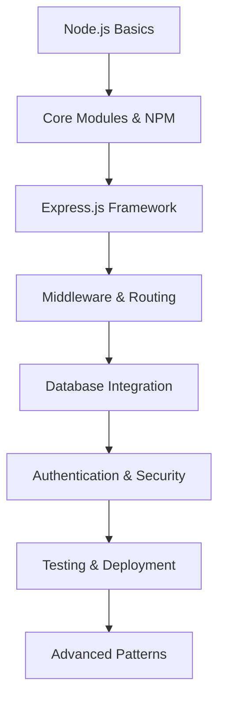

# Node.js Server Tutorial: Xây dựng REST API từ cơ bản đến nâng cao

## 🚀 Node.js là gì và tại sao cần học?

**Node.js** là một JavaScript runtime được xây dựng trên Chrome's V8 JavaScript engine, cho phép chạy JavaScript ở server-side. Node.js đã trở thành một trong những công nghệ backend phổ biến nhất hiện nay.

### 🎯 Tại sao Node.js quan trọng trong 2025?

- **Full-stack JavaScript**: Cùng ngôn ngữ cho frontend và backend
- **High Performance**: Non-blocking I/O và event-driven architecture
- **Rich Ecosystem**: NPM với hàng triệu packages
- **Scalability**: Dễ dàng scale horizontal và vertical
- **Industry Adoption**: Được sử dụng bởi Netflix, Uber, LinkedIn, PayPal

### 📚 Roadmap học Node.js cho người mới



## 🎯 Mục tiêu bài viết

Sau khi đọc xong bài viết này, bạn sẽ hiểu:
- **Node.js Fundamentals**: Core modules, event loop, streams
- **Express.js Framework**: Routing, middleware, error handling
- **REST API Design**: HTTP methods, status codes, best practices
- **Database Integration**: MongoDB với Mongoose, PostgreSQL với Prisma
- **Authentication**: JWT, bcrypt, session management
- **Security**: CORS, helmet, rate limiting
- **Testing**: Unit tests, integration tests với Jest
- **Deployment**: Docker, PM2, cloud platforms

### 👥 Ai nên đọc bài viết này?

- ✅ **Frontend developers** muốn học backend development
- ✅ **Career changers** từ ngôn ngữ khác sang JavaScript
- ✅ **Students** muốn xây dựng full-stack applications
- ✅ **Developers** muốn nâng cao kỹ năng Node.js

## 🛠️ Cài đặt và Setup

### Cài đặt Node.js

```bash
# Kiểm tra version Node.js
node --version
npm --version

# Cài đặt Node.js (nếu chưa có)
# Tải từ: https://nodejs.org/
# Hoặc sử dụng nvm (Node Version Manager)
nvm install 18.17.0
nvm use 18.17.0
```

### Tạo project mới

```bash
# Tạo thư mục project
mkdir nodejs-server-tutorial
cd nodejs-server-tutorial

# Khởi tạo package.json
npm init -y

# Cài đặt dependencies
npm install express cors helmet morgan dotenv bcryptjs jsonwebtoken
npm install mongoose prisma @prisma/client

# Cài đặt dev dependencies
npm install --save-dev nodemon jest supertest
```

### Cấu trúc thư mục

```
nodejs-server-tutorial/
├── src/
│   ├── controllers/
│   ├── middleware/
│   ├── models/
│   ├── routes/
│   ├── services/
│   ├── utils/
│   └── app.js
├── tests/
├── .env
├── .gitignore
├── package.json
└── README.md
```

## 🏗️ Node.js Fundamentals

### Core Modules

```javascript
// fs - File System
const fs = require('fs');
const path = require('path');

// Đọc file đồng bộ
const data = fs.readFileSync('./data.txt', 'utf8');
console.log(data);

// Đọc file bất đồng bộ
fs.readFile('./data.txt', 'utf8', (err, data) => {
    if (err) {
        console.error('Error reading file:', err);
        return;
    }
    console.log(data);
});

// Promise-based file reading
const fsPromises = require('fs').promises;
async function readFileAsync() {
    try {
        const data = await fsPromises.readFile('./data.txt', 'utf8');
        console.log(data);
    } catch (err) {
        console.error('Error:', err);
    }
}
```

### HTTP Server cơ bản

```javascript
const http = require('http');
const url = require('url');

const server = http.createServer((req, res) => {
    const parsedUrl = url.parse(req.url, true);
    const path = parsedUrl.pathname;
    const method = req.method;
    
    // Set headers
    res.setHeader('Content-Type', 'application/json');
    res.setHeader('Access-Control-Allow-Origin', '*');
    
    // Simple routing
    if (path === '/api/users' && method === 'GET') {
        res.statusCode = 200;
        res.end(JSON.stringify({
            message: 'Get all users',
            users: [
                { id: 1, name: 'John Doe' },
                { id: 2, name: 'Jane Smith' }
            ]
        }));
    } else if (path === '/api/users' && method === 'POST') {
        let body = '';
        req.on('data', chunk => {
            body += chunk.toString();
        });
        
        req.on('end', () => {
            const userData = JSON.parse(body);
            res.statusCode = 201;
            res.end(JSON.stringify({
                message: 'User created successfully',
                user: userData
            }));
        });
    } else {
        res.statusCode = 404;
        res.end(JSON.stringify({ error: 'Not Found' }));
    }
});

const PORT = process.env.PORT || 3000;
server.listen(PORT, () => {
    console.log(`Server running on port ${PORT}`);
});
```

### Event Loop và Asynchronous Programming

```javascript
// Event Loop demonstration
console.log('1. Start');

setTimeout(() => {
    console.log('2. setTimeout');
}, 0);

Promise.resolve().then(() => {
    console.log('3. Promise');
});

process.nextTick(() => {
    console.log('4. nextTick');
});

console.log('5. End');

// Output:
// 1. Start
// 5. End
// 4. nextTick
// 3. Promise
// 2. setTimeout
```

## 🚀 Express.js Framework

### Express Server cơ bản

```javascript
const express = require('express');
const app = express();

// Middleware để parse JSON
app.use(express.json());
app.use(express.urlencoded({ extended: true }));

// Basic route
app.get('/', (req, res) => {
    res.json({ message: 'Welcome to Node.js Server Tutorial!' });
});

// Route với parameters
app.get('/api/users/:id', (req, res) => {
    const { id } = req.params;
    res.json({ 
        message: `Get user with ID: ${id}`,
        userId: id
    });
});

// Route với query parameters
app.get('/api/search', (req, res) => {
    const { q, limit = 10, page = 1 } = req.query;
    res.json({
        query: q,
        limit: parseInt(limit),
        page: parseInt(page),
        results: []
    });
});

const PORT = process.env.PORT || 3000;
app.listen(PORT, () => {
    console.log(`Server running on http://localhost:${PORT}`);
});
```

### Middleware trong Express

```javascript
// Custom middleware
const logger = (req, res, next) => {
    console.log(`${new Date().toISOString()} - ${req.method} ${req.path}`);
    next();
};

const authMiddleware = (req, res, next) => {
    const token = req.headers.authorization;
    
    if (!token) {
        return res.status(401).json({ error: 'No token provided' });
    }
    
    // Verify token logic here
    req.user = { id: 1, name: 'John Doe' };
    next();
};

// Error handling middleware
const errorHandler = (err, req, res, next) => {
    console.error(err.stack);
    res.status(500).json({ 
        error: 'Something went wrong!',
        message: process.env.NODE_ENV === 'development' ? err.message : 'Internal Server Error'
    });
};

// Apply middleware
app.use(logger);
app.use('/api/protected', authMiddleware);
app.use(errorHandler);
```

### Advanced Routing

```javascript
// Router module
const express = require('express');
const router = express.Router();

// User routes
router.get('/', async (req, res) => {
    try {
        const users = await User.find();
        res.json(users);
    } catch (error) {
        res.status(500).json({ error: error.message });
    }
});

router.post('/', async (req, res) => {
    try {
        const user = new User(req.body);
        await user.save();
        res.status(201).json(user);
    } catch (error) {
        res.status(400).json({ error: error.message });
    }
});

router.get('/:id', async (req, res) => {
    try {
        const user = await User.findById(req.params.id);
        if (!user) {
            return res.status(404).json({ error: 'User not found' });
        }
        res.json(user);
    } catch (error) {
        res.status(500).json({ error: error.message });
    }
});

router.put('/:id', async (req, res) => {
    try {
        const user = await User.findByIdAndUpdate(
            req.params.id, 
            req.body, 
            { new: true, runValidators: true }
        );
        if (!user) {
            return res.status(404).json({ error: 'User not found' });
        }
        res.json(user);
    } catch (error) {
        res.status(400).json({ error: error.message });
    }
});

router.delete('/:id', async (req, res) => {
    try {
        const user = await User.findByIdAndDelete(req.params.id);
        if (!user) {
            return res.status(404).json({ error: 'User not found' });
        }
        res.json({ message: 'User deleted successfully' });
    } catch (error) {
        res.status(500).json({ error: error.message });
    }
});

module.exports = router;
```

## 🗄️ Database Integration

### MongoDB với Mongoose

```javascript
const mongoose = require('mongoose');

// Connect to MongoDB
mongoose.connect(process.env.MONGODB_URI, {
    useNewUrlParser: true,
    useUnifiedTopology: true,
})
.then(() => console.log('Connected to MongoDB'))
.catch(err => console.error('MongoDB connection error:', err));

// User Schema
const userSchema = new mongoose.Schema({
    name: {
        type: String,
        required: [true, 'Name is required'],
        trim: true,
        maxlength: [50, 'Name cannot exceed 50 characters']
    },
    email: {
        type: String,
        required: [true, 'Email is required'],
        unique: true,
        lowercase: true,
        match: [/^\w+([.-]?\w+)*@\w+([.-]?\w+)*(\.\w{2,3})+$/, 'Please enter a valid email']
    },
    age: {
        type: Number,
        min: [0, 'Age cannot be negative'],
        max: [120, 'Age cannot exceed 120']
    },
    isActive: {
        type: Boolean,
        default: true
    },
    createdAt: {
        type: Date,
        default: Date.now
    }
});

// Virtual fields
userSchema.virtual('fullName').get(function() {
    return `${this.name} (${this.email})`;
});

// Instance methods
userSchema.methods.getPublicProfile = function() {
    return {
        id: this._id,
        name: this.name,
        email: this.email,
        isActive: this.isActive
    };
};

// Static methods
userSchema.statics.findByEmail = function(email) {
    return this.findOne({ email: email.toLowerCase() });
};

// Pre and post hooks
userSchema.pre('save', function(next) {
    console.log('Saving user:', this.name);
    next();
});

userSchema.post('save', function(doc) {
    console.log('User saved:', doc.name);
});

const User = mongoose.model('User', userSchema);
module.exports = User;
```

### PostgreSQL với Prisma

```javascript
// prisma/schema.prisma
generator client {
  provider = "prisma-client-js"
}

datasource db {
  provider = "postgresql"
  url      = env("DATABASE_URL")
}

model User {
  id        Int      @id @default(autoincrement())
  name      String
  email     String   @unique
  age       Int?
  isActive  Boolean  @default(true)
  createdAt DateTime @default(now())
  posts     Post[]
}

model Post {
  id        Int      @id @default(autoincrement())
  title     String
  content   String?
  published Boolean  @default(false)
  authorId  Int
  author    User     @relation(fields: [authorId], references: [id])
  createdAt DateTime @default(now())
}
```

```javascript
// Using Prisma Client
const { PrismaClient } = require('@prisma/client');
const prisma = new PrismaClient();

// User operations
class UserService {
    async createUser(userData) {
        return await prisma.user.create({
            data: userData
        });
    }
    
    async getAllUsers() {
        return await prisma.user.findMany({
            include: {
                posts: true
            }
        });
    }
    
    async getUserById(id) {
        return await prisma.user.findUnique({
            where: { id: parseInt(id) },
            include: {
                posts: true
            }
        });
    }
    
    async updateUser(id, userData) {
        return await prisma.user.update({
            where: { id: parseInt(id) },
            data: userData
        });
    }
    
    async deleteUser(id) {
        return await prisma.user.delete({
            where: { id: parseInt(id) }
        });
    }
}

module.exports = new UserService();
```

## 🔐 Authentication & Security

### JWT Authentication

```javascript
const jwt = require('jsonwebtoken');
const bcrypt = require('bcryptjs');

// Generate JWT token
const generateToken = (userId) => {
    return jwt.sign(
        { userId }, 
        process.env.JWT_SECRET, 
        { expiresIn: '7d' }
    );
};

// Verify JWT token
const verifyToken = (token) => {
    try {
        return jwt.verify(token, process.env.JWT_SECRET);
    } catch (error) {
        throw new Error('Invalid token');
    }
};

// Hash password
const hashPassword = async (password) => {
    const saltRounds = 12;
    return await bcrypt.hash(password, saltRounds);
};

// Compare password
const comparePassword = async (password, hashedPassword) => {
    return await bcrypt.compare(password, hashedPassword);
};

// Auth middleware
const authMiddleware = async (req, res, next) => {
    try {
        const token = req.header('Authorization')?.replace('Bearer ', '');
        
        if (!token) {
            return res.status(401).json({ error: 'Access denied. No token provided.' });
        }
        
        const decoded = verifyToken(token);
        const user = await User.findById(decoded.userId);
        
        if (!user) {
            return res.status(401).json({ error: 'Invalid token.' });
        }
        
        req.user = user;
        next();
    } catch (error) {
        res.status(401).json({ error: 'Invalid token.' });
    }
};
```

### Authentication Routes

```javascript
// Auth routes
app.post('/api/auth/register', async (req, res) => {
    try {
        const { name, email, password } = req.body;
        
        // Check if user already exists
        const existingUser = await User.findByEmail(email);
        if (existingUser) {
            return res.status(400).json({ error: 'User already exists' });
        }
        
        // Hash password
        const hashedPassword = await hashPassword(password);
        
        // Create user
        const user = new User({
            name,
            email,
            password: hashedPassword
        });
        
        await user.save();
        
        // Generate token
        const token = generateToken(user._id);
        
        res.status(201).json({
            message: 'User created successfully',
            token,
            user: user.getPublicProfile()
        });
    } catch (error) {
        res.status(400).json({ error: error.message });
    }
});

app.post('/api/auth/login', async (req, res) => {
    try {
        const { email, password } = req.body;
        
        // Find user
        const user = await User.findByEmail(email);
        if (!user) {
            return res.status(401).json({ error: 'Invalid credentials' });
        }
        
        // Check password
        const isPasswordValid = await comparePassword(password, user.password);
        if (!isPasswordValid) {
            return res.status(401).json({ error: 'Invalid credentials' });
        }
        
        // Generate token
        const token = generateToken(user._id);
        
        res.json({
            message: 'Login successful',
            token,
            user: user.getPublicProfile()
        });
    } catch (error) {
        res.status(500).json({ error: error.message });
    }
});
```

### Security Middleware

```javascript
const helmet = require('helmet');
const cors = require('cors');
const rateLimit = require('express-rate-limit');

// Security headers
app.use(helmet());

// CORS configuration
app.use(cors({
    origin: process.env.FRONTEND_URL || 'http://localhost:3000',
    credentials: true
}));

// Rate limiting
const limiter = rateLimit({
    windowMs: 15 * 60 * 1000, // 15 minutes
    max: 100, // limit each IP to 100 requests per windowMs
    message: 'Too many requests from this IP, please try again later.'
});
app.use('/api/', limiter);

// Input validation middleware
const validateInput = (schema) => {
    return (req, res, next) => {
        const { error } = schema.validate(req.body);
        if (error) {
            return res.status(400).json({
                error: 'Validation error',
                details: error.details.map(detail => detail.message)
            });
        }
        next();
    };
};

// Example validation schema
const Joi = require('joi');

const userSchema = Joi.object({
    name: Joi.string().min(2).max(50).required(),
    email: Joi.string().email().required(),
    password: Joi.string().min(6).required()
});

// Apply validation
app.post('/api/users', validateInput(userSchema), async (req, res) => {
    // Route handler
});
```

## 🧪 Testing

### Unit Testing với Jest

```javascript
// tests/user.test.js
const request = require('supertest');
const app = require('../src/app');
const User = require('../src/models/User');

describe('User API', () => {
    beforeEach(async () => {
        await User.deleteMany({});
    });
    
    describe('POST /api/users', () => {
        it('should create a new user', async () => {
            const userData = {
                name: 'John Doe',
                email: 'john@example.com',
                age: 30
            };
            
            const response = await request(app)
                .post('/api/users')
                .send(userData)
                .expect(201);
            
            expect(response.body.user.name).toBe(userData.name);
            expect(response.body.user.email).toBe(userData.email);
        });
        
        it('should not create user with invalid email', async () => {
            const userData = {
                name: 'John Doe',
                email: 'invalid-email',
                age: 30
            };
            
            const response = await request(app)
                .post('/api/users')
                .send(userData)
                .expect(400);
            
            expect(response.body.error).toBeDefined();
        });
    });
    
    describe('GET /api/users', () => {
        it('should get all users', async () => {
            // Create test users
            await User.create([
                { name: 'John Doe', email: 'john@example.com' },
                { name: 'Jane Smith', email: 'jane@example.com' }
            ]);
            
            const response = await request(app)
                .get('/api/users')
                .expect(200);
            
            expect(response.body.users).toHaveLength(2);
        });
    });
});
```

### Integration Testing

```javascript
// tests/integration/auth.test.js
const request = require('supertest');
const app = require('../src/app');
const User = require('../src/models/User');

describe('Authentication Integration', () => {
    beforeEach(async () => {
        await User.deleteMany({});
    });
    
    describe('POST /api/auth/register', () => {
        it('should register a new user and return token', async () => {
            const userData = {
                name: 'John Doe',
                email: 'john@example.com',
                password: 'password123'
            };
            
            const response = await request(app)
                .post('/api/auth/register')
                .send(userData)
                .expect(201);
            
            expect(response.body.token).toBeDefined();
            expect(response.body.user.email).toBe(userData.email);
            
            // Verify user was created in database
            const user = await User.findByEmail(userData.email);
            expect(user).toBeTruthy();
            expect(user.name).toBe(userData.name);
        });
    });
    
    describe('POST /api/auth/login', () => {
        it('should login with valid credentials', async () => {
            // Create user first
            const userData = {
                name: 'John Doe',
                email: 'john@example.com',
                password: 'password123'
            };
            
            await request(app)
                .post('/api/auth/register')
                .send(userData);
            
            // Login
            const response = await request(app)
                .post('/api/auth/login')
                .send({
                    email: userData.email,
                    password: userData.password
                })
                .expect(200);
            
            expect(response.body.token).toBeDefined();
            expect(response.body.user.email).toBe(userData.email);
        });
    });
});
```

## 🚀 Deployment

### Docker Configuration

```dockerfile
# Dockerfile
FROM node:18-alpine

WORKDIR /app

# Copy package files
COPY package*.json ./

# Install dependencies
RUN npm ci --only=production

# Copy source code
COPY . .

# Create non-root user
RUN addgroup -g 1001 -S nodejs
RUN adduser -S nodejs -u 1001

# Change ownership
RUN chown -R nodejs:nodejs /app
USER nodejs

# Expose port
EXPOSE 3000

# Health check
HEALTHCHECK --interval=30s --timeout=3s --start-period=5s --retries=3 \
    CMD curl -f http://localhost:3000/health || exit 1

# Start application
CMD ["npm", "start"]
```

```yaml
# docker-compose.yml
version: '3.8'

services:
  app:
    build: .
    ports:
      - "3000:3000"
    environment:
      - NODE_ENV=production
      - MONGODB_URI=mongodb://mongo:27017/nodejs-tutorial
      - JWT_SECRET=your-secret-key
    depends_on:
      - mongo
    restart: unless-stopped

  mongo:
    image: mongo:5
    ports:
      - "27017:27017"
    volumes:
      - mongo_data:/data/db
    restart: unless-stopped

volumes:
  mongo_data:
```

### PM2 Configuration

```javascript
// ecosystem.config.js
module.exports = {
    apps: [{
        name: 'nodejs-server-tutorial',
        script: './src/app.js',
        instances: 'max',
        exec_mode: 'cluster',
        env: {
            NODE_ENV: 'development',
            PORT: 3000
        },
        env_production: {
            NODE_ENV: 'production',
            PORT: 3000
        },
        error_file: './logs/err.log',
        out_file: './logs/out.log',
        log_file: './logs/combined.log',
        time: true
    }]
};
```

```bash
# PM2 commands
npm install -g pm2

# Start application
pm2 start ecosystem.config.js --env production

# Monitor
pm2 monit

# Restart
pm2 restart nodejs-server-tutorial

# Stop
pm2 stop nodejs-server-tutorial

# Delete
pm2 delete nodejs-server-tutorial
```

## 🏋️ Bài tập thực hành

### Bài tập 1: Tạo User Management API
Xây dựng một API hoàn chỉnh để quản lý users với các endpoints:
- `GET /api/users` - Lấy danh sách users
- `POST /api/users` - Tạo user mới
- `GET /api/users/:id` - Lấy thông tin user theo ID
- `PUT /api/users/:id` - Cập nhật user
- `DELETE /api/users/:id` - Xóa user

### Bài tập 2: Implement Authentication
Thêm authentication vào API với:
- User registration
- User login
- JWT token generation
- Protected routes
- Password hashing

### Bài tập 3: Add Validation & Error Handling
Implement:
- Input validation với Joi
- Error handling middleware
- Custom error classes
- Logging system

### Bài tập 4: Database Integration
Chọn một database và implement:
- Database connection
- CRUD operations
- Relationships (nếu cần)
- Migrations

### 🎯 Gợi ý giải bài tập

<details>
<summary>Click để xem gợi ý</summary>

**Bài tập 1 - User Management API:**
```javascript
// routes/users.js
const express = require('express');
const router = express.Router();
const User = require('../models/User');

router.get('/', async (req, res) => {
    try {
        const users = await User.find();
        res.json({ users });
    } catch (error) {
        res.status(500).json({ error: error.message });
    }
});

router.post('/', async (req, res) => {
    try {
        const user = new User(req.body);
        await user.save();
        res.status(201).json({ user });
    } catch (error) {
        res.status(400).json({ error: error.message });
    }
});

// ... other routes
```

**Bài tập 2 - Authentication:**
```javascript
// middleware/auth.js
const jwt = require('jsonwebtoken');

const authMiddleware = (req, res, next) => {
    const token = req.header('Authorization')?.replace('Bearer ', '');
    
    if (!token) {
        return res.status(401).json({ error: 'Access denied' });
    }
    
    try {
        const decoded = jwt.verify(token, process.env.JWT_SECRET);
        req.user = decoded;
        next();
    } catch (error) {
        res.status(401).json({ error: 'Invalid token' });
    }
};
```

</details>

## 📚 Tài liệu tham khảo

- [Node.js Official Documentation](https://nodejs.org/en/docs/)
- [Express.js Guide](https://expressjs.com/en/guide/)
- [MongoDB with Mongoose](https://mongoosejs.com/docs/)
- [Prisma Documentation](https://www.prisma.io/docs/)
- [JWT.io](https://jwt.io/)

## 🎉 Kết luận

Chúng ta đã tìm hiểu về Node.js server development từ cơ bản đến nâng cao:

- ✅ **Node.js Fundamentals**: Core modules, event loop, HTTP server
- ✅ **Express.js Framework**: Routing, middleware, error handling
- ✅ **Database Integration**: MongoDB với Mongoose, PostgreSQL với Prisma
- ✅ **Authentication & Security**: JWT, bcrypt, security middleware
- ✅ **Testing**: Unit tests và integration tests với Jest
- ✅ **Deployment**: Docker, PM2, production best practices

### 🚀 Ứng dụng thực tế trong 2025

Node.js server development là kỹ năng **essential** cho:

- **Full-stack Developers**: Xây dựng complete applications
- **Backend Developers**: API development và microservices
- **DevOps Engineers**: Deployment và monitoring
- **Career Changers**: Entry point vào backend development

### 📈 Next Steps

1. **Thực hành**: Làm các bài tập ở trên
2. **Mở rộng**: Tìm hiểu về GraphQL, WebSockets, Microservices
3. **Deploy**: Deploy ứng dụng lên cloud platforms
4. **Monitor**: Implement logging và monitoring

Trong bài viết tiếp theo, chúng ta sẽ tìm hiểu về **Advanced Node.js Patterns** và **Microservices Architecture**. Hãy theo dõi để không bỏ lỡ!

---

*Bạn có câu hỏi nào về Node.js server development không? Hãy để lại comment hoặc liên hệ với mình!* 🚀

**Tags**: #nodejs #express #rest-api #backend #javascript #server #tutorial #2025 #modern-javascript
