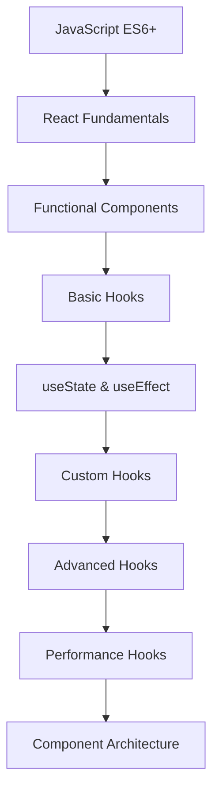

# React Hooks và Component Architecture: Từ Cơ Bản đến Nâng Cao

## 🚀 React Hooks là gì và tại sao quan trọng trong 2025?

**React Hooks** là một tính năng cách mạng được giới thiệu trong React 16.8, cho phép bạn sử dụng state và các tính năng khác của React trong functional components. Trong năm 2025, Hooks đã trở thành standard cho React development.

### 🎯 Tại sao React Hooks quan trọng trong 2025?

- **Modern React Development**: 99% các project React mới sử dụng Hooks
- **Better Code Reusability**: Logic có thể được tái sử dụng dễ dàng hơn
- **Improved Developer Experience**: Code ngắn gọn, dễ đọc và maintain
- **Performance Optimization**: Hooks giúp optimize performance tốt hơn
- **Industry Standard**: Được sử dụng rộng rãi trong các công ty công nghệ hàng đầu

### 📚 Roadmap học React Hooks cho người mới



**Lưu ý**: Bài viết này tập trung vào **Intermediate to Advanced Level** (cấp độ 5-9). Bạn cần có kiến thức cơ bản về JavaScript ES6+ và React fundamentals.

## 🎯 Mục tiêu bài viết

Sau khi đọc xong bài viết này, bạn sẽ hiểu:
- **Basic Hooks**: useState, useEffect, useContext - foundation của React Hooks
- **Custom Hooks**: Tạo reusable logic - essential cho scalable applications
- **Advanced Hooks**: useReducer, useCallback, useMemo - performance optimization
- **Component Architecture**: Patterns và best practices - maintainable codebase
- **Real-world Examples**: Practical applications - ready for production

### 👥 Ai nên đọc bài viết này?

- ✅ **Sinh viên IT**: Có kiến thức JavaScript cơ bản, muốn học React Hooks
- ✅ **Junior Developers**: Đã biết React cơ bản, muốn nâng cao kỹ năng
- ✅ **Career Changers**: Chuyển đổi sang Frontend development
- ✅ **Backend Developers**: Muốn học Frontend với React
- ✅ **Experienced Developers**: Muốn cập nhật kiến thức React hiện đại

## 🎣 Basic Hooks

### useState Hook

**useState** là hook cơ bản nhất để quản lý state trong functional components.

```javascript
import React, { useState } from 'react';

// Basic useState
function Counter() {
  const [count, setCount] = useState(0);
  
  return (
    <div>
      <p>Count: {count}</p>
      <button onClick={() => setCount(count + 1)}>
        Increment
      </button>
      <button onClick={() => setCount(count - 1)}>
        Decrement
      </button>
      <button onClick={() => setCount(0)}>
        Reset
      </button>
    </div>
  );
}

// useState với object
function UserProfile() {
  const [user, setUser] = useState({
    name: '',
    email: '',
    age: 0
  });
  
  const updateUser = (field, value) => {
    setUser(prevUser => ({
      ...prevUser,
      [field]: value
    }));
  };
  
  return (
    <div>
      <input
        value={user.name}
        onChange={(e) => updateUser('name', e.target.value)}
        placeholder="Name"
      />
      <input
        value={user.email}
        onChange={(e) => updateUser('email', e.target.value)}
        placeholder="Email"
      />
      <input
        type="number"
        value={user.age}
        onChange={(e) => updateUser('age', parseInt(e.target.value))}
        placeholder="Age"
      />
    </div>
  );
}

// useState với array
function TodoList() {
  const [todos, setTodos] = useState([]);
  const [inputValue, setInputValue] = useState('');
  
  const addTodo = () => {
    if (inputValue.trim()) {
      setTodos(prevTodos => [
        ...prevTodos,
        {
          id: Date.now(),
          text: inputValue,
          completed: false
        }
      ]);
      setInputValue('');
    }
  };
  
  const toggleTodo = (id) => {
    setTodos(prevTodos =>
      prevTodos.map(todo =>
        todo.id === id ? { ...todo, completed: !todo.completed } : todo
      )
    );
  };
  
  const deleteTodo = (id) => {
    setTodos(prevTodos => prevTodos.filter(todo => todo.id !== id));
  };
  
  return (
    <div>
      <div>
        <input
          value={inputValue}
          onChange={(e) => setInputValue(e.target.value)}
          placeholder="Add todo..."
        />
        <button onClick={addTodo}>Add</button>
      </div>
      <ul>
        {todos.map(todo => (
          <li key={todo.id}>
            <span
              style={{ textDecoration: todo.completed ? 'line-through' : 'none' }}
              onClick={() => toggleTodo(todo.id)}
            >
              {todo.text}
            </span>
            <button onClick={() => deleteTodo(todo.id)}>Delete</button>
          </li>
        ))}
      </ul>
    </div>
  );
}
```

### useEffect Hook

**useEffect** cho phép thực hiện side effects trong functional components.

```javascript
import React, { useState, useEffect } from 'react';

// Basic useEffect
function Timer() {
  const [seconds, setSeconds] = useState(0);
  
  useEffect(() => {
    const interval = setInterval(() => {
      setSeconds(prevSeconds => prevSeconds + 1);
    }, 1000);
    
    // Cleanup function
    return () => clearInterval(interval);
  }, []); // Empty dependency array = run once on mount
  
  return <div>Timer: {seconds} seconds</div>;
}

// useEffect với dependencies
function UserProfile({ userId }) {
  const [user, setUser] = useState(null);
  const [loading, setLoading] = useState(true);
  const [error, setError] = useState(null);
  
  useEffect(() => {
    const fetchUser = async () => {
      try {
        setLoading(true);
        setError(null);
        const response = await fetch(`/api/users/${userId}`);
        const userData = await response.json();
        setUser(userData);
      } catch (err) {
        setError(err.message);
      } finally {
        setLoading(false);
      }
    };
    
    if (userId) {
      fetchUser();
    }
  }, [userId]); // Re-run when userId changes
  
  if (loading) return <div>Loading...</div>;
  if (error) return <div>Error: {error}</div>;
  if (!user) return <div>User not found</div>;
  
  return (
    <div>
      <h2>{user.name}</h2>
      <p>{user.email}</p>
    </div>
  );
}

// useEffect với cleanup
function WindowSize() {
  const [windowSize, setWindowSize] = useState({
    width: window.innerWidth,
    height: window.innerHeight
  });
  
  useEffect(() => {
    const handleResize = () => {
      setWindowSize({
        width: window.innerWidth,
        height: window.innerHeight
      });
    };
    
    window.addEventListener('resize', handleResize);
    
    // Cleanup: remove event listener
    return () => {
      window.removeEventListener('resize', handleResize);
    };
  }, []); // Empty dependency array
  
  return (
    <div>
      Window size: {windowSize.width} x {windowSize.height}
    </div>
  );
}
```

### useContext Hook

**useContext** cho phép truy cập React Context trong functional components.

```javascript
import React, { createContext, useContext, useState } from 'react';

// Create Context
const ThemeContext = createContext();
const UserContext = createContext();

// Theme Provider
function ThemeProvider({ children }) {
  const [theme, setTheme] = useState('light');
  
  const toggleTheme = () => {
    setTheme(prevTheme => prevTheme === 'light' ? 'dark' : 'light');
  };
  
  return (
    <ThemeContext.Provider value={{ theme, toggleTheme }}>
      {children}
    </ThemeContext.Provider>
  );
}

// User Provider
function UserProvider({ children }) {
  const [user, setUser] = useState(null);
  const [loading, setLoading] = useState(false);
  
  const login = async (credentials) => {
    setLoading(true);
    try {
      const response = await fetch('/api/login', {
        method: 'POST',
        headers: { 'Content-Type': 'application/json' },
        body: JSON.stringify(credentials)
      });
      const userData = await response.json();
      setUser(userData);
    } catch (error) {
      console.error('Login failed:', error);
    } finally {
      setLoading(false);
    }
  };
  
  const logout = () => {
    setUser(null);
  };
  
  return (
    <UserContext.Provider value={{ user, login, logout, loading }}>
      {children}
    </UserContext.Provider>
  );
}

// Custom hooks
function useTheme() {
  const context = useContext(ThemeContext);
  if (!context) {
    throw new Error('useTheme must be used within a ThemeProvider');
  }
  return context;
}

function useUser() {
  const context = useContext(UserContext);
  if (!context) {
    throw new Error('useUser must be used within a UserProvider');
  }
  return context;
}

// Components using context
function ThemeToggle() {
  const { theme, toggleTheme } = useTheme();
  
  return (
    <button onClick={toggleTheme}>
      Switch to {theme === 'light' ? 'dark' : 'light'} mode
    </button>
  );
}

function UserProfile() {
  const { user, logout } = useUser();
  
  if (!user) {
    return <div>Please log in</div>;
  }
  
  return (
    <div>
      <h2>Welcome, {user.name}!</h2>
      <p>Email: {user.email}</p>
      <button onClick={logout}>Logout</button>
    </div>
  );
}

function LoginForm() {
  const { login, loading } = useUser();
  const [credentials, setCredentials] = useState({
    email: '',
    password: ''
  });
  
  const handleSubmit = (e) => {
    e.preventDefault();
    login(credentials);
  };
  
  return (
    <form onSubmit={handleSubmit}>
      <input
        type="email"
        value={credentials.email}
        onChange={(e) => setCredentials(prev => ({
          ...prev,
          email: e.target.value
        }))}
        placeholder="Email"
        required
      />
      <input
        type="password"
        value={credentials.password}
        onChange={(e) => setCredentials(prev => ({
          ...prev,
          password: e.target.value
        }))}
        placeholder="Password"
        required
      />
      <button type="submit" disabled={loading}>
        {loading ? 'Logging in...' : 'Login'}
      </button>
    </form>
  );
}

// App component
function App() {
  return (
    <ThemeProvider>
      <UserProvider>
        <div>
          <ThemeToggle />
          <UserProfile />
          <LoginForm />
        </div>
      </UserProvider>
    </ThemeProvider>
  );
}
```

## 🎣 Advanced Hooks

### useReducer Hook

**useReducer** là alternative cho useState khi state logic phức tạp.

```javascript
import React, { useReducer } from 'react';

// Reducer function
function todoReducer(state, action) {
  switch (action.type) {
    case 'ADD_TODO':
      return {
        ...state,
        todos: [...state.todos, {
          id: Date.now(),
          text: action.payload,
          completed: false
        }]
      };
    case 'TOGGLE_TODO':
      return {
        ...state,
        todos: state.todos.map(todo =>
          todo.id === action.payload
            ? { ...todo, completed: !todo.completed }
            : todo
        )
      };
    case 'DELETE_TODO':
      return {
        ...state,
        todos: state.todos.filter(todo => todo.id !== action.payload)
      };
    case 'SET_FILTER':
      return {
        ...state,
        filter: action.payload
      };
    case 'CLEAR_COMPLETED':
      return {
        ...state,
        todos: state.todos.filter(todo => !todo.completed)
      };
    default:
      return state;
  }
}

// Initial state
const initialState = {
  todos: [],
  filter: 'all' // 'all', 'active', 'completed'
};

function TodoApp() {
  const [state, dispatch] = useReducer(todoReducer, initialState);
  const [inputValue, setInputValue] = useState('');
  
  const addTodo = () => {
    if (inputValue.trim()) {
      dispatch({ type: 'ADD_TODO', payload: inputValue });
      setInputValue('');
    }
  };
  
  const toggleTodo = (id) => {
    dispatch({ type: 'TOGGLE_TODO', payload: id });
  };
  
  const deleteTodo = (id) => {
    dispatch({ type: 'DELETE_TODO', payload: id });
  };
  
  const setFilter = (filter) => {
    dispatch({ type: 'SET_FILTER', payload: filter });
  };
  
  const clearCompleted = () => {
    dispatch({ type: 'CLEAR_COMPLETED' });
  };
  
  // Filter todos based on current filter
  const filteredTodos = state.todos.filter(todo => {
    if (state.filter === 'active') return !todo.completed;
    if (state.filter === 'completed') return todo.completed;
    return true;
  });
  
  return (
    <div>
      <div>
        <input
          value={inputValue}
          onChange={(e) => setInputValue(e.target.value)}
          placeholder="Add todo..."
          onKeyPress={(e) => e.key === 'Enter' && addTodo()}
        />
        <button onClick={addTodo}>Add</button>
      </div>
      
      <div>
        <button
          onClick={() => setFilter('all')}
          className={state.filter === 'all' ? 'active' : ''}
        >
          All
        </button>
        <button
          onClick={() => setFilter('active')}
          className={state.filter === 'active' ? 'active' : ''}
        >
          Active
        </button>
        <button
          onClick={() => setFilter('completed')}
          className={state.filter === 'completed' ? 'active' : ''}
        >
          Completed
        </button>
      </div>
      
      <ul>
        {filteredTodos.map(todo => (
          <li key={todo.id}>
            <span
              style={{ textDecoration: todo.completed ? 'line-through' : 'none' }}
              onClick={() => toggleTodo(todo.id)}
            >
              {todo.text}
            </span>
            <button onClick={() => deleteTodo(todo.id)}>Delete</button>
          </li>
        ))}
      </ul>
      
      <button onClick={clearCompleted}>
        Clear Completed
      </button>
    </div>
  );
}
```

### useCallback và useMemo Hooks

**useCallback** và **useMemo** giúp optimize performance bằng cách memoize functions và values.

```javascript
import React, { useState, useCallback, useMemo } from 'react';

// Expensive calculation function
function expensiveCalculation(n) {
  console.log('Calculating...');
  let result = 0;
  for (let i = 0; i < n * 1000000; i++) {
    result += i;
  }
  return result;
}

function OptimizedComponent() {
  const [count, setCount] = useState(0);
  const [name, setName] = useState('');
  const [items, setItems] = useState([]);
  
  // useMemo: Memoize expensive calculation
  const expensiveValue = useMemo(() => {
    return expensiveCalculation(count);
  }, [count]); // Only recalculate when count changes
  
  // useCallback: Memoize function
  const addItem = useCallback(() => {
    setItems(prevItems => [...prevItems, `Item ${prevItems.length + 1}`]);
  }, []); // Empty dependency array = function never changes
  
  // useCallback with dependencies
  const handleNameChange = useCallback((newName) => {
    setName(newName);
  }, []); // No dependencies needed
  
  return (
    <div>
      <div>
        <input
          value={name}
          onChange={(e) => handleNameChange(e.target.value)}
          placeholder="Enter name"
        />
        <p>Name: {name}</p>
      </div>
      
      <div>
        <button onClick={() => setCount(count + 1)}>
          Count: {count}
        </button>
        <p>Expensive calculation result: {expensiveValue}</p>
      </div>
      
      <div>
        <button onClick={addItem}>Add Item</button>
        <ul>
          {items.map((item, index) => (
            <li key={index}>{item}</li>
          ))}
        </ul>
      </div>
    </div>
  );
}

// Child component that receives memoized function
const MemoizedChild = React.memo(({ onAddItem, items }) => {
  console.log('MemoizedChild rendered');
  
  return (
    <div>
      <button onClick={onAddItem}>Add Item from Child</button>
      <ul>
        {items.map((item, index) => (
          <li key={index}>{item}</li>
        ))}
      </ul>
    </div>
  );
});

function ParentComponent() {
  const [items, setItems] = useState([]);
  const [count, setCount] = useState(0);
  
  // Without useCallback, this function would be recreated on every render
  const addItem = useCallback(() => {
    setItems(prevItems => [...prevItems, `Item ${prevItems.length + 1}`]);
  }, []);
  
  return (
    <div>
      <button onClick={() => setCount(count + 1)}>
        Parent Count: {count}
      </button>
      <MemoizedChild onAddItem={addItem} items={items} />
    </div>
  );
}
```

## 🎣 Custom Hooks

### Tạo Custom Hooks

Custom Hooks cho phép tái sử dụng logic giữa các components.

```javascript
import { useState, useEffect, useCallback } from 'react';

// Custom hook for API calls
function useApi(url, options = {}) {
  const [data, setData] = useState(null);
  const [loading, setLoading] = useState(true);
  const [error, setError] = useState(null);
  
  const fetchData = useCallback(async () => {
    try {
      setLoading(true);
      setError(null);
      const response = await fetch(url, options);
      if (!response.ok) {
        throw new Error(`HTTP error! status: ${response.status}`);
      }
      const result = await response.json();
      setData(result);
    } catch (err) {
      setError(err.message);
    } finally {
      setLoading(false);
    }
  }, [url, JSON.stringify(options)]);
  
  useEffect(() => {
    fetchData();
  }, [fetchData]);
  
  const refetch = useCallback(() => {
    fetchData();
  }, [fetchData]);
  
  return { data, loading, error, refetch };
}

// Custom hook for local storage
function useLocalStorage(key, initialValue) {
  const [storedValue, setStoredValue] = useState(() => {
    try {
      const item = window.localStorage.getItem(key);
      return item ? JSON.parse(item) : initialValue;
    } catch (error) {
      console.error(`Error reading localStorage key "${key}":`, error);
      return initialValue;
    }
  });
  
  const setValue = useCallback((value) => {
    try {
      const valueToStore = value instanceof Function ? value(storedValue) : value;
      setStoredValue(valueToStore);
      window.localStorage.setItem(key, JSON.stringify(valueToStore));
    } catch (error) {
      console.error(`Error setting localStorage key "${key}":`, error);
    }
  }, [key, storedValue]);
  
  const removeValue = useCallback(() => {
    try {
      window.localStorage.removeItem(key);
      setStoredValue(initialValue);
    } catch (error) {
      console.error(`Error removing localStorage key "${key}":`, error);
    }
  }, [key, initialValue]);
  
  return [storedValue, setValue, removeValue];
}

// Custom hook for debounced value
function useDebounce(value, delay) {
  const [debouncedValue, setDebouncedValue] = useState(value);
  
  useEffect(() => {
    const handler = setTimeout(() => {
      setDebouncedValue(value);
    }, delay);
    
    return () => {
      clearTimeout(handler);
    };
  }, [value, delay]);
  
  return debouncedValue;
}

// Custom hook for window size
function useWindowSize() {
  const [windowSize, setWindowSize] = useState({
    width: typeof window !== 'undefined' ? window.innerWidth : 0,
    height: typeof window !== 'undefined' ? window.innerHeight : 0
  });
  
  useEffect(() => {
    function handleResize() {
      setWindowSize({
        width: window.innerWidth,
        height: window.innerHeight
      });
    }
    
    window.addEventListener('resize', handleResize);
    return () => window.removeEventListener('resize', handleResize);
  }, []);
  
  return windowSize;
}

// Custom hook for form handling
function useForm(initialValues = {}, validationRules = {}) {
  const [values, setValues] = useState(initialValues);
  const [errors, setErrors] = useState({});
  const [touched, setTouched] = useState({});
  
  const handleChange = useCallback((e) => {
    const { name, value } = e.target;
    setValues(prev => ({ ...prev, [name]: value }));
    
    // Clear error when user starts typing
    if (errors[name]) {
      setErrors(prev => ({ ...prev, [name]: '' }));
    }
  }, [errors]);
  
  const handleBlur = useCallback((e) => {
    const { name } = e.target;
    setTouched(prev => ({ ...prev, [name]: true }));
    
    // Validate field
    if (validationRules[name]) {
      const error = validationRules[name](values[name]);
      setErrors(prev => ({ ...prev, [name]: error }));
    }
  }, [validationRules, values]);
  
  const handleSubmit = useCallback((onSubmit) => {
    return (e) => {
      e.preventDefault();
      
      // Validate all fields
      const newErrors = {};
      Object.keys(validationRules).forEach(key => {
        const error = validationRules[key](values[key]);
        if (error) {
          newErrors[key] = error;
        }
      });
      
      setErrors(newErrors);
      setTouched(Object.keys(values).reduce((acc, key) => ({ ...acc, [key]: true }), {}));
      
      // If no errors, call onSubmit
      if (Object.keys(newErrors).length === 0) {
        onSubmit(values);
      }
    };
  }, [validationRules, values]);
  
  const reset = useCallback(() => {
    setValues(initialValues);
    setErrors({});
    setTouched({});
  }, [initialValues]);
  
  const isValid = Object.keys(errors).every(key => !errors[key]);
  
  return {
    values,
    errors,
    touched,
    handleChange,
    handleBlur,
    handleSubmit,
    reset,
    isValid
  };
}

// Usage examples
function UserProfile({ userId }) {
  const { data: user, loading, error } = useApi(`/api/users/${userId}`);
  
  if (loading) return <div>Loading...</div>;
  if (error) return <div>Error: {error}</div>;
  
  return (
    <div>
      <h2>{user.name}</h2>
      <p>{user.email}</p>
    </div>
  );
}

function SearchComponent() {
  const [searchTerm, setSearchTerm] = useState('');
  const debouncedSearchTerm = useDebounce(searchTerm, 500);
  const { data: results, loading } = useApi(
    debouncedSearchTerm ? `/api/search?q=${debouncedSearchTerm}` : null
  );
  
  return (
    <div>
      <input
        value={searchTerm}
        onChange={(e) => setSearchTerm(e.target.value)}
        placeholder="Search..."
      />
      {loading && <div>Searching...</div>}
      {results && (
        <ul>
          {results.map((item, index) => (
            <li key={index}>{item.name}</li>
          ))}
        </ul>
      )}
    </div>
  );
}

function ResponsiveComponent() {
  const { width, height } = useWindowSize();
  
  return (
    <div>
      <p>Window size: {width} x {height}</p>
      {width < 768 ? (
        <div>Mobile view</div>
      ) : (
        <div>Desktop view</div>
      )}
    </div>
  );
}

function LoginForm() {
  const [theme, setTheme] = useLocalStorage('theme', 'light');
  
  const validationRules = {
    email: (value) => {
      if (!value) return 'Email is required';
      if (!/\S+@\S+\.\S+/.test(value)) return 'Email is invalid';
      return '';
    },
    password: (value) => {
      if (!value) return 'Password is required';
      if (value.length < 6) return 'Password must be at least 6 characters';
      return '';
    }
  };
  
  const {
    values,
    errors,
    touched,
    handleChange,
    handleBlur,
    handleSubmit,
    isValid
  } = useForm({ email: '', password: '' }, validationRules);
  
  const onSubmit = (formData) => {
    console.log('Form submitted:', formData);
    // Handle form submission
  };
  
  return (
    <div>
      <button onClick={() => setTheme(theme === 'light' ? 'dark' : 'light')}>
        Current theme: {theme}
      </button>
      
      <form onSubmit={handleSubmit(onSubmit)}>
        <div>
          <input
            name="email"
            type="email"
            value={values.email}
            onChange={handleChange}
            onBlur={handleBlur}
            placeholder="Email"
          />
          {touched.email && errors.email && (
            <span style={{ color: 'red' }}>{errors.email}</span>
          )}
        </div>
        
        <div>
          <input
            name="password"
            type="password"
            value={values.password}
            onChange={handleChange}
            onBlur={handleBlur}
            placeholder="Password"
          />
          {touched.password && errors.password && (
            <span style={{ color: 'red' }}>{errors.password}</span>
          )}
        </div>
        
        <button type="submit" disabled={!isValid}>
          Login
        </button>
      </form>
    </div>
  );
}
```

## 🏗️ Component Architecture Patterns

### Compound Components Pattern

```javascript
import React, { createContext, useContext, useState } from 'react';

// Context for compound component
const TabsContext = createContext();

function Tabs({ children, defaultTab }) {
  const [activeTab, setActiveTab] = useState(defaultTab);
  
  return (
    <TabsContext.Provider value={{ activeTab, setActiveTab }}>
      <div className="tabs">
        {children}
      </div>
    </TabsContext.Provider>
  );
}

function TabList({ children }) {
  return (
    <div className="tab-list">
      {children}
    </div>
  );
}

function Tab({ id, children }) {
  const { activeTab, setActiveTab } = useContext(TabsContext);
  
  return (
    <button
      className={`tab ${activeTab === id ? 'active' : ''}`}
      onClick={() => setActiveTab(id)}
    >
      {children}
    </button>
  );
}

function TabPanels({ children }) {
  return (
    <div className="tab-panels">
      {children}
    </div>
  );
}

function TabPanel({ id, children }) {
  const { activeTab } = useContext(TabsContext);
  
  if (activeTab !== id) return null;
  
  return (
    <div className="tab-panel">
      {children}
    </div>
  );
}

// Usage
function App() {
  return (
    <Tabs defaultTab="tab1">
      <TabList>
        <Tab id="tab1">Tab 1</Tab>
        <Tab id="tab2">Tab 2</Tab>
        <Tab id="tab3">Tab 3</Tab>
      </TabList>
      
      <TabPanels>
        <TabPanel id="tab1">
          <h2>Content for Tab 1</h2>
          <p>This is the content for the first tab.</p>
        </TabPanel>
        <TabPanel id="tab2">
          <h2>Content for Tab 2</h2>
          <p>This is the content for the second tab.</p>
        </TabPanel>
        <TabPanel id="tab3">
          <h2>Content for Tab 3</h2>
          <p>This is the content for the third tab.</p>
        </TabPanel>
      </TabPanels>
    </Tabs>
  );
}
```

### Render Props Pattern

```javascript
import React, { useState, useEffect } from 'react';

// Render Props component for API data
function ApiData({ url, children }) {
  const [data, setData] = useState(null);
  const [loading, setLoading] = useState(true);
  const [error, setError] = useState(null);
  
  useEffect(() => {
    const fetchData = async () => {
      try {
        setLoading(true);
        setError(null);
        const response = await fetch(url);
        const result = await response.json();
        setData(result);
      } catch (err) {
        setError(err.message);
      } finally {
        setLoading(false);
      }
    };
    
    fetchData();
  }, [url]);
  
  return children({ data, loading, error });
}

// Render Props component for mouse position
function MouseTracker({ children }) {
  const [mousePosition, setMousePosition] = useState({ x: 0, y: 0 });
  
  useEffect(() => {
    const handleMouseMove = (e) => {
      setMousePosition({ x: e.clientX, y: e.clientY });
    };
    
    window.addEventListener('mousemove', handleMouseMove);
    return () => window.removeEventListener('mousemove', handleMouseMove);
  }, []);
  
  return children(mousePosition);
}

// Usage
function App() {
  return (
    <div>
      {/* API Data with Render Props */}
      <ApiData url="/api/users">
        {({ data, loading, error }) => {
          if (loading) return <div>Loading users...</div>;
          if (error) return <div>Error: {error}</div>;
          
          return (
            <ul>
              {data.map(user => (
                <li key={user.id}>{user.name}</li>
              ))}
            </ul>
          );
        }}
      </ApiData>
      
      {/* Mouse Tracker with Render Props */}
      <MouseTracker>
        {({ x, y }) => (
          <div>
            Mouse position: {x}, {y}
          </div>
        )}
      </MouseTracker>
    </div>
  );
}
```

### Higher-Order Components (HOC)

```javascript
import React, { useState, useEffect } from 'react';

// HOC for loading state
function withLoading(WrappedComponent) {
  return function WithLoadingComponent(props) {
    const [loading, setLoading] = useState(true);
    
    useEffect(() => {
      const timer = setTimeout(() => {
        setLoading(false);
      }, 2000);
      
      return () => clearTimeout(timer);
    }, []);
    
    if (loading) {
      return <div>Loading...</div>;
    }
    
    return <WrappedComponent {...props} />;
  };
}

// HOC for error boundary
function withErrorBoundary(WrappedComponent) {
  return class WithErrorBoundary extends React.Component {
    constructor(props) {
      super(props);
      this.state = { hasError: false, error: null };
    }
    
    static getDerivedStateFromError(error) {
      return { hasError: true, error };
    }
    
    componentDidCatch(error, errorInfo) {
      console.error('Error caught by boundary:', error, errorInfo);
    }
    
    render() {
      if (this.state.hasError) {
        return (
          <div>
            <h2>Something went wrong.</h2>
            <p>{this.state.error.message}</p>
          </div>
        );
      }
      
      return <WrappedComponent {...this.props} />;
    }
  };
}

// HOC for authentication
function withAuth(WrappedComponent) {
  return function WithAuthComponent(props) {
    const [isAuthenticated, setIsAuthenticated] = useState(false);
    const [user, setUser] = useState(null);
    
    useEffect(() => {
      // Check authentication status
      const token = localStorage.getItem('token');
      if (token) {
        // Verify token and get user data
        fetch('/api/verify', {
          headers: { Authorization: `Bearer ${token}` }
        })
        .then(response => response.json())
        .then(userData => {
          setIsAuthenticated(true);
          setUser(userData);
        })
        .catch(() => {
          localStorage.removeItem('token');
        });
      }
    }, []);
    
    if (!isAuthenticated) {
      return <div>Please log in to access this content.</div>;
    }
    
    return <WrappedComponent {...props} user={user} />;
  };
}

// Components to be enhanced
function UserProfile({ user }) {
  return (
    <div>
      <h2>User Profile</h2>
      <p>Name: {user.name}</p>
      <p>Email: {user.email}</p>
    </div>
  );
}

function Dashboard() {
  return (
    <div>
      <h2>Dashboard</h2>
      <p>Welcome to your dashboard!</p>
    </div>
  );
}

// Enhanced components
const UserProfileWithLoading = withLoading(UserProfile);
const UserProfileWithErrorBoundary = withErrorBoundary(UserProfile);
const AuthenticatedDashboard = withAuth(Dashboard);

// Usage
function App() {
  return (
    <div>
      <UserProfileWithLoading />
      <UserProfileWithErrorBoundary />
      <AuthenticatedDashboard />
    </div>
  );
}
```

## 🧪 Real-world Examples

### E-commerce Product Filter

```javascript
import React, { useState, useMemo, useCallback } from 'react';

// Custom hook for product filtering
function useProductFilter(products) {
  const [filters, setFilters] = useState({
    category: 'all',
    priceRange: [0, 1000],
    rating: 0,
    searchTerm: ''
  });
  
  const filteredProducts = useMemo(() => {
    return products.filter(product => {
      // Category filter
      if (filters.category !== 'all' && product.category !== filters.category) {
        return false;
      }
      
      // Price range filter
      if (product.price < filters.priceRange[0] || product.price > filters.priceRange[1]) {
        return false;
      }
      
      // Rating filter
      if (product.rating < filters.rating) {
        return false;
      }
      
      // Search term filter
      if (filters.searchTerm && !product.name.toLowerCase().includes(filters.searchTerm.toLowerCase())) {
        return false;
      }
      
      return true;
    });
  }, [products, filters]);
  
  const updateFilter = useCallback((key, value) => {
    setFilters(prev => ({ ...prev, [key]: value }));
  }, []);
  
  const clearFilters = useCallback(() => {
    setFilters({
      category: 'all',
      priceRange: [0, 1000],
      rating: 0,
      searchTerm: ''
    });
  }, []);
  
  return {
    filters,
    filteredProducts,
    updateFilter,
    clearFilters
  };
}

function ProductFilter({ products }) {
  const { filters, filteredProducts, updateFilter, clearFilters } = useProductFilter(products);
  
  const categories = useMemo(() => {
    return [...new Set(products.map(product => product.category))];
  }, [products]);
  
  return (
    <div>
      <div className="filters">
        <div>
          <label>Search:</label>
          <input
            type="text"
            value={filters.searchTerm}
            onChange={(e) => updateFilter('searchTerm', e.target.value)}
            placeholder="Search products..."
          />
        </div>
        
        <div>
          <label>Category:</label>
          <select
            value={filters.category}
            onChange={(e) => updateFilter('category', e.target.value)}
          >
            <option value="all">All Categories</option>
            {categories.map(category => (
              <option key={category} value={category}>
                {category}
              </option>
            ))}
          </select>
        </div>
        
        <div>
          <label>Price Range:</label>
          <input
            type="range"
            min="0"
            max="1000"
            value={filters.priceRange[1]}
            onChange={(e) => updateFilter('priceRange', [filters.priceRange[0], parseInt(e.target.value)])}
          />
          <span>${filters.priceRange[0]} - ${filters.priceRange[1]}</span>
        </div>
        
        <div>
          <label>Minimum Rating:</label>
          <select
            value={filters.rating}
            onChange={(e) => updateFilter('rating', parseInt(e.target.value))}
          >
            <option value={0}>Any Rating</option>
            <option value={1}>1+ Stars</option>
            <option value={2}>2+ Stars</option>
            <option value={3}>3+ Stars</option>
            <option value={4}>4+ Stars</option>
            <option value={5}>5 Stars</option>
          </select>
        </div>
        
        <button onClick={clearFilters}>Clear Filters</button>
      </div>
      
      <div className="products">
        <h3>Products ({filteredProducts.length})</h3>
        {filteredProducts.map(product => (
          <div key={product.id} className="product">
            <h4>{product.name}</h4>
            <p>Category: {product.category}</p>
            <p>Price: ${product.price}</p>
            <p>Rating: {'★'.repeat(product.rating)}{'☆'.repeat(5 - product.rating)}</p>
          </div>
        ))}
      </div>
    </div>
  );
}
```

### Real-time Chat Component

```javascript
import React, { useState, useEffect, useRef, useCallback } from 'react';

// Custom hook for WebSocket connection
function useWebSocket(url) {
  const [socket, setSocket] = useState(null);
  const [messages, setMessages] = useState([]);
  const [connectionStatus, setConnectionStatus] = useState('Disconnected');
  
  useEffect(() => {
    const ws = new WebSocket(url);
    
    ws.onopen = () => {
      setConnectionStatus('Connected');
      setSocket(ws);
    };
    
    ws.onmessage = (event) => {
      const message = JSON.parse(event.data);
      setMessages(prev => [...prev, message]);
    };
    
    ws.onclose = () => {
      setConnectionStatus('Disconnected');
      setSocket(null);
    };
    
    ws.onerror = (error) => {
      console.error('WebSocket error:', error);
      setConnectionStatus('Error');
    };
    
    return () => {
      ws.close();
    };
  }, [url]);
  
  const sendMessage = useCallback((message) => {
    if (socket && socket.readyState === WebSocket.OPEN) {
      socket.send(JSON.stringify(message));
    }
  }, [socket]);
  
  return { messages, sendMessage, connectionStatus };
}

function ChatRoom({ roomId, userId }) {
  const { messages, sendMessage, connectionStatus } = useWebSocket(
    `ws://localhost:8080/chat/${roomId}`
  );
  
  const [newMessage, setNewMessage] = useState('');
  const messagesEndRef = useRef(null);
  
  const scrollToBottom = useCallback(() => {
    messagesEndRef.current?.scrollIntoView({ behavior: 'smooth' });
  }, []);
  
  useEffect(() => {
    scrollToBottom();
  }, [messages, scrollToBottom]);
  
  const handleSendMessage = (e) => {
    e.preventDefault();
    if (newMessage.trim()) {
      sendMessage({
        type: 'message',
        content: newMessage,
        userId,
        timestamp: new Date().toISOString()
      });
      setNewMessage('');
    }
  };
  
  return (
    <div className="chat-room">
      <div className="chat-header">
        <h3>Chat Room: {roomId}</h3>
        <span className={`status ${connectionStatus.toLowerCase()}`}>
          {connectionStatus}
        </span>
      </div>
      
      <div className="messages">
        {messages.map((message, index) => (
          <div
            key={index}
            className={`message ${message.userId === userId ? 'own' : 'other'}`}
          >
            <div className="message-header">
              <span className="user">{message.userId}</span>
              <span className="timestamp">
                {new Date(message.timestamp).toLocaleTimeString()}
              </span>
            </div>
            <div className="message-content">{message.content}</div>
          </div>
        ))}
        <div ref={messagesEndRef} />
      </div>
      
      <form onSubmit={handleSendMessage} className="message-form">
        <input
          type="text"
          value={newMessage}
          onChange={(e) => setNewMessage(e.target.value)}
          placeholder="Type a message..."
          disabled={connectionStatus !== 'Connected'}
        />
        <button type="submit" disabled={connectionStatus !== 'Connected'}>
          Send
        </button>
      </form>
    </div>
  );
}
```

## 🏋️ Bài tập thực hành

### Bài tập 1: Tạo Custom Hook useCounter
Tạo một custom hook `useCounter` với các tính năng increment, decrement, reset và set value.

```javascript
// TODO: Implement useCounter hook
function useCounter(initialValue = 0) {
  // Your code here
  // Should return: { count, increment, decrement, reset, setValue }
}

// Test component
function Counter() {
  const { count, increment, decrement, reset, setValue } = useCounter(0);
  
  return (
    <div>
      <p>Count: {count}</p>
      <button onClick={increment}>+</button>
      <button onClick={decrement}>-</button>
      <button onClick={reset}>Reset</button>
      <button onClick={() => setValue(10)}>Set to 10</button>
    </div>
  );
}
```

### Bài tập 2: Tạo Custom Hook useToggle
Tạo một custom hook `useToggle` để quản lý boolean state.

```javascript
// TODO: Implement useToggle hook
function useToggle(initialValue = false) {
  // Your code here
  // Should return: [value, toggle, setValue]
}

// Test component
function ToggleExample() {
  const [isOn, toggle, setIsOn] = useToggle(false);
  
  return (
    <div>
      <p>Status: {isOn ? 'ON' : 'OFF'}</p>
      <button onClick={toggle}>Toggle</button>
      <button onClick={() => setIsOn(true)}>Turn ON</button>
      <button onClick={() => setIsOn(false)}>Turn OFF</button>
    </div>
  );
}
```

### Bài tập 3: Tạo Custom Hook usePrevious
Tạo một custom hook `usePrevious` để lưu trữ giá trị trước đó của một value.

```javascript
// TODO: Implement usePrevious hook
function usePrevious(value) {
  // Your code here
  // Should return the previous value
}

// Test component
function PreviousExample() {
  const [count, setCount] = useState(0);
  const previousCount = usePrevious(count);
  
  return (
    <div>
      <p>Current: {count}</p>
      <p>Previous: {previousCount}</p>
      <button onClick={() => setCount(count + 1)}>Increment</button>
    </div>
  );
}
```

### Bài tập 4: Tạo Custom Hook useFetch
Tạo một custom hook `useFetch` để thực hiện API calls với loading và error states.

```javascript
// TODO: Implement useFetch hook
function useFetch(url, options = {}) {
  // Your code here
  // Should return: { data, loading, error, refetch }
}

// Test component
function FetchExample() {
  const { data, loading, error, refetch } = useFetch('/api/users');
  
  if (loading) return <div>Loading...</div>;
  if (error) return <div>Error: {error}</div>;
  
  return (
    <div>
      <button onClick={refetch}>Refetch</button>
      <ul>
        {data?.map(user => (
          <li key={user.id}>{user.name}</li>
        ))}
      </ul>
    </div>
  );
}
```

### 🎯 Gợi ý giải bài tập

<details>
<summary>Click để xem gợi ý</summary>

**Bài tập 1 - useCounter:**
```javascript
function useCounter(initialValue = 0) {
  const [count, setCount] = useState(initialValue);
  
  const increment = useCallback(() => setCount(c => c + 1), []);
  const decrement = useCallback(() => setCount(c => c - 1), []);
  const reset = useCallback(() => setCount(initialValue), [initialValue]);
  const setValue = useCallback((value) => setCount(value), []);
  
  return { count, increment, decrement, reset, setValue };
}
```

**Bài tập 2 - useToggle:**
```javascript
function useToggle(initialValue = false) {
  const [value, setValue] = useState(initialValue);
  
  const toggle = useCallback(() => setValue(v => !v), []);
  
  return [value, toggle, setValue];
}
```

**Bài tập 3 - usePrevious:**
```javascript
function usePrevious(value) {
  const ref = useRef();
  
  useEffect(() => {
    ref.current = value;
  });
  
  return ref.current;
}
```

**Bài tập 4 - useFetch:**
```javascript
function useFetch(url, options = {}) {
  const [data, setData] = useState(null);
  const [loading, setLoading] = useState(true);
  const [error, setError] = useState(null);
  
  const fetchData = useCallback(async () => {
    try {
      setLoading(true);
      setError(null);
      const response = await fetch(url, options);
      const result = await response.json();
      setData(result);
    } catch (err) {
      setError(err.message);
    } finally {
      setLoading(false);
    }
  }, [url, JSON.stringify(options)]);
  
  useEffect(() => {
    fetchData();
  }, [fetchData]);
  
  return { data, loading, error, refetch: fetchData };
}
```

</details>

## 🚨 Common Mistakes và Best Practices

### Common Mistakes

1. **Missing Dependencies in useEffect**
```javascript
// ❌ Wrong - missing dependency
useEffect(() => {
  fetchData(userId);
}, []); // Missing userId dependency

// ✅ Correct
useEffect(() => {
  fetchData(userId);
}, [userId]);
```

2. **Stale Closures**
```javascript
// ❌ Wrong - stale closure
const [count, setCount] = useState(0);
useEffect(() => {
  const timer = setInterval(() => {
    setCount(count + 1); // Always uses initial count
  }, 1000);
  return () => clearInterval(timer);
}, []);

// ✅ Correct - functional update
useEffect(() => {
  const timer = setInterval(() => {
    setCount(prev => prev + 1);
  }, 1000);
  return () => clearInterval(timer);
}, []);
```

3. **Infinite Re-renders**
```javascript
// ❌ Wrong - object recreated on every render
const [user, setUser] = useState({ name: '', email: '' });
useEffect(() => {
  // This will cause infinite re-renders
}, [user]);

// ✅ Correct - use useCallback or useMemo
const [user, setUser] = useState({ name: '', email: '' });
const memoizedUser = useMemo(() => user, [user.name, user.email]);
useEffect(() => {
  // This will only run when user.name or user.email changes
}, [memoizedUser]);
```

### Best Practices

1. **Custom Hooks Naming**
```javascript
// ✅ Good - starts with 'use'
function useApi(url) { }
function useLocalStorage(key) { }
function useDebounce(value, delay) { }

// ❌ Bad - doesn't start with 'use'
function api(url) { }
function localStorage(key) { }
```

2. **Hook Dependencies**
```javascript
// ✅ Good - include all dependencies
useEffect(() => {
  const fetchData = async () => {
    const result = await api.get(url, { params: { userId } });
    setData(result);
  };
  fetchData();
}, [url, userId]); // Include all dependencies

// ✅ Good - use useCallback for functions
const fetchData = useCallback(async () => {
  const result = await api.get(url, { params: { userId } });
  setData(result);
}, [url, userId]);

useEffect(() => {
  fetchData();
}, [fetchData]);
```

3. **Performance Optimization**
```javascript
// ✅ Good - use React.memo for expensive components
const ExpensiveComponent = React.memo(({ data, onUpdate }) => {
  return <div>{/* Expensive rendering */}</div>;
});

// ✅ Good - use useMemo for expensive calculations
const expensiveValue = useMemo(() => {
  return expensiveCalculation(data);
}, [data]);

// ✅ Good - use useCallback for event handlers
const handleClick = useCallback(() => {
  onUpdate(id);
}, [onUpdate, id]);
```

## 📚 Tài liệu tham khảo

- [React Hooks Documentation](https://react.dev/reference/react)
- [React Hooks FAQ](https://react.dev/learn/reusing-logic-with-custom-hooks)
- [useHooks.ts](https://usehooks-ts.com/) - Collection of React Hooks
- [React Patterns](https://reactpatterns.com/)

## 🎉 Kết luận

Chúng ta đã tìm hiểu về React Hooks và Component Architecture:

- ✅ **Basic Hooks**: useState, useEffect, useContext - foundation của React Hooks
- ✅ **Advanced Hooks**: useReducer, useCallback, useMemo - performance optimization
- ✅ **Custom Hooks**: Reusable logic patterns - essential cho scalable applications
- ✅ **Component Architecture**: Compound components, render props, HOCs - maintainable codebase
- ✅ **Real-world Examples**: Practical applications - ready for production
- ✅ **Best Practices**: Common mistakes và optimization techniques

### 🚀 Ứng dụng thực tế trong 2025

Những kỹ năng này là **essential skills** cho:

- **React Developers**: Core skills cho modern React development
- **Frontend Developers**: Component architecture và state management
- **Full-stack Developers**: React skills cho full-stack applications
- **Career Changers**: Foundation cho Frontend development career

### 📈 Next Steps

1. **Thực hành**: Làm các bài tập ở trên
2. **Mở rộng**: Học React Router, Redux, Zustand
3. **Testing**: Học React Testing Library, Jest
4. **Performance**: Học React.memo, useMemo, useCallback
5. **Advanced**: Học React 18 features, Server Components, Suspense

### 🎯 Key Takeaways

- **React Hooks** thay thế class components - modern React development
- **Custom Hooks** cho reusable logic - better code organization
- **Component Architecture** cho scalability - maintainable codebase
- **Performance Optimization** với useMemo, useCallback - better user experience

Trong bài viết tiếp theo, chúng ta sẽ tìm hiểu về **React Router và Navigation** trong Single Page Applications. Hãy theo dõi để không bỏ lỡ!

---

*Bạn có câu hỏi nào về React Hooks và Component Architecture không? Hãy để lại comment hoặc liên hệ với mình!* 🚀

**Tags**: #react #hooks #components #javascript #frontend #2025 #modern-react
