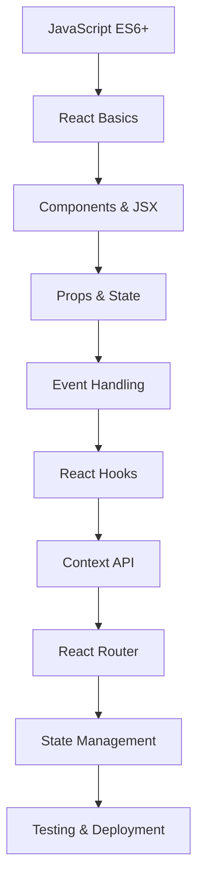

# React SPA với Hooks và Routing

## 🚀 React là gì và tại sao quan trọng trong 2025?

**React** là một JavaScript library mạnh mẽ được Facebook phát triển để xây dựng user interfaces, đặc biệt là Single Page Applications (SPA). Trong năm 2025, React vẫn là framework frontend phổ biến nhất với hơn 40% thị phần.

### 🎯 Tại sao React quan trọng trong 2025?

- **Industry Standard**: Được sử dụng bởi Netflix, Airbnb, Facebook, Instagram
- **Job Market**: Hơn 60% job postings frontend yêu cầu React
- **Ecosystem**: Huge ecosystem với thousands of libraries
- **Performance**: Virtual DOM và optimization techniques
- **Developer Experience**: Excellent tooling và community support
- **Future-proof**: Active development và long-term support

### 📚 Roadmap học React cho người mới



**Lưu ý**: Bài viết này tập trung vào **Intermediate Level** (cấp độ 6-10). Bạn cần có kiến thức cơ bản về JavaScript ES6+ và React fundamentals.

## 🎯 Mục tiêu bài viết

Sau khi đọc xong bài viết này, bạn sẽ biết cách:
- **Setup React project** với Vite - modern build tool
- **Sử dụng React Hooks** (useState, useEffect, useContext) - modern state management
- **Implement React Router** cho navigation - client-side routing
- **Tạo custom hooks** - reusable logic
- **Xây dựng component architecture** - scalable structure
- **Implement authentication** với JWT - secure user sessions
- **Deploy ứng dụng** - production-ready

### 👥 Ai nên đọc bài viết này?

- ✅ **Sinh viên IT**: Có kiến thức JavaScript cơ bản, muốn học React
- ✅ **Junior Developers**: Đã biết React cơ bản, muốn nâng cao kỹ năng
- ✅ **Career Changers**: Chuyển đổi sang Frontend development
- ✅ **Backend Developers**: Muốn học Frontend với React
- ✅ **Experienced Developers**: Muốn cập nhật kiến thức React hiện đại

### 🎯 Khi nào sử dụng React?

**React** rất phù hợp khi bạn cần:
- **Single Page Applications (SPA)**: Gmail, Facebook, Twitter
- **Interactive UIs**: Real-time updates, complex user interactions
- **Component-based Architecture**: Reusable, maintainable code
- **Large-scale Applications**: Scalable và performant
- **Cross-platform**: Web, mobile (React Native), desktop (Electron)

**Ví dụ thực tế**: E-commerce sites, dashboards, social media apps, admin panels

## 🏗️ Project Setup

### Tạo React Project với Vite

```bash
# Tạo project mới
npm create vite@latest react-spa-app -- --template react

# Di chuyển vào thư mục
cd react-spa-app

# Cài đặt dependencies
npm install

# Cài đặt thêm dependencies cần thiết
npm install react-router-dom axios
npm install -D @types/react-router-dom
```

### Cấu trúc thư mục

```
src/
├── components/
│   ├── common/
│   │   ├── Header.jsx
│   │   ├── Footer.jsx
│   │   ├── Loading.jsx
│   │   └── ErrorBoundary.jsx
│   ├── auth/
│   │   ├── Login.jsx
│   │   ├── Register.jsx
│   │   └── ProtectedRoute.jsx
│   └── user/
│       ├── UserList.jsx
│       ├── UserProfile.jsx
│       └── UserForm.jsx
├── hooks/
│   ├── useAuth.js
│   ├── useApi.js
│   └── useLocalStorage.js
├── context/
│   └── AuthContext.jsx
├── services/
│   └── api.js
├── utils/
│   └── constants.js
├── pages/
│   ├── Home.jsx
│   ├── Dashboard.jsx
│   ├── Login.jsx
│   ├── Register.jsx
│   └── NotFound.jsx
├── App.jsx
└── main.jsx
```

## 🔐 Authentication Context

### 🎯 Context API là gì?

**Context API** là một tính năng của React cho phép chia sẻ state giữa các components mà không cần truyền props qua nhiều cấp (prop drilling). Nó rất hữu ích cho:

- **Global State**: User authentication, theme, language settings
- **Avoiding Prop Drilling**: Khi cần truyền data qua nhiều component levels
- **Shared Logic**: Common functionality across components

**Khi nào sử dụng Context API?**
- ✅ Authentication state
- ✅ Theme preferences
- ✅ User preferences
- ✅ Global notifications
- ❌ Local component state (dùng useState)
- ❌ Complex state logic (dùng Redux/Zustand)

### AuthContext

```javascript
// src/context/AuthContext.jsx
import React, { createContext, useContext, useReducer, useEffect } from 'react';
import { api } from '../services/api';

const AuthContext = createContext();

// Auth reducer
const authReducer = (state, action) => {
  switch (action.type) {
    case 'LOGIN_START':
      return {
        ...state,
        loading: true,
        error: null
      };
    case 'LOGIN_SUCCESS':
      return {
        ...state,
        loading: false,
        isAuthenticated: true,
        user: action.payload.user,
        token: action.payload.token,
        error: null
      };
    case 'LOGIN_FAILURE':
      return {
        ...state,
        loading: false,
        isAuthenticated: false,
        user: null,
        token: null,
        error: action.payload
      };
    case 'LOGOUT':
      return {
        ...state,
        isAuthenticated: false,
        user: null,
        token: null,
        error: null
      };
    case 'CLEAR_ERROR':
      return {
        ...state,
        error: null
      };
    default:
      return state;
  }
};

// Initial state
const initialState = {
  isAuthenticated: false,
  user: null,
  token: localStorage.getItem('token'),
  loading: false,
  error: null
};

// AuthProvider component
export const AuthProvider = ({ children }) => {
  const [state, dispatch] = useReducer(authReducer, initialState);

  // Set up axios interceptor
  useEffect(() => {
    if (state.token) {
      api.defaults.headers.common['Authorization'] = `Bearer ${state.token}`;
    } else {
      delete api.defaults.headers.common['Authorization'];
    }
  }, [state.token]);

  // Login function
  const login = async (credentials) => {
    dispatch({ type: 'LOGIN_START' });
    try {
      const response = await api.post('/auth/login', credentials);
      const { accessToken, tokenType } = response.data;
      
      localStorage.setItem('token', accessToken);
      
      dispatch({
        type: 'LOGIN_SUCCESS',
        payload: {
          user: { username: credentials.username },
          token: accessToken
        }
      });
      
      return { success: true };
    } catch (error) {
      const errorMessage = error.response?.data?.message || 'Login failed';
      dispatch({
        type: 'LOGIN_FAILURE',
        payload: errorMessage
      });
      return { success: false, error: errorMessage };
    }
  };

  // Register function
  const register = async (userData) => {
    dispatch({ type: 'LOGIN_START' });
    try {
      await api.post('/auth/register', userData);
      return { success: true };
    } catch (error) {
      const errorMessage = error.response?.data?.message || 'Registration failed';
      dispatch({
        type: 'LOGIN_FAILURE',
        payload: errorMessage
      });
      return { success: false, error: errorMessage };
    }
  };

  // Logout function
  const logout = () => {
    localStorage.removeItem('token');
    dispatch({ type: 'LOGOUT' });
  };

  // Clear error function
  const clearError = () => {
    dispatch({ type: 'CLEAR_ERROR' });
  };

  const value = {
    ...state,
    login,
    register,
    logout,
    clearError
  };

  return (
    <AuthContext.Provider value={value}>
      {children}
    </AuthContext.Provider>
  );
};

// Custom hook to use auth context
export const useAuth = () => {
  const context = useContext(AuthContext);
  if (!context) {
    throw new Error('useAuth must be used within an AuthProvider');
  }
  return context;
};
```

## 🎣 Custom Hooks

### 🎯 React Hooks là gì?

**React Hooks** là các functions cho phép bạn "hook into" React features như state và lifecycle methods từ functional components. Chúng được giới thiệu trong React 16.8.

**Tại sao Hooks quan trọng?**
- **Functional Components**: Có thể sử dụng state và lifecycle trong functional components
- **Reusable Logic**: Tạo custom hooks để tái sử dụng logic
- **Better Code Organization**: Logic liên quan được nhóm lại với nhau
- **Easier Testing**: Functional components dễ test hơn class components

**Common Hooks:**
- `useState`: Quản lý local state
- `useEffect`: Side effects và lifecycle
- `useContext`: Truy cập React Context
- `useReducer`: Complex state logic
- `useCallback`: Memoize functions
- `useMemo`: Memoize values

### useApi Hook

```javascript
// src/hooks/useApi.js
import { useState, useEffect } from 'react';
import { api } from '../services/api';

export const useApi = (url, options = {}) => {
  const [data, setData] = useState(null);
  const [loading, setLoading] = useState(false);
  const [error, setError] = useState(null);

  const fetchData = async () => {
    setLoading(true);
    setError(null);
    
    try {
      const response = await api.get(url, options);
      setData(response.data);
    } catch (err) {
      setError(err.response?.data?.message || 'An error occurred');
    } finally {
      setLoading(false);
    }
  };

  useEffect(() => {
    if (url) {
      fetchData();
    }
  }, [url]);

  const refetch = () => {
    fetchData();
  };

  return { data, loading, error, refetch };
};
```

### useLocalStorage Hook

```javascript
// src/hooks/useLocalStorage.js
import { useState, useEffect } from 'react';

export const useLocalStorage = (key, initialValue) => {
  const [storedValue, setStoredValue] = useState(() => {
    try {
      const item = window.localStorage.getItem(key);
      return item ? JSON.parse(item) : initialValue;
    } catch (error) {
      console.error(`Error reading localStorage key "${key}":`, error);
      return initialValue;
    }
  });

  const setValue = (value) => {
    try {
      const valueToStore = value instanceof Function ? value(storedValue) : value;
      setStoredValue(valueToStore);
      window.localStorage.setItem(key, JSON.stringify(valueToStore));
    } catch (error) {
      console.error(`Error setting localStorage key "${key}":`, error);
    }
  };

  const removeValue = () => {
    try {
      window.localStorage.removeItem(key);
      setStoredValue(initialValue);
    } catch (error) {
      console.error(`Error removing localStorage key "${key}":`, error);
    }
  };

  return [storedValue, setValue, removeValue];
};
```

## 🔧 API Service

```javascript
// src/services/api.js
import axios from 'axios';

const API_BASE_URL = 'http://localhost:8080/api';

export const api = axios.create({
  baseURL: API_BASE_URL,
  headers: {
    'Content-Type': 'application/json',
  },
});

// Request interceptor
api.interceptors.request.use(
  (config) => {
    const token = localStorage.getItem('token');
    if (token) {
      config.headers.Authorization = `Bearer ${token}`;
    }
    return config;
  },
  (error) => {
    return Promise.reject(error);
  }
);

// Response interceptor
api.interceptors.response.use(
  (response) => {
    return response;
  },
  (error) => {
    if (error.response?.status === 401) {
      localStorage.removeItem('token');
      window.location.href = '/login';
    }
    return Promise.reject(error);
  }
);

export default api;
```

## 🧩 Components

### Header Component

```javascript
// src/components/common/Header.jsx
import React from 'react';
import { Link, useNavigate } from 'react-router-dom';
import { useAuth } from '../../context/AuthContext';

const Header = () => {
  const { isAuthenticated, user, logout } = useAuth();
  const navigate = useNavigate();

  const handleLogout = () => {
    logout();
    navigate('/');
  };

  return (
    <header className="bg-blue-600 text-white shadow-lg">
      <div className="container mx-auto px-4 py-3">
        <div className="flex items-center justify-between">
          <Link to="/" className="text-2xl font-bold">
            DevNet Insights
          </Link>
          
          <nav className="flex items-center space-x-4">
            <Link to="/" className="hover:text-blue-200 transition-colors">
              Home
            </Link>
            
            {isAuthenticated ? (
              <>
                <Link to="/dashboard" className="hover:text-blue-200 transition-colors">
                  Dashboard
                </Link>
                <span className="text-sm">
                  Welcome, {user?.username}
                </span>
                <button
                  onClick={handleLogout}
                  className="bg-red-500 hover:bg-red-600 px-3 py-1 rounded transition-colors"
                >
                  Logout
                </button>
              </>
            ) : (
              <>
                <Link to="/login" className="hover:text-blue-200 transition-colors">
                  Login
                </Link>
                <Link to="/register" className="hover:text-blue-200 transition-colors">
                  Register
                </Link>
              </>
            )}
          </nav>
        </div>
      </div>
    </header>
  );
};

export default Header;
```

### ProtectedRoute Component

```javascript
// src/components/auth/ProtectedRoute.jsx
import React from 'react';
import { Navigate, useLocation } from 'react-router-dom';
import { useAuth } from '../../context/AuthContext';

const ProtectedRoute = ({ children }) => {
  const { isAuthenticated, loading } = useAuth();
  const location = useLocation();

  if (loading) {
    return (
      <div className="flex items-center justify-center min-h-screen">
        <div className="animate-spin rounded-full h-32 w-32 border-b-2 border-blue-600"></div>
      </div>
    );
  }

  if (!isAuthenticated) {
    return <Navigate to="/login" state={{ from: location }} replace />;
  }

  return children;
};

export default ProtectedRoute;
```

### Login Component

```javascript
// src/components/auth/Login.jsx
import React, { useState, useEffect } from 'react';
import { Link, useNavigate, useLocation } from 'react-router-dom';
import { useAuth } from '../../context/AuthContext';

const Login = () => {
  const [formData, setFormData] = useState({
    username: '',
    password: ''
  });
  
  const { login, isAuthenticated, error, clearError } = useAuth();
  const navigate = useNavigate();
  const location = useLocation();

  const from = location.state?.from?.pathname || '/dashboard';

  useEffect(() => {
    if (isAuthenticated) {
      navigate(from, { replace: true });
    }
  }, [isAuthenticated, navigate, from]);

  useEffect(() => {
    clearError();
  }, [clearError]);

  const handleChange = (e) => {
    setFormData({
      ...formData,
      [e.target.name]: e.target.value
    });
  };

  const handleSubmit = async (e) => {
    e.preventDefault();
    const result = await login(formData);
    
    if (result.success) {
      navigate(from, { replace: true });
    }
  };

  return (
    <div className="min-h-screen flex items-center justify-center bg-gray-50 py-12 px-4 sm:px-6 lg:px-8">
      <div className="max-w-md w-full space-y-8">
        <div>
          <h2 className="mt-6 text-center text-3xl font-extrabold text-gray-900">
            Sign in to your account
          </h2>
          <p className="mt-2 text-center text-sm text-gray-600">
            Or{' '}
            <Link to="/register" className="font-medium text-blue-600 hover:text-blue-500">
              create a new account
            </Link>
          </p>
        </div>
        
        <form className="mt-8 space-y-6" onSubmit={handleSubmit}>
          {error && (
            <div className="bg-red-100 border border-red-400 text-red-700 px-4 py-3 rounded">
              {error}
            </div>
          )}
          
          <div className="space-y-4">
            <div>
              <label htmlFor="username" className="block text-sm font-medium text-gray-700">
                Username
              </label>
              <input
                id="username"
                name="username"
                type="text"
                required
                value={formData.username}
                onChange={handleChange}
                className="mt-1 block w-full px-3 py-2 border border-gray-300 rounded-md shadow-sm focus:outline-none focus:ring-blue-500 focus:border-blue-500"
              />
            </div>
            
            <div>
              <label htmlFor="password" className="block text-sm font-medium text-gray-700">
                Password
              </label>
              <input
                id="password"
                name="password"
                type="password"
                required
                value={formData.password}
                onChange={handleChange}
                className="mt-1 block w-full px-3 py-2 border border-gray-300 rounded-md shadow-sm focus:outline-none focus:ring-blue-500 focus:border-blue-500"
              />
            </div>
          </div>

          <div>
            <button
              type="submit"
              className="group relative w-full flex justify-center py-2 px-4 border border-transparent text-sm font-medium rounded-md text-white bg-blue-600 hover:bg-blue-700 focus:outline-none focus:ring-2 focus:ring-offset-2 focus:ring-blue-500"
            >
              Sign in
            </button>
          </div>
        </form>
      </div>
    </div>
  );
};

export default Login;
```

### UserList Component

```javascript
// src/components/user/UserList.jsx
import React from 'react';
import { useApi } from '../../hooks/useApi';

const UserList = () => {
  const { data: users, loading, error, refetch } = useApi('/users');

  if (loading) {
    return (
      <div className="flex items-center justify-center py-8">
        <div className="animate-spin rounded-full h-8 w-8 border-b-2 border-blue-600"></div>
      </div>
    );
  }

  if (error) {
    return (
      <div className="bg-red-100 border border-red-400 text-red-700 px-4 py-3 rounded">
        Error: {error}
        <button
          onClick={refetch}
          className="ml-2 bg-red-500 text-white px-2 py-1 rounded text-sm"
        >
          Retry
        </button>
      </div>
    );
  }

  return (
    <div className="bg-white shadow overflow-hidden sm:rounded-md">
      <div className="px-4 py-5 sm:px-6">
        <h3 className="text-lg leading-6 font-medium text-gray-900">
          Users
        </h3>
        <p className="mt-1 max-w-2xl text-sm text-gray-500">
          List of all registered users
        </p>
      </div>
      
      <ul className="divide-y divide-gray-200">
        {users?.map((user) => (
          <li key={user.id}>
            <div className="px-4 py-4 sm:px-6">
              <div className="flex items-center justify-between">
                <div className="flex items-center">
                  <div className="flex-shrink-0">
                    <div className="h-10 w-10 rounded-full bg-blue-500 flex items-center justify-center">
                      <span className="text-white font-medium">
                        {user.username.charAt(0).toUpperCase()}
                      </span>
                    </div>
                  </div>
                  <div className="ml-4">
                    <div className="text-sm font-medium text-gray-900">
                      {user.username}
                    </div>
                    <div className="text-sm text-gray-500">
                      {user.email}
                    </div>
                  </div>
                </div>
                <div className="text-sm text-gray-500">
                  Joined {new Date(user.createdAt).toLocaleDateString()}
                </div>
              </div>
            </div>
          </li>
        ))}
      </ul>
    </div>
  );
};

export default UserList;
```

## 📄 Pages

### Home Page

```javascript
// src/pages/Home.jsx
import React from 'react';
import { Link } from 'react-router-dom';
import { useAuth } from '../context/AuthContext';

const Home = () => {
  const { isAuthenticated } = useAuth();

  return (
    <div className="min-h-screen bg-gray-50">
      <div className="max-w-7xl mx-auto px-4 sm:px-6 lg:px-8 py-12">
        <div className="text-center">
          <h1 className="text-4xl font-bold text-gray-900 sm:text-5xl md:text-6xl">
            Welcome to{' '}
            <span className="text-blue-600">DevNet Insights</span>
          </h1>
          <p className="mt-3 max-w-md mx-auto text-base text-gray-500 sm:text-lg md:mt-5 md:text-xl md:max-w-3xl">
            A modern React SPA with authentication, routing, and state management.
            Built with React Hooks and React Router.
          </p>
          
          <div className="mt-5 max-w-md mx-auto sm:flex sm:justify-center md:mt-8">
            {isAuthenticated ? (
              <Link
                to="/dashboard"
                className="w-full flex items-center justify-center px-8 py-3 border border-transparent text-base font-medium rounded-md text-white bg-blue-600 hover:bg-blue-700 md:py-4 md:text-lg md:px-10"
              >
                Go to Dashboard
              </Link>
            ) : (
              <>
                <Link
                  to="/login"
                  className="w-full flex items-center justify-center px-8 py-3 border border-transparent text-base font-medium rounded-md text-white bg-blue-600 hover:bg-blue-700 md:py-4 md:text-lg md:px-10"
                >
                  Sign In
                </Link>
                <Link
                  to="/register"
                  className="mt-3 w-full flex items-center justify-center px-8 py-3 border border-transparent text-base font-medium rounded-md text-blue-700 bg-blue-100 hover:bg-blue-200 md:py-4 md:text-lg md:px-10 sm:mt-0 sm:ml-3"
                >
                  Sign Up
                </Link>
              </>
            )}
          </div>
        </div>
        
        <div className="mt-16">
          <div className="grid grid-cols-1 gap-8 sm:grid-cols-2 lg:grid-cols-3">
            <div className="bg-white overflow-hidden shadow rounded-lg">
              <div className="p-5">
                <div className="flex items-center">
                  <div className="flex-shrink-0">
                    <div className="w-8 h-8 bg-blue-500 rounded-md flex items-center justify-center">
                      <span className="text-white text-sm font-bold">⚛️</span>
                    </div>
                  </div>
                  <div className="ml-5 w-0 flex-1">
                    <dl>
                      <dt className="text-sm font-medium text-gray-500 truncate">
                        React Hooks
                      </dt>
                      <dd className="text-lg font-medium text-gray-900">
                        Modern state management
                      </dd>
                    </dl>
                  </div>
                </div>
              </div>
            </div>
            
            <div className="bg-white overflow-hidden shadow rounded-lg">
              <div className="p-5">
                <div className="flex items-center">
                  <div className="flex-shrink-0">
                    <div className="w-8 h-8 bg-green-500 rounded-md flex items-center justify-center">
                      <span className="text-white text-sm font-bold">🔐</span>
                    </div>
                  </div>
                  <div className="ml-5 w-0 flex-1">
                    <dl>
                      <dt className="text-sm font-medium text-gray-500 truncate">
                        JWT Authentication
                      </dt>
                      <dd className="text-lg font-medium text-gray-900">
                        Secure user sessions
                      </dd>
                    </dl>
                  </div>
                </div>
              </div>
            </div>
            
            <div className="bg-white overflow-hidden shadow rounded-lg">
              <div className="p-5">
                <div className="flex items-center">
                  <div className="flex-shrink-0">
                    <div className="w-8 h-8 bg-purple-500 rounded-md flex items-center justify-center">
                      <span className="text-white text-sm font-bold">🚀</span>
                    </div>
                  </div>
                  <div className="ml-5 w-0 flex-1">
                    <dl>
                      <dt className="text-sm font-medium text-gray-500 truncate">
                        React Router
                      </dt>
                      <dd className="text-lg font-medium text-gray-900">
                        Client-side routing
                      </dd>
                    </dl>
                  </div>
                </div>
              </div>
            </div>
          </div>
        </div>
      </div>
    </div>
  );
};

export default Home;
```

### Dashboard Page

```javascript
// src/pages/Dashboard.jsx
import React from 'react';
import { useAuth } from '../context/AuthContext';
import UserList from '../components/user/UserList';

const Dashboard = () => {
  const { user } = useAuth();

  return (
    <div className="min-h-screen bg-gray-50">
      <div className="max-w-7xl mx-auto px-4 sm:px-6 lg:px-8 py-8">
        <div className="mb-8">
          <h1 className="text-3xl font-bold text-gray-900">
            Dashboard
          </h1>
          <p className="mt-2 text-gray-600">
            Welcome back, {user?.username}!
          </p>
        </div>
        
        <div className="grid grid-cols-1 lg:grid-cols-3 gap-8">
          <div className="lg:col-span-2">
            <UserList />
          </div>
          
          <div className="space-y-6">
            <div className="bg-white shadow rounded-lg p-6">
              <h3 className="text-lg font-medium text-gray-900 mb-4">
                Quick Stats
              </h3>
              <div className="space-y-3">
                <div className="flex justify-between">
                  <span className="text-gray-600">Total Users</span>
                  <span className="font-medium">42</span>
                </div>
                <div className="flex justify-between">
                  <span className="text-gray-600">Active Sessions</span>
                  <span className="font-medium">12</span>
                </div>
                <div className="flex justify-between">
                  <span className="text-gray-600">API Calls</span>
                  <span className="font-medium">1,234</span>
                </div>
              </div>
            </div>
            
            <div className="bg-white shadow rounded-lg p-6">
              <h3 className="text-lg font-medium text-gray-900 mb-4">
                Recent Activity
              </h3>
              <div className="space-y-3">
                <div className="text-sm text-gray-600">
                  User john_doe logged in
                </div>
                <div className="text-sm text-gray-600">
                  New user registered
                </div>
                <div className="text-sm text-gray-600">
                  API endpoint updated
                </div>
              </div>
            </div>
          </div>
        </div>
      </div>
    </div>
  );
};

export default Dashboard;
```

## 🚀 App Component và Routing

### 🎯 React Router là gì?

**React Router** là thư viện routing phổ biến nhất cho React applications. Nó cho phép tạo Single Page Applications (SPA) với client-side routing.

**Tại sao cần React Router?**
- **SPA Navigation**: Chuyển trang mà không reload browser
- **URL Management**: URLs có ý nghĩa và có thể bookmark
- **Browser History**: Back/forward buttons hoạt động đúng
- **Protected Routes**: Kiểm soát quyền truy cập các trang
- **Nested Routes**: Tổ chức routes theo hierarchy

**Key Concepts:**
- `BrowserRouter`: Router component sử dụng HTML5 history API
- `Routes`: Container cho tất cả routes
- `Route`: Định nghĩa một route cụ thể
- `Link`: Navigation component
- `Navigate`: Programmatic navigation
- `useNavigate`: Hook để navigate programmatically
- `useParams`: Lấy route parameters
- `useLocation`: Lấy thông tin về current location

```javascript
// src/App.jsx
import React from 'react';
import { BrowserRouter as Router, Routes, Route } from 'react-router-dom';
import { AuthProvider } from './context/AuthContext';
import Header from './components/common/Header';
import Footer from './components/common/Footer';
import ProtectedRoute from './components/auth/ProtectedRoute';
import Home from './pages/Home';
import Dashboard from './pages/Dashboard';
import Login from './pages/Login';
import Register from './pages/Register';
import NotFound from './pages/NotFound';

function App() {
  return (
    <AuthProvider>
      <Router>
        <div className="min-h-screen flex flex-col">
          <Header />
          <main className="flex-grow">
            <Routes>
              <Route path="/" element={<Home />} />
              <Route path="/login" element={<Login />} />
              <Route path="/register" element={<Register />} />
              <Route
                path="/dashboard"
                element={
                  <ProtectedRoute>
                    <Dashboard />
                  </ProtectedRoute>
                }
              />
              <Route path="*" element={<NotFound />} />
            </Routes>
          </main>
          <Footer />
        </div>
      </Router>
    </AuthProvider>
  );
}

export default App;
```

## 🏋️ Bài tập thực hành

### Bài tập 1: Tạo Custom Hook
Tạo một custom hook `useCounter` để quản lý counter state.

```javascript
// TODO: Implement useCounter hook
import { useState, useCallback } from 'react';

export const useCounter = (initialValue = 0) => {
  // Your code here
  // Should return: { count, increment, decrement, reset }
};

// Test component
function Counter() {
  const { count, increment, decrement, reset } = useCounter(0);
  
  return (
    <div>
      <p>Count: {count}</p>
      <button onClick={increment}>+</button>
      <button onClick={decrement}>-</button>
      <button onClick={reset}>Reset</button>
    </div>
  );
}
```

### Bài tập 2: Tạo Protected Route Component
Tạo một component `AdminRoute` chỉ cho phép admin users truy cập.

```javascript
// TODO: Implement AdminRoute component
import React from 'react';
import { Navigate } from 'react-router-dom';
import { useAuth } from '../context/AuthContext';

const AdminRoute = ({ children }) => {
  // Your code here
  // Check if user is authenticated AND is admin
};

export default AdminRoute;
```

### Bài tập 3: Tạo Form Hook
Tạo custom hook `useForm` để quản lý form state và validation.

```javascript
// TODO: Implement useForm hook
import { useState, useCallback } from 'react';

export const useForm = (initialValues = {}, validationRules = {}) => {
  // Your code here
  // Should return: { values, errors, handleChange, handleSubmit, isValid }
};

// Test component
function LoginForm() {
  const { values, errors, handleChange, handleSubmit, isValid } = useForm(
    { email: '', password: '' },
    {
      email: (value) => value.includes('@') ? null : 'Invalid email',
      password: (value) => value.length >= 6 ? null : 'Password too short'
    }
  );
  
  return (
    <form onSubmit={handleSubmit}>
      <input
        name="email"
        value={values.email}
        onChange={handleChange}
        placeholder="Email"
      />
      {errors.email && <span>{errors.email}</span>}
      
      <input
        name="password"
        type="password"
        value={values.password}
        onChange={handleChange}
        placeholder="Password"
      />
      {errors.password && <span>{errors.password}</span>}
      
      <button type="submit" disabled={!isValid}>
        Login
      </button>
    </form>
  );
}
```

### Bài tập 4: Tạo API Hook với Caching
Tạo custom hook `useApiWithCache` có khả năng cache data.

```javascript
// TODO: Implement useApiWithCache hook
import { useState, useEffect, useRef } from 'react';
import { api } from '../services/api';

export const useApiWithCache = (url, options = {}) => {
  // Your code here
  // Should implement caching mechanism
  // Return: { data, loading, error, refetch, clearCache }
};
```

### 🎯 Gợi ý giải bài tập

<details>
<summary>Click để xem gợi ý</summary>

**Bài tập 1 - useCounter:**
```javascript
export const useCounter = (initialValue = 0) => {
  const [count, setCount] = useState(initialValue);
  
  const increment = useCallback(() => setCount(c => c + 1), []);
  const decrement = useCallback(() => setCount(c => c - 1), []);
  const reset = useCallback(() => setCount(initialValue), [initialValue]);
  
  return { count, increment, decrement, reset };
};
```

**Bài tập 2 - AdminRoute:**
```javascript
const AdminRoute = ({ children }) => {
  const { isAuthenticated, user } = useAuth();
  
  if (!isAuthenticated) {
    return <Navigate to="/login" replace />;
  }
  
  if (user?.role !== 'admin') {
    return <Navigate to="/dashboard" replace />;
  }
  
  return children;
};
```

**Bài tập 3 - useForm:**
```javascript
export const useForm = (initialValues = {}, validationRules = {}) => {
  const [values, setValues] = useState(initialValues);
  const [errors, setErrors] = useState({});
  
  const handleChange = useCallback((e) => {
    const { name, value } = e.target;
    setValues(prev => ({ ...prev, [name]: value }));
    
    // Validate
    if (validationRules[name]) {
      const error = validationRules[name](value);
      setErrors(prev => ({ ...prev, [name]: error }));
    }
  }, [validationRules]);
  
  const handleSubmit = useCallback((e) => {
    e.preventDefault();
    // Submit logic here
  }, []);
  
  const isValid = Object.values(errors).every(error => error === null);
  
  return { values, errors, handleChange, handleSubmit, isValid };
};
```

**Bài tập 4 - useApiWithCache:**
```javascript
export const useApiWithCache = (url, options = {}) => {
  const [data, setData] = useState(null);
  const [loading, setLoading] = useState(false);
  const [error, setError] = useState(null);
  const cacheRef = useRef(new Map());
  
  const fetchData = useCallback(async () => {
    const cacheKey = `${url}-${JSON.stringify(options)}`;
    
    // Check cache first
    if (cacheRef.current.has(cacheKey)) {
      setData(cacheRef.current.get(cacheKey));
      return;
    }
    
    setLoading(true);
    setError(null);
    
    try {
      const response = await api.get(url, options);
      setData(response.data);
      cacheRef.current.set(cacheKey, response.data);
    } catch (err) {
      setError(err.response?.data?.message || 'An error occurred');
    } finally {
      setLoading(false);
    }
  }, [url, options]);
  
  const clearCache = useCallback(() => {
    cacheRef.current.clear();
  }, []);
  
  useEffect(() => {
    if (url) {
      fetchData();
    }
  }, [fetchData]);
  
  return { data, loading, error, refetch: fetchData, clearCache };
};
```

</details>

## 🚨 Troubleshooting và Common Mistakes

### Common React Hooks Mistakes

1. **Infinite Re-renders với useEffect**
```javascript
// ❌ Wrong - missing dependency
useEffect(() => {
  fetchData(userId);
}, []); // Missing userId dependency

// ✅ Correct
useEffect(() => {
  fetchData(userId);
}, [userId]);
```

2. **Stale Closures**
```javascript
// ❌ Wrong - stale closure
const [count, setCount] = useState(0);
useEffect(() => {
  const timer = setInterval(() => {
    setCount(count + 1); // Always uses initial count
  }, 1000);
  return () => clearInterval(timer);
}, []);

// ✅ Correct - functional update
useEffect(() => {
  const timer = setInterval(() => {
    setCount(prev => prev + 1);
  }, 1000);
  return () => clearInterval(timer);
}, []);
```

3. **Missing Cleanup**
```javascript
// ❌ Wrong - memory leak
useEffect(() => {
  const subscription = subscribe();
  // No cleanup
}, []);

// ✅ Correct - with cleanup
useEffect(() => {
  const subscription = subscribe();
  return () => subscription.unsubscribe();
}, []);
```

### Common React Router Mistakes

1. **Wrong Router Placement**
```javascript
// ❌ Wrong - Router inside component
function App() {
  return (
    <Router>
      <Routes>
        <Route path="/" element={<Home />} />
      </Routes>
    </Router>
  );
}

// ✅ Correct - Router at top level
function App() {
  return (
    <Routes>
      <Route path="/" element={<Home />} />
    </Routes>
  );
}

// In main.jsx
<Router>
  <App />
</Router>
```

2. **Forgetting to Handle 404**
```javascript
// ❌ Wrong - no 404 handling
<Routes>
  <Route path="/" element={<Home />} />
  <Route path="/about" element={<About />} />
</Routes>

// ✅ Correct - with 404 handling
<Routes>
  <Route path="/" element={<Home />} />
  <Route path="/about" element={<About />} />
  <Route path="*" element={<NotFound />} />
</Routes>
```

### Common Context API Mistakes

1. **Creating Context in Component**
```javascript
// ❌ Wrong - context created in component
function App() {
  const MyContext = createContext();
  return (
    <MyContext.Provider value={value}>
      <Child />
    </MyContext.Provider>
  );
}

// ✅ Correct - context created outside
const MyContext = createContext();

function App() {
  return (
    <MyContext.Provider value={value}>
      <Child />
    </MyContext.Provider>
  );
}
```

2. **Not Providing Default Value**
```javascript
// ❌ Wrong - no default value
const MyContext = createContext();

// ✅ Correct - with default value
const MyContext = createContext({
  value: null,
  setValue: () => {}
});
```

## 🧪 Testing

### Component Testing với React Testing Library

```javascript
// src/components/__tests__/Header.test.jsx
import React from 'react';
import { render, screen, fireEvent } from '@testing-library/react';
import { BrowserRouter } from 'react-router-dom';
import { AuthProvider } from '../../context/AuthContext';
import Header from '../common/Header';

const MockedHeader = () => (
  <BrowserRouter>
    <AuthProvider>
      <Header />
    </AuthProvider>
  </BrowserRouter>
);

describe('Header Component', () => {
  test('renders header with title', () => {
    render(<MockedHeader />);
    expect(screen.getByText('DevNet Insights')).toBeInTheDocument();
  });

  test('shows login and register links when not authenticated', () => {
    render(<MockedHeader />);
    expect(screen.getByText('Login')).toBeInTheDocument();
    expect(screen.getByText('Register')).toBeInTheDocument();
  });

  test('shows dashboard link when authenticated', () => {
    // Mock authenticated state
    render(<MockedHeader />);
    // Test authenticated state
  });
});
```

## 🚀 Deployment

### Vite Configuration

```javascript
// vite.config.js
import { defineConfig } from 'vite';
import react from '@vitejs/plugin-react';

export default defineConfig({
  plugins: [react()],
  server: {
    port: 3000,
    proxy: {
      '/api': {
        target: 'http://localhost:8080',
        changeOrigin: true,
        secure: false,
      },
    },
  },
  build: {
    outDir: 'dist',
    sourcemap: true,
  },
});
```

### Docker Configuration

```dockerfile
# Dockerfile
FROM node:18-alpine as build

WORKDIR /app

COPY package*.json ./
RUN npm ci --only=production

COPY . .
RUN npm run build

FROM nginx:alpine
COPY --from=build /app/dist /usr/share/nginx/html
COPY nginx.conf /etc/nginx/nginx.conf

EXPOSE 80

CMD ["nginx", "-g", "daemon off;"]
```

### Nginx Configuration

```nginx
# nginx.conf
events {
    worker_connections 1024;
}

http {
    include /etc/nginx/mime.types;
    default_type application/octet-stream;

    server {
        listen 80;
        server_name localhost;
        root /usr/share/nginx/html;
        index index.html;

        location / {
            try_files $uri $uri/ /index.html;
        }

        location /api {
            proxy_pass http://backend:8080;
            proxy_set_header Host $host;
            proxy_set_header X-Real-IP $remote_addr;
        }
    }
}
```

## 📚 Tài liệu tham khảo

- [React Documentation](https://react.dev/)
- [React Router Documentation](https://reactrouter.com/)
- [Vite Documentation](https://vitejs.dev/)
- [React Testing Library](https://testing-library.com/docs/react-testing-library/intro/)

## 🎉 Kết luận

Chúng ta đã xây dựng thành công một React SPA hoàn chỉnh với:

- ✅ **Project Setup**: Vite configuration và modern tooling
- ✅ **Authentication**: JWT-based auth với Context API - essential cho production apps
- ✅ **Custom Hooks**: useApi, useLocalStorage - reusable logic patterns
- ✅ **Components**: Reusable và maintainable architecture
- ✅ **Routing**: React Router với protected routes - SPA navigation
- ✅ **State Management**: Context API và custom hooks - modern state patterns
- ✅ **Testing**: Component testing với React Testing Library
- ✅ **Deployment**: Docker và Nginx configuration - production-ready

### 🚀 Ứng dụng thực tế trong 2025

Những kỹ năng này là **essential skills** cho:

- **Sinh viên IT**: Nền tảng vững chắc để học modern frontend development
- **Junior Developers**: Core skills cho React development jobs
- **Career Changers**: Chuyển đổi sang Frontend với React ecosystem
- **Backend Developers**: Học Frontend với React - full-stack capabilities
- **Experienced Developers**: Cập nhật kiến thức React hiện đại

### 📈 Next Steps

1. **Thực hành**: Làm các bài tập ở trên
2. **Mở rộng**: Học Redux, Zustand cho complex state management
3. **Testing**: Học Jest, React Testing Library, Cypress
4. **Performance**: Học React.memo, useMemo, useCallback
5. **Advanced**: Học React 18 features, Server Components, Suspense

### 🎯 Key Takeaways

- **React Hooks** thay thế class components - modern React development
- **Context API** cho global state - tránh prop drilling
- **React Router** cho SPA navigation - essential cho modern web apps
- **Custom Hooks** cho reusable logic - better code organization
- **Component Architecture** cho scalability - maintainable codebase

Trong bài viết tiếp theo, chúng ta sẽ tìm hiểu về **Java vs JavaScript Performance** và so sánh hiệu suất giữa hai ngôn ngữ. Hãy theo dõi để không bỏ lỡ!

---

*Bạn có câu hỏi nào về React SPA với Hooks và Routing không? Hãy để lại comment hoặc liên hệ với mình!* 🚀

**Tags**: #react #spa #hooks #routing #javascript #frontend #2025 #modern-react
