# React 18 TypeScript Guide: Từ Cơ Bản đến Nâng Cao 2025

## 🚀 React 18 + TypeScript: Tại sao là sự kết hợp hoàn hảo?

**React 18** và **TypeScript** là bộ đôi không thể thiếu trong modern frontend development năm 2025. React 18 mang đến những tính năng mạnh mẽ như Concurrent Features, Automatic Batching, và Suspense improvements, trong khi TypeScript cung cấp type safety và developer experience tuyệt vời.

### 🎯 Tại sao React 18 + TypeScript quan trọng trong 2025?

- **Type Safety**: Giảm 90% runtime errors với static type checking
- **Better Developer Experience**: IntelliSense, auto-completion, refactoring tools
- **React 18 Features**: Concurrent rendering, Suspense, Server Components
- **Industry Standard**: 85% các React projects mới sử dụng TypeScript
- **Performance**: React 18's concurrent features + TypeScript's optimization
- **Maintainability**: Code dễ đọc, maintain và scale hơn

### 📚 Roadmap học React 18 + TypeScript

```mermaid
graph TD
    A[JavaScript ES6+] --> B[TypeScript Basics]
    B --> C[React Fundamentals]
    C --> D[React 18 Features]
    D --> E[TypeScript + React]
    E --> F[Advanced Patterns]
    F --> G[Performance Optimization]
    G --> H[Testing với TypeScript]
    H --> I[Production Deployment]
```



**Lưu ý**: Bài viết này tập trung vào **Intermediate to Advanced Level** (cấp độ 5-9). Bạn cần có kiến thức cơ bản về JavaScript ES6+ và React fundamentals.

## 🎯 Mục tiêu bài viết

Sau khi đọc xong bài viết này, bạn sẽ hiểu:
- **TypeScript Setup**: Cấu hình TypeScript cho React 18 projects
- **React 18 Features**: Concurrent rendering, Suspense, Server Components
- **TypeScript Patterns**: Props typing, hooks typing, advanced patterns
- **Performance**: React 18 optimizations với TypeScript
- **Testing**: Testing React components với TypeScript
- **Best Practices**: Code organization và maintainability

### 👥 Ai nên đọc bài viết này?

- ✅ **React Developers**: Muốn nâng cấp lên React 18 với TypeScript
- ✅ **TypeScript Developers**: Muốn học React 18 features
- ✅ **Full-stack Developers**: Cần frontend skills với type safety
- ✅ **Career Changers**: Chuyển đổi sang modern React development
- ✅ **Experienced Developers**: Muốn cập nhật kiến thức mới nhất

## 🛠️ Setup React 18 + TypeScript

### Tạo project mới với Vite

```bash
# Tạo React 18 + TypeScript project với Vite
npm create vite@latest my-react18-app -- --template react-ts
cd my-react18-app
npm install
npm run dev
```

### Cấu hình TypeScript (tsconfig.json)

```json
{
  "compilerOptions": {
    "target": "ES2020",
    "useDefineForClassFields": true,
    "lib": ["ES2020", "DOM", "DOM.Iterable"],
    "module": "ESNext",
    "skipLibCheck": true,
    "moduleResolution": "bundler",
    "allowImportingTsExtensions": true,
    "resolveJsonModule": true,
    "isolatedModules": true,
    "noEmit": true,
    "jsx": "react-jsx",
    "strict": true,
    "noUnusedLocals": true,
    "noUnusedParameters": true,
    "noFallthroughCasesInSwitch": true,
    "baseUrl": ".",
    "paths": {
      "@/*": ["./src/*"],
      "@/components/*": ["./src/components/*"],
      "@/hooks/*": ["./src/hooks/*"],
      "@/utils/*": ["./src/utils/*"],
      "@/types/*": ["./src/types/*"]
    }
  },
  "include": ["src"],
  "references": [{ "path": "./tsconfig.node.json" }]
}
```

### Cấu hình Vite (vite.config.ts)

```typescript
import { defineConfig } from 'vite'
import react from '@vitejs/plugin-react'
import path from 'path'

export default defineConfig({
  plugins: [react()],
  resolve: {
    alias: {
      '@': path.resolve(__dirname, './src'),
      '@/components': path.resolve(__dirname, './src/components'),
      '@/hooks': path.resolve(__dirname, './src/hooks'),
      '@/utils': path.resolve(__dirname, './src/utils'),
      '@/types': path.resolve(__dirname, './src/types'),
    },
  },
  server: {
    port: 3000,
    open: true,
  },
  build: {
    outDir: 'dist',
    sourcemap: true,
  },
})
```

## 🎨 TypeScript với React Components

### Basic Component Typing

```typescript
import React from 'react';

// Props interface
interface ButtonProps {
  children: React.ReactNode;
  onClick?: () => void;
  variant?: 'primary' | 'secondary' | 'danger';
  size?: 'small' | 'medium' | 'large';
  disabled?: boolean;
  type?: 'button' | 'submit' | 'reset';
}

// Functional component với TypeScript
const Button: React.FC<ButtonProps> = ({
  children,
  onClick,
  variant = 'primary',
  size = 'medium',
  disabled = false,
  type = 'button',
}) => {
  const baseClasses = 'px-4 py-2 rounded font-medium transition-colors';
  const variantClasses = {
    primary: 'bg-blue-500 text-white hover:bg-blue-600',
    secondary: 'bg-gray-200 text-gray-800 hover:bg-gray-300',
    danger: 'bg-red-500 text-white hover:bg-red-600',
  };
  const sizeClasses = {
    small: 'px-2 py-1 text-sm',
    medium: 'px-4 py-2',
    large: 'px-6 py-3 text-lg',
  };

  return (
    <button
      type={type}
      onClick={onClick}
      disabled={disabled}
      className={`${baseClasses} ${variantClasses[variant]} ${sizeClasses[size]} ${
        disabled ? 'opacity-50 cursor-not-allowed' : ''
      }`}
    >
      {children}
    </button>
  );
};

export default Button;
```

### Advanced Component Patterns

```typescript
import React, { forwardRef, useImperativeHandle } from 'react';

// Props với generic types
interface ListProps<T> {
  items: T[];
  renderItem: (item: T, index: number) => React.ReactNode;
  keyExtractor: (item: T, index: number) => string | number;
  emptyMessage?: string;
  loading?: boolean;
  error?: string | null;
}

// Generic component
function List<T>({
  items,
  renderItem,
  keyExtractor,
  emptyMessage = 'No items found',
  loading = false,
  error = null,
}: ListProps<T>) {
  if (loading) {
    return <div className="text-center py-4">Loading...</div>;
  }

  if (error) {
    return <div className="text-center py-4 text-red-500">Error: {error}</div>;
  }

  if (items.length === 0) {
    return <div className="text-center py-4 text-gray-500">{emptyMessage}</div>;
  }

  return (
    <ul className="space-y-2">
      {items.map((item, index) => (
        <li key={keyExtractor(item, index)}>
          {renderItem(item, index)}
        </li>
      ))}
    </ul>
  );
}

// Forward ref component
interface InputProps {
  label?: string;
  error?: string;
  placeholder?: string;
  type?: 'text' | 'email' | 'password' | 'number';
  required?: boolean;
}

const Input = forwardRef<HTMLInputElement, InputProps>(
  ({ label, error, placeholder, type = 'text', required = false, ...props }, ref) => {
    return (
      <div className="space-y-1">
        {label && (
          <label className="block text-sm font-medium text-gray-700">
            {label}
            {required && <span className="text-red-500 ml-1">*</span>}
          </label>
        )}
        <input
          ref={ref}
          type={type}
          placeholder={placeholder}
          className={`w-full px-3 py-2 border rounded-md focus:outline-none focus:ring-2 focus:ring-blue-500 ${
            error ? 'border-red-500' : 'border-gray-300'
          }`}
          {...props}
        />
        {error && <p className="text-sm text-red-500">{error}</p>}
      </div>
    );
  }
);

Input.displayName = 'Input';

// Usage examples
interface User {
  id: number;
  name: string;
  email: string;
}

function UserList() {
  const users: User[] = [
    { id: 1, name: 'John Doe', email: 'john@example.com' },
    { id: 2, name: 'Jane Smith', email: 'jane@example.com' },
  ];

  return (
    <List
      items={users}
      keyExtractor={(user) => user.id}
      renderItem={(user) => (
        <div className="p-4 border rounded">
          <h3 className="font-semibold">{user.name}</h3>
          <p className="text-gray-600">{user.email}</p>
        </div>
      )}
    />
  );
}

export { List, Input, UserList };
```

## 🎣 React Hooks với TypeScript

### useState với TypeScript

```typescript
import React, { useState } from 'react';

// Basic useState typing
function Counter() {
  const [count, setCount] = useState<number>(0);
  const [name, setName] = useState<string>('');
  const [isLoading, setIsLoading] = useState<boolean>(false);

  return (
    <div>
      <p>Count: {count}</p>
      <button onClick={() => setCount(count + 1)}>Increment</button>
      <input
        value={name}
        onChange={(e) => setName(e.target.value)}
        placeholder="Enter name"
      />
    </div>
  );
}

// Complex state với interface
interface User {
  id: number;
  name: string;
  email: string;
  avatar?: string;
}

interface AppState {
  user: User | null;
  loading: boolean;
  error: string | null;
}

function UserProfile() {
  const [state, setState] = useState<AppState>({
    user: null,
    loading: false,
    error: null,
  });

  const updateUser = (userData: Partial<User>) => {
    setState(prev => ({
      ...prev,
      user: prev.user ? { ...prev.user, ...userData } : null,
    }));
  };

  return (
    <div>
      {state.user && (
        <div>
          <h2>{state.user.name}</h2>
          <p>{state.user.email}</p>
        </div>
      )}
    </div>
  );
}
```

### useEffect với TypeScript

```typescript
import React, { useState, useEffect } from 'react';

// API response types
interface Post {
  id: number;
  title: string;
  body: string;
  userId: number;
}

interface ApiResponse<T> {
  data: T;
  status: number;
  message: string;
}

// Custom hook với TypeScript
function useApi<T>(url: string) {
  const [data, setData] = useState<T | null>(null);
  const [loading, setLoading] = useState<boolean>(true);
  const [error, setError] = useState<string | null>(null);

  useEffect(() => {
    const fetchData = async () => {
      try {
        setLoading(true);
        setError(null);
        const response = await fetch(url);
        
        if (!response.ok) {
          throw new Error(`HTTP error! status: ${response.status}`);
        }
        
        const result: T = await response.json();
        setData(result);
      } catch (err) {
        setError(err instanceof Error ? err.message : 'An error occurred');
      } finally {
        setLoading(false);
      }
    };

    fetchData();
  }, [url]);

  return { data, loading, error };
}

// Component sử dụng custom hook
function PostsList() {
  const { data: posts, loading, error } = useApi<Post[]>('https://jsonplaceholder.typicode.com/posts');

  if (loading) return <div>Loading posts...</div>;
  if (error) return <div>Error: {error}</div>;
  if (!posts) return <div>No posts found</div>;

  return (
    <div>
      <h2>Posts</h2>
      <ul>
        {posts.map((post) => (
          <li key={post.id}>
            <h3>{post.title}</h3>
            <p>{post.body}</p>
          </li>
        ))}
      </ul>
    </div>
  );
}
```

### useReducer với TypeScript

```typescript
import React, { useReducer } from 'react';

// State và Action types
interface Todo {
  id: number;
  text: string;
  completed: boolean;
}

interface TodoState {
  todos: Todo[];
  filter: 'all' | 'active' | 'completed';
}

type TodoAction =
  | { type: 'ADD_TODO'; payload: string }
  | { type: 'TOGGLE_TODO'; payload: number }
  | { type: 'DELETE_TODO'; payload: number }
  | { type: 'SET_FILTER'; payload: 'all' | 'active' | 'completed' }
  | { type: 'CLEAR_COMPLETED' };

// Reducer function
function todoReducer(state: TodoState, action: TodoAction): TodoState {
  switch (action.type) {
    case 'ADD_TODO':
      return {
        ...state,
        todos: [
          ...state.todos,
          {
            id: Date.now(),
            text: action.payload,
            completed: false,
          },
        ],
      };
    case 'TOGGLE_TODO':
      return {
        ...state,
        todos: state.todos.map((todo) =>
          todo.id === action.payload
            ? { ...todo, completed: !todo.completed }
            : todo
        ),
      };
    case 'DELETE_TODO':
      return {
        ...state,
        todos: state.todos.filter((todo) => todo.id !== action.payload),
      };
    case 'SET_FILTER':
      return {
        ...state,
        filter: action.payload,
      };
    case 'CLEAR_COMPLETED':
      return {
        ...state,
        todos: state.todos.filter((todo) => !todo.completed),
      };
    default:
      return state;
  }
}

// Component sử dụng useReducer
function TodoApp() {
  const [state, dispatch] = useReducer(todoReducer, {
    todos: [],
    filter: 'all',
  });

  const filteredTodos = state.todos.filter((todo) => {
    if (state.filter === 'active') return !todo.completed;
    if (state.filter === 'completed') return todo.completed;
    return true;
  });

  return (
    <div>
      <h1>Todo App</h1>
      {/* Todo input and list components */}
    </div>
  );
}
```

## 🚀 React 18 Features với TypeScript

### Concurrent Features

```typescript
import React, { useState, useTransition, useDeferredValue } from 'react';

// useTransition hook
function SearchResults() {
  const [query, setQuery] = useState<string>('');
  const [isPending, startTransition] = useTransition();
  const deferredQuery = useDeferredValue(query);

  const handleSearch = (newQuery: string) => {
    setQuery(newQuery);
    startTransition(() => {
      // Expensive search operation
      performSearch(newQuery);
    });
  };

  return (
    <div>
      <input
        value={query}
        onChange={(e) => handleSearch(e.target.value)}
        placeholder="Search..."
      />
      {isPending && <div>Searching...</div>}
      <SearchResultsList query={deferredQuery} />
    </div>
  );
}

// useDeferredValue hook
interface SearchResultsListProps {
  query: string;
}

function SearchResultsList({ query }: SearchResultsListProps) {
  const [results, setResults] = useState<string[]>([]);

  React.useEffect(() => {
    if (query) {
      // Simulate expensive search
      const timeoutId = setTimeout(() => {
        setResults([`Result 1 for ${query}`, `Result 2 for ${query}`]);
      }, 1000);
      return () => clearTimeout(timeoutId);
    } else {
      setResults([]);
    }
  }, [query]);

  return (
    <ul>
      {results.map((result, index) => (
        <li key={index}>{result}</li>
      ))}
    </ul>
  );
}

function performSearch(query: string) {
  // Expensive search logic
  console.log('Searching for:', query);
}
```

### Suspense với TypeScript

```typescript
import React, { Suspense, lazy } from 'react';

// Lazy loading components
const LazyComponent = lazy(() => import('./LazyComponent'));
const AnotherLazyComponent = lazy(() => import('./AnotherLazyComponent'));

// Loading component
function LoadingSpinner() {
  return (
    <div className="flex items-center justify-center p-4">
      <div className="animate-spin rounded-full h-8 w-8 border-b-2 border-blue-500"></div>
      <span className="ml-2">Loading...</span>
    </div>
  );
}

// Error boundary với TypeScript
interface ErrorBoundaryState {
  hasError: boolean;
  error?: Error;
}

class ErrorBoundary extends React.Component<
  React.PropsWithChildren<{}>,
  ErrorBoundaryState
> {
  constructor(props: React.PropsWithChildren<{}>) {
    super(props);
    this.state = { hasError: false };
  }

  static getDerivedStateFromError(error: Error): ErrorBoundaryState {
    return { hasError: true, error };
  }

  componentDidCatch(error: Error, errorInfo: React.ErrorInfo) {
    console.error('Error caught by boundary:', error, errorInfo);
  }

  render() {
    if (this.state.hasError) {
      return (
        <div className="p-4 bg-red-100 border border-red-400 text-red-700 rounded">
          <h2>Something went wrong.</h2>
          <p>{this.state.error?.message}</p>
          <button
            onClick={() => this.setState({ hasError: false })}
            className="mt-2 px-4 py-2 bg-red-500 text-white rounded"
          >
            Try again
          </button>
        </div>
      );
    }

    return this.props.children;
  }
}

// App component với Suspense
function App() {
  return (
    <ErrorBoundary>
      <div className="App">
        <Suspense fallback={<LoadingSpinner />}>
          <LazyComponent />
        </Suspense>
        <Suspense fallback={<LoadingSpinner />}>
          <AnotherLazyComponent />
        </Suspense>
      </div>
    </ErrorBoundary>
  );
}
```

### Automatic Batching

```typescript
import React, { useState, useEffect } from 'react';

function BatchingExample() {
  const [count, setCount] = useState<number>(0);
  const [name, setName] = useState<string>('');
  const [loading, setLoading] = useState<boolean>(false);

  // React 18 automatically batches these updates
  const handleClick = () => {
    setCount(count + 1);
    setName('Updated');
    setLoading(true);
    // All three state updates are batched together
  };

  // Automatic batching works in event handlers, promises, timeouts, etc.
  const handleAsyncClick = async () => {
    setLoading(true);
    
    await new Promise(resolve => setTimeout(resolve, 1000));
    
    // These are also batched in React 18
    setCount(prev => prev + 1);
    setName('Async Updated');
    setLoading(false);
  };

  return (
    <div>
      <p>Count: {count}</p>
      <p>Name: {name}</p>
      <p>Loading: {loading ? 'Yes' : 'No'}</p>
      <button onClick={handleClick}>Sync Update</button>
      <button onClick={handleAsyncClick}>Async Update</button>
    </div>
  );
}
```

## 🎯 Advanced TypeScript Patterns

### Generic Components

```typescript
import React from 'react';

// Generic form component
interface FormField<T> {
  name: keyof T;
  label: string;
  type: 'text' | 'email' | 'password' | 'number' | 'textarea';
  required?: boolean;
  placeholder?: string;
}

interface FormProps<T> {
  fields: FormField<T>[];
  initialValues: T;
  onSubmit: (values: T) => void;
  validationRules?: Partial<Record<keyof T, (value: any) => string | null>>;
}

function Form<T extends Record<string, any>>({
  fields,
  initialValues,
  onSubmit,
  validationRules = {},
}: FormProps<T>) {
  const [values, setValues] = React.useState<T>(initialValues);
  const [errors, setErrors] = React.useState<Partial<Record<keyof T, string>>>({});

  const handleChange = (name: keyof T, value: any) => {
    setValues(prev => ({ ...prev, [name]: value }));
    
    // Clear error when user starts typing
    if (errors[name]) {
      setErrors(prev => ({ ...prev, [name]: undefined }));
    }
  };

  const validate = (): boolean => {
    const newErrors: Partial<Record<keyof T, string>> = {};
    
    fields.forEach(field => {
      const value = values[field.name];
      const validator = validationRules[field.name];
      
      if (field.required && !value) {
        newErrors[field.name] = `${field.label} is required`;
      } else if (validator) {
        const error = validator(value);
        if (error) {
          newErrors[field.name] = error;
        }
      }
    });
    
    setErrors(newErrors);
    return Object.keys(newErrors).length === 0;
  };

  const handleSubmit = (e: React.FormEvent) => {
    e.preventDefault();
    if (validate()) {
      onSubmit(values);
    }
  };

  return (
    <form onSubmit={handleSubmit} className="space-y-4">
      {fields.map(field => (
        <div key={String(field.name)}>
          <label className="block text-sm font-medium text-gray-700">
            {field.label}
            {field.required && <span className="text-red-500 ml-1">*</span>}
          </label>
          {field.type === 'textarea' ? (
            <textarea
              value={values[field.name] || ''}
              onChange={(e) => handleChange(field.name, e.target.value)}
              placeholder={field.placeholder}
              className="w-full px-3 py-2 border border-gray-300 rounded-md focus:outline-none focus:ring-2 focus:ring-blue-500"
            />
          ) : (
            <input
              type={field.type}
              value={values[field.name] || ''}
              onChange={(e) => handleChange(field.name, e.target.value)}
              placeholder={field.placeholder}
              className="w-full px-3 py-2 border border-gray-300 rounded-md focus:outline-none focus:ring-2 focus:ring-blue-500"
            />
          )}
          {errors[field.name] && (
            <p className="text-sm text-red-500">{errors[field.name]}</p>
          )}
        </div>
      ))}
      <button
        type="submit"
        className="w-full bg-blue-500 text-white py-2 px-4 rounded-md hover:bg-blue-600 focus:outline-none focus:ring-2 focus:ring-blue-500"
      >
        Submit
      </button>
    </form>
  );
}

// Usage example
interface UserFormData {
  name: string;
  email: string;
  age: number;
  bio: string;
}

function UserForm() {
  const userFields: FormField<UserFormData>[] = [
    { name: 'name', label: 'Name', type: 'text', required: true },
    { name: 'email', label: 'Email', type: 'email', required: true },
    { name: 'age', label: 'Age', type: 'number', required: true },
    { name: 'bio', label: 'Bio', type: 'textarea' },
  ];

  const validationRules = {
    email: (value: string) => {
      if (!/^[^\s@]+@[^\s@]+\.[^\s@]+$/.test(value)) {
        return 'Invalid email format';
      }
      return null;
    },
    age: (value: number) => {
      if (value < 18) {
        return 'Must be at least 18 years old';
      }
      return null;
    },
  };

  const handleSubmit = (values: UserFormData) => {
    console.log('Form submitted:', values);
  };

  return (
    <Form
      fields={userFields}
      initialValues={{ name: '', email: '', age: 0, bio: '' }}
      onSubmit={handleSubmit}
      validationRules={validationRules}
    />
  );
}
```

### Higher-Order Components với TypeScript

```typescript
import React from 'react';

// HOC với TypeScript
function withLoading<P extends object>(
  Component: React.ComponentType<P>
): React.ComponentType<P & { loading?: boolean }> {
  return function WithLoadingComponent(props: P & { loading?: boolean }) {
    const { loading, ...componentProps } = props;
    
    if (loading) {
      return (
        <div className="flex items-center justify-center p-4">
          <div className="animate-spin rounded-full h-8 w-8 border-b-2 border-blue-500"></div>
          <span className="ml-2">Loading...</span>
        </div>
      );
    }
    
    return <Component {...(componentProps as P)} />;
  };
}

// HOC với authentication
function withAuth<P extends object>(
  Component: React.ComponentType<P>
): React.ComponentType<P & { user?: any }> {
  return function WithAuthComponent(props: P & { user?: any }) {
    const { user, ...componentProps } = props;
    
    if (!user) {
      return (
        <div className="p-4 bg-yellow-100 border border-yellow-400 text-yellow-700 rounded">
          Please log in to access this content.
        </div>
      );
    }
    
    return <Component {...(componentProps as P)} user={user} />;
  };
}

// Usage
interface UserProfileProps {
  user: any;
  name: string;
}

function UserProfile({ user, name }: UserProfileProps) {
  return (
    <div>
      <h2>Welcome, {name}!</h2>
      <p>Email: {user.email}</p>
    </div>
  );
}

const UserProfileWithLoading = withLoading(UserProfile);
const AuthenticatedUserProfile = withAuth(UserProfileWithLoading);

// App component
function App() {
  const [loading, setLoading] = React.useState(true);
  const [user, setUser] = React.useState(null);

  React.useEffect(() => {
    // Simulate loading user data
    setTimeout(() => {
      setUser({ email: 'john@example.com' });
      setLoading(false);
    }, 2000);
  }, []);

  return (
    <AuthenticatedUserProfile
      loading={loading}
      user={user}
      name="John Doe"
    />
  );
}
```

## 🧪 Testing React Components với TypeScript

### Setup Testing với Jest và React Testing Library

```bash
# Install testing dependencies
npm install --save-dev @testing-library/react @testing-library/jest-dom @testing-library/user-event jest @types/jest
```

### Test utilities

```typescript
// src/test-utils.tsx
import React, { ReactElement } from 'react';
import { render, RenderOptions } from '@testing-library/react';
import { ThemeProvider } from '@/contexts/ThemeContext';

// Custom render function với providers
const AllTheProviders = ({ children }: { children: React.ReactNode }) => {
  return (
    <ThemeProvider>
      {children}
    </ThemeProvider>
  );
};

const customRender = (
  ui: ReactElement,
  options?: Omit<RenderOptions, 'wrapper'>
) => render(ui, { wrapper: AllTheProviders, ...options });

export * from '@testing-library/react';
export { customRender as render };
```

### Component tests

```typescript
// src/components/Button.test.tsx
import React from 'react';
import { render, screen, fireEvent } from '@/test-utils';
import Button from './Button';

describe('Button Component', () => {
  it('renders correctly with default props', () => {
    render(<Button>Click me</Button>);
    
    const button = screen.getByRole('button', { name: /click me/i });
    expect(button).toBeInTheDocument();
    expect(button).toHaveClass('bg-blue-500');
  });

  it('renders with different variants', () => {
    render(<Button variant="danger">Delete</Button>);
    
    const button = screen.getByRole('button', { name: /delete/i });
    expect(button).toHaveClass('bg-red-500');
  });

  it('calls onClick when clicked', () => {
    const handleClick = jest.fn();
    render(<Button onClick={handleClick}>Click me</Button>);
    
    const button = screen.getByRole('button', { name: /click me/i });
    fireEvent.click(button);
    
    expect(handleClick).toHaveBeenCalledTimes(1);
  });

  it('is disabled when disabled prop is true', () => {
    render(<Button disabled>Disabled Button</Button>);
    
    const button = screen.getByRole('button', { name: /disabled button/i });
    expect(button).toBeDisabled();
    expect(button).toHaveClass('opacity-50', 'cursor-not-allowed');
  });
});
```

### Hook tests

```typescript
// src/hooks/useApi.test.ts
import { renderHook, waitFor } from '@testing-library/react';
import { useApi } from './useApi';

// Mock fetch
global.fetch = jest.fn();

describe('useApi Hook', () => {
  beforeEach(() => {
    (fetch as jest.Mock).mockClear();
  });

  it('fetches data successfully', async () => {
    const mockData = { id: 1, name: 'Test' };
    (fetch as jest.Mock).mockResolvedValueOnce({
      ok: true,
      json: async () => mockData,
    });

    const { result } = renderHook(() => useApi('/api/test'));

    expect(result.current.loading).toBe(true);
    expect(result.current.data).toBe(null);
    expect(result.current.error).toBe(null);

    await waitFor(() => {
      expect(result.current.loading).toBe(false);
    });

    expect(result.current.data).toEqual(mockData);
    expect(result.current.error).toBe(null);
  });

  it('handles fetch errors', async () => {
    (fetch as jest.Mock).mockRejectedValueOnce(new Error('Network error'));

    const { result } = renderHook(() => useApi('/api/test'));

    await waitFor(() => {
      expect(result.current.loading).toBe(false);
    });

    expect(result.current.data).toBe(null);
    expect(result.current.error).toBe('Network error');
  });
});
```

## 🚀 Performance Optimization

### React.memo với TypeScript

```typescript
import React, { memo, useMemo, useCallback } from 'react';

interface User {
  id: number;
  name: string;
  email: string;
  avatar?: string;
}

interface UserCardProps {
  user: User;
  onEdit: (user: User) => void;
  onDelete: (userId: number) => void;
}

// Memoized component
const UserCard = memo<UserCardProps>(({ user, onEdit, onDelete }) => {
  const handleEdit = useCallback(() => {
    onEdit(user);
  }, [onEdit, user]);

  const handleDelete = useCallback(() => {
    onDelete(user.id);
  }, [onDelete, user.id]);

  return (
    <div className="p-4 border rounded-lg shadow-sm">
      <div className="flex items-center space-x-3">
        {user.avatar && (
          
        )}
        <div className="flex-1">
          <h3 className="font-semibold">{user.name}</h3>
          <p className="text-gray-600">{user.email}</p>
        </div>
        <div className="space-x-2">
          <button
            onClick={handleEdit}
            className="px-3 py-1 bg-blue-500 text-white rounded text-sm hover:bg-blue-600"
          >
            Edit
          </button>
          <button
            onClick={handleDelete}
            className="px-3 py-1 bg-red-500 text-white rounded text-sm hover:bg-red-600"
          >
            Delete
          </button>
        </div>
      </div>
    </div>
  );
});

UserCard.displayName = 'UserCard';

// Parent component với optimization
function UserList() {
  const [users, setUsers] = React.useState<User[]>([]);
  const [searchTerm, setSearchTerm] = React.useState('');

  // Memoized filtered users
  const filteredUsers = useMemo(() => {
    return users.filter(user =>
      user.name.toLowerCase().includes(searchTerm.toLowerCase()) ||
      user.email.toLowerCase().includes(searchTerm.toLowerCase())
    );
  }, [users, searchTerm]);

  // Memoized callbacks
  const handleEdit = useCallback((user: User) => {
    console.log('Edit user:', user);
  }, []);

  const handleDelete = useCallback((userId: number) => {
    setUsers(prev => prev.filter(user => user.id !== userId));
  }, []);

  return (
    <div>
      <input
        type="text"
        value={searchTerm}
        onChange={(e) => setSearchTerm(e.target.value)}
        placeholder="Search users..."
        className="w-full p-2 border rounded mb-4"
      />
      <div className="space-y-2">
        {filteredUsers.map(user => (
          <UserCard
            key={user.id}
            user={user}
            onEdit={handleEdit}
            onDelete={handleDelete}
          />
        ))}
      </div>
    </div>
  );
}
```

## 🏋️ Bài tập thực hành

### Bài tập 1: Tạo Generic Table Component
Tạo một generic table component có thể hiển thị bất kỳ loại dữ liệu nào với TypeScript.

```typescript
// TODO: Implement GenericTable component
interface TableColumn<T> {
  key: keyof T;
  header: string;
  render?: (value: any, item: T) => React.ReactNode;
  sortable?: boolean;
}

interface GenericTableProps<T> {
  data: T[];
  columns: TableColumn<T>[];
  keyExtractor: (item: T) => string | number;
  onSort?: (key: keyof T, direction: 'asc' | 'desc') => void;
  loading?: boolean;
  emptyMessage?: string;
}

function GenericTable<T>({
  data,
  columns,
  keyExtractor,
  onSort,
  loading = false,
  emptyMessage = 'No data available'
}: GenericTableProps<T>) {
  // Your implementation here
}

// Test với User data
interface User {
  id: number;
  name: string;
  email: string;
  age: number;
  active: boolean;
}

const userColumns: TableColumn<User>[] = [
  { key: 'name', header: 'Name', sortable: true },
  { key: 'email', header: 'Email' },
  { key: 'age', header: 'Age', sortable: true },
  { 
    key: 'active', 
    header: 'Status',
    render: (value: boolean) => (
      <span className={value ? 'text-green-500' : 'text-red-500'}>
        {value ? 'Active' : 'Inactive'}
      </span>
    )
  },
];
```

### Bài tập 2: Tạo Custom Hook useLocalStorage
Tạo một custom hook để quản lý localStorage với TypeScript.

```typescript
// TODO: Implement useLocalStorage hook
function useLocalStorage<T>(
  key: string,
  initialValue: T
): [T, (value: T | ((prev: T) => T)) => void, () => void] {
  // Your implementation here
  // Should return: [value, setValue, removeValue]
}

// Usage example
function SettingsPanel() {
  const [theme, setTheme] = useLocalStorage<'light' | 'dark'>('theme', 'light');
  const [language, setLanguage] = useLocalStorage('language', 'en');
  
  return (
    <div>
      <select value={theme} onChange={(e) => setTheme(e.target.value as 'light' | 'dark')}>
        <option value="light">Light</option>
        <option value="dark">Dark</option>
      </select>
    </div>
  );
}
```

### Bài tập 3: Tạo Form Builder với TypeScript
Tạo một form builder có thể tạo form động từ configuration.

```typescript
// TODO: Implement FormBuilder
interface FormFieldConfig {
  name: string;
  type: 'text' | 'email' | 'password' | 'number' | 'select' | 'checkbox' | 'textarea';
  label: string;
  placeholder?: string;
  required?: boolean;
  options?: { value: string; label: string }[];
  validation?: {
    min?: number;
    max?: number;
    pattern?: string;
    custom?: (value: any) => string | null;
  };
}

interface FormBuilderProps {
  fields: FormFieldConfig[];
  onSubmit: (data: Record<string, any>) => void;
  initialValues?: Record<string, any>;
}

function FormBuilder({ fields, onSubmit, initialValues = {} }: FormBuilderProps) {
  // Your implementation here
}

// Usage example
const loginFormConfig: FormFieldConfig[] = [
  {
    name: 'email',
    type: 'email',
    label: 'Email',
    placeholder: 'Enter your email',
    required: true,
    validation: {
      pattern: '^[^\\s@]+@[^\\s@]+\\.[^\\s@]+$'
    }
  },
  {
    name: 'password',
    type: 'password',
    label: 'Password',
    placeholder: 'Enter your password',
    required: true,
    validation: {
      min: 8
    }
  }
];
```

### 🎯 Gợi ý giải bài tập

<details>
<summary>Click để xem gợi ý</summary>

**Bài tập 1 - GenericTable:**
```typescript
function GenericTable<T>({
  data,
  columns,
  keyExtractor,
  onSort,
  loading = false,
  emptyMessage = 'No data available'
}: GenericTableProps<T>) {
  const [sortKey, setSortKey] = React.useState<keyof T | null>(null);
  const [sortDirection, setSortDirection] = React.useState<'asc' | 'desc'>('asc');

  const handleSort = (key: keyof T) => {
    if (!onSort) return;
    
    const newDirection = sortKey === key && sortDirection === 'asc' ? 'desc' : 'asc';
    setSortKey(key);
    setSortDirection(newDirection);
    onSort(key, newDirection);
  };

  if (loading) {
    return <div>Loading...</div>;
  }

  if (data.length === 0) {
    return <div>{emptyMessage}</div>;
  }

  return (
    <table className="w-full border-collapse border border-gray-300">
      <thead>
        <tr className="bg-gray-100">
          {columns.map(column => (
            <th
              key={String(column.key)}
              className="border border-gray-300 px-4 py-2 text-left"
            >
              {column.sortable ? (
                <button
                  onClick={() => handleSort(column.key)}
                  className="flex items-center space-x-1 hover:text-blue-500"
                >
                  <span>{column.header}</span>
                  {sortKey === column.key && (
                    <span>{sortDirection === 'asc' ? '↑' : '↓'}</span>
                  )}
                </button>
              ) : (
                column.header
              )}
            </th>
          ))}
        </tr>
      </thead>
      <tbody>
        {data.map(item => (
          <tr key={keyExtractor(item)}>
            {columns.map(column => (
              <td key={String(column.key)} className="border border-gray-300 px-4 py-2">
                {column.render
                  ? column.render(item[column.key], item)
                  : String(item[column.key])
                }
              </td>
            ))}
          </tr>
        ))}
      </tbody>
    </table>
  );
}
```

**Bài tập 2 - useLocalStorage:**
```typescript
function useLocalStorage<T>(
  key: string,
  initialValue: T
): [T, (value: T | ((prev: T) => T)) => void, () => void] {
  const [storedValue, setStoredValue] = React.useState<T>(() => {
    try {
      const item = window.localStorage.getItem(key);
      return item ? JSON.parse(item) : initialValue;
    } catch (error) {
      console.error(`Error reading localStorage key "${key}":`, error);
      return initialValue;
    }
  });

  const setValue = React.useCallback((value: T | ((prev: T) => T)) => {
    try {
      const valueToStore = value instanceof Function ? value(storedValue) : value;
      setStoredValue(valueToStore);
      window.localStorage.setItem(key, JSON.stringify(valueToStore));
    } catch (error) {
      console.error(`Error setting localStorage key "${key}":`, error);
    }
  }, [key, storedValue]);

  const removeValue = React.useCallback(() => {
    try {
      window.localStorage.removeItem(key);
      setStoredValue(initialValue);
    } catch (error) {
      console.error(`Error removing localStorage key "${key}":`, error);
    }
  }, [key, initialValue]);

  return [storedValue, setValue, removeValue];
}
```

</details>

## 📚 Tài liệu tham khảo

- [React 18 Documentation](https://react.dev/)
- [TypeScript Handbook](https://www.typescriptlang.org/docs/)
- [React TypeScript Cheatsheet](https://react-typescript-cheatsheet.netlify.app/)
- [React Testing Library](https://testing-library.com/docs/react-testing-library/intro/)

## 🎉 Kết luận

Chúng ta đã tìm hiểu về React 18 + TypeScript:

- ✅ **Setup & Configuration**: Vite, TypeScript config, path aliases
- ✅ **Component Typing**: Props interfaces, generic components, advanced patterns
- ✅ **Hooks với TypeScript**: useState, useEffect, useReducer với type safety
- ✅ **React 18 Features**: Concurrent rendering, Suspense, Automatic Batching
- ✅ **Advanced Patterns**: HOCs, generic components, form builders
- ✅ **Testing**: Jest, React Testing Library với TypeScript
- ✅ **Performance**: React.memo, useMemo, useCallback optimization

### 🚀 Ứng dụng thực tế trong 2025

Những kỹ năng này là **essential skills** cho:

- **React Developers**: Modern React development với type safety
- **Full-stack Developers**: Frontend skills với TypeScript
- **Career Changers**: Foundation cho modern web development
- **Experienced Developers**: Cập nhật kiến thức React 18 mới nhất

### 📈 Next Steps

1. **Thực hành**: Làm các bài tập ở trên
2. **Mở rộng**: Học React Router, Redux Toolkit, Zustand với TypeScript
3. **Testing**: Nâng cao kỹ năng testing với TypeScript
4. **Performance**: Học React 18 concurrent features sâu hơn
5. **Deployment**: Học deploy React 18 + TypeScript applications

### 🎯 Key Takeaways

- **TypeScript** cung cấp type safety và better developer experience
- **React 18** mang đến concurrent features và performance improvements
- **Combination** của cả hai tạo ra powerful và maintainable applications
- **Testing** với TypeScript giúp catch bugs sớm hơn

Trong bài viết tiếp theo, chúng ta sẽ tìm hiểu về **React Router và Navigation** trong Single Page Applications với TypeScript. Hãy theo dõi để không bỏ lỡ!

---

*Bạn có câu hỏi nào về React 18 + TypeScript không? Hãy để lại comment hoặc liên hệ với mình!* 🚀

**Tags**: #react #typescript #react18 #frontend #javascript #2025 #modern-react
