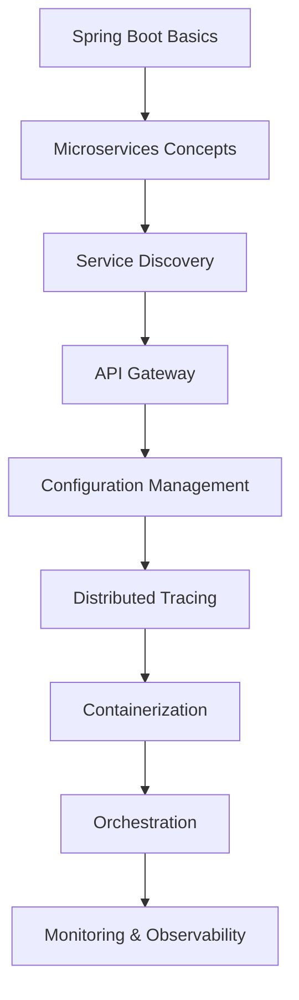
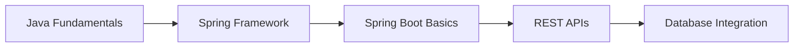
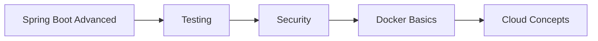
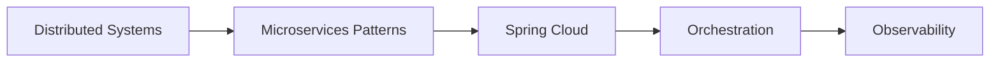
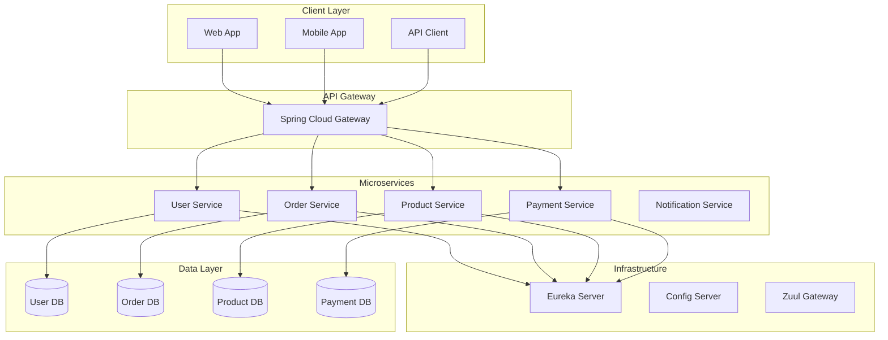

# Spring Boot Microservices 2025: Modern Architecture

## 🚀 Microservices là gì và tại sao quan trọng trong 2025?

**Microservices** là một architectural style trong đó applications được xây dựng như một collection của loosely coupled services. Mỗi service được deploy independently và communicate với nhau qua well-defined APIs. Trong năm 2025, microservices vẫn là dominant architecture pattern với hơn 75% enterprise applications.

### 🎯 Tại sao Microservices quan trọng trong 2025?

- **Scalability**: Scale individual services independently
- **Technology Diversity**: Use different technologies cho different services
- **Team Autonomy**: Teams can work independently
- **Fault Isolation**: Failure in one service doesn't affect others
- **Cloud Native**: Perfect cho cloud deployment
- **DevOps**: Enable continuous deployment và delivery

### 📚 Roadmap học Microservices cho người mới



**Lưu ý**: Bài viết này tập trung vào **Advanced Level** (cấp độ 7-10). Bạn cần có kiến thức vững về Spring Boot và distributed systems.

## 📋 Prerequisites - Yêu cầu kiến thức

### 🎯 Kiến thức bắt buộc (Required)

**1. Spring Boot (2-3 năm kinh nghiệm)**
- ✅ Hiểu sâu về Spring Boot architecture
- ✅ Thành thạo với Spring Boot starters
- ✅ Kinh nghiệm với Spring Data JPA
- ✅ Hiểu về Spring Security cơ bản
- ✅ Kinh nghiệm với Spring Boot testing

**2. Distributed Systems Fundamentals**
- ✅ Hiểu về microservices vs monolith
- ✅ Kiến thức về service communication
- ✅ Hiểu về CAP theorem
- ✅ Kinh nghiệm với REST APIs
- ✅ Hiểu về database per service pattern

**3. Docker & Containerization**
- ✅ Thành thạo Docker commands
- ✅ Hiểu về Dockerfile và docker-compose
- ✅ Kinh nghiệm với container networking
- ✅ Hiểu về multi-stage builds
- ✅ Kinh nghiệm với Docker volumes

### 🔧 Kiến thức khuyến nghị (Recommended)

**4. Cloud Platforms**
- ✅ AWS/Azure/GCP cơ bản
- ✅ Container orchestration concepts
- ✅ Load balancing và auto-scaling
- ✅ Service mesh concepts

**5. Monitoring & Observability**
- ✅ Logging best practices
- ✅ Metrics collection
- ✅ Distributed tracing concepts
- ✅ Health checks và monitoring

### ⚠️ Nếu bạn chưa có đủ kiến thức

**Hãy đọc các bài viết này trước:**
1. [Spring Boot REST API: Hướng Dẫn Toàn Diện](../spring-boot-rest-api.md)
2. [Spring Framework Overview: Từ Cơ Bản đến Nâng Cao](../spring-framework-overview.md)
3. [Java Database JPA: Complete Guide](../java-database-jpa.md)

**Hoặc tham khảo learning path bên dưới:**

## 🛤️ Learning Path - Lộ trình học tập

### 📚 Level 1: Foundation (Beginner - 3-6 tháng)


**Mục tiêu:** Hiểu cơ bản về Spring ecosystem
- Java OOP và Collections
- Spring Framework core concepts
- Spring Boot starters và auto-configuration
- REST API development
- Database integration với JPA

### 📚 Level 2: Intermediate (6-12 tháng)


**Mục tiêu:** Thành thạo Spring Boot và containerization
- Spring Boot advanced features
- Unit và integration testing
- Spring Security implementation
- Docker containerization
- Cloud platform basics

### 📚 Level 3: Advanced (12-18 tháng)


**Mục tiêu:** Master microservices architecture
- Distributed systems concepts
- Microservices design patterns
- Spring Cloud ecosystem
- Kubernetes orchestration
- Monitoring và observability

### 🎯 Bài viết này phù hợp với Level 3

## 🎯 Mục tiêu bài viết

Sau khi đọc xong bài viết này, bạn sẽ hiểu:
- **Microservices Architecture**: Design principles, patterns, anti-patterns
- **Spring Cloud**: Service discovery, configuration, circuit breaker
- **API Gateway**: Routing, load balancing, authentication
- **Distributed Systems**: Event-driven architecture, saga pattern
- **Containerization**: Docker, Kubernetes deployment
- **Observability**: Logging, metrics, tracing
- **Security**: Service-to-service authentication, API security

### 👥 Ai nên đọc bài viết này?

**✅ Phù hợp:**
- **Senior Developers**: Có kinh nghiệm Spring Boot 2-3 năm, muốn học microservices
- **System Architects**: Thiết kế distributed systems và microservices
- **DevOps Engineers**: Deploy và manage microservices infrastructure
- **Tech Leads**: Lead microservices projects và teams
- **Experienced Developers**: Muốn cập nhật kiến thức microservices hiện đại

**❌ Không phù hợp:**
- **Sinh viên IT**: Cần học Spring Boot cơ bản trước
- **Junior Developers**: Cần kinh nghiệm thực tế với Spring Boot
- **Career Changers**: Cần foundation knowledge về Java enterprise
- **Frontend Developers**: Chỉ quan tâm đến API consumption

### 🚀 Bài viết bổ sung được khuyến nghị

**Nếu bạn chưa đủ kinh nghiệm, hãy đọc:**

1. **"Microservices Fundamentals for Beginners"** (Sẽ được tạo)
   - Microservices vs Monolith
   - Basic concepts và terminology
   - Simple examples với Spring Boot

2. **"Spring Boot to Microservices Journey"** (Sẽ được tạo)
   - Từ monolith Spring Boot sang microservices
   - Step-by-step migration guide
   - Common pitfalls và solutions

3. **"Microservices Patterns for Junior Developers"** (Sẽ được tạo)
   - Essential patterns cho beginners
   - Practical examples
   - Best practices cho small teams

### 🎯 Khi nào sử dụng Microservices?

**Microservices** rất phù hợp khi bạn cần:
- **Large Applications**: Complex, large-scale applications
- **Team Scalability**: Multiple teams working on same system
- **Technology Diversity**: Different services need different technologies
- **Independent Deployment**: Deploy services independently
- **Fault Tolerance**: Isolate failures
- **Cloud Deployment**: Cloud-native applications

**Ví dụ thực tế**: E-commerce platforms, banking systems, social media platforms, IoT systems

## 🏗️ Project Architecture

### Microservices Overview



## 🏛️ Service Discovery với Eureka

### Eureka Server

```xml
<!-- eureka-server/pom.xml -->
<dependencies>
    <dependency>
        <groupId>org.springframework.cloud</groupId>
        <artifactId>spring-cloud-starter-netflix-eureka-server</artifactId>
    </dependency>
    <dependency>
        <groupId>org.springframework.boot</groupId>
        <artifactId>spring-boot-starter-web</artifactId>
    </dependency>
</dependencies>
```

```java
// eureka-server/src/main/java/com/devnetinsights/EurekaServerApplication.java
package com.devnetinsights;

import org.springframework.boot.SpringApplication;
import org.springframework.boot.autoconfigure.SpringBootApplication;
import org.springframework.cloud.netflix.eureka.server.EnableEurekaServer;

@SpringBootApplication
@EnableEurekaServer
public class EurekaServerApplication {
    public static void main(String[] args) {
        SpringApplication.run(EurekaServerApplication.class, args);
    }
}
```

```yaml
# eureka-server/src/main/resources/application.yml
server:
  port: 8761

eureka:
  client:
    register-with-eureka: false
    fetch-registry: false
  server:
    enable-self-preservation: false

spring:
  application:
    name: eureka-server
```

### User Service với Eureka Client

```xml
<!-- user-service/pom.xml -->
<dependencies>
    <dependency>
        <groupId>org.springframework.cloud</groupId>
        <artifactId>spring-cloud-starter-netflix-eureka-client</artifactId>
    </dependency>
    <dependency>
        <groupId>org.springframework.boot</groupId>
        <artifactId>spring-boot-starter-web</artifactId>
    </dependency>
    <dependency>
        <groupId>org.springframework.boot</groupId>
        <artifactId>spring-boot-starter-data-jpa</artifactId>
    </dependency>
</dependencies>
```

```java
// user-service/src/main/java/com/devnetinsights/UserServiceApplication.java
package com.devnetinsights;

import org.springframework.boot.SpringApplication;
import org.springframework.boot.autoconfigure.SpringBootApplication;
import org.springframework.cloud.netflix.eureka.EnableEurekaClient;

@SpringBootApplication
@EnableEurekaClient
public class UserServiceApplication {
    public static void main(String[] args) {
        SpringApplication.run(UserServiceApplication.class, args);
    }
}
```

```yaml
# user-service/src/main/resources/application.yml
server:
  port: 8081

spring:
  application:
    name: user-service
  datasource:
    url: jdbc:h2:mem:userdb
    driver-class-name: org.h2.Driver
    username: sa
    password: password
  jpa:
    hibernate:
      ddl-auto: create-drop
    show-sql: true

eureka:
  client:
    service-url:
      defaultZone: http://localhost:8761/eureka/
  instance:
    prefer-ip-address: true
```

## 🌐 API Gateway với Spring Cloud Gateway

### Gateway Configuration

```xml
<!-- api-gateway/pom.xml -->
<dependencies>
    <dependency>
        <groupId>org.springframework.cloud</groupId>
        <artifactId>spring-cloud-starter-gateway</artifactId>
    </dependency>
    <dependency>
        <groupId>org.springframework.cloud</groupId>
        <artifactId>spring-cloud-starter-netflix-eureka-client</artifactId>
    </dependency>
    <dependency>
        <groupId>org.springframework.boot</groupId>
        <artifactId>spring-boot-starter-security</artifactId>
    </dependency>
</dependencies>
```

```java
// api-gateway/src/main/java/com/devnetinsights/ApiGatewayApplication.java
package com.devnetinsights;

import org.springframework.boot.SpringApplication;
import org.springframework.boot.autoconfigure.SpringBootApplication;
import org.springframework.cloud.netflix.eureka.EnableEurekaClient;

@SpringBootApplication
@EnableEurekaClient
public class ApiGatewayApplication {
    public static void main(String[] args) {
        SpringApplication.run(ApiGatewayApplication.class, args);
    }
}
```

```yaml
# api-gateway/src/main/resources/application.yml
server:
  port: 8080

spring:
  application:
    name: api-gateway
  cloud:
    gateway:
      routes:
        - id: user-service
          uri: lb://user-service
          predicates:
            - Path=/api/users/**
          filters:
            - StripPrefix=2
        - id: order-service
          uri: lb://order-service
          predicates:
            - Path=/api/orders/**
          filters:
            - StripPrefix=2
        - id: product-service
          uri: lb://product-service
          predicates:
            - Path=/api/products/**
          filters:
            - StripPrefix=2
      globalcors:
        cors-configurations:
          '[/**]':
            allowedOrigins: "*"
            allowedMethods:
              - GET
              - POST
              - PUT
              - DELETE
              - OPTIONS
            allowedHeaders: "*"

eureka:
  client:
    service-url:
      defaultZone: http://localhost:8761/eureka/
```

### Custom Gateway Filters

```java
// api-gateway/src/main/java/com/devnetinsights/filter/AuthenticationFilter.java
package com.devnetinsights.filter;

import org.springframework.cloud.gateway.filter.GatewayFilterChain;
import org.springframework.cloud.gateway.filter.GlobalFilter;
import org.springframework.core.Ordered;
import org.springframework.http.HttpStatus;
import org.springframework.stereotype.Component;
import org.springframework.web.server.ServerWebExchange;
import reactor.core.publisher.Mono;

@Component
public class AuthenticationFilter implements GlobalFilter, Ordered {
    
    @Override
    public Mono<Void> filter(ServerWebExchange exchange, GatewayFilterChain chain) {
        String authHeader = exchange.getRequest().getHeaders().getFirst("Authorization");
        
        if (authHeader == null || !authHeader.startsWith("Bearer ")) {
            exchange.getResponse().setStatusCode(HttpStatus.UNAUTHORIZED);
            return exchange.getResponse().setComplete();
        }
        
        // Validate JWT token
        String token = authHeader.substring(7);
        if (!isValidToken(token)) {
            exchange.getResponse().setStatusCode(HttpStatus.UNAUTHORIZED);
            return exchange.getResponse().setComplete();
        }
        
        return chain.filter(exchange);
    }
    
    @Override
    public int getOrder() {
        return -1;
    }
    
    private boolean isValidToken(String token) {
        // JWT validation logic
        return true; // Placeholder
    }
}

// api-gateway/src/main/java/com/devnetinsights/filter/LoggingFilter.java
package com.devnetinsights.filter;

import org.springframework.cloud.gateway.filter.GatewayFilterChain;
import org.springframework.cloud.gateway.filter.GlobalFilter;
import org.springframework.core.Ordered;
import org.springframework.stereotype.Component;
import org.springframework.web.server.ServerWebExchange;
import reactor.core.publisher.Mono;

@Component
public class LoggingFilter implements GlobalFilter, Ordered {
    
    @Override
    public Mono<Void> filter(ServerWebExchange exchange, GatewayFilterChain chain) {
        long startTime = System.currentTimeMillis();
        
        return chain.filter(exchange).then(
            Mono.fromRunnable(() -> {
                long endTime = System.currentTimeMillis();
                System.out.println("Request to " + exchange.getRequest().getURI() + 
                                 " took " + (endTime - startTime) + " ms");
            })
        );
    }
    
    @Override
    public int getOrder() {
        return 0;
    }
}
```

## 🔧 Configuration Management

### Config Server

```xml
<!-- config-server/pom.xml -->
<dependencies>
    <dependency>
        <groupId>org.springframework.cloud</groupId>
        <artifactId>spring-cloud-config-server</artifactId>
    </dependency>
    <dependency>
        <groupId>org.springframework.cloud</groupId>
        <artifactId>spring-cloud-starter-netflix-eureka-client</artifactId>
    </dependency>
</dependencies>
```

```java
// config-server/src/main/java/com/devnetinsights/ConfigServerApplication.java
package com.devnetinsights;

import org.springframework.boot.SpringApplication;
import org.springframework.boot.autoconfigure.SpringBootApplication;
import org.springframework.cloud.config.server.EnableConfigServer;
import org.springframework.cloud.netflix.eureka.EnableEurekaClient;

@SpringBootApplication
@EnableConfigServer
@EnableEurekaClient
public class ConfigServerApplication {
    public static void main(String[] args) {
        SpringApplication.run(ConfigServerApplication.class, args);
    }
}
```

```yaml
# config-server/src/main/resources/application.yml
server:
  port: 8888

spring:
  application:
    name: config-server
  cloud:
    config:
      server:
        git:
          uri: https://github.com/devnetinsights/microservices-config
          clone-on-start: true

eureka:
  client:
    service-url:
      defaultZone: http://localhost:8761/eureka/
```

### Client Configuration

```yaml
# user-service/src/main/resources/bootstrap.yml
spring:
  application:
    name: user-service
  cloud:
    config:
      uri: http://localhost:8888
      fail-fast: true
```

## 🔄 Circuit Breaker với Resilience4j

### Circuit Breaker Configuration

```xml
<!-- user-service/pom.xml -->
<dependency>
    <groupId>io.github.resilience4j</groupId>
    <artifactId>resilience4j-spring-boot2</artifactId>
    <version>2.1.0</version>
</dependency>
<dependency>
    <groupId>io.github.resilience4j</groupId>
    <artifactId>resilience4j-circuitbreaker</artifactId>
    <version>2.1.0</version>
</dependency>
```

```java
// user-service/src/main/java/com/devnetinsights/service/UserService.java
package com.devnetinsights.service;

import com.devnetinsights.model.User;
import com.devnetinsights.repository.UserRepository;
import io.github.resilience4j.circuitbreaker.annotation.CircuitBreaker;
import io.github.resilience4j.retry.annotation.Retry;
import io.github.resilience4j.timelimiter.annotation.TimeLimiter;
import org.springframework.beans.factory.annotation.Autowired;
import org.springframework.stereotype.Service;
import org.springframework.web.client.RestTemplate;

import java.util.concurrent.CompletableFuture;

@Service
public class UserService {
    
    @Autowired
    private UserRepository userRepository;
    
    @Autowired
    private RestTemplate restTemplate;
    
    @CircuitBreaker(name = "userService", fallbackMethod = "fallbackGetUser")
    @Retry(name = "userService")
    @TimeLimiter(name = "userService")
    public CompletableFuture<User> getUserWithOrders(Long userId) {
        return CompletableFuture.supplyAsync(() -> {
            User user = userRepository.findById(userId)
                    .orElseThrow(() -> new RuntimeException("User not found"));
            
            // Call order service
            String ordersUrl = "http://order-service/api/orders/user/" + userId;
            // Order[] orders = restTemplate.getForObject(ordersUrl, Order[].class);
            
            return user;
        });
    }
    
    public CompletableFuture<User> fallbackGetUser(Long userId, Exception ex) {
        User user = new User();
        user.setId(userId);
        user.setUsername("Fallback User");
        return CompletableFuture.completedFuture(user);
    }
}
```

```yaml
# user-service/src/main/resources/application.yml
resilience4j:
  circuitbreaker:
    instances:
      userService:
        register-health-indicator: true
        sliding-window-size: 10
        minimum-number-of-calls: 5
        permitted-number-of-calls-in-half-open-state: 3
        automatic-transition-from-open-to-half-open-enabled: true
        wait-duration-in-open-state: 5s
        failure-rate-threshold: 50
        event-consumer-buffer-size: 10
  retry:
    instances:
      userService:
        max-attempts: 3
        wait-duration: 1s
  timelimiter:
    instances:
      userService:
        timeout-duration: 2s
```

## 📊 Distributed Tracing với Sleuth

### Tracing Configuration

```xml
<!-- user-service/pom.xml -->
<dependency>
    <groupId>org.springframework.cloud</groupId>
    <artifactId>spring-cloud-starter-sleuth</artifactId>
</dependency>
<dependency>
    <groupId>org.springframework.cloud</groupId>
    <artifactId>spring-cloud-sleuth-zipkin</artifactId>
</dependency>
```

```yaml
# user-service/src/main/resources/application.yml
spring:
  sleuth:
    zipkin:
      base-url: http://localhost:9411
    sampler:
      probability: 1.0
```

### Custom Tracing

```java
// user-service/src/main/java/com/devnetinsights/service/TracedUserService.java
package com.devnetinsights.service;

import brave.Span;
import brave.Tracer;
import com.devnetinsights.model.User;
import com.devnetinsights.repository.UserRepository;
import org.springframework.beans.factory.annotation.Autowired;
import org.springframework.stereotype.Service;

@Service
public class TracedUserService {
    
    @Autowired
    private UserRepository userRepository;
    
    @Autowired
    private Tracer tracer;
    
    public User createUser(User user) {
        Span span = tracer.nextSpan().name("create-user").start();
        
        try (Tracer.SpanInScope ws = tracer.withSpanInScope(span)) {
            span.tag("user.email", user.getEmail());
            span.tag("user.username", user.getUsername());
            
            User savedUser = userRepository.save(user);
            
            span.tag("user.id", savedUser.getId().toString());
            return savedUser;
        } finally {
            span.end();
        }
    }
}
```

## 🐳 Containerization với Docker

### Dockerfile cho User Service

```dockerfile
# user-service/Dockerfile
FROM openjdk:17-jdk-slim

WORKDIR /app

COPY target/user-service-1.0.0.jar app.jar

EXPOSE 8081

ENTRYPOINT ["java", "-jar", "app.jar"]
```

### Docker Compose

```yaml
# docker-compose.yml
version: '3.8'

services:
  eureka-server:
    build: ./eureka-server
    ports:
      - "8761:8761"
    networks:
      - microservices-network

  config-server:
    build: ./config-server
    ports:
      - "8888:8888"
    depends_on:
      - eureka-server
    networks:
      - microservices-network

  api-gateway:
    build: ./api-gateway
    ports:
      - "8080:8080"
    depends_on:
      - eureka-server
      - config-server
    networks:
      - microservices-network

  user-service:
    build: ./user-service
    ports:
      - "8081:8081"
    depends_on:
      - eureka-server
      - config-server
    networks:
      - microservices-network

  order-service:
    build: ./order-service
    ports:
      - "8082:8082"
    depends_on:
      - eureka-server
      - config-server
    networks:
      - microservices-network

  product-service:
    build: ./product-service
    ports:
      - "8083:8083"
    depends_on:
      - eureka-server
      - config-server
    networks:
      - microservices-network

networks:
  microservices-network:
    driver: bridge
```

## ☸️ Kubernetes Deployment

### Kubernetes Manifests

```yaml
# k8s/eureka-server-deployment.yaml
apiVersion: apps/v1
kind: Deployment
metadata:
  name: eureka-server
spec:
  replicas: 1
  selector:
    matchLabels:
      app: eureka-server
  template:
    metadata:
      labels:
        app: eureka-server
    spec:
      containers:
      - name: eureka-server
        image: devnetinsights/eureka-server:latest
        ports:
        - containerPort: 8761
        env:
        - name: SPRING_PROFILES_ACTIVE
          value: "k8s"
---
apiVersion: v1
kind: Service
metadata:
  name: eureka-server
spec:
  selector:
    app: eureka-server
  ports:
  - port: 8761
    targetPort: 8761
  type: ClusterIP
```

```yaml
# k8s/user-service-deployment.yaml
apiVersion: apps/v1
kind: Deployment
metadata:
  name: user-service
spec:
  replicas: 3
  selector:
    matchLabels:
      app: user-service
  template:
    metadata:
      labels:
        app: user-service
    spec:
      containers:
      - name: user-service
        image: devnetinsights/user-service:latest
        ports:
        - containerPort: 8081
        env:
        - name: SPRING_PROFILES_ACTIVE
          value: "k8s"
        - name: EUREKA_CLIENT_SERVICE_URL_DEFAULTZONE
          value: "http://eureka-server:8761/eureka/"
        resources:
          requests:
            memory: "256Mi"
            cpu: "250m"
          limits:
            memory: "512Mi"
            cpu: "500m"
---
apiVersion: v1
kind: Service
metadata:
  name: user-service
spec:
  selector:
    app: user-service
  ports:
  - port: 8081
    targetPort: 8081
  type: ClusterIP
```

## 🏋️ Bài tập thực hành

### Bài tập 1: Tạo Order Service
Tạo Order Service với Eureka client và circuit breaker.

```java
// TODO: Implement Order Service
@SpringBootApplication
@EnableEurekaClient
public class OrderServiceApplication {
    // Your code here
}
```

### Bài tập 2: Implement Event-Driven Architecture
Tạo event-driven communication giữa services.

```java
// TODO: Create Event Publisher
@Component
public class OrderEventPublisher {
    // Your code here
    // Publish events using Spring Cloud Stream
}
```

### Bài tập 3: Add Distributed Caching
Implement distributed caching với Redis.

```java
// TODO: Configure Redis Cache
@Configuration
@EnableCaching
public class CacheConfig {
    // Your code here
}
```

### Bài tập 4: Implement API Versioning
Add API versioning strategy cho microservices.

```java
// TODO: Create Versioned Controllers
@RestController
@RequestMapping("/v1/orders")
public class OrderControllerV1 {
    // Your code here
}
```

## 🚨 Troubleshooting và Common Mistakes

### Common Microservices Mistakes

1. **Distributed Monolith**
```java
// ❌ Wrong - tight coupling between services
@Service
public class UserService {
    @Autowired
    private OrderServiceClient orderServiceClient;
    
    public User getUserWithOrders(Long userId) {
        User user = getUser(userId);
        List<Order> orders = orderServiceClient.getOrdersByUserId(userId);
        user.setOrders(orders);
        return user;
    }
}

// ✅ Correct - loose coupling
@Service
public class UserService {
    public User getUser(Long userId) {
        return userRepository.findById(userId);
    }
}

@Service
public class OrderService {
    public List<Order> getOrdersByUserId(Long userId) {
        return orderRepository.findByUserId(userId);
    }
}
```

2. **Missing Circuit Breaker**
```java
// ❌ Wrong - no circuit breaker
@Service
public class UserService {
    public User getUserWithOrders(Long userId) {
        User user = getUser(userId);
        // Direct call to order service - can fail
        List<Order> orders = restTemplate.getForObject(
            "http://order-service/orders/user/" + userId, List.class);
        return user;
    }
}

// ✅ Correct - with circuit breaker
@Service
public class UserService {
    @CircuitBreaker(name = "orderService", fallbackMethod = "fallbackGetOrders")
    public User getUserWithOrders(Long userId) {
        User user = getUser(userId);
        List<Order> orders = orderServiceClient.getOrdersByUserId(userId);
        return user;
    }
    
    public User fallbackGetOrders(Long userId, Exception ex) {
        return getUser(userId); // Return user without orders
    }
}
```

3. **Poor Service Discovery**
```java
// ❌ Wrong - hardcoded URLs
@Service
public class UserService {
    private static final String ORDER_SERVICE_URL = "http://localhost:8082";
    
    public List<Order> getOrders(Long userId) {
        return restTemplate.getForObject(
            ORDER_SERVICE_URL + "/orders/user/" + userId, List.class);
    }
}

// ✅ Correct - service discovery
@Service
public class UserService {
    @Autowired
    private DiscoveryClient discoveryClient;
    
    public List<Order> getOrders(Long userId) {
        List<ServiceInstance> instances = discoveryClient.getInstances("order-service");
        ServiceInstance instance = instances.get(0);
        String url = "http://" + instance.getHost() + ":" + instance.getPort();
        return restTemplate.getForObject(url + "/orders/user/" + userId, List.class);
    }
}
```

## 📚 Tài liệu tham khảo

- [Spring Cloud Documentation](https://spring.io/projects/spring-cloud)
- [Microservices Patterns](https://microservices.io/)
- [Docker Documentation](https://docs.docker.com/)
- [Kubernetes Documentation](https://kubernetes.io/docs/)

## 🎉 Kết luận

Chúng ta đã tìm hiểu về Spring Boot Microservices từ cơ bản đến nâng cao:

- ✅ **Microservices Architecture**: Design principles, patterns, best practices
- ✅ **Spring Cloud**: Service discovery, configuration, circuit breaker
- ✅ **API Gateway**: Routing, load balancing, authentication
- ✅ **Distributed Systems**: Event-driven architecture, tracing
- ✅ **Containerization**: Docker, Kubernetes deployment
- ✅ **Observability**: Logging, metrics, monitoring

### 🚀 Ứng dụng thực tế trong 2025

Microservices là **essential skill** cho:
- **Senior Developers**: Advanced distributed systems
- **System Architects**: Large-scale system design
- **DevOps Engineers**: Container orchestration
- **Tech Leads**: Microservices project leadership

### 📈 Next Steps

1. **Thực hành**: Làm các bài tập ở trên
2. **Mở rộng**: Học Service Mesh (Istio)
3. **Advanced**: Học Event Sourcing, CQRS
4. **Monitoring**: Học Prometheus, Grafana
5. **Security**: Học OAuth2, mTLS

---

*Bạn có câu hỏi nào về Spring Boot Microservices không? Hãy để lại comment hoặc liên hệ với mình!* 🚀

**Tags**: #spring-boot #microservices #spring-cloud #docker #kubernetes #2025 #distributed-systems
