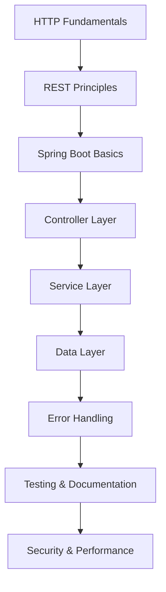

# Spring Boot REST API: Hướng Dẫn Toàn Diện

## 🚀 REST API là gì và tại sao quan trọng trong 2025?

**REST (Representational State Transfer)** là một architectural style cho designing web services. REST API là interface cho phép các applications khác nhau communicate với nhau qua HTTP protocol. Trong năm 2025, REST API vẫn là standard cho web services với hơn 85% thị phần.

### 🎯 Tại sao REST API quan trọng trong 2025?

- **Industry Standard**: Được sử dụng bởi hầu hết các công ty công nghệ
- **Microservices**: Foundation cho microservices architecture
- **Mobile First**: Essential cho mobile app development
- **Cloud Native**: Perfect cho cloud-based applications
- **Interoperability**: Language và platform independent
- **Scalability**: Stateless design cho horizontal scaling

### 📚 Roadmap học REST API cho người mới



**Lưu ý**: Bài viết này tập trung vào **Intermediate to Advanced Level** (cấp độ 4-9). Bạn cần có kiến thức cơ bản về Java và Spring Boot.

## 🎯 Mục tiêu bài viết

Sau khi đọc xong bài viết này, bạn sẽ hiểu:
- **REST Principles**: HTTP methods, status codes, resource design
- **Spring Boot Controllers**: @RestController, @RequestMapping, @PathVariable
- **Request/Response Handling**: JSON serialization, validation, error handling
- **Service Layer**: Business logic, transaction management
- **Data Layer**: JPA integration, repository pattern
- **Testing**: Unit tests, integration tests, API testing
- **Documentation**: OpenAPI/Swagger integration
- **Security**: Authentication, authorization, CORS

### 👥 Ai nên đọc bài viết này?

- ✅ **Sinh viên IT**: Có kiến thức Java cơ bản, muốn học web services
- ✅ **Junior Developers**: Đã biết Spring Boot cơ bản, muốn nâng cao kỹ năng
- ✅ **Career Changers**: Chuyển đổi sang Java Backend development
- ✅ **Full-stack Developers**: Muốn hiểu sâu về API design
- ✅ **Experienced Developers**: Muốn cập nhật kiến thức REST API hiện đại

### 🎯 Khi nào sử dụng REST API?

**REST API** rất phù hợp khi bạn cần:
- **Web Services**: Expose business logic qua HTTP
- **Mobile Backends**: Support cho mobile applications
- **Microservices**: Service-to-service communication
- **Third-party Integration**: Integrate với external systems
- **Frontend Separation**: Decouple frontend và backend

**Ví dụ thực tế**: E-commerce APIs, social media platforms, banking systems, IoT platforms

## 🏗️ Project Setup

### Maven Dependencies

```xml
<!-- pom.xml -->
<?xml version="1.0" encoding="UTF-8"?>
<project xmlns="http://maven.apache.org/POM/4.0.0"
         xmlns:xsi="http://www.w3.org/2001/XMLSchema-instance"
         xsi:schemaLocation="http://maven.apache.org/POM/4.0.0 
         http://maven.apache.org/xsd/maven-4.0.0.xsd">
    <modelVersion>4.0.0</modelVersion>

    <parent>
        <groupId>org.springframework.boot</groupId>
        <artifactId>spring-boot-starter-parent</artifactId>
        <version>3.2.0</version>
        <relativePath/>
    </parent>

    <groupId>com.devnetinsights</groupId>
    <artifactId>spring-boot-rest-api</artifactId>
    <version>1.0.0</version>
    <packaging>jar</packaging>

    <properties>
        <java.version>17</java.version>
    </properties>

    <dependencies>
        <!-- Spring Boot Starters -->
        <dependency>
            <groupId>org.springframework.boot</groupId>
            <artifactId>spring-boot-starter-web</artifactId>
        </dependency>
        
        <dependency>
            <groupId>org.springframework.boot</groupId>
            <artifactId>spring-boot-starter-data-jpa</artifactId>
        </dependency>
        
        <dependency>
            <groupId>org.springframework.boot</groupId>
            <artifactId>spring-boot-starter-validation</artifactId>
        </dependency>
        
        <dependency>
            <groupId>org.springframework.boot</groupId>
            <artifactId>spring-boot-starter-security</artifactId>
        </dependency>

        <!-- Database -->
        <dependency>
            <groupId>mysql</groupId>
            <artifactId>mysql-connector-java</artifactId>
            <version>8.0.33</version>
        </dependency>
        
        <dependency>
            <groupId>com.h2database</groupId>
            <artifactId>h2</artifactId>
            <scope>runtime</scope>
        </dependency>

        <!-- Documentation -->
        <dependency>
            <groupId>org.springdoc</groupId>
            <artifactId>springdoc-openapi-starter-webmvc-ui</artifactId>
            <version>2.2.0</version>
        </dependency>

        <!-- Testing -->
        <dependency>
            <groupId>org.springframework.boot</groupId>
            <artifactId>spring-boot-starter-test</artifactId>
            <scope>test</scope>
        </dependency>
        
        <dependency>
            <groupId>org.springframework.security</groupId>
            <artifactId>spring-security-test</artifactId>
            <scope>test</scope>
        </dependency>
    </dependencies>

    <build>
        <plugins>
            <plugin>
                <groupId>org.springframework.boot</groupId>
                <artifactId>spring-boot-maven-plugin</artifactId>
            </plugin>
        </plugins>
    </build>
</project>
```

### Application Configuration

```properties
# application.properties
server.port=8080
server.servlet.context-path=/api

# Database Configuration
spring.datasource.url=jdbc:mysql://localhost:3306/rest_api_db
spring.datasource.username=root
spring.datasource.password=password
spring.datasource.driver-class-name=com.mysql.cj.jdbc.Driver

# JPA Configuration
spring.jpa.hibernate.ddl-auto=update
spring.jpa.show-sql=true
spring.jpa.properties.hibernate.format_sql=true
spring.jpa.properties.hibernate.dialect=org.hibernate.dialect.MySQLDialect

# Logging
logging.level.com.devnetinsights=DEBUG
logging.level.org.springframework.web=DEBUG

# OpenAPI Documentation
springdoc.api-docs.path=/api-docs
springdoc.swagger-ui.path=/swagger-ui.html
```

## 🏛️ REST API Fundamentals

### 🎯 REST Principles

**REST** tuân theo 6 constraints:
1. **Client-Server**: Separation of concerns
2. **Stateless**: No client context stored on server
3. **Cacheable**: Responses must define cacheability
4. **Uniform Interface**: Consistent interface design
5. **Layered System**: Hierarchical system architecture
6. **Code on Demand**: Optional constraint

### HTTP Methods và Status Codes

```java
// HTTP Methods mapping
GET    /api/users        -> Retrieve all users
GET    /api/users/{id}   -> Retrieve specific user
POST   /api/users        -> Create new user
PUT    /api/users/{id}   -> Update entire user
PATCH  /api/users/{id}   -> Partial update user
DELETE /api/users/{id}   -> Delete user

// HTTP Status Codes
200 OK           -> Success
201 Created      -> Resource created
204 No Content   -> Success, no content
400 Bad Request  -> Client error
401 Unauthorized -> Authentication required
403 Forbidden    -> Authorization failed
404 Not Found    -> Resource not found
500 Internal Server Error -> Server error
```

## 🎮 Controller Layer

### Basic REST Controller

```java
// src/main/java/com/devnetinsights/controller/UserController.java
package com.devnetinsights.controller;

import com.devnetinsights.dto.UserDto;
import com.devnetinsights.dto.CreateUserRequest;
import com.devnetinsights.dto.UpdateUserRequest;
import com.devnetinsights.service.UserService;
import jakarta.validation.Valid;
import org.springframework.beans.factory.annotation.Autowired;
import org.springframework.http.HttpStatus;
import org.springframework.http.ResponseEntity;
import org.springframework.web.bind.annotation.*;

import java.util.List;

@RestController
@RequestMapping("/users")
@CrossOrigin(origins = "*", maxAge = 3600)
public class UserController {
    
    private final UserService userService;
    
    @Autowired
    public UserController(UserService userService) {
        this.userService = userService;
    }
    
    @GetMapping
    public ResponseEntity<List<UserDto>> getAllUsers(
            @RequestParam(defaultValue = "0") int page,
            @RequestParam(defaultValue = "10") int size,
            @RequestParam(defaultValue = "id") String sortBy,
            @RequestParam(defaultValue = "asc") String sortDir) {
        
        List<UserDto> users = userService.getAllUsers(page, size, sortBy, sortDir);
        return ResponseEntity.ok(users);
    }
    
    @GetMapping("/{id}")
    public ResponseEntity<UserDto> getUserById(@PathVariable Long id) {
        UserDto user = userService.getUserById(id);
        return ResponseEntity.ok(user);
    }
    
    @PostMapping
    public ResponseEntity<UserDto> createUser(@Valid @RequestBody CreateUserRequest request) {
        UserDto createdUser = userService.createUser(request);
        return ResponseEntity.status(HttpStatus.CREATED).body(createdUser);
    }
    
    @PutMapping("/{id}")
    public ResponseEntity<UserDto> updateUser(
            @PathVariable Long id, 
            @Valid @RequestBody UpdateUserRequest request) {
        UserDto updatedUser = userService.updateUser(id, request);
        return ResponseEntity.ok(updatedUser);
    }
    
    @PatchMapping("/{id}")
    public ResponseEntity<UserDto> partialUpdateUser(
            @PathVariable Long id, 
            @RequestBody UpdateUserRequest request) {
        UserDto updatedUser = userService.partialUpdateUser(id, request);
        return ResponseEntity.ok(updatedUser);
    }
    
    @DeleteMapping("/{id}")
    public ResponseEntity<Void> deleteUser(@PathVariable Long id) {
        userService.deleteUser(id);
        return ResponseEntity.noContent().build();
    }
    
    @GetMapping("/search")
    public ResponseEntity<List<UserDto>> searchUsers(
            @RequestParam String query,
            @RequestParam(defaultValue = "0") int page,
            @RequestParam(defaultValue = "10") int size) {
        
        List<UserDto> users = userService.searchUsers(query, page, size);
        return ResponseEntity.ok(users);
    }
}
```

### Advanced Controller Features

```java
// src/main/java/com/devnetinsights/controller/ProductController.java
package com.devnetinsights.controller;

import com.devnetinsights.dto.ProductDto;
import com.devnetinsights.dto.CreateProductRequest;
import com.devnetinsights.service.ProductService;
import jakarta.validation.Valid;
import org.springframework.beans.factory.annotation.Autowired;
import org.springframework.http.HttpStatus;
import org.springframework.http.MediaType;
import org.springframework.http.ResponseEntity;
import org.springframework.web.bind.annotation.*;
import org.springframework.web.multipart.MultipartFile;

import java.util.List;
import java.util.Map;

@RestController
@RequestMapping("/products")
public class ProductController {
    
    private final ProductService productService;
    
    @Autowired
    public ProductController(ProductService productService) {
        this.productService = productService;
    }
    
    // Content Negotiation
    @GetMapping(produces = {MediaType.APPLICATION_JSON_VALUE, MediaType.APPLICATION_XML_VALUE})
    public ResponseEntity<List<ProductDto>> getAllProducts() {
        List<ProductDto> products = productService.getAllProducts();
        return ResponseEntity.ok(products);
    }
    
    // File Upload
    @PostMapping(value = "/{id}/image", consumes = MediaType.MULTIPART_FORM_DATA_VALUE)
    public ResponseEntity<Map<String, String>> uploadProductImage(
            @PathVariable Long id,
            @RequestParam("file") MultipartFile file) {
        
        String imageUrl = productService.uploadProductImage(id, file);
        return ResponseEntity.ok(Map.of("imageUrl", imageUrl));
    }
    
    // Custom Headers
    @GetMapping("/{id}")
    public ResponseEntity<ProductDto> getProductById(
            @PathVariable Long id,
            @RequestHeader(value = "X-Client-Version", required = false) String clientVersion) {
        
        ProductDto product = productService.getProductById(id);
        
        // Add custom headers to response
        return ResponseEntity.ok()
                .header("X-Product-Version", "1.0")
                .header("X-Cache-Status", "HIT")
                .body(product);
    }
    
    // Bulk Operations
    @PostMapping("/bulk")
    public ResponseEntity<Map<String, Object>> createProductsBulk(
            @Valid @RequestBody List<CreateProductRequest> requests) {
        
        Map<String, Object> result = productService.createProductsBulk(requests);
        return ResponseEntity.status(HttpStatus.CREATED).body(result);
    }
    
    // Async Processing
    @PostMapping("/{id}/process")
    public ResponseEntity<Map<String, String>> processProductAsync(@PathVariable Long id) {
        String taskId = productService.processProductAsync(id);
        return ResponseEntity.accepted()
                .body(Map.of("taskId", taskId, "status", "PROCESSING"));
    }
}
```

## 📊 Service Layer

### Business Logic Implementation

```java
// src/main/java/com/devnetinsights/service/UserService.java
package com.devnetinsights.service;

import com.devnetinsights.dto.UserDto;
import com.devnetinsights.dto.CreateUserRequest;
import com.devnetinsights.dto.UpdateUserRequest;
import com.devnetinsights.entity.User;
import com.devnetinsights.exception.ResourceNotFoundException;
import com.devnetinsights.mapper.UserMapper;
import com.devnetinsights.repository.UserRepository;
import org.springframework.beans.factory.annotation.Autowired;
import org.springframework.data.domain.Page;
import org.springframework.data.domain.PageRequest;
import org.springframework.data.domain.Pageable;
import org.springframework.data.domain.Sort;
import org.springframework.stereotype.Service;
import org.springframework.transaction.annotation.Transactional;

import java.util.List;
import java.util.stream.Collectors;

@Service
@Transactional
public class UserService {
    
    private final UserRepository userRepository;
    private final UserMapper userMapper;
    
    @Autowired
    public UserService(UserRepository userRepository, UserMapper userMapper) {
        this.userRepository = userRepository;
        this.userMapper = userMapper;
    }
    
    @Transactional(readOnly = true)
    public List<UserDto> getAllUsers(int page, int size, String sortBy, String sortDir) {
        Sort sort = sortDir.equalsIgnoreCase("desc") ? 
            Sort.by(sortBy).descending() : Sort.by(sortBy).ascending();
        
        Pageable pageable = PageRequest.of(page, size, sort);
        Page<User> userPage = userRepository.findAll(pageable);
        
        return userPage.getContent().stream()
                .map(userMapper::toDto)
                .collect(Collectors.toList());
    }
    
    @Transactional(readOnly = true)
    public UserDto getUserById(Long id) {
        User user = userRepository.findById(id)
                .orElseThrow(() -> new ResourceNotFoundException("User not found with id: " + id));
        return userMapper.toDto(user);
    }
    
    public UserDto createUser(CreateUserRequest request) {
        // Check if user already exists
        if (userRepository.existsByEmail(request.getEmail())) {
            throw new IllegalArgumentException("User with email already exists");
        }
        
        User user = userMapper.toEntity(request);
        User savedUser = userRepository.save(user);
        return userMapper.toDto(savedUser);
    }
    
    public UserDto updateUser(Long id, UpdateUserRequest request) {
        User existingUser = userRepository.findById(id)
                .orElseThrow(() -> new ResourceNotFoundException("User not found with id: " + id));
        
        userMapper.updateEntity(existingUser, request);
        User updatedUser = userRepository.save(existingUser);
        return userMapper.toDto(updatedUser);
    }
    
    public UserDto partialUpdateUser(Long id, UpdateUserRequest request) {
        User existingUser = userRepository.findById(id)
                .orElseThrow(() -> new ResourceNotFoundException("User not found with id: " + id));
        
        // Only update non-null fields
        if (request.getFirstName() != null) {
            existingUser.setFirstName(request.getFirstName());
        }
        if (request.getLastName() != null) {
            existingUser.setLastName(request.getLastName());
        }
        if (request.getEmail() != null) {
            existingUser.setEmail(request.getEmail());
        }
        
        User updatedUser = userRepository.save(existingUser);
        return userMapper.toDto(updatedUser);
    }
    
    public void deleteUser(Long id) {
        if (!userRepository.existsById(id)) {
            throw new ResourceNotFoundException("User not found with id: " + id);
        }
        userRepository.deleteById(id);
    }
    
    @Transactional(readOnly = true)
    public List<UserDto> searchUsers(String query, int page, int size) {
        Pageable pageable = PageRequest.of(page, size);
        Page<User> userPage = userRepository.findByFirstNameContainingOrLastNameContainingOrEmailContaining(
                query, query, query, pageable);
        
        return userPage.getContent().stream()
                .map(userMapper::toDto)
                .collect(Collectors.toList());
    }
}
```

## 📝 DTOs và Mapping

### Data Transfer Objects

```java
// src/main/java/com/devnetinsights/dto/UserDto.java
package com.devnetinsights.dto;

import com.fasterxml.jackson.annotation.JsonFormat;
import com.fasterxml.jackson.annotation.JsonInclude;
import java.time.LocalDateTime;
import java.util.List;

@JsonInclude(JsonInclude.Include.NON_NULL)
public class UserDto {
    private Long id;
    private String username;
    private String email;
    private String firstName;
    private String lastName;
    private String status;
    
    @JsonFormat(pattern = "yyyy-MM-dd HH:mm:ss")
    private LocalDateTime createdAt;
    
    @JsonFormat(pattern = "yyyy-MM-dd HH:mm:ss")
    private LocalDateTime updatedAt;
    
    private List<OrderDto> orders;
    
    // Constructors
    public UserDto() {}
    
    // Getters and Setters
    public Long getId() { return id; }
    public void setId(Long id) { this.id = id; }
    
    public String getUsername() { return username; }
    public void setUsername(String username) { this.username = username; }
    
    public String getEmail() { return email; }
    public void setEmail(String email) { this.email = email; }
    
    public String getFirstName() { return firstName; }
    public void setFirstName(String firstName) { this.firstName = firstName; }
    
    public String getLastName() { return lastName; }
    public void setLastName(String lastName) { this.lastName = lastName; }
    
    public String getStatus() { return status; }
    public void setStatus(String status) { this.status = status; }
    
    public LocalDateTime getCreatedAt() { return createdAt; }
    public void setCreatedAt(LocalDateTime createdAt) { this.createdAt = createdAt; }
    
    public LocalDateTime getUpdatedAt() { return updatedAt; }
    public void setUpdatedAt(LocalDateTime updatedAt) { this.updatedAt = updatedAt; }
    
    public List<OrderDto> getOrders() { return orders; }
    public void setOrders(List<OrderDto> orders) { this.orders = orders; }
}

// src/main/java/com/devnetinsights/dto/CreateUserRequest.java
package com.devnetinsights.dto;

import jakarta.validation.constraints.Email;
import jakarta.validation.constraints.NotBlank;
import jakarta.validation.constraints.Size;

public class CreateUserRequest {
    
    @NotBlank(message = "Username is required")
    @Size(min = 3, max = 50, message = "Username must be between 3 and 50 characters")
    private String username;
    
    @NotBlank(message = "Email is required")
    @Email(message = "Email should be valid")
    @Size(max = 100, message = "Email must not exceed 100 characters")
    private String email;
    
    @NotBlank(message = "First name is required")
    @Size(max = 50, message = "First name must not exceed 50 characters")
    private String firstName;
    
    @NotBlank(message = "Last name is required")
    @Size(max = 50, message = "Last name must not exceed 50 characters")
    private String lastName;
    
    @NotBlank(message = "Password is required")
    @Size(min = 6, max = 100, message = "Password must be between 6 and 100 characters")
    private String password;
    
    // Constructors
    public CreateUserRequest() {}
    
    // Getters and Setters
    public String getUsername() { return username; }
    public void setUsername(String username) { this.username = username; }
    
    public String getEmail() { return email; }
    public void setEmail(String email) { this.email = email; }
    
    public String getFirstName() { return firstName; }
    public void setFirstName(String firstName) { this.firstName = firstName; }
    
    public String getLastName() { return lastName; }
    public void setLastName(String lastName) { this.lastName = lastName; }
    
    public String getPassword() { return password; }
    public void setPassword(String password) { this.password = password; }
}
```

### Mapper Implementation

```java
// src/main/java/com/devnetinsights/mapper/UserMapper.java
package com.devnetinsights.mapper;

import com.devnetinsights.dto.UserDto;
import com.devnetinsights.dto.CreateUserRequest;
import com.devnetinsights.dto.UpdateUserRequest;
import com.devnetinsights.entity.User;
import org.springframework.stereotype.Component;

@Component
public class UserMapper {
    
    public UserDto toDto(User user) {
        UserDto dto = new UserDto();
        dto.setId(user.getId());
        dto.setUsername(user.getUsername());
        dto.setEmail(user.getEmail());
        dto.setFirstName(user.getFirstName());
        dto.setLastName(user.getLastName());
        dto.setStatus(user.getStatus().name());
        dto.setCreatedAt(user.getCreatedAt());
        dto.setUpdatedAt(user.getUpdatedAt());
        return dto;
    }
    
    public User toEntity(CreateUserRequest request) {
        User user = new User();
        user.setUsername(request.getUsername());
        user.setEmail(request.getEmail());
        user.setFirstName(request.getFirstName());
        user.setLastName(request.getLastName());
        user.setPasswordHash(hashPassword(request.getPassword()));
        user.setStatus(UserStatus.ACTIVE);
        return user;
    }
    
    public void updateEntity(User user, UpdateUserRequest request) {
        if (request.getFirstName() != null) {
            user.setFirstName(request.getFirstName());
        }
        if (request.getLastName() != null) {
            user.setLastName(request.getLastName());
        }
        if (request.getEmail() != null) {
            user.setEmail(request.getEmail());
        }
    }
    
    private String hashPassword(String password) {
        // Implement password hashing (BCrypt, etc.)
        return password; // Placeholder
    }
}
```

## 🚨 Error Handling

### Global Exception Handler

```java
// src/main/java/com/devnetinsights/exception/GlobalExceptionHandler.java
package com.devnetinsights.exception;

import org.springframework.http.HttpStatus;
import org.springframework.http.ResponseEntity;
import org.springframework.validation.FieldError;
import org.springframework.web.bind.MethodArgumentNotValidException;
import org.springframework.web.bind.annotation.ExceptionHandler;
import org.springframework.web.bind.annotation.RestControllerAdvice;
import org.springframework.web.context.request.WebRequest;

import java.time.LocalDateTime;
import java.util.HashMap;
import java.util.Map;

@RestControllerAdvice
public class GlobalExceptionHandler {
    
    @ExceptionHandler(ResourceNotFoundException.class)
    public ResponseEntity<ErrorResponse> handleResourceNotFoundException(
            ResourceNotFoundException ex, WebRequest request) {
        
        ErrorResponse errorResponse = new ErrorResponse(
                HttpStatus.NOT_FOUND.value(),
                ex.getMessage(),
                request.getDescription(false),
                LocalDateTime.now()
        );
        
        return new ResponseEntity<>(errorResponse, HttpStatus.NOT_FOUND);
    }
    
    @ExceptionHandler(IllegalArgumentException.class)
    public ResponseEntity<ErrorResponse> handleIllegalArgumentException(
            IllegalArgumentException ex, WebRequest request) {
        
        ErrorResponse errorResponse = new ErrorResponse(
                HttpStatus.BAD_REQUEST.value(),
                ex.getMessage(),
                request.getDescription(false),
                LocalDateTime.now()
        );
        
        return new ResponseEntity<>(errorResponse, HttpStatus.BAD_REQUEST);
    }
    
    @ExceptionHandler(MethodArgumentNotValidException.class)
    public ResponseEntity<ValidationErrorResponse> handleValidationExceptions(
            MethodArgumentNotValidException ex) {
        
        Map<String, String> errors = new HashMap<>();
        ex.getBindingResult().getAllErrors().forEach((error) -> {
            String fieldName = ((FieldError) error).getField();
            String errorMessage = error.getDefaultMessage();
            errors.put(fieldName, errorMessage);
        });
        
        ValidationErrorResponse errorResponse = new ValidationErrorResponse(
                HttpStatus.BAD_REQUEST.value(),
                "Validation failed",
                errors,
                LocalDateTime.now()
        );
        
        return new ResponseEntity<>(errorResponse, HttpStatus.BAD_REQUEST);
    }
    
    @ExceptionHandler(Exception.class)
    public ResponseEntity<ErrorResponse> handleGlobalException(
            Exception ex, WebRequest request) {
        
        ErrorResponse errorResponse = new ErrorResponse(
                HttpStatus.INTERNAL_SERVER_ERROR.value(),
                "An error occurred while processing your request",
                request.getDescription(false),
                LocalDateTime.now()
        );
        
        return new ResponseEntity<>(errorResponse, HttpStatus.INTERNAL_SERVER_ERROR);
    }
}

// Error Response DTOs
class ErrorResponse {
    private int status;
    private String message;
    private String path;
    private LocalDateTime timestamp;
    
    public ErrorResponse(int status, String message, String path, LocalDateTime timestamp) {
        this.status = status;
        this.message = message;
        this.path = path;
        this.timestamp = timestamp;
    }
    
    // Getters and Setters
    public int getStatus() { return status; }
    public void setStatus(int status) { this.status = status; }
    
    public String getMessage() { return message; }
    public void setMessage(String message) { this.message = message; }
    
    public String getPath() { return path; }
    public void setPath(String path) { this.path = path; }
    
    public LocalDateTime getTimestamp() { return timestamp; }
    public void setTimestamp(LocalDateTime timestamp) { this.timestamp = timestamp; }
}

class ValidationErrorResponse extends ErrorResponse {
    private Map<String, String> errors;
    
    public ValidationErrorResponse(int status, String message, Map<String, String> errors, LocalDateTime timestamp) {
        super(status, message, null, timestamp);
        this.errors = errors;
    }
    
    public Map<String, String> getErrors() { return errors; }
    public void setErrors(Map<String, String> errors) { this.errors = errors; }
}
```

## 🧪 Testing

### Unit Tests

```java
// src/test/java/com/devnetinsights/controller/UserControllerTest.java
package com.devnetinsights.controller;

import com.devnetinsights.dto.UserDto;
import com.devnetinsights.service.UserService;
import com.fasterxml.jackson.databind.ObjectMapper;
import org.junit.jupiter.api.Test;
import org.springframework.beans.factory.annotation.Autowired;
import org.springframework.boot.test.autoconfigure.web.servlet.WebMvcTest;
import org.springframework.boot.test.mock.mockito.MockBean;
import org.springframework.http.MediaType;
import org.springframework.test.web.servlet.MockMvc;

import java.util.Arrays;
import java.util.List;

import static org.mockito.ArgumentMatchers.any;
import static org.mockito.Mockito.when;
import static org.springframework.test.web.servlet.request.MockMvcRequestBuilders.*;
import static org.springframework.test.web.servlet.result.MockMvcResultMatchers.*;

@WebMvcTest(UserController.class)
class UserControllerTest {
    
    @Autowired
    private MockMvc mockMvc;
    
    @MockBean
    private UserService userService;
    
    @Autowired
    private ObjectMapper objectMapper;
    
    @Test
    void testGetAllUsers() throws Exception {
        // Given
        List<UserDto> users = Arrays.asList(
                createUserDto(1L, "john", "john@example.com"),
                createUserDto(2L, "jane", "jane@example.com")
        );
        when(userService.getAllUsers(0, 10, "id", "asc")).thenReturn(users);
        
        // When & Then
        mockMvc.perform(get("/users")
                .param("page", "0")
                .param("size", "10")
                .param("sortBy", "id")
                .param("sortDir", "asc"))
                .andExpect(status().isOk())
                .andExpect(jsonPath("$").isArray())
                .andExpect(jsonPath("$[0].username").value("john"))
                .andExpect(jsonPath("$[1].username").value("jane"));
    }
    
    @Test
    void testGetUserById() throws Exception {
        // Given
        UserDto user = createUserDto(1L, "john", "john@example.com");
        when(userService.getUserById(1L)).thenReturn(user);
        
        // When & Then
        mockMvc.perform(get("/users/1"))
                .andExpect(status().isOk())
                .andExpect(jsonPath("$.id").value(1))
                .andExpect(jsonPath("$.username").value("john"))
                .andExpect(jsonPath("$.email").value("john@example.com"));
    }
    
    @Test
    void testCreateUser() throws Exception {
        // Given
        CreateUserRequest request = new CreateUserRequest();
        request.setUsername("john");
        request.setEmail("john@example.com");
        request.setFirstName("John");
        request.setLastName("Doe");
        request.setPassword("password123");
        
        UserDto createdUser = createUserDto(1L, "john", "john@example.com");
        when(userService.createUser(any(CreateUserRequest.class))).thenReturn(createdUser);
        
        // When & Then
        mockMvc.perform(post("/users")
                .contentType(MediaType.APPLICATION_JSON)
                .content(objectMapper.writeValueAsString(request)))
                .andExpect(status().isCreated())
                .andExpect(jsonPath("$.id").value(1))
                .andExpect(jsonPath("$.username").value("john"));
    }
    
    private UserDto createUserDto(Long id, String username, String email) {
        UserDto user = new UserDto();
        user.setId(id);
        user.setUsername(username);
        user.setEmail(email);
        return user;
    }
}
```

### Integration Tests

```java
// src/test/java/com/devnetinsights/controller/UserControllerIntegrationTest.java
package com.devnetinsights.controller;

import com.devnetinsights.dto.CreateUserRequest;
import com.devnetinsights.entity.User;
import com.devnetinsights.repository.UserRepository;
import com.fasterxml.jackson.databind.ObjectMapper;
import org.junit.jupiter.api.BeforeEach;
import org.junit.jupiter.api.Test;
import org.springframework.beans.factory.annotation.Autowired;
import org.springframework.boot.test.autoconfigure.web.servlet.AutoConfigureWebMvc;
import org.springframework.boot.test.context.SpringBootTest;
import org.springframework.http.MediaType;
import org.springframework.test.context.ActiveProfiles;
import org.springframework.test.web.servlet.MockMvc;
import org.springframework.transaction.annotation.Transactional;

import static org.springframework.test.web.servlet.request.MockMvcRequestBuilders.*;
import static org.springframework.test.web.servlet.result.MockMvcResultMatchers.*;

@SpringBootTest
@AutoConfigureWebMvc
@ActiveProfiles("test")
@Transactional
class UserControllerIntegrationTest {
    
    @Autowired
    private MockMvc mockMvc;
    
    @Autowired
    private UserRepository userRepository;
    
    @Autowired
    private ObjectMapper objectMapper;
    
    @BeforeEach
    void setUp() {
        userRepository.deleteAll();
    }
    
    @Test
    void testCreateAndGetUser() throws Exception {
        // Given
        CreateUserRequest request = new CreateUserRequest();
        request.setUsername("john");
        request.setEmail("john@example.com");
        request.setFirstName("John");
        request.setLastName("Doe");
        request.setPassword("password123");
        
        // When & Then - Create user
        mockMvc.perform(post("/users")
                .contentType(MediaType.APPLICATION_JSON)
                .content(objectMapper.writeValueAsString(request)))
                .andExpect(status().isCreated())
                .andExpect(jsonPath("$.username").value("john"))
                .andExpect(jsonPath("$.email").value("john@example.com"));
        
        // When & Then - Get user
        mockMvc.perform(get("/users/1"))
                .andExpect(status().isOk())
                .andExpect(jsonPath("$.username").value("john"));
    }
}
```

## 📚 API Documentation

### OpenAPI/Swagger Configuration

```java
// src/main/java/com/devnetinsights/config/OpenApiConfig.java
package com.devnetinsights.config;

import io.swagger.v3.oas.models.OpenAPI;
import io.swagger.v3.oas.models.info.Info;
import io.swagger.v3.oas.models.info.Contact;
import io.swagger.v3.oas.models.info.License;
import io.swagger.v3.oas.models.servers.Server;
import org.springframework.context.annotation.Bean;
import org.springframework.context.annotation.Configuration;

import java.util.List;

@Configuration
public class OpenApiConfig {
    
    @Bean
    public OpenAPI customOpenAPI() {
        return new OpenAPI()
                .info(new Info()
                        .title("REST API Documentation")
                        .version("1.0.0")
                        .description("Comprehensive REST API for User Management")
                        .contact(new Contact()
                                .name("DevNet Insights")
                                .email("contact@devnetinsights.com")
                                .url("https://devnetinsights.com"))
                        .license(new License()
                                .name("MIT License")
                                .url("https://opensource.org/licenses/MIT")))
                .servers(List.of(
                        new Server()
                                .url("http://localhost:8080/api")
                                .description("Development Server"),
                        new Server()
                                .url("https://api.devnetinsights.com")
                                .description("Production Server")
                ));
    }
}
```

## 🏋️ Bài tập thực hành

### Bài tập 1: Tạo Product API
Tạo complete REST API cho Product management.

```java
// TODO: Implement ProductController
@RestController
@RequestMapping("/products")
public class ProductController {
    // Your code here
    // Endpoints: CRUD operations, search, bulk operations
}
```

### Bài tập 2: Implement Caching
Thêm caching cho frequently accessed data.

```java
// TODO: Add caching to UserService
@Service
public class UserService {
    // Your code here
    // Add @Cacheable, @CacheEvict annotations
}
```

### Bài tập 3: Add API Versioning
Implement API versioning strategy.

```java
// TODO: Create versioned controllers
@RestController
@RequestMapping("/v1/users")
public class UserControllerV1 {
    // Your code here
}

@RestController
@RequestMapping("/v2/users")
public class UserControllerV2 {
    // Your code here
}
```

### Bài tập 4: Implement Rate Limiting
Add rate limiting để protect API.

```java
// TODO: Add rate limiting
@Component
public class RateLimitingFilter implements Filter {
    // Your code here
    // Implement rate limiting logic
}
```

## 🚨 Troubleshooting và Common Mistakes

### Common REST API Mistakes

1. **Inconsistent Response Format**
```java
// ❌ Wrong - inconsistent responses
@GetMapping("/{id}")
public User getUser(@PathVariable Long id) {
    return userService.findById(id).orElse(null);
}

// ✅ Correct - consistent ResponseEntity
@GetMapping("/{id}")
public ResponseEntity<UserDto> getUser(@PathVariable Long id) {
    UserDto user = userService.getUserById(id);
    return ResponseEntity.ok(user);
}
```

2. **Missing Input Validation**
```java
// ❌ Wrong - no validation
@PostMapping
public ResponseEntity<UserDto> createUser(@RequestBody CreateUserRequest request) {
    // process request
}

// ✅ Correct - with validation
@PostMapping
public ResponseEntity<UserDto> createUser(@Valid @RequestBody CreateUserRequest request) {
    // process request
}
```

3. **Poor Error Handling**
```java
// ❌ Wrong - generic error handling
@ExceptionHandler(Exception.class)
public ResponseEntity<String> handleException(Exception e) {
    return ResponseEntity.status(500).body("Error occurred");
}

// ✅ Correct - specific error handling
@ExceptionHandler(ResourceNotFoundException.class)
public ResponseEntity<ErrorResponse> handleResourceNotFound(ResourceNotFoundException e) {
    ErrorResponse error = new ErrorResponse(404, e.getMessage(), LocalDateTime.now());
    return ResponseEntity.status(404).body(error);
}
```

## 📚 Tài liệu tham khảo

- [Spring Boot Documentation](https://spring.io/projects/spring-boot)
- [REST API Design Guidelines](https://restfulapi.net/)
- [OpenAPI Specification](https://swagger.io/specification/)
- [Spring Boot Testing](https://spring.io/guides/gs/testing-web/)

## 🎉 Kết luận

Chúng ta đã tìm hiểu về Spring Boot REST API từ cơ bản đến nâng cao:

- ✅ **REST Principles**: HTTP methods, status codes, resource design
- ✅ **Controller Layer**: @RestController, request mapping, validation
- ✅ **Service Layer**: Business logic, transaction management
- ✅ **DTOs và Mapping**: Data transfer objects, object mapping
- ✅ **Error Handling**: Global exception handling, custom errors
- ✅ **Testing**: Unit tests, integration tests
- ✅ **Documentation**: OpenAPI/Swagger integration

### 🚀 Ứng dụng thực tế trong 2025

REST API là **essential skill** cho:
- **Backend Developers**: Core skill cho web services
- **Full-stack Developers**: API design và integration
- **Mobile Developers**: Backend integration
- **DevOps Engineers**: API monitoring và performance

### 📈 Next Steps

1. **Thực hành**: Làm các bài tập ở trên
2. **Mở rộng**: Học GraphQL, gRPC
3. **Security**: Học OAuth2, JWT, API security
4. **Performance**: Học caching, load balancing
5. **Monitoring**: Học API monitoring, logging

---

*Bạn có câu hỏi nào về Spring Boot REST API không? Hãy để lại comment hoặc liên hệ với mình!* 🚀

**Tags**: #spring-boot #rest-api #web-services #java #backend #2025 #api-design
