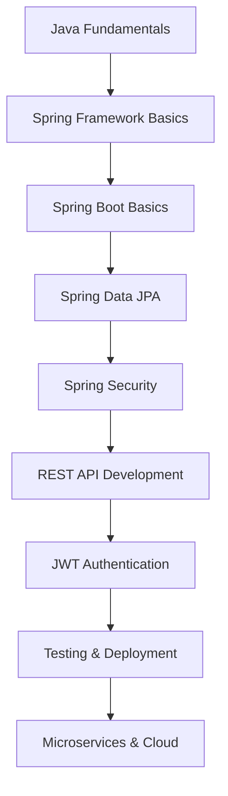

# Spring Boot REST API với JWT Authentication

## 🚀 Spring Boot là gì và tại sao quan trọng trong 2025?

**Spring Boot** là một framework Java mạnh mẽ được phát triển bởi Pivotal Team để tạo ra các ứng dụng Java enterprise-grade một cách nhanh chóng và dễ dàng. Trong năm 2025, Spring Boot vẫn là framework Java phổ biến nhất với hơn 60% thị phần.

### 🎯 Tại sao Spring Boot quan trọng trong 2025?

- **Industry Standard**: Được sử dụng bởi Netflix, Amazon, Google, Microsoft
- **Job Market**: Hơn 70% job postings Java yêu cầu Spring Boot
- **Microservices**: Perfect cho microservices architecture
- **Cloud Native**: Excellent support cho cloud deployment
- **Developer Productivity**: Auto-configuration, embedded servers
- **Enterprise Ready**: Security, monitoring, testing built-in

### 📚 Roadmap học Spring Boot cho người mới



**Lưu ý**: Bài viết này tập trung vào **Intermediate Level** (cấp độ 6-8). Bạn cần có kiến thức cơ bản về Java và Spring Framework.

## 🎯 Mục tiêu bài viết

Sau khi đọc xong bài viết này, bạn sẽ biết cách:
- **Tạo Spring Boot project** với Maven - modern Java development
- **Cấu hình JWT Authentication** - secure API authentication
- **Xây dựng REST API endpoints** - modern web services
- **Implement User Registration và Login** - complete auth flow
- **Bảo vệ endpoints với JWT tokens** - secure API access
- **Test API với Postman** - API testing best practices
- **Deploy ứng dụng** - production-ready deployment

### 👥 Ai nên đọc bài viết này?

- ✅ **Sinh viên IT**: Có kiến thức Java cơ bản, muốn học Spring Boot
- ✅ **Junior Developers**: Đã biết Spring Boot cơ bản, muốn nâng cao kỹ năng
- ✅ **Career Changers**: Chuyển đổi sang Java Backend development
- ✅ **Frontend Developers**: Muốn học Backend với Spring Boot
- ✅ **Experienced Developers**: Muốn cập nhật kiến thức Spring Boot hiện đại

### 🎯 Khi nào sử dụng Spring Boot?

**Spring Boot** rất phù hợp khi bạn cần:
- **REST APIs**: Web services, mobile backends
- **Microservices**: Distributed systems, cloud-native apps
- **Enterprise Applications**: Large-scale, complex business logic
- **Rapid Prototyping**: Quick development và deployment
- **Cloud Applications**: AWS, Azure, Google Cloud deployment

**Ví dụ thực tế**: E-commerce APIs, banking systems, social media backends, IoT platforms

## 🏗️ Project Setup

### Tạo Spring Boot Project

```xml
<!-- pom.xml -->
<?xml version="1.0" encoding="UTF-8"?>
<project xmlns="http://maven.apache.org/POM/4.0.0"
         xmlns:xsi="http://www.w3.org/2001/XMLSchema-instance"
         xsi:schemaLocation="http://maven.apache.org/POM/4.0.0 
         http://maven.apache.org/xsd/maven-4.0.0.xsd">
    <modelVersion>4.0.0</modelVersion>

    <parent>
        <groupId>org.springframework.boot</groupId>
        <artifactId>spring-boot-starter-parent</artifactId>
        <version>3.2.0</version>
        <relativePath/>
    </parent>

    <groupId>com.devnetinsights</groupId>
    <artifactId>spring-boot-jwt-api</artifactId>
    <version>1.0.0</version>
    <packaging>jar</packaging>

    <properties>
        <java.version>17</java.version>
    </properties>

    <dependencies>
        <!-- Spring Boot Starters -->
        <dependency>
            <groupId>org.springframework.boot</groupId>
            <artifactId>spring-boot-starter-web</artifactId>
        </dependency>
        
        <dependency>
            <groupId>org.springframework.boot</groupId>
            <artifactId>spring-boot-starter-security</artifactId>
        </dependency>
        
        <dependency>
            <groupId>org.springframework.boot</groupId>
            <artifactId>spring-boot-starter-data-jpa</artifactId>
        </dependency>
        
        <dependency>
            <groupId>org.springframework.boot</groupId>
            <artifactId>spring-boot-starter-validation</artifactId>
        </dependency>

        <!-- JWT -->
        <dependency>
            <groupId>io.jsonwebtoken</groupId>
            <artifactId>jjwt-api</artifactId>
            <version>0.11.5</version>
        </dependency>
        <dependency>
            <groupId>io.jsonwebtoken</groupId>
            <artifactId>jjwt-impl</artifactId>
            <version>0.11.5</version>
            <scope>runtime</scope>
        </dependency>
        <dependency>
            <groupId>io.jsonwebtoken</groupId>
            <artifactId>jjwt-jackson</artifactId>
            <version>0.11.5</version>
            <scope>runtime</scope>
        </dependency>

        <!-- Database -->
        <dependency>
            <groupId>com.h2database</groupId>
            <artifactId>h2</artifactId>
            <scope>runtime</scope>
        </dependency>

        <!-- Testing -->
        <dependency>
            <groupId>org.springframework.boot</groupId>
            <artifactId>spring-boot-starter-test</artifactId>
            <scope>test</scope>
        </dependency>
        
        <dependency>
            <groupId>org.springframework.security</groupId>
            <artifactId>spring-security-test</artifactId>
            <scope>test</scope>
        </dependency>
    </dependencies>

    <build>
        <plugins>
            <plugin>
                <groupId>org.springframework.boot</groupId>
                <artifactId>spring-boot-maven-plugin</artifactId>
            </plugin>
        </plugins>
    </build>
</project>
```

### Cấu hình Application Properties

```properties
# application.properties
server.port=8080

# Database Configuration
spring.datasource.url=jdbc:h2:mem:testdb
spring.datasource.driverClassName=org.h2.Driver
spring.datasource.username=sa
spring.datasource.password=password

# JPA Configuration
spring.jpa.database-platform=org.hibernate.dialect.H2Dialect
spring.jpa.hibernate.ddl-auto=create-drop
spring.jpa.show-sql=true

# H2 Console
spring.h2.console.enabled=true
spring.h2.console.path=/h2-console

# JWT Configuration
jwt.secret=mySecretKey
jwt.expiration=86400000

# Logging
logging.level.com.devnetinsights=DEBUG
logging.level.org.springframework.security=DEBUG
```

## 🔐 JWT Configuration

### 🎯 JWT là gì?

**JWT (JSON Web Token)** là một chuẩn mở (RFC 7519) để truyền thông tin an toàn giữa các parties dưới dạng JSON object. JWT được sử dụng rộng rãi cho authentication và authorization trong web applications.

**Tại sao sử dụng JWT?**
- **Stateless**: Không cần lưu trữ session trên server
- **Scalable**: Dễ dàng scale horizontal
- **Secure**: Được ký số và có thể mã hóa
- **Cross-domain**: Có thể sử dụng across different domains
- **Self-contained**: Chứa tất cả thông tin cần thiết

**Cấu trúc JWT:**
```
Header.Payload.Signature
```

**Khi nào sử dụng JWT?**
- ✅ API Authentication
- ✅ Single Sign-On (SSO)
- ✅ Microservices communication
- ✅ Mobile app authentication
- ❌ Sensitive data storage (use encryption)
- ❌ Large payloads (size limit)

### JWT Utility Class

```java
// src/main/java/com/devnetinsights/config/JwtUtil.java
package com.devnetinsights.config;

import io.jsonwebtoken.*;
import io.jsonwebtoken.security.Keys;
import org.springframework.beans.factory.annotation.Value;
import org.springframework.security.core.userdetails.UserDetails;
import org.springframework.stereotype.Component;

import javax.crypto.SecretKey;
import java.util.Date;
import java.util.HashMap;
import java.util.Map;
import java.util.function.Function;

@Component
public class JwtUtil {

    @Value("${jwt.secret}")
    private String secret;

    @Value("${jwt.expiration}")
    private Long expiration;

    private SecretKey getSigningKey() {
        return Keys.hmacShaKeyFor(secret.getBytes());
    }

    public String extractUsername(String token) {
        return extractClaim(token, Claims::getSubject);
    }

    public Date extractExpiration(String token) {
        return extractClaim(token, Claims::getExpiration);
    }

    public <T> T extractClaim(String token, Function<Claims, T> claimsResolver) {
        final Claims claims = extractAllClaims(token);
        return claimsResolver.apply(claims);
    }

    private Claims extractAllClaims(String token) {
        return Jwts.parserBuilder()
                .setSigningKey(getSigningKey())
                .build()
                .parseClaimsJws(token)
                .getBody();
    }

    private Boolean isTokenExpired(String token) {
        return extractExpiration(token).before(new Date());
    }

    public String generateToken(UserDetails userDetails) {
        Map<String, Object> claims = new HashMap<>();
        return createToken(claims, userDetails.getUsername());
    }

    private String createToken(Map<String, Object> claims, String subject) {
        return Jwts.builder()
                .setClaims(claims)
                .setSubject(subject)
                .setIssuedAt(new Date(System.currentTimeMillis()))
                .setExpiration(new Date(System.currentTimeMillis() + expiration))
                .signWith(getSigningKey(), SignatureAlgorithm.HS256)
                .compact();
    }

    public Boolean validateToken(String token, UserDetails userDetails) {
        final String username = extractUsername(token);
        return (username.equals(userDetails.getUsername()) && !isTokenExpired(token));
    }
}
```

### JWT Authentication Filter

```java
// src/main/java/com/devnetinsights/security/JwtAuthenticationFilter.java
package com.devnetinsights.security;

import com.devnetinsights.config.JwtUtil;
import com.devnetinsights.service.UserDetailsServiceImpl;
import jakarta.servlet.FilterChain;
import jakarta.servlet.ServletException;
import jakarta.servlet.http.HttpServletRequest;
import jakarta.servlet.http.HttpServletResponse;
import org.springframework.beans.factory.annotation.Autowired;
import org.springframework.security.authentication.UsernamePasswordAuthenticationToken;
import org.springframework.security.core.context.SecurityContextHolder;
import org.springframework.security.core.userdetails.UserDetails;
import org.springframework.security.web.authentication.WebAuthenticationDetailsSource;
import org.springframework.stereotype.Component;
import org.springframework.web.filter.OncePerRequestFilter;

import java.io.IOException;

@Component
public class JwtAuthenticationFilter extends OncePerRequestFilter {

    @Autowired
    private UserDetailsServiceImpl userDetailsService;

    @Autowired
    private JwtUtil jwtUtil;

    @Override
    protected void doFilterInternal(HttpServletRequest request, 
                                  HttpServletResponse response, 
                                  FilterChain filterChain) throws ServletException, IOException {
        
        final String authorizationHeader = request.getHeader("Authorization");

        String username = null;
        String jwt = null;

        if (authorizationHeader != null && authorizationHeader.startsWith("Bearer ")) {
            jwt = authorizationHeader.substring(7);
            try {
                username = jwtUtil.extractUsername(jwt);
            } catch (Exception e) {
                logger.error("JWT token is invalid: " + e.getMessage());
            }
        }

        if (username != null && SecurityContextHolder.getContext().getAuthentication() == null) {
            UserDetails userDetails = this.userDetailsService.loadUserByUsername(username);
            
            if (jwtUtil.validateToken(jwt, userDetails)) {
                UsernamePasswordAuthenticationToken authToken = 
                    new UsernamePasswordAuthenticationToken(userDetails, null, userDetails.getAuthorities());
                authToken.setDetails(new WebAuthenticationDetailsSource().buildDetails(request));
                SecurityContextHolder.getContext().setAuthentication(authToken);
            }
        }
        
        filterChain.doFilter(request, response);
    }
}
```

## 👤 User Entity và Repository

### User Entity

```java
// src/main/java/com/devnetinsights/entity/User.java
package com.devnetinsights.entity;

import jakarta.persistence.*;
import jakarta.validation.constraints.Email;
import jakarta.validation.constraints.NotBlank;
import jakarta.validation.constraints.Size;
import org.springframework.security.core.GrantedAuthority;
import org.springframework.security.core.authority.SimpleGrantedAuthority;
import org.springframework.security.core.userdetails.UserDetails;

import java.util.Collection;
import java.util.Collections;
import java.util.Date;

@Entity
@Table(name = "users")
public class User implements UserDetails {
    
    @Id
    @GeneratedValue(strategy = GenerationType.IDENTITY)
    private Long id;

    @NotBlank
    @Size(max = 50)
    @Column(unique = true)
    private String username;

    @NotBlank
    @Size(max = 100)
    @Email
    @Column(unique = true)
    private String email;

    @NotBlank
    @Size(max = 120)
    private String password;

    @Column(name = "created_at")
    private Date createdAt;

    @Column(name = "updated_at")
    private Date updatedAt;

    @PrePersist
    protected void onCreate() {
        createdAt = new Date();
        updatedAt = new Date();
    }

    @PreUpdate
    protected void onUpdate() {
        updatedAt = new Date();
    }

    // Constructors
    public User() {}

    public User(String username, String email, String password) {
        this.username = username;
        this.email = email;
        this.password = password;
    }

    // Getters and Setters
    public Long getId() { return id; }
    public void setId(Long id) { this.id = id; }

    public String getUsername() { return username; }
    public void setUsername(String username) { this.username = username; }

    public String getEmail() { return email; }
    public void setEmail(String email) { this.email = email; }

    public String getPassword() { return password; }
    public void setPassword(String password) { this.password = password; }

    public Date getCreatedAt() { return createdAt; }
    public void setCreatedAt(Date createdAt) { this.createdAt = createdAt; }

    public Date getUpdatedAt() { return updatedAt; }
    public void setUpdatedAt(Date updatedAt) { this.updatedAt = updatedAt; }

    // UserDetails implementation
    @Override
    public Collection<? extends GrantedAuthority> getAuthorities() {
        return Collections.singletonList(new SimpleGrantedAuthority("ROLE_USER"));
    }

    @Override
    public boolean isAccountNonExpired() { return true; }

    @Override
    public boolean isAccountNonLocked() { return true; }

    @Override
    public boolean isCredentialsNonExpired() { return true; }

    @Override
    public boolean isEnabled() { return true; }
}
```

### User Repository

```java
// src/main/java/com/devnetinsights/repository/UserRepository.java
package com.devnetinsights.repository;

import com.devnetinsights.entity.User;
import org.springframework.data.jpa.repository.JpaRepository;
import org.springframework.stereotype.Repository;

import java.util.Optional;

@Repository
public interface UserRepository extends JpaRepository<User, Long> {
    Optional<User> findByUsername(String username);
    Optional<User> findByEmail(String email);
    Boolean existsByUsername(String username);
    Boolean existsByEmail(String email);
}
```

## 🔧 Service Layer

### User Service

```java
// src/main/java/com/devnetinsights/service/UserService.java
package com.devnetinsights.service;

import com.devnetinsights.entity.User;
import com.devnetinsights.repository.UserRepository;
import org.springframework.beans.factory.annotation.Autowired;
import org.springframework.security.crypto.password.PasswordEncoder;
import org.springframework.stereotype.Service;

import java.util.List;
import java.util.Optional;

@Service
public class UserService {

    @Autowired
    private UserRepository userRepository;

    @Autowired
    private PasswordEncoder passwordEncoder;

    public User createUser(User user) {
        user.setPassword(passwordEncoder.encode(user.getPassword()));
        return userRepository.save(user);
    }

    public Optional<User> findByUsername(String username) {
        return userRepository.findByUsername(username);
    }

    public Optional<User> findByEmail(String email) {
        return userRepository.findByEmail(email);
    }

    public Boolean existsByUsername(String username) {
        return userRepository.existsByUsername(username);
    }

    public Boolean existsByEmail(String email) {
        return userRepository.existsByEmail(email);
    }

    public List<User> findAll() {
        return userRepository.findAll();
    }

    public Optional<User> findById(Long id) {
        return userRepository.findById(id);
    }

    public User updateUser(User user) {
        return userRepository.save(user);
    }

    public void deleteUser(Long id) {
        userRepository.deleteById(id);
    }
}
```

### User Details Service

```java
// src/main/java/com/devnetinsights/service/UserDetailsServiceImpl.java
package com.devnetinsights.service;

import com.devnetinsights.entity.User;
import com.devnetinsights.repository.UserRepository;
import org.springframework.beans.factory.annotation.Autowired;
import org.springframework.security.core.userdetails.UserDetails;
import org.springframework.security.core.userdetails.UserDetailsService;
import org.springframework.security.core.userdetails.UsernameNotFoundException;
import org.springframework.stereotype.Service;
import org.springframework.transaction.annotation.Transactional;

@Service
public class UserDetailsServiceImpl implements UserDetailsService {

    @Autowired
    private UserRepository userRepository;

    @Override
    @Transactional
    public UserDetails loadUserByUsername(String username) throws UsernameNotFoundException {
        User user = userRepository.findByUsername(username)
                .orElseThrow(() -> new UsernameNotFoundException("User Not Found with username: " + username));

        return user;
    }
}
```

## 🎯 Controller Layer

### Auth Controller

```java
// src/main/java/com/devnetinsights/controller/AuthController.java
package com.devnetinsights.controller;

import com.devnetinsights.config.JwtUtil;
import com.devnetinsights.dto.LoginRequest;
import com.devnetinsights.dto.LoginResponse;
import com.devnetinsights.dto.RegisterRequest;
import com.devnetinsights.dto.RegisterResponse;
import com.devnetinsights.entity.User;
import com.devnetinsights.service.UserService;
import jakarta.validation.Valid;
import org.springframework.beans.factory.annotation.Autowired;
import org.springframework.http.ResponseEntity;
import org.springframework.security.authentication.AuthenticationManager;
import org.springframework.security.authentication.UsernamePasswordAuthenticationToken;
import org.springframework.security.core.Authentication;
import org.springframework.security.core.context.SecurityContextHolder;
import org.springframework.web.bind.annotation.*;

@RestController
@RequestMapping("/api/auth")
@CrossOrigin(origins = "*", maxAge = 3600)
public class AuthController {

    @Autowired
    private AuthenticationManager authenticationManager;

    @Autowired
    private UserService userService;

    @Autowired
    private JwtUtil jwtUtil;

    @PostMapping("/register")
    public ResponseEntity<?> register(@Valid @RequestBody RegisterRequest registerRequest) {
        if (userService.existsByUsername(registerRequest.getUsername())) {
            return ResponseEntity.badRequest()
                    .body(new RegisterResponse("Error: Username is already taken!"));
        }

        if (userService.existsByEmail(registerRequest.getEmail())) {
            return ResponseEntity.badRequest()
                    .body(new RegisterResponse("Error: Email is already in use!"));
        }

        User user = new User(registerRequest.getUsername(), 
                           registerRequest.getEmail(), 
                           registerRequest.getPassword());

        userService.createUser(user);

        return ResponseEntity.ok(new RegisterResponse("User registered successfully!"));
    }

    @PostMapping("/login")
    public ResponseEntity<?> login(@Valid @RequestBody LoginRequest loginRequest) {
        Authentication authentication = authenticationManager.authenticate(
                new UsernamePasswordAuthenticationToken(loginRequest.getUsername(), 
                                                     loginRequest.getPassword()));

        SecurityContextHolder.getContext().setAuthentication(authentication);
        String jwt = jwtUtil.generateToken((org.springframework.security.core.userdetails.UserDetails) authentication.getPrincipal());

        return ResponseEntity.ok(new LoginResponse(jwt, "Bearer"));
    }
}
```

### User Controller

```java
// src/main/java/com/devnetinsights/controller/UserController.java
package com.devnetinsights.controller;

import com.devnetinsights.entity.User;
import com.devnetinsights.service.UserService;
import org.springframework.beans.factory.annotation.Autowired;
import org.springframework.http.ResponseEntity;
import org.springframework.security.access.prepost.PreAuthorize;
import org.springframework.web.bind.annotation.*;

import java.util.List;
import java.util.Optional;

@RestController
@RequestMapping("/api/users")
@CrossOrigin(origins = "*", maxAge = 3600)
public class UserController {

    @Autowired
    private UserService userService;

    @GetMapping
    @PreAuthorize("hasRole('USER')")
    public ResponseEntity<List<User>> getAllUsers() {
        List<User> users = userService.findAll();
        return ResponseEntity.ok(users);
    }

    @GetMapping("/{id}")
    @PreAuthorize("hasRole('USER')")
    public ResponseEntity<?> getUserById(@PathVariable Long id) {
        Optional<User> user = userService.findById(id);
        if (user.isPresent()) {
            return ResponseEntity.ok(user.get());
        } else {
            return ResponseEntity.notFound().build();
        }
    }

    @PutMapping("/{id}")
    @PreAuthorize("hasRole('USER')")
    public ResponseEntity<?> updateUser(@PathVariable Long id, @RequestBody User userDetails) {
        Optional<User> user = userService.findById(id);
        if (user.isPresent()) {
            User existingUser = user.get();
            existingUser.setEmail(userDetails.getEmail());
            existingUser.setUsername(userDetails.getUsername());
            
            User updatedUser = userService.updateUser(existingUser);
            return ResponseEntity.ok(updatedUser);
        } else {
            return ResponseEntity.notFound().build();
        }
    }

    @DeleteMapping("/{id}")
    @PreAuthorize("hasRole('USER')")
    public ResponseEntity<?> deleteUser(@PathVariable Long id) {
        Optional<User> user = userService.findById(id);
        if (user.isPresent()) {
            userService.deleteUser(id);
            return ResponseEntity.ok().build();
        } else {
            return ResponseEntity.notFound().build();
        }
    }
}
```

## 📝 DTOs

### Request DTOs

```java
// src/main/java/com/devnetinsights/dto/RegisterRequest.java
package com.devnetinsights.dto;

import jakarta.validation.constraints.Email;
import jakarta.validation.constraints.NotBlank;
import jakarta.validation.constraints.Size;

public class RegisterRequest {
    @NotBlank
    @Size(min = 3, max = 50)
    private String username;

    @NotBlank
    @Size(max = 100)
    @Email
    private String email;

    @NotBlank
    @Size(min = 6, max = 40)
    private String password;

    // Constructors
    public RegisterRequest() {}

    public RegisterRequest(String username, String email, String password) {
        this.username = username;
        this.email = email;
        this.password = password;
    }

    // Getters and Setters
    public String getUsername() { return username; }
    public void setUsername(String username) { this.username = username; }

    public String getEmail() { return email; }
    public void setEmail(String email) { this.email = email; }

    public String getPassword() { return password; }
    public void setPassword(String password) { this.password = password; }
}
```

```java
// src/main/java/com/devnetinsights/dto/LoginRequest.java
package com.devnetinsights.dto;

import jakarta.validation.constraints.NotBlank;

public class LoginRequest {
    @NotBlank
    private String username;

    @NotBlank
    private String password;

    // Constructors
    public LoginRequest() {}

    public LoginRequest(String username, String password) {
        this.username = username;
        this.password = password;
    }

    // Getters and Setters
    public String getUsername() { return username; }
    public void setUsername(String username) { this.username = username; }

    public String getPassword() { return password; }
    public void setPassword(String password) { this.password = password; }
}
```

### Response DTOs

```java
// src/main/java/com/devnetinsights/dto/RegisterResponse.java
package com.devnetinsights.dto;

public class RegisterResponse {
    private String message;

    public RegisterResponse(String message) {
        this.message = message;
    }

    public String getMessage() { return message; }
    public void setMessage(String message) { this.message = message; }
}
```

```java
// src/main/java/com/devnetinsights/dto/LoginResponse.java
package com.devnetinsights.dto;

public class LoginResponse {
    private String accessToken;
    private String tokenType;

    public LoginResponse(String accessToken, String tokenType) {
        this.accessToken = accessToken;
        this.tokenType = tokenType;
    }

    public String getAccessToken() { return accessToken; }
    public void setAccessToken(String accessToken) { this.accessToken = accessToken; }

    public String getTokenType() { return tokenType; }
    public void setTokenType(String tokenType) { this.tokenType = tokenType; }
}
```

## 🔒 Security Configuration

### 🎯 Spring Security là gì?

**Spring Security** là một framework mạnh mẽ và có thể tùy chỉnh cao cho authentication và authorization trong Spring applications. Nó cung cấp comprehensive security services cho Java applications.

**Tại sao sử dụng Spring Security?**
- **Comprehensive**: Authentication, authorization, protection against attacks
- **Flexible**: Highly configurable và extensible
- **Enterprise-grade**: Used by major companies worldwide
- **Integration**: Seamless integration với Spring ecosystem
- **Standards**: Supports industry standards (OAuth2, JWT, SAML)

**Key Concepts:**
- **Authentication**: Xác định user là ai
- **Authorization**: Xác định user có quyền gì
- **Principal**: Currently authenticated user
- **GrantedAuthority**: Permission được cấp cho user
- **SecurityContext**: Chứa authentication information

**Khi nào sử dụng Spring Security?**
- ✅ Web applications cần authentication
- ✅ REST APIs cần protection
- ✅ Enterprise applications
- ✅ Applications với multiple user roles
- ❌ Simple applications không cần security

```java
// src/main/java/com/devnetinsights/config/SecurityConfig.java
package com.devnetinsights.config;

import com.devnetinsights.security.JwtAuthenticationFilter;
import com.devnetinsights.service.UserDetailsServiceImpl;
import org.springframework.beans.factory.annotation.Autowired;
import org.springframework.context.annotation.Bean;
import org.springframework.context.annotation.Configuration;
import org.springframework.security.authentication.AuthenticationManager;
import org.springframework.security.config.annotation.authentication.configuration.AuthenticationConfiguration;
import org.springframework.security.config.annotation.method.configuration.EnableMethodSecurity;
import org.springframework.security.config.annotation.web.builders.HttpSecurity;
import org.springframework.security.config.annotation.web.configuration.EnableWebSecurity;
import org.springframework.security.config.http.SessionCreationPolicy;
import org.springframework.security.crypto.bcrypt.BCryptPasswordEncoder;
import org.springframework.security.crypto.password.PasswordEncoder;
import org.springframework.security.web.SecurityFilterChain;
import org.springframework.security.web.authentication.UsernamePasswordAuthenticationFilter;

@Configuration
@EnableWebSecurity
@EnableMethodSecurity(prePostEnabled = true)
public class SecurityConfig {

    @Autowired
    private UserDetailsServiceImpl userDetailsService;

    @Autowired
    private JwtAuthenticationFilter jwtAuthenticationFilter;

    @Bean
    public PasswordEncoder passwordEncoder() {
        return new BCryptPasswordEncoder();
    }

    @Bean
    public AuthenticationManager authenticationManager(AuthenticationConfiguration authConfig) throws Exception {
        return authConfig.getAuthenticationManager();
    }

    @Bean
    public SecurityFilterChain filterChain(HttpSecurity http) throws Exception {
        http.cors().and().csrf().disable()
            .sessionManagement().sessionCreationPolicy(SessionCreationPolicy.STATELESS).and()
            .authorizeHttpRequests(authz -> authz
                .requestMatchers("/api/auth/**").permitAll()
                .requestMatchers("/h2-console/**").permitAll()
                .anyRequest().authenticated()
            );

        http.addFilterBefore(jwtAuthenticationFilter, UsernamePasswordAuthenticationFilter.class);
        http.headers().frameOptions().disable();

        return http.build();
    }
}
```

## 🏋️ Bài tập thực hành

### Bài tập 1: Tạo Product Entity và API
Tạo một Product entity với CRUD operations và JWT protection.

```java
// TODO: Implement Product entity
@Entity
@Table(name = "products")
public class Product {
    // Your code here
    // Fields: id, name, description, price, category, createdAt, updatedAt
}

// TODO: Implement ProductRepository
@Repository
public interface ProductRepository extends JpaRepository<Product, Long> {
    // Your code here
    // Methods: findByCategory, findByNameContaining
}

// TODO: Implement ProductService
@Service
public class ProductService {
    // Your code here
    // Methods: createProduct, findAll, findByCategory, updateProduct, deleteProduct
}

// TODO: Implement ProductController
@RestController
@RequestMapping("/api/products")
public class ProductController {
    // Your code here
    // Endpoints: GET /api/products, POST /api/products, PUT /api/products/{id}, DELETE /api/products/{id}
}
```

### Bài tập 2: Implement Role-based Authorization
Thêm role-based authorization với ADMIN và USER roles.

```java
// TODO: Add Role enum
public enum Role {
    USER, ADMIN
}

// TODO: Update User entity to support roles
@Entity
public class User implements UserDetails {
    // Your code here
    // Add: @Enumerated(EnumType.STRING) private Role role;
    // Update: getAuthorities() method
}

// TODO: Create AdminController with admin-only endpoints
@RestController
@RequestMapping("/api/admin")
@PreAuthorize("hasRole('ADMIN')")
public class AdminController {
    // Your code here
    // Endpoints: GET /api/admin/users, DELETE /api/admin/users/{id}
}
```

### Bài tập 3: Implement Refresh Token
Thêm refresh token mechanism để extend session.

```java
// TODO: Create RefreshToken entity
@Entity
@Table(name = "refresh_tokens")
public class RefreshToken {
    // Your code here
    // Fields: id, token, user, expiryDate
}

// TODO: Implement RefreshTokenService
@Service
public class RefreshTokenService {
    // Your code here
    // Methods: createRefreshToken, validateRefreshToken, deleteRefreshToken
}

// TODO: Update AuthController with refresh token endpoints
@PostMapping("/refresh")
public ResponseEntity<?> refreshToken(@RequestBody RefreshTokenRequest request) {
    // Your code here
}
```

### Bài tập 4: Add API Rate Limiting
Implement rate limiting để protect API từ abuse.

```java
// TODO: Add rate limiting dependency to pom.xml
<dependency>
    <groupId>com.github.vladimir-bukhtoyarov</groupId>
    <artifactId>bucket4j-core</artifactId>
    <version>7.6.0</version>
</dependency>

// TODO: Create RateLimitingFilter
@Component
public class RateLimitingFilter implements Filter {
    // Your code here
    // Implement: rate limiting logic
}

// TODO: Configure rate limiting in SecurityConfig
@Bean
public FilterRegistrationBean<RateLimitingFilter> rateLimitingFilter() {
    // Your code here
}
```

### 🎯 Gợi ý giải bài tập

<details>
<summary>Click để xem gợi ý</summary>

**Bài tập 1 - Product Entity:**
```java
@Entity
@Table(name = "products")
public class Product {
    @Id
    @GeneratedValue(strategy = GenerationType.IDENTITY)
    private Long id;
    
    @NotBlank
    @Size(max = 100)
    private String name;
    
    @Size(max = 500)
    private String description;
    
    @NotNull
    @DecimalMin(value = "0.0")
    private BigDecimal price;
    
    @NotBlank
    @Size(max = 50)
    private String category;
    
    @Column(name = "created_at")
    private Date createdAt;
    
    @Column(name = "updated_at")
    private Date updatedAt;
    
    // Constructors, getters, setters, @PrePersist, @PreUpdate
}
```

**Bài tập 2 - Role-based Authorization:**
```java
@Entity
public class User implements UserDetails {
    @Enumerated(EnumType.STRING)
    private Role role;
    
    @Override
    public Collection<? extends GrantedAuthority> getAuthorities() {
        return Collections.singletonList(new SimpleGrantedAuthority("ROLE_" + role.name()));
    }
}
```

**Bài tập 3 - Refresh Token:**
```java
@Entity
@Table(name = "refresh_tokens")
public class RefreshToken {
    @Id
    @GeneratedValue(strategy = GenerationType.IDENTITY)
    private Long id;
    
    @NotBlank
    private String token;
    
    @OneToOne
    @JoinColumn(name = "user_id")
    private User user;
    
    @Column(name = "expiry_date")
    private Date expiryDate;
}
```

**Bài tập 4 - Rate Limiting:**
```java
@Component
public class RateLimitingFilter implements Filter {
    private final Map<String, Bucket> buckets = new ConcurrentHashMap<>();
    
    @Override
    public void doFilter(ServletRequest request, ServletResponse response, FilterChain chain) {
        String clientId = getClientId((HttpServletRequest) request);
        Bucket bucket = buckets.computeIfAbsent(clientId, k -> createBucket());
        
        if (bucket.tryConsume(1)) {
            chain.doFilter(request, response);
        } else {
            ((HttpServletResponse) response).setStatus(429);
        }
    }
}
```

</details>

## 🚨 Troubleshooting và Common Mistakes

### Common Spring Boot Mistakes

1. **Missing @Entity annotation**
```java
// ❌ Wrong - missing @Entity
public class User {
    @Id
    private Long id;
}

// ✅ Correct
@Entity
public class User {
    @Id
    private Long id;
}
```

2. **Incorrect JWT Secret Configuration**
```java
// ❌ Wrong - weak secret
@Value("${jwt.secret}")
private String secret = "mySecretKey";

// ✅ Correct - strong secret from properties
@Value("${jwt.secret}")
private String secret;
```

3. **Missing @Transactional annotation**
```java
// ❌ Wrong - missing @Transactional
public UserDetails loadUserByUsername(String username) {
    User user = userRepository.findByUsername(username)
        .orElseThrow(() -> new UsernameNotFoundException("User not found"));
    return user;
}

// ✅ Correct - with @Transactional
@Transactional
public UserDetails loadUserByUsername(String username) {
    User user = userRepository.findByUsername(username)
        .orElseThrow(() -> new UsernameNotFoundException("User not found"));
    return user;
}
```

### Common JWT Mistakes

1. **Not validating token expiration**
```java
// ❌ Wrong - not checking expiration
public Boolean validateToken(String token, UserDetails userDetails) {
    final String username = extractUsername(token);
    return username.equals(userDetails.getUsername());
}

// ✅ Correct - with expiration check
public Boolean validateToken(String token, UserDetails userDetails) {
    final String username = extractUsername(token);
    return (username.equals(userDetails.getUsername()) && !isTokenExpired(token));
}
```

2. **Storing sensitive data in JWT**
```java
// ❌ Wrong - storing sensitive data
Map<String, Object> claims = new HashMap<>();
claims.put("password", user.getPassword());
claims.put("creditCard", user.getCreditCard());

// ✅ Correct - only non-sensitive data
Map<String, Object> claims = new HashMap<>();
claims.put("userId", user.getId());
claims.put("role", user.getRole());
```

### Common Spring Security Mistakes

1. **Wrong Security Configuration**
```java
// ❌ Wrong - allowing all requests
.authorizeHttpRequests(authz -> authz
    .anyRequest().permitAll()
);

// ✅ Correct - proper authorization
.authorizeHttpRequests(authz -> authz
    .requestMatchers("/api/auth/**").permitAll()
    .anyRequest().authenticated()
);
```

2. **Missing CORS Configuration**
```java
// ❌ Wrong - no CORS configuration
@RestController
public class UserController {
    // endpoints
}

// ✅ Correct - with CORS
@RestController
@CrossOrigin(origins = "*", maxAge = 3600)
public class UserController {
    // endpoints
}
```

### Common REST API Mistakes

1. **Inconsistent Response Format**
```java
// ❌ Wrong - inconsistent responses
@GetMapping("/{id}")
public User getUser(@PathVariable Long id) {
    return userService.findById(id).orElse(null);
}

// ✅ Correct - consistent ResponseEntity
@GetMapping("/{id}")
public ResponseEntity<?> getUser(@PathVariable Long id) {
    Optional<User> user = userService.findById(id);
    if (user.isPresent()) {
        return ResponseEntity.ok(user.get());
    } else {
        return ResponseEntity.notFound().build();
    }
}
```

2. **Missing Input Validation**
```java
// ❌ Wrong - no validation
@PostMapping("/register")
public ResponseEntity<?> register(@RequestBody RegisterRequest request) {
    // process request
}

// ✅ Correct - with validation
@PostMapping("/register")
public ResponseEntity<?> register(@Valid @RequestBody RegisterRequest request) {
    // process request
}
```

## 🧪 Testing

### Unit Tests

```java
// src/test/java/com/devnetinsights/controller/AuthControllerTest.java
package com.devnetinsights.controller;

import com.devnetinsights.config.JwtUtil;
import com.devnetinsights.dto.LoginRequest;
import com.devnetinsights.dto.RegisterRequest;
import com.devnetinsights.service.UserService;
import com.fasterxml.jackson.databind.ObjectMapper;
import org.junit.jupiter.api.Test;
import org.springframework.beans.factory.annotation.Autowired;
import org.springframework.boot.test.autoconfigure.web.servlet.WebMvcTest;
import org.springframework.boot.test.mock.mockito.MockBean;
import org.springframework.http.MediaType;
import org.springframework.security.authentication.AuthenticationManager;
import org.springframework.security.test.context.support.WithMockUser;
import org.springframework.test.web.servlet.MockMvc;

import static org.mockito.ArgumentMatchers.any;
import static org.mockito.Mockito.when;
import static org.springframework.test.web.servlet.request.MockMvcRequestBuilders.post;
import static org.springframework.test.web.servlet.result.MockMvcResultMatchers.*;

@WebMvcTest(AuthController.class)
class AuthControllerTest {

    @Autowired
    private MockMvc mockMvc;

    @MockBean
    private UserService userService;

    @MockBean
    private AuthenticationManager authenticationManager;

    @MockBean
    private JwtUtil jwtUtil;

    @Autowired
    private ObjectMapper objectMapper;

    @Test
    void testRegister() throws Exception {
        RegisterRequest registerRequest = new RegisterRequest("testuser", "test@example.com", "password123");
        
        when(userService.existsByUsername("testuser")).thenReturn(false);
        when(userService.existsByEmail("test@example.com")).thenReturn(false);
        when(userService.createUser(any())).thenReturn(new com.devnetinsights.entity.User());

        mockMvc.perform(post("/api/auth/register")
                .contentType(MediaType.APPLICATION_JSON)
                .content(objectMapper.writeValueAsString(registerRequest)))
                .andExpect(status().isOk())
                .andExpect(jsonPath("$.message").value("User registered successfully!"));
    }

    @Test
    void testLogin() throws Exception {
        LoginRequest loginRequest = new LoginRequest("testuser", "password123");
        
        when(jwtUtil.generateToken(any())).thenReturn("jwt-token");

        mockMvc.perform(post("/api/auth/login")
                .contentType(MediaType.APPLICATION_JSON)
                .content(objectMapper.writeValueAsString(loginRequest)))
                .andExpect(status().isOk())
                .andExpect(jsonPath("$.accessToken").value("jwt-token"))
                .andExpect(jsonPath("$.tokenType").value("Bearer"));
    }
}
```

## 🚀 Main Application

```java
// src/main/java/com/devnetinsights/SpringBootJwtApplication.java
package com.devnetinsights;

import org.springframework.boot.SpringApplication;
import org.springframework.boot.autoconfigure.SpringBootApplication;

@SpringBootApplication
public class SpringBootJwtApplication {

    public static void main(String[] args) {
        SpringApplication.run(SpringBootJwtApplication.class, args);
    }
}
```

## 📋 API Endpoints

### Authentication Endpoints

| Method | Endpoint | Description | Auth Required |
|--------|----------|-------------|---------------|
| POST | `/api/auth/register` | Register new user | No |
| POST | `/api/auth/login` | Login user | No |

### User Endpoints

| Method | Endpoint | Description | Auth Required |
|--------|----------|-------------|---------------|
| GET | `/api/users` | Get all users | Yes |
| GET | `/api/users/{id}` | Get user by ID | Yes |
| PUT | `/api/users/{id}` | Update user | Yes |
| DELETE | `/api/users/{id}` | Delete user | Yes |

## 🧪 Testing với Postman

### 1. Register User

```json
POST http://localhost:8080/api/auth/register
Content-Type: application/json

{
    "username": "testuser",
    "email": "test@example.com",
    "password": "password123"
}
```

### 2. Login User

```json
POST http://localhost:8080/api/auth/login
Content-Type: application/json

{
    "username": "testuser",
    "password": "password123"
}
```

### 3. Get All Users (with JWT token)

```
GET http://localhost:8080/api/users
Authorization: Bearer YOUR_JWT_TOKEN
```

## 🚀 Deployment

### Docker Configuration

```dockerfile
# Dockerfile
FROM openjdk:17-jdk-slim

WORKDIR /app

COPY target/spring-boot-jwt-api-1.0.0.jar app.jar

EXPOSE 8080

CMD ["java", "-jar", "app.jar"]
```

### Docker Compose

```yaml
# docker-compose.yml
version: '3.8'

services:
  app:
    build: .
    ports:
      - "8080:8080"
    environment:
      - SPRING_PROFILES_ACTIVE=prod
    depends_on:
      - db

  db:
    image: postgres:13
    environment:
      POSTGRES_DB: jwt_db
      POSTGRES_USER: jwt_user
      POSTGRES_PASSWORD: jwt_password
    ports:
      - "5432:5432"
    volumes:
      - postgres_data:/var/lib/postgresql/data

volumes:
  postgres_data:
```

## 📚 Tài liệu tham khảo

- [Spring Boot Documentation](https://spring.io/projects/spring-boot)
- [Spring Security Documentation](https://spring.io/projects/spring-security)
- [JWT.io](https://jwt.io/)
- [Spring Boot JWT Tutorial](https://www.bezkoder.com/spring-boot-jwt-authentication/)

## 🎉 Kết luận

Chúng ta đã xây dựng thành công một REST API hoàn chỉnh với Spring Boot và JWT Authentication:

- ✅ **Project Setup**: Maven configuration và modern dependencies
- ✅ **JWT Configuration**: JWT utility và authentication filter - secure token-based auth
- ✅ **Database Layer**: User entity và repository - data persistence
- ✅ **Service Layer**: Business logic và user details service - clean architecture
- ✅ **Controller Layer**: REST endpoints cho authentication và user management
- ✅ **Security Configuration**: Spring Security với JWT - enterprise-grade security
- ✅ **Testing**: Unit tests và Postman testing - quality assurance
- ✅ **Deployment**: Docker configuration - production-ready

### 🚀 Ứng dụng thực tế trong 2025

Những kỹ năng này là **essential skills** cho:

- **Sinh viên IT**: Nền tảng vững chắc để học Java Backend development
- **Junior Developers**: Core skills cho Spring Boot development jobs
- **Career Changers**: Chuyển đổi sang Java Backend với Spring ecosystem
- **Frontend Developers**: Học Backend với Spring Boot - full-stack capabilities
- **Experienced Developers**: Cập nhật kiến thức Spring Boot hiện đại

### 📈 Next Steps

1. **Thực hành**: Làm các bài tập ở trên
2. **Mở rộng**: Học Spring Cloud, Microservices architecture
3. **Testing**: Học TestContainers, Integration testing
4. **Performance**: Học Caching, Database optimization
5. **Advanced**: Học OAuth2, API Gateway, Service Mesh

### 🎯 Key Takeaways

- **Spring Boot** simplifies Java development - rapid prototyping và production-ready
- **JWT Authentication** provides stateless security - scalable và secure
- **REST API Design** follows industry standards - maintainable và testable
- **Spring Security** offers comprehensive protection - enterprise-grade security
- **Clean Architecture** ensures maintainability - scalable codebase

Trong bài viết tiếp theo, chúng ta sẽ tìm hiểu về **React SPA với Hooks và Routing** để tạo frontend cho API này. Hãy theo dõi để không bỏ lỡ!

---

*Bạn có câu hỏi nào về Spring Boot REST API với JWT không? Hãy để lại comment hoặc liên hệ với mình!* 🚀

**Tags**: #spring-boot #rest-api #jwt #authentication #java #backend #2025 #enterprise-java
