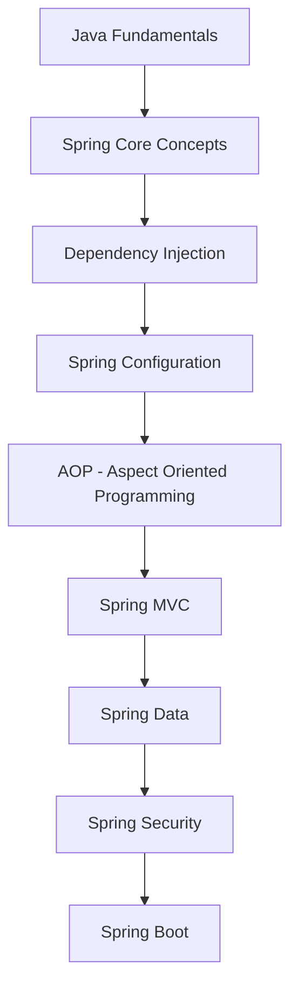

# Spring Framework Overview: Từ Cơ Bản đến Nâng Cao

## 🚀 Spring Framework là gì và tại sao quan trọng trong 2025?

**Spring Framework** là một comprehensive programming và configuration model cho Java applications. Được phát triển bởi Rod Johnson vào năm 2003, Spring đã trở thành de facto standard cho enterprise Java development. Trong năm 2025, Spring vẫn là framework Java phổ biến nhất với hơn 70% thị phần.

### 🎯 Tại sao Spring Framework quan trọng trong 2025?

- **Industry Standard**: Được sử dụng bởi Netflix, Amazon, Google, Microsoft
- **Ecosystem**: Huge ecosystem với Spring Boot, Spring Cloud, Spring Security
- **Enterprise Ready**: Comprehensive solution cho enterprise applications
- **Modern Java**: Excellent support cho Java 17+, records, modules
- **Cloud Native**: Perfect cho microservices và cloud deployment
- **Developer Productivity**: Reduces boilerplate code significantly

### 📚 Roadmap học Spring Framework cho người mới



**Lưu ý**: Bài viết này tập trung vào **Intermediate to Advanced Level** (cấp độ 3-8). Bạn cần có kiến thức cơ bản về Java và OOP.

## 🎯 Mục tiêu bài viết

Sau khi đọc xong bài viết này, bạn sẽ hiểu:
- **Spring Core**: IoC Container, Dependency Injection, Bean lifecycle
- **Spring Configuration**: XML, Java Config, Annotation-based
- **AOP**: Aspect-Oriented Programming, cross-cutting concerns
- **Spring MVC**: Web layer, controllers, view resolution
- **Spring Data**: Data access abstraction, repository pattern
- **Spring Security**: Authentication, authorization, security
- **Testing**: Spring Test framework, mock objects

### 👥 Ai nên đọc bài viết này?

- ✅ **Sinh viên IT**: Có kiến thức Java cơ bản, muốn học Spring
- ✅ **Junior Developers**: Đã biết Spring Boot, muốn hiểu Spring core
- ✅ **Career Changers**: Chuyển đổi sang Java enterprise development
- ✅ **Full-stack Developers**: Muốn hiểu sâu về Spring architecture
- ✅ **Experienced Developers**: Muốn cập nhật kiến thức Spring hiện đại

### 🎯 Khi nào sử dụng Spring Framework?

**Spring Framework** rất phù hợp khi bạn cần:
- **Enterprise Applications**: Large-scale, complex business logic
- **Dependency Injection**: Loose coupling, testable code
- **AOP**: Cross-cutting concerns (logging, security, transactions)
- **Web Applications**: MVC pattern, REST APIs
- **Data Access**: Database integration, transaction management
- **Integration**: Third-party libraries, messaging systems

**Ví dụ thực tế**: Banking systems, e-commerce platforms, CRM systems, content management

## 🏗️ Project Setup

### Maven Dependencies

```xml
<!-- pom.xml -->
<?xml version="1.0" encoding="UTF-8"?>
<project xmlns="http://maven.apache.org/POM/4.0.0"
         xmlns:xsi="http://www.w3.org/2001/XMLSchema-instance"
         xsi:schemaLocation="http://maven.apache.org/POM/4.0.0 
         http://maven.apache.org/xsd/maven-4.0.0.xsd">
    <modelVersion>4.0.0</modelVersion>

    <groupId>com.devnetinsights</groupId>
    <artifactId>spring-framework-tutorial</artifactId>
    <version>1.0.0</version>
    <packaging>jar</packaging>

    <properties>
        <maven.compiler.source>17</maven.compiler.source>
        <maven.compiler.target>17</maven.compiler.target>
        <spring.version>6.1.0</spring.version>
        <project.build.sourceEncoding>UTF-8</project.build.sourceEncoding>
    </properties>

    <dependencies>
        <!-- Spring Core -->
        <dependency>
            <groupId>org.springframework</groupId>
            <artifactId>spring-context</artifactId>
            <version>${spring.version}</version>
        </dependency>
        
        <!-- Spring AOP -->
        <dependency>
            <groupId>org.springframework</groupId>
            <artifactId>spring-aop</artifactId>
            <version>${spring.version}</version>
        </dependency>
        
        <!-- AspectJ -->
        <dependency>
            <groupId>org.aspectj</groupId>
            <artifactId>aspectjweaver</artifactId>
            <version>1.9.20</version>
        </dependency>
        
        <!-- Spring MVC -->
        <dependency>
            <groupId>org.springframework</groupId>
            <artifactId>spring-webmvc</artifactId>
            <version>${spring.version}</version>
        </dependency>
        
        <!-- Spring Data JPA -->
        <dependency>
            <groupId>org.springframework</groupId>
            <artifactId>spring-orm</artifactId>
            <version>${spring.version}</version>
        </dependency>
        
        <!-- Spring Security -->
        <dependency>
            <groupId>org.springframework.security</groupId>
            <artifactId>spring-security-core</artifactId>
            <version>6.2.0</version>
        </dependency>
        
        <!-- Spring Test -->
        <dependency>
            <groupId>org.springframework</groupId>
            <artifactId>spring-test</artifactId>
            <version>${spring.version}</version>
            <scope>test</scope>
        </dependency>
        
        <!-- Hibernate -->
        <dependency>
            <groupId>org.hibernate</groupId>
            <artifactId>hibernate-core</artifactId>
            <version>6.4.0.Final</version>
        </dependency>
        
        <!-- H2 Database -->
        <dependency>
            <groupId>com.h2database</groupId>
            <artifactId>h2</artifactId>
            <version>2.2.224</version>
        </dependency>
        
        <!-- Logging -->
        <dependency>
            <groupId>org.slf4j</groupId>
            <artifactId>slf4j-api</artifactId>
            <version>2.0.9</version>
        </dependency>
        
        <dependency>
            <groupId>ch.qos.logback</groupId>
            <artifactId>logback-classic</artifactId>
            <version>1.4.11</version>
        </dependency>
    </dependencies>

    <build>
        <plugins>
            <plugin>
                <groupId>org.apache.maven.plugins</groupId>
                <artifactId>maven-compiler-plugin</artifactId>
                <version>3.11.0</version>
                <configuration>
                    <source>17</source>
                    <target>17</target>
                </configuration>
            </plugin>
        </plugins>
    </build>
</project>
```

## 🏛️ Spring Core Concepts

### 🎯 Inversion of Control (IoC) là gì?

**Inversion of Control (IoC)** là một design principle trong đó control flow của program được inverted. Thay vì application code calling framework, framework calls application code. Spring implements IoC thông qua **Dependency Injection**.

**Benefits của IoC:**
- **Loose Coupling**: Components không depend trực tiếp vào concrete implementations
- **Testability**: Dễ dàng mock dependencies cho testing
- **Flexibility**: Có thể change implementations mà không modify client code
- **Maintainability**: Code dễ maintain và extend

### Dependency Injection

```java
// src/main/java/com/devnetinsights/service/UserService.java
package com.devnetinsights.service;

import com.devnetinsights.model.User;
import com.devnetinsights.repository.UserRepository;
import org.springframework.beans.factory.annotation.Autowired;
import org.springframework.stereotype.Service;

@Service
public class UserService {
    
    private final UserRepository userRepository;
    private final EmailService emailService;
    private final NotificationService notificationService;
    
    // Constructor Injection (Recommended)
    @Autowired
    public UserService(UserRepository userRepository, 
                      EmailService emailService,
                      NotificationService notificationService) {
        this.userRepository = userRepository;
        this.emailService = emailService;
        this.notificationService = notificationService;
    }
    
    public User createUser(User user) {
        // Save user
        User savedUser = userRepository.save(user);
        
        // Send welcome email
        emailService.sendWelcomeEmail(savedUser);
        
        // Send notification
        notificationService.sendNotification("User created: " + savedUser.getUsername());
        
        return savedUser;
    }
    
    public User findUserById(Long id) {
        return userRepository.findById(id)
                .orElseThrow(() -> new RuntimeException("User not found"));
    }
}

// src/main/java/com/devnetinsights/repository/UserRepository.java
package com.devnetinsights.repository;

import com.devnetinsights.model.User;
import org.springframework.stereotype.Repository;

import java.util.*;

@Repository
public class UserRepository {
    
    private final Map<Long, User> users = new HashMap<>();
    private Long nextId = 1L;
    
    public User save(User user) {
        if (user.getId() == null) {
            user.setId(nextId++);
        }
        users.put(user.getId(), user);
        return user;
    }
    
    public Optional<User> findById(Long id) {
        return Optional.ofNullable(users.get(id));
    }
    
    public List<User> findAll() {
        return new ArrayList<>(users.values());
    }
    
    public void deleteById(Long id) {
        users.remove(id);
    }
}

// src/main/java/com/devnetinsights/service/EmailService.java
package com.devnetinsights.service;

import com.devnetinsights.model.User;
import org.springframework.stereotype.Service;

@Service
public class EmailService {
    
    public void sendWelcomeEmail(User user) {
        System.out.println("Sending welcome email to: " + user.getEmail());
        // Email sending logic
    }
    
    public void sendPasswordResetEmail(User user, String resetToken) {
        System.out.println("Sending password reset email to: " + user.getEmail());
        // Password reset email logic
    }
}

// src/main/java/com/devnetinsights/service/NotificationService.java
package com.devnetinsights.service;

import org.springframework.stereotype.Service;

@Service
public class NotificationService {
    
    public void sendNotification(String message) {
        System.out.println("Notification: " + message);
        // Notification logic
    }
}
```

### Bean Configuration

```java
// src/main/java/com/devnetinsights/config/AppConfig.java
package com.devnetinsights.config;

import com.devnetinsights.service.UserService;
import com.devnetinsights.service.EmailService;
import com.devnetinsights.service.NotificationService;
import com.devnetinsights.repository.UserRepository;
import org.springframework.context.annotation.Bean;
import org.springframework.context.annotation.Configuration;
import org.springframework.context.annotation.Scope;

@Configuration
public class AppConfig {
    
    @Bean
    public UserRepository userRepository() {
        return new UserRepository();
    }
    
    @Bean
    public EmailService emailService() {
        return new EmailService();
    }
    
    @Bean
    public NotificationService notificationService() {
        return new NotificationService();
    }
    
    @Bean
    public UserService userService(UserRepository userRepository,
                                  EmailService emailService,
                                  NotificationService notificationService) {
        return new UserService(userRepository, emailService, notificationService);
    }
    
    // Singleton scope (default)
    @Bean
    @Scope("singleton")
    public DatabaseConnection databaseConnection() {
        return new DatabaseConnection();
    }
    
    // Prototype scope
    @Bean
    @Scope("prototype")
    public UserSession userSession() {
        return new UserSession();
    }
}
```

### Application Context

```java
// src/main/java/com/devnetinsights/SpringApplication.java
package com.devnetinsights;

import com.devnetinsights.config.AppConfig;
import com.devnetinsights.model.User;
import com.devnetinsights.service.UserService;
import org.springframework.context.ApplicationContext;
import org.springframework.context.annotation.AnnotationConfigApplicationContext;

public class SpringApplication {
    
    public static void main(String[] args) {
        // Create Spring Application Context
        ApplicationContext context = new AnnotationConfigApplicationContext(AppConfig.class);
        
        // Get bean from context
        UserService userService = context.getBean(UserService.class);
        
        // Use the service
        User user = new User();
        user.setUsername("john_doe");
        user.setEmail("john@example.com");
        user.setFirstName("John");
        user.setLastName("Doe");
        
        User createdUser = userService.createUser(user);
        System.out.println("Created user: " + createdUser);
        
        // Get user by ID
        User foundUser = userService.findUserById(createdUser.getId());
        System.out.println("Found user: " + foundUser);
        
        // Close context
        ((AnnotationConfigApplicationContext) context).close();
    }
}
```

## 🔄 Aspect-Oriented Programming (AOP)

### 🎯 AOP là gì?

**Aspect-Oriented Programming (AOP)** là một programming paradigm cho phép separation of cross-cutting concerns. AOP giúp modularize cross-cutting concerns như logging, security, transactions.

**Key Concepts:**
- **Aspect**: Module chứa cross-cutting concerns
- **Join Point**: Point trong execution của program
- **Pointcut**: Expression để match join points
- **Advice**: Action được thực hiện tại join point
- **Weaving**: Process của applying aspects

### AOP Implementation

```java
// src/main/java/com/devnetinsights/aspect/LoggingAspect.java
package com.devnetinsights.aspect;

import org.aspectj.lang.JoinPoint;
import org.aspectj.lang.ProceedingJoinPoint;
import org.aspectj.lang.annotation.*;
import org.springframework.stereotype.Component;

import java.util.Arrays;

@Aspect
@Component
public class LoggingAspect {
    
    // Pointcut for all service methods
    @Pointcut("execution(* com.devnetinsights.service.*.*(..))")
    public void serviceMethods() {}
    
    // Before advice
    @Before("serviceMethods()")
    public void logBefore(JoinPoint joinPoint) {
        System.out.println("Before method: " + joinPoint.getSignature().getName());
        System.out.println("Arguments: " + Arrays.toString(joinPoint.getArgs()));
    }
    
    // After advice
    @After("serviceMethods()")
    public void logAfter(JoinPoint joinPoint) {
        System.out.println("After method: " + joinPoint.getSignature().getName());
    }
    
    // After returning advice
    @AfterReturning(pointcut = "serviceMethods()", returning = "result")
    public void logAfterReturning(JoinPoint joinPoint, Object result) {
        System.out.println("Method " + joinPoint.getSignature().getName() + 
                          " returned: " + result);
    }
    
    // After throwing advice
    @AfterThrowing(pointcut = "serviceMethods()", throwing = "exception")
    public void logAfterThrowing(JoinPoint joinPoint, Exception exception) {
        System.out.println("Method " + joinPoint.getSignature().getName() + 
                          " threw exception: " + exception.getMessage());
    }
    
    // Around advice
    @Around("serviceMethods()")
    public Object logAround(ProceedingJoinPoint joinPoint) throws Throwable {
        long startTime = System.currentTimeMillis();
        
        System.out.println("Around: Before method " + joinPoint.getSignature().getName());
        
        try {
            Object result = joinPoint.proceed();
            
            long endTime = System.currentTimeMillis();
            System.out.println("Around: After method " + joinPoint.getSignature().getName() + 
                              " executed in " + (endTime - startTime) + " ms");
            
            return result;
        } catch (Exception e) {
            System.out.println("Around: Exception in method " + joinPoint.getSignature().getName() + 
                              ": " + e.getMessage());
            throw e;
        }
    }
}

// src/main/java/com/devnetinsights/aspect/SecurityAspect.java
package com.devnetinsights.aspect;

import org.aspectj.lang.annotation.Aspect;
import org.aspectj.lang.annotation.Before;
import org.springframework.stereotype.Component;

@Aspect
@Component
public class SecurityAspect {
    
    @Before("@annotation(com.devnetinsights.annotation.RequiresAdmin)")
    public void checkAdminAccess() {
        System.out.println("Checking admin access...");
        // Security check logic
    }
    
    @Before("@annotation(com.devnetinsights.annotation.RequiresAuth)")
    public void checkAuthentication() {
        System.out.println("Checking authentication...");
        // Authentication check logic
    }
}

// Custom annotations
package com.devnetinsights.annotation;

import java.lang.annotation.ElementType;
import java.lang.annotation.Retention;
import java.lang.annotation.RetentionPolicy;
import java.lang.annotation.Target;

@Target(ElementType.METHOD)
@Retention(RetentionPolicy.RUNTIME)
public @interface RequiresAdmin {
}

@Target(ElementType.METHOD)
@Retention(RetentionPolicy.RUNTIME)
public @interface RequiresAuth {
}
```

### Transaction Management

```java
// src/main/java/com/devnetinsights/aspect/TransactionAspect.java
package com.devnetinsights.aspect;

import org.aspectj.lang.ProceedingJoinPoint;
import org.aspectj.lang.annotation.Around;
import org.aspectj.lang.annotation.Aspect;
import org.springframework.stereotype.Component;

@Aspect
@Component
public class TransactionAspect {
    
    @Around("@annotation(org.springframework.transaction.annotation.Transactional)")
    public Object manageTransaction(ProceedingJoinPoint joinPoint) throws Throwable {
        System.out.println("Starting transaction for method: " + joinPoint.getSignature().getName());
        
        try {
            Object result = joinPoint.proceed();
            System.out.println("Committing transaction for method: " + joinPoint.getSignature().getName());
            return result;
        } catch (Exception e) {
            System.out.println("Rolling back transaction for method: " + joinPoint.getSignature().getName());
            throw e;
        }
    }
}
```

## 🌐 Spring MVC

### 🎯 Spring MVC là gì?

**Spring MVC** là web framework built trên Spring Framework. Nó implements Model-View-Controller pattern và provides comprehensive infrastructure cho developing web applications.

**MVC Components:**
- **Model**: Data và business logic
- **View**: Presentation layer (JSP, Thymeleaf, etc.)
- **Controller**: Handles requests và responses

### MVC Configuration

```java
// src/main/java/com/devnetinsights/config/WebConfig.java
package com.devnetinsights.config;

import org.springframework.context.annotation.Bean;
import org.springframework.context.annotation.ComponentScan;
import org.springframework.context.annotation.Configuration;
import org.springframework.web.servlet.ViewResolver;
import org.springframework.web.servlet.config.annotation.DefaultServletHandlerConfigurer;
import org.springframework.web.servlet.config.annotation.EnableWebMvc;
import org.springframework.web.servlet.config.annotation.WebMvcConfigurer;
import org.springframework.web.servlet.view.InternalResourceViewResolver;

@Configuration
@EnableWebMvc
@ComponentScan(basePackages = "com.devnetinsights")
public class WebConfig implements WebMvcConfigurer {
    
    @Bean
    public ViewResolver viewResolver() {
        InternalResourceViewResolver resolver = new InternalResourceViewResolver();
        resolver.setPrefix("/WEB-INF/views/");
        resolver.setSuffix(".jsp");
        return resolver;
    }
    
    @Override
    public void configureDefaultServletHandling(DefaultServletHandlerConfigurer configurer) {
        configurer.enable();
    }
}
```

### Controllers

```java
// src/main/java/com/devnetinsights/controller/UserController.java
package com.devnetinsights.controller;

import com.devnetinsights.model.User;
import com.devnetinsights.service.UserService;
import org.springframework.beans.factory.annotation.Autowired;
import org.springframework.stereotype.Controller;
import org.springframework.ui.Model;
import org.springframework.web.bind.annotation.*;

import java.util.List;

@Controller
@RequestMapping("/users")
public class UserController {
    
    private final UserService userService;
    
    @Autowired
    public UserController(UserService userService) {
        this.userService = userService;
    }
    
    @GetMapping
    public String getAllUsers(Model model) {
        List<User> users = userService.findAllUsers();
        model.addAttribute("users", users);
        return "users/list";
    }
    
    @GetMapping("/{id}")
    public String getUserById(@PathVariable Long id, Model model) {
        User user = userService.findUserById(id);
        model.addAttribute("user", user);
        return "users/detail";
    }
    
    @GetMapping("/new")
    public String showCreateForm(Model model) {
        model.addAttribute("user", new User());
        return "users/create";
    }
    
    @PostMapping
    public String createUser(@ModelAttribute User user) {
        userService.createUser(user);
        return "redirect:/users";
    }
    
    @GetMapping("/{id}/edit")
    public String showEditForm(@PathVariable Long id, Model model) {
        User user = userService.findUserById(id);
        model.addAttribute("user", user);
        return "users/edit";
    }
    
    @PostMapping("/{id}")
    public String updateUser(@PathVariable Long id, @ModelAttribute User user) {
        user.setId(id);
        userService.updateUser(user);
        return "redirect:/users";
    }
    
    @PostMapping("/{id}/delete")
    public String deleteUser(@PathVariable Long id) {
        userService.deleteUser(id);
        return "redirect:/users";
    }
}
```

## 🏋️ Bài tập thực hành

### Bài tập 1: Tạo Product Service
Tạo ProductService với dependency injection.

```java
// TODO: Implement ProductService
@Service
public class ProductService {
    // Your code here
    // Dependencies: ProductRepository, InventoryService, PriceService
}
```

### Bài tập 2: Implement Custom Aspect
Tạo custom aspect cho performance monitoring.

```java
// TODO: Create PerformanceAspect
@Aspect
@Component
public class PerformanceAspect {
    // Your code here
    // Monitor method execution time
}
```

### Bài tập 3: Add Validation Aspect
Tạo validation aspect cho input validation.

```java
// TODO: Create ValidationAspect
@Aspect
@Component
public class ValidationAspect {
    // Your code here
    // Validate method parameters
}
```

### Bài tập 4: Implement Caching Aspect
Tạo caching aspect cho method results.

```java
// TODO: Create CachingAspect
@Aspect
@Component
public class CachingAspect {
    // Your code here
    // Cache method results
}
```

## 🚨 Troubleshooting và Common Mistakes

### Common Spring Framework Mistakes

1. **Circular Dependencies**
```java
// ❌ Wrong - circular dependency
@Service
public class ServiceA {
    @Autowired
    private ServiceB serviceB;
}

@Service
public class ServiceB {
    @Autowired
    private ServiceA serviceA;
}

// ✅ Correct - use @Lazy or refactor
@Service
public class ServiceA {
    @Autowired
    @Lazy
    private ServiceB serviceB;
}
```

2. **Missing @Component Annotation**
```java
// ❌ Wrong - missing @Component
public class UserService {
    // service methods
}

// ✅ Correct - with @Component
@Component
public class UserService {
    // service methods
}
```

3. **Incorrect AOP Pointcut**
```java
// ❌ Wrong - too broad pointcut
@Pointcut("execution(* *.*(..))")
public void allMethods() {}

// ✅ Correct - specific pointcut
@Pointcut("execution(* com.devnetinsights.service.*.*(..))")
public void serviceMethods() {}
```

## 📚 Tài liệu tham khảo

- [Spring Framework Documentation](https://spring.io/projects/spring-framework)
- [Spring AOP Documentation](https://docs.spring.io/spring-framework/docs/current/reference/html/core.html#aop)
- [Spring MVC Documentation](https://docs.spring.io/spring-framework/docs/current/reference/html/web.html)
- [Spring Testing](https://docs.spring.io/spring-framework/docs/current/reference/html/testing.html)

## 🎉 Kết luận

Chúng ta đã tìm hiểu về Spring Framework từ cơ bản đến nâng cao:

- ✅ **Spring Core**: IoC Container, Dependency Injection, Bean lifecycle
- ✅ **Spring Configuration**: Java Config, Annotation-based configuration
- ✅ **AOP**: Aspect-Oriented Programming, cross-cutting concerns
- ✅ **Spring MVC**: Web layer, controllers, view resolution
- ✅ **Testing**: Spring Test framework, mock objects

### 🚀 Ứng dụng thực tế trong 2025

Spring Framework là **foundation skill** cho:
- **Enterprise Java Developers**: Core skill cho enterprise applications
- **Spring Boot Developers**: Understanding Spring core concepts
- **System Architects**: Framework design patterns
- **Full-stack Developers**: Backend framework knowledge

### 📈 Next Steps

1. **Thực hành**: Làm các bài tập ở trên
2. **Mở rộng**: Học Spring Boot, Spring Cloud
3. **Advanced**: Học Spring Security, Spring Data
4. **Testing**: Học Spring Test, TestContainers
5. **Performance**: Học Spring performance tuning

---

*Bạn có câu hỏi nào về Spring Framework không? Hãy để lại comment hoặc liên hệ với mình!* 🚀

**Tags**: #spring #spring-framework #dependency-injection #aop #java #2025 #enterprise-java
