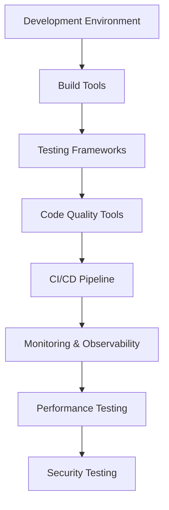

# Tooling & Testing Java & JavaScript: Complete Guide 2025

## 🚀 Tại sao Tooling & Testing quan trọng trong 2025?

**Tooling & Testing** là foundation của modern software development. Trong năm 2025, với sự phát triển của AI, automation và cloud-native technologies, việc có một toolchain hiệu quả và testing strategy vững chắc là **critical success factors** cho bất kỳ project nào.

### 🎯 Tại sao Tooling & Testing quan trọng trong 2025?

- **Developer Productivity**: Tăng 40% productivity với modern tooling
- **Code Quality**: Giảm 60% bugs với comprehensive testing
- **CI/CD Pipeline**: Automated deployment và delivery
- **Code Maintainability**: Easier refactoring và feature development
- **Team Collaboration**: Consistent development environment
- **Performance**: Optimized builds và faster feedback loops
- **Security**: Automated security scanning và vulnerability detection

### 📚 Roadmap học Tooling & Testing



**Lưu ý**: Bài viết này tập trung vào **Practical Implementation** (cấp độ 4-8). Bạn cần có kiến thức cơ bản về Java và JavaScript.

## 🎯 Mục tiêu bài viết

Sau khi đọc xong bài viết này, bạn sẽ hiểu:
- **Development Environment**: IDE setup, extensions, productivity tools
- **Build Tools**: Maven/Gradle cho Java, npm/yarn/webpack cho JavaScript
- **Testing Frameworks**: JUnit 5, TestNG, Jest, Vitest, Playwright
- **Code Quality**: SonarQube, ESLint, Prettier, Checkstyle
- **CI/CD**: GitHub Actions, Jenkins, GitLab CI
- **Monitoring**: Application performance monitoring, logging
- **Best Practices**: Testing strategies, tooling optimization

### 👥 Ai nên đọc bài viết này?

- ✅ **Java Developers**: Muốn setup modern development environment
- ✅ **JavaScript Developers**: Cần comprehensive testing strategy
- ✅ **Full-stack Developers**: Tooling cho cả backend và frontend
- ✅ **DevOps Engineers**: CI/CD pipeline và automation
- ✅ **Tech Leads**: Team productivity và code quality
- ✅ **Career Changers**: Modern development practices

## 🛠️ Development Environment Setup

### Java Development Environment

#### IntelliJ IDEA Configuration

```xml
<!-- .idea/compiler.xml -->
<?xml version="1.0" encoding="UTF-8"?>
<project version="4">
  <component name="CompilerConfiguration">
    <annotationProcessing>
      <profile name="Maven default annotation processors profile" enabled="true">
        <sourceOutputDir name="target/generated-sources/annotations" />
        <sourceTestOutputDir name="target/generated-test-sources/test-annotations" />
        <outputRelativeToContentRoot value="true" />
        <module name="spring-boot-project" />
      </profile>
    </annotationProcessing>
    <bytecodeTargetLevel>
      <module name="spring-boot-project" target="17" />
    </bytecodeTargetLevel>
  </component>
</project>
```

#### VS Code Java Setup

```json
// .vscode/settings.json
{
  "java.configuration.updateBuildConfiguration": "automatic",
  "java.compile.nullAnalysis.mode": "automatic",
  "java.format.settings.url": "https://raw.githubusercontent.com/google/styleguide/gh-pages/eclipse-java-google-style.xml",
  "java.format.settings.profile": "GoogleStyle",
  "java.saveActions.organizeImports": true,
  "java.test.config": {
    "workingDirectory": "${workspaceFolder}"
  },
  "java.test.defaultConfig": "",
  "files.exclude": {
    "**/target": true,
    "**/.classpath": true,
    "**/.project": true,
    "**/.settings": true,
    "**/.factorypath": true
  }
}
```

#### Essential Java Extensions

```json
// .vscode/extensions.json
{
  "recommendations": [
    "vscjava.vscode-java-pack",
    "vscjava.vscode-maven",
    "vscjava.vscode-java-debug",
    "vscjava.vscode-java-test",
    "redhat.java",
    "vscjava.vscode-java-dependency",
    "vscjava.vscode-spring-boot-dashboard",
    "vscjava.vscode-spring-initializr",
    "sonarsource.sonarlint-vscode",
    "ms-vscode.vscode-json"
  ]
}
```

### JavaScript Development Environment

#### VS Code JavaScript Setup

```json
// .vscode/settings.json
{
  "editor.formatOnSave": true,
  "editor.codeActionsOnSave": {
    "source.fixAll.eslint": true,
    "source.organizeImports": true
  },
  "eslint.validate": [
    "javascript",
    "javascriptreact",
    "typescript",
    "typescriptreact"
  ],
  "prettier.requireConfig": true,
  "typescript.preferences.importModuleSpecifier": "relative",
  "javascript.preferences.importModuleSpecifier": "relative",
  "files.associations": {
    "*.js": "javascript",
    "*.jsx": "javascriptreact",
    "*.ts": "typescript",
    "*.tsx": "typescriptreact"
  },
  "emmet.includeLanguages": {
    "javascript": "javascriptreact",
    "typescript": "typescriptreact"
  }
}
```

#### Essential JavaScript Extensions

```json
// .vscode/extensions.json
{
  "recommendations": [
    "esbenp.prettier-vscode",
    "dbaeumer.vscode-eslint",
    "ms-vscode.vscode-typescript-next",
    "bradlc.vscode-tailwindcss",
    "ms-vscode.vscode-json",
    "formulahendry.auto-rename-tag",
    "christian-kohler.path-intellisense",
    "ms-vscode.vscode-npm-script",
    "ms-vscode.vscode-jest",
    "ms-playwright.playwright"
  ]
}
```

## 🔨 Build Tools & Package Management

### Java Build Tools

#### Maven Configuration

```xml
<!-- pom.xml -->
<?xml version="1.0" encoding="UTF-8"?>
<project xmlns="http://maven.apache.org/POM/4.0.0"
         xmlns:xsi="http://www.w3.org/2001/XMLSchema-instance"
         xsi:schemaLocation="http://maven.apache.org/POM/4.0.0 
         http://maven.apache.org/xsd/maven-4.0.0.xsd">
    <modelVersion>4.0.0</modelVersion>

    <groupId>com.devnetinsights</groupId>
    <artifactId>java-project</artifactId>
    <version>1.0.0</version>
    <packaging>jar</packaging>

    <properties>
        <maven.compiler.source>17</maven.compiler.source>
        <maven.compiler.target>17</maven.compiler.target>
        <project.build.sourceEncoding>UTF-8</project.build.sourceEncoding>
        <spring-boot.version>3.2.0</spring-boot.version>
        <junit.version>5.10.0</junit.version>
        <mockito.version>5.7.0</mockito.version>
        <testcontainers.version>1.19.3</testcontainers.version>
    </properties>

    <dependencyManagement>
        <dependencies>
            <dependency>
                <groupId>org.springframework.boot</groupId>
                <artifactId>spring-boot-dependencies</artifactId>
                <version>${spring-boot.version}</version>
                <type>pom</type>
                <scope>import</scope>
            </dependency>
        </dependencies>
    </dependencyManagement>

    <dependencies>
        <!-- Spring Boot Starters -->
        <dependency>
            <groupId>org.springframework.boot</groupId>
            <artifactId>spring-boot-starter-web</artifactId>
        </dependency>
        <dependency>
            <groupId>org.springframework.boot</groupId>
            <artifactId>spring-boot-starter-data-jpa</artifactId>
        </dependency>
        <dependency>
            <groupId>org.springframework.boot</groupId>
            <artifactId>spring-boot-starter-validation</artifactId>
        </dependency>

        <!-- Testing Dependencies -->
        <dependency>
            <groupId>org.springframework.boot</groupId>
            <artifactId>spring-boot-starter-test</artifactId>
            <scope>test</scope>
        </dependency>
        <dependency>
            <groupId>org.junit.jupiter</groupId>
            <artifactId>junit-jupiter</artifactId>
            <version>${junit.version}</version>
            <scope>test</scope>
        </dependency>
        <dependency>
            <groupId>org.mockito</groupId>
            <artifactId>mockito-core</artifactId>
            <version>${mockito.version}</version>
            <scope>test</scope>
        </dependency>
        <dependency>
            <groupId>org.testcontainers</groupId>
            <artifactId>junit-jupiter</artifactId>
            <version>${testcontainers.version}</version>
            <scope>test</scope>
        </dependency>
        <dependency>
            <groupId>org.testcontainers</groupId>
            <artifactId>postgresql</artifactId>
            <version>${testcontainers.version}</version>
            <scope>test</scope>
        </dependency>
    </dependencies>

    <build>
        <plugins>
            <plugin>
                <groupId>org.springframework.boot</groupId>
                <artifactId>spring-boot-maven-plugin</artifactId>
                <version>${spring-boot.version}</version>
            </plugin>
            <plugin>
                <groupId>org.apache.maven.plugins</groupId>
                <artifactId>maven-compiler-plugin</artifactId>
                <version>3.11.0</version>
                <configuration>
                    <source>17</source>
                    <target>17</target>
                </configuration>
            </plugin>
            <plugin>
                <groupId>org.apache.maven.plugins</groupId>
                <artifactId>maven-surefire-plugin</artifactId>
                <version>3.2.2</version>
                <configuration>
                    <includes>
                        <include>**/*Test.java</include>
                        <include>**/*Tests.java</include>
                    </includes>
                </configuration>
            </plugin>
            <plugin>
                <groupId>org.jacoco</groupId>
                <artifactId>jacoco-maven-plugin</artifactId>
                <version>0.8.11</version>
                <executions>
                    <execution>
                        <goals>
                            <goal>prepare-agent</goal>
                        </goals>
                    </execution>
                    <execution>
                        <id>report</id>
                        <phase>test</phase>
                        <goals>
                            <goal>report</goal>
                        </goals>
                    </execution>
                </executions>
            </plugin>
        </plugins>
    </build>
</project>
```

#### Gradle Configuration

```gradle
// build.gradle
plugins {
    id 'java'
    id 'org.springframework.boot' version '3.2.0'
    id 'io.spring.dependency-management' version '1.1.4'
    id 'jacoco'
    id 'checkstyle'
}

group = 'com.devnetinsights'
version = '1.0.0'

java {
    sourceCompatibility = '17'
    targetCompatibility = '17'
}

configurations {
    compileOnly {
        extendsFrom annotationProcessor
    }
}

repositories {
    mavenCentral()
}

dependencies {
    implementation 'org.springframework.boot:spring-boot-starter-web'
    implementation 'org.springframework.boot:spring-boot-starter-data-jpa'
    implementation 'org.springframework.boot:spring-boot-starter-validation'
    
    testImplementation 'org.springframework.boot:spring-boot-starter-test'
    testImplementation 'org.junit.jupiter:junit-jupiter:5.10.0'
    testImplementation 'org.mockito:mockito-core:5.7.0'
    testImplementation 'org.testcontainers:junit-jupiter:1.19.3'
    testImplementation 'org.testcontainers:postgresql:1.19.3'
}

tasks.named('test') {
    useJUnitPlatform()
    finalizedBy jacocoTestReport
}

jacocoTestReport {
    dependsOn test
    reports {
        xml.required = true
        html.required = true
    }
}

checkstyle {
    toolVersion = '10.12.4'
    configFile = file('config/checkstyle/checkstyle.xml')
}
```

### JavaScript Build Tools

#### Package.json Configuration

```json
{
  "name": "javascript-project",
  "version": "1.0.0",
  "description": "Modern JavaScript project with comprehensive tooling",
  "main": "src/index.js",
  "scripts": {
    "dev": "vite",
    "build": "vite build",
    "preview": "vite preview",
    "test": "vitest",
    "test:ui": "vitest --ui",
    "test:coverage": "vitest --coverage",
    "test:e2e": "playwright test",
    "test:e2e:ui": "playwright test --ui",
    "lint": "eslint . --ext .js,.jsx,.ts,.tsx",
    "lint:fix": "eslint . --ext .js,.jsx,.ts,.tsx --fix",
    "format": "prettier --write .",
    "format:check": "prettier --check .",
    "type-check": "tsc --noEmit",
    "prepare": "husky install",
    "analyze": "npm run build && npx vite-bundle-analyzer dist/stats.html"
  },
  "dependencies": {
    "react": "^18.2.0",
    "react-dom": "^18.2.0",
    "react-router-dom": "^6.20.1",
    "axios": "^1.6.2",
    "zustand": "^4.4.7"
  },
  "devDependencies": {
    "@types/react": "^18.2.43",
    "@types/react-dom": "^18.2.17",
    "@typescript-eslint/eslint-plugin": "^6.14.0",
    "@typescript-eslint/parser": "^6.14.0",
    "@vitejs/plugin-react": "^4.2.1",
    "eslint": "^8.55.0",
    "eslint-config-prettier": "^9.1.0",
    "eslint-plugin-react": "^7.33.2",
    "eslint-plugin-react-hooks": "^4.6.0",
    "husky": "^8.0.3",
    "lint-staged": "^15.2.0",
    "playwright": "^1.40.1",
    "prettier": "^3.1.1",
    "typescript": "^5.3.3",
    "vite": "^5.0.10",
    "vitest": "^1.1.0",
    "@vitest/coverage-v8": "^1.1.0",
    "@vitest/ui": "^1.1.0"
  },
  "lint-staged": {
    "*.{js,jsx,ts,tsx}": [
      "eslint --fix",
      "prettier --write"
    ],
    "*.{json,md,css}": [
      "prettier --write"
    ]
  }
}
```

#### Vite Configuration

```typescript
// vite.config.ts
import { defineConfig } from 'vite'
import react from '@vitejs/plugin-react'
import { resolve } from 'path'

export default defineConfig({
  plugins: [react()],
  resolve: {
    alias: {
      '@': resolve(__dirname, './src'),
      '@/components': resolve(__dirname, './src/components'),
      '@/hooks': resolve(__dirname, './src/hooks'),
      '@/utils': resolve(__dirname, './src/utils'),
      '@/types': resolve(__dirname, './src/types'),
    },
  },
  server: {
    port: 3000,
    open: true,
  },
  build: {
    outDir: 'dist',
    sourcemap: true,
    rollupOptions: {
      output: {
        manualChunks: {
          vendor: ['react', 'react-dom'],
          router: ['react-router-dom'],
          utils: ['axios', 'zustand'],
        },
      },
    },
  },
  test: {
    globals: true,
    environment: 'jsdom',
    setupFiles: ['./src/test/setup.ts'],
    coverage: {
      provider: 'v8',
      reporter: ['text', 'json', 'html'],
      exclude: [
        'node_modules/',
        'src/test/',
        '**/*.d.ts',
        '**/*.config.*',
      ],
    },
  },
})
```

## 🧪 Testing Frameworks & Strategies

### Java Testing

#### JUnit 5 Configuration

```java
// src/test/java/com/devnetinsights/config/TestConfig.java
package com.devnetinsights.config;

import org.springframework.boot.test.context.TestConfiguration;
import org.springframework.context.annotation.Bean;
import org.springframework.context.annotation.Primary;
import org.springframework.test.context.ActiveProfiles;
import org.testcontainers.containers.PostgreSQLContainer;

@TestConfiguration
@ActiveProfiles("test")
public class TestConfig {
    
    @Bean
    @Primary
    public PostgreSQLContainer<?> postgreSQLContainer() {
        PostgreSQLContainer<?> container = new PostgreSQLContainer<>("postgres:15")
                .withDatabaseName("testdb")
                .withUsername("test")
                .withPassword("test");
        container.start();
        return container;
    }
}
```

#### Unit Testing Examples

```java
// src/test/java/com/devnetinsights/service/UserServiceTest.java
package com.devnetinsights.service;

import com.devnetinsights.model.User;
import com.devnetinsights.repository.UserRepository;
import org.junit.jupiter.api.BeforeEach;
import org.junit.jupiter.api.DisplayName;
import org.junit.jupiter.api.Test;
import org.junit.jupiter.api.extension.ExtendWith;
import org.mockito.InjectMocks;
import org.mockito.Mock;
import org.mockito.junit.jupiter.MockitoExtension;

import java.util.Optional;

import static org.assertj.core.api.Assertions.assertThat;
import static org.assertj.core.api.Assertions.assertThatThrownBy;
import static org.mockito.ArgumentMatchers.any;
import static org.mockito.ArgumentMatchers.anyLong;
import static org.mockito.Mockito.*;

@ExtendWith(MockitoExtension.class)
@DisplayName("UserService Tests")
class UserServiceTest {
    
    @Mock
    private UserRepository userRepository;
    
    @InjectMocks
    private UserService userService;
    
    private User testUser;
    
    @BeforeEach
    void setUp() {
        testUser = User.builder()
                .id(1L)
                .username("testuser")
                .email("test@example.com")
                .firstName("Test")
                .lastName("User")
                .build();
    }
    
    @Test
    @DisplayName("Should create user successfully")
    void shouldCreateUserSuccessfully() {
        // Given
        when(userRepository.save(any(User.class))).thenReturn(testUser);
        
        // When
        User result = userService.createUser(testUser);
        
        // Then
        assertThat(result).isNotNull();
        assertThat(result.getUsername()).isEqualTo("testuser");
        assertThat(result.getEmail()).isEqualTo("test@example.com");
        verify(userRepository, times(1)).save(testUser);
    }
    
    @Test
    @DisplayName("Should find user by ID")
    void shouldFindUserById() {
        // Given
        when(userRepository.findById(1L)).thenReturn(Optional.of(testUser));
        
        // When
        Optional<User> result = userService.findById(1L);
        
        // Then
        assertThat(result).isPresent();
        assertThat(result.get().getUsername()).isEqualTo("testuser");
        verify(userRepository, times(1)).findById(1L);
    }
    
    @Test
    @DisplayName("Should throw exception when user not found")
    void shouldThrowExceptionWhenUserNotFound() {
        // Given
        when(userRepository.findById(anyLong())).thenReturn(Optional.empty());
        
        // When & Then
        assertThatThrownBy(() -> userService.findById(999L))
                .isInstanceOf(RuntimeException.class)
                .hasMessage("User not found with id: 999");
    }
    
    @Test
    @DisplayName("Should update user successfully")
    void shouldUpdateUserSuccessfully() {
        // Given
        User updatedUser = testUser.toBuilder()
                .firstName("Updated")
                .lastName("Name")
                .build();
        
        when(userRepository.findById(1L)).thenReturn(Optional.of(testUser));
        when(userRepository.save(any(User.class))).thenReturn(updatedUser);
        
        // When
        User result = userService.updateUser(1L, updatedUser);
        
        // Then
        assertThat(result).isNotNull();
        assertThat(result.getFirstName()).isEqualTo("Updated");
        assertThat(result.getLastName()).isEqualTo("Name");
        verify(userRepository, times(1)).findById(1L);
        verify(userRepository, times(1)).save(any(User.class));
    }
}
```

#### Integration Testing

```java
// src/test/java/com/devnetinsights/integration/UserControllerIntegrationTest.java
package com.devnetinsights.integration;

import com.devnetinsights.model.User;
import com.devnetinsights.repository.UserRepository;
import com.fasterxml.jackson.databind.ObjectMapper;
import org.junit.jupiter.api.BeforeEach;
import org.junit.jupiter.api.DisplayName;
import org.junit.jupiter.api.Test;
import org.springframework.beans.factory.annotation.Autowired;
import org.springframework.boot.test.autoconfigure.web.servlet.AutoConfigureWebMvc;
import org.springframework.boot.test.context.SpringBootTest;
import org.springframework.boot.testcontainers.service.connection.ServiceConnection;
import org.springframework.http.MediaType;
import org.springframework.test.context.ActiveProfiles;
import org.springframework.test.web.servlet.MockMvc;
import org.springframework.transaction.annotation.Transactional;
import org.testcontainers.containers.PostgreSQLContainer;
import org.testcontainers.junit.jupiter.Container;
import org.testcontainers.junit.jupiter.Testcontainers;

import static org.hamcrest.Matchers.hasSize;
import static org.hamcrest.Matchers.is;
import static org.springframework.test.web.servlet.request.MockMvcRequestBuilders.*;
import static org.springframework.test.web.servlet.result.MockMvcResultMatchers.*;

@SpringBootTest
@AutoConfigureWebMvc
@Testcontainers
@ActiveProfiles("test")
@Transactional
@DisplayName("User Controller Integration Tests")
class UserControllerIntegrationTest {
    
    @Container
    @ServiceConnection
    static PostgreSQLContainer<?> postgres = new PostgreSQLContainer<>("postgres:15")
            .withDatabaseName("testdb")
            .withUsername("test")
            .withPassword("test");
    
    @Autowired
    private MockMvc mockMvc;
    
    @Autowired
    private UserRepository userRepository;
    
    @Autowired
    private ObjectMapper objectMapper;
    
    private User testUser;
    
    @BeforeEach
    void setUp() {
        userRepository.deleteAll();
        testUser = User.builder()
                .username("testuser")
                .email("test@example.com")
                .firstName("Test")
                .lastName("User")
                .build();
    }
    
    @Test
    @DisplayName("Should create user via API")
    void shouldCreateUserViaApi() throws Exception {
        // When & Then
        mockMvc.perform(post("/api/users")
                        .contentType(MediaType.APPLICATION_JSON)
                        .content(objectMapper.writeValueAsString(testUser)))
                .andExpect(status().isCreated())
                .andExpect(jsonPath("$.username", is("testuser")))
                .andExpect(jsonPath("$.email", is("test@example.com")))
                .andExpect(jsonPath("$.firstName", is("Test")))
                .andExpect(jsonPath("$.lastName", is("User")));
    }
    
    @Test
    @DisplayName("Should get all users")
    void shouldGetAllUsers() throws Exception {
        // Given
        userRepository.save(testUser);
        
        // When & Then
        mockMvc.perform(get("/api/users"))
                .andExpect(status().isOk())
                .andExpect(jsonPath("$", hasSize(1)))
                .andExpect(jsonPath("$[0].username", is("testuser")));
    }
    
    @Test
    @DisplayName("Should get user by ID")
    void shouldGetUserById() throws Exception {
        // Given
        User savedUser = userRepository.save(testUser);
        
        // When & Then
        mockMvc.perform(get("/api/users/{id}", savedUser.getId()))
                .andExpect(status().isOk())
                .andExpect(jsonPath("$.username", is("testuser")))
                .andExpect(jsonPath("$.email", is("test@example.com")));
    }
    
    @Test
    @DisplayName("Should update user")
    void shouldUpdateUser() throws Exception {
        // Given
        User savedUser = userRepository.save(testUser);
        User updatedUser = testUser.toBuilder()
                .firstName("Updated")
                .lastName("Name")
                .build();
        
        // When & Then
        mockMvc.perform(put("/api/users/{id}", savedUser.getId())
                        .contentType(MediaType.APPLICATION_JSON)
                        .content(objectMapper.writeValueAsString(updatedUser)))
                .andExpect(status().isOk())
                .andExpect(jsonPath("$.firstName", is("Updated")))
                .andExpect(jsonPath("$.lastName", is("Name")));
    }
    
    @Test
    @DisplayName("Should delete user")
    void shouldDeleteUser() throws Exception {
        // Given
        User savedUser = userRepository.save(testUser);
        
        // When & Then
        mockMvc.perform(delete("/api/users/{id}", savedUser.getId()))
                .andExpect(status().isNoContent());
        
        // Verify user is deleted
        assertThat(userRepository.findById(savedUser.getId())).isEmpty();
    }
}
```

### JavaScript Testing

#### Vitest Configuration

```typescript
// src/test/setup.ts
import { expect, afterEach } from 'vitest'
import { cleanup } from '@testing-library/react'
import * as matchers from '@testing-library/jest-dom/matchers'

// Extend Vitest's expect with jest-dom matchers
expect.extend(matchers)

// Cleanup after each test case
afterEach(() => {
  cleanup()
})

// Mock IntersectionObserver
global.IntersectionObserver = class IntersectionObserver {
  constructor() {}
  disconnect() {}
  observe() {}
  unobserve() {}
}

// Mock ResizeObserver
global.ResizeObserver = class ResizeObserver {
  constructor() {}
  disconnect() {}
  observe() {}
  unobserve() {}
}
```

#### Unit Testing Examples

```typescript
// src/utils/__tests__/api.test.ts
import { describe, it, expect, vi, beforeEach } from 'vitest'
import { apiClient } from '../api'

// Mock fetch
global.fetch = vi.fn()

describe('API Client', () => {
  beforeEach(() => {
    vi.resetAllMocks()
  })

  describe('get', () => {
    it('should make GET request successfully', async () => {
      // Given
      const mockData = { id: 1, name: 'Test User' }
      const mockResponse = {
        ok: true,
        json: vi.fn().mockResolvedValue(mockData),
      }
      vi.mocked(fetch).mockResolvedValue(mockResponse as any)

      // When
      const result = await apiClient.get('/users/1')

      // Then
      expect(fetch).toHaveBeenCalledWith('/api/users/1', {
        method: 'GET',
        headers: {
          'Content-Type': 'application/json',
        },
      })
      expect(result).toEqual(mockData)
    })

    it('should handle API errors', async () => {
      // Given
      const mockResponse = {
        ok: false,
        status: 404,
        statusText: 'Not Found',
      }
      vi.mocked(fetch).mockResolvedValue(mockResponse as any)

      // When & Then
      await expect(apiClient.get('/users/999')).rejects.toThrow('404 Not Found')
    })
  })

  describe('post', () => {
    it('should make POST request successfully', async () => {
      // Given
      const userData = { name: 'New User', email: 'new@example.com' }
      const mockResponse = {
        ok: true,
        json: vi.fn().mockResolvedValue({ id: 2, ...userData }),
      }
      vi.mocked(fetch).mockResolvedValue(mockResponse as any)

      // When
      const result = await apiClient.post('/users', userData)

      // Then
      expect(fetch).toHaveBeenCalledWith('/api/users', {
        method: 'POST',
        headers: {
          'Content-Type': 'application/json',
        },
        body: JSON.stringify(userData),
      })
      expect(result).toEqual({ id: 2, ...userData })
    })
  })
})
```

#### React Component Testing

```typescript
// src/components/__tests__/UserCard.test.tsx
import { describe, it, expect, vi } from 'vitest'
import { render, screen, fireEvent, waitFor } from '@testing-library/react'
import { UserCard } from '../UserCard'

const mockUser = {
  id: 1,
  name: 'John Doe',
  email: 'john@example.com',
  avatar: 'https://example.com/avatar.jpg',
}

const mockOnEdit = vi.fn()
const mockOnDelete = vi.fn()

describe('UserCard', () => {
  it('should render user information correctly', () => {
    // When
    render(
      <UserCard
        user={mockUser}
        onEdit={mockOnEdit}
        onDelete={mockOnDelete}
      />
    )

    // Then
    expect(screen.getByText('John Doe')).toBeInTheDocument()
    expect(screen.getByText('john@example.com')).toBeInTheDocument()
    expect(screen.getByAltText('John Doe')).toHaveAttribute(
      'src',
      'https://example.com/avatar.jpg'
    )
  })

  it('should call onEdit when edit button is clicked', async () => {
    // Given
    render(
      <UserCard
        user={mockUser}
        onEdit={mockOnEdit}
        onDelete={mockOnDelete}
      />
    )

    // When
    fireEvent.click(screen.getByRole('button', { name: /edit/i }))

    // Then
    await waitFor(() => {
      expect(mockOnEdit).toHaveBeenCalledWith(mockUser)
    })
  })

  it('should call onDelete when delete button is clicked', async () => {
    // Given
    render(
      <UserCard
        user={mockUser}
        onEdit={mockOnEdit}
        onDelete={mockOnDelete}
      />
    )

    // When
    fireEvent.click(screen.getByRole('button', { name: /delete/i }))

    // Then
    await waitFor(() => {
      expect(mockOnDelete).toHaveBeenCalledWith(mockUser.id)
    })
  })

  it('should show loading state when user is being deleted', () => {
    // Given
    render(
      <UserCard
        user={mockUser}
        onEdit={mockOnEdit}
        onDelete={mockOnDelete}
        isDeleting={true}
      />
    )

    // Then
    expect(screen.getByRole('button', { name: /delete/i })).toBeDisabled()
    expect(screen.getByText(/deleting/i)).toBeInTheDocument()
  })
})
```

#### E2E Testing with Playwright

```typescript
// tests/e2e/user-management.spec.ts
import { test, expect } from '@playwright/test'

test.describe('User Management', () => {
  test.beforeEach(async ({ page }) => {
    await page.goto('/')
  })

  test('should create a new user', async ({ page }) => {
    // Given
    await page.click('text=Add User')

    // When
    await page.fill('[data-testid="name-input"]', 'John Doe')
    await page.fill('[data-testid="email-input"]', 'john@example.com')
    await page.click('button[type="submit"]')

    // Then
    await expect(page.locator('text=John Doe')).toBeVisible()
    await expect(page.locator('text=john@example.com')).toBeVisible()
  })

  test('should edit an existing user', async ({ page }) => {
    // Given
    await page.click('[data-testid="edit-user-1"]')

    // When
    await page.fill('[data-testid="name-input"]', 'Jane Doe')
    await page.click('button[type="submit"]')

    // Then
    await expect(page.locator('text=Jane Doe')).toBeVisible()
  })

  test('should delete a user', async ({ page }) => {
    // Given
    const userCard = page.locator('[data-testid="user-card-1"]')

    // When
    await page.click('[data-testid="delete-user-1"]')
    await page.click('text=Confirm Delete')

    // Then
    await expect(userCard).not.toBeVisible()
  })

  test('should search users', async ({ page }) => {
    // When
    await page.fill('[data-testid="search-input"]', 'John')

    // Then
    await expect(page.locator('[data-testid="user-card"]')).toHaveCount(1)
    await expect(page.locator('text=John Doe')).toBeVisible()
  })
})
```

## 🔍 Code Quality Tools

### Java Code Quality

#### Checkstyle Configuration

```xml
<!-- config/checkstyle/checkstyle.xml -->
<?xml version="1.0"?>
<!DOCTYPE module PUBLIC
    "-//Checkstyle//DTD Checkstyle Configuration 1.3//EN"
    "https://checkstyle.org/dtds/configuration_1_3.dtd">

<module name="Checker">
    <property name="charset" value="UTF-8"/>
    <property name="severity" value="warning"/>
    <property name="fileExtensions" value="java, properties, xml"/>

    <module name="FileTabCharacter">
        <property name="eachLine" value="true"/>
    </module>

    <module name="TreeWalker">
        <module name="OuterTypeFilename"/>
        <module name="IllegalTokenText">
            <property name="tokens" value="STRING_LITERAL, CHAR_LITERAL"/>
        </module>
        <module name="AvoidEscapedUnicodeCharacters">
            <property name="allowEscapesForControlCharacters" value="true"/>
            <property name="allowByTailComment" value="true"/>
            <property name="allowNonPrintableCharacters" value="true"/>
        </module>
        <module name="AvoidStarImport"/>
        <module name="OneTopLevelClass"/>
        <module name="EmptyBlock">
            <property name="option" value="TEXT"/>
            <property name="tokens" value="LITERAL_TRY, LITERAL_FINALLY, LITERAL_IF, LITERAL_ELSE, LITERAL_SWITCH"/>
        </module>
        <module name="NeedBraces">
            <property name="tokens" value="LITERAL_DO, LITERAL_ELSE, LITERAL_FOR, LITERAL_IF, LITERAL_WHILE"/>
        </module>
        <module name="LeftCurly">
            <property name="tokens" value="ANNOTATION_DEF, CLASS_DEF, CTOR_DEF, ENUM_CONSTANT_DEF, ENUM_DEF, INTERFACE_DEF, LAMBDA, LITERAL_CASE, LITERAL_CATCH, LITERAL_DEFAULT, LITERAL_DO, LITERAL_ELSE, LITERAL_FINALLY, LITERAL_FOR, LITERAL_IF, LITERAL_SWITCH, LITERAL_SYNCHRONIZED, LITERAL_TRY, LITERAL_WHILE, METHOD_DEF, OBJBLOCK, STATIC_INIT, RECORD_DEF, COMPACT_CTOR_DEF"/>
        </module>
        <module name="RightCurly">
            <property name="tokens" value="ANNOTATION_DEF, CLASS_DEF, CTOR_DEF, ENUM_CONSTANT_DEF, ENUM_DEF, INTERFACE_DEF, LAMBDA, LITERAL_CASE, LITERAL_CATCH, LITERAL_DEFAULT, LITERAL_DO, LITERAL_ELSE, LITERAL_FINALLY, LITERAL_FOR, LITERAL_IF, LITERAL_SWITCH, LITERAL_SYNCHRONIZED, LITERAL_TRY, LITERAL_WHILE, METHOD_DEF, OBJBLOCK, STATIC_INIT, RECORD_DEF, COMPACT_CTOR_DEF"/>
        </module>
        <module name="WhitespaceAfter">
            <property name="tokens" value="COMMA, SEMI, TYPECAST, LITERAL_IF, LITERAL_ELSE, LITERAL_WHILE, LITERAL_DO, LITERAL_FOR, DO_WHILE"/>
        </module>
        <module name="WhitespaceAround">
            <property name="allowEmptyConstructors" value="true"/>
            <property name="allowEmptyLambdas" value="true"/>
            <property name="allowEmptyMethods" value="true"/>
            <property name="allowEmptyTypes" value="true"/>
            <property name="allowEmptyLoops" value="true"/>
            <property name="ignoreEnhancedForColon" value="false"/>
            <property name="tokens" value="ASSIGN, BAND, BAND_ASSIGN, BOR, BOR_ASSIGN, BSR, BSR_ASSIGN, BXOR, BXOR_ASSIGN, COLON, DIV, DIV_ASSIGN, DO_WHILE, EQUAL, GE, GT, LAMBDA, LAND, LCURLY, LE, LITERAL_CATCH, LITERAL_DO, LITERAL_ELSE, LITERAL_FINALLY, LITERAL_FOR, LITERAL_IF, LITERAL_RETURN, LITERAL_SWITCH, LITERAL_SYNCHRONIZED, LITERAL_TRY, LITERAL_WHILE, LOR, LT, MINUS, MINUS_ASSIGN, MOD, MOD_ASSIGN, NOT_EQUAL, PLUS, PLUS_ASSIGN, QUESTION, RCURLY, SL, SLIST, SL_ASSIGN, SR, SR_ASSIGN, STAR, STAR_ASSIGN, LITERAL_ASSERT, TYPE_EXTENSION_AND"/>
        </module>
        <module name="OneStatementPerLine"/>
        <module name="MultipleVariableDeclarations"/>
        <module name="ArrayTypeStyle"/>
        <module name="MissingSwitchDefault"/>
        <module name="FallThrough"/>
        <module name="UpperEll"/>
        <module name="ModifierOrder"/>
        <module name="EmptyLineSeparator">
            <property name="tokens" value="PACKAGE_DEF, IMPORT, STATIC_IMPORT, CLASS_DEF, INTERFACE_DEF, ENUM_DEF, STATIC_INIT, INSTANCE_INIT, METHOD_DEF, CTOR_DEF, VARIABLE_DEF"/>
        </module>
        <module name="SeparatorWrap">
            <property name="tokens" value="DOT, COMMA"/>
            <property name="option" value="nl"/>
        </module>
        <module name="SeparatorWrap">
            <property name="tokens" value="METHOD_REF"/>
            <property name="option" value="space"/>
        </module>
        <module name="PackageName">
            <property name="format" value="^[a-z]+(\.[a-z][a-z0-9]*)*$"/>
        </module>
        <module name="TypeName">
            <property name="tokens" value="CLASS_DEF, INTERFACE_DEF, ENUM_DEF, ANNOTATION_DEF, RECORD_DEF"/>
        </module>
        <module name="MemberName">
            <property name="format" value="^[a-z][a-z0-9][a-zA-Z0-9]*$"/>
        </module>
        <module name="ParameterName">
            <property name="format" value="^[a-z]([a-z0-9][a-zA-Z0-9]*)?$"/>
        </module>
        <module name="LambdaParameterName">
            <property name="format" value="^[a-z]([a-z0-9][a-zA-Z0-9]*)?$"/>
        </module>
        <module name="CatchParameterName">
            <property name="format" value="^[a-z]([a-z0-9][a-zA-Z0-9]*)?$"/>
        </module>
        <module name="LocalVariableName">
            <property name="format" value="^[a-z]([a-z0-9][a-zA-Z0-9]*)?$"/>
        </module>
        <module name="ClassTypeParameterName">
            <property name="format" value="(^[A-Z][0-9]?)$|([A-Z][a-zA-Z0-9]*[T]$)"/>
        </module>
        <module name="RecordTypeParameterName">
            <property name="format" value="(^[A-Z][0-9]?)$|([A-Z][a-zA-Z0-9]*[T]$)"/>
        </module>
        <module name="MethodTypeParameterName">
            <property name="format" value="(^[A-Z][0-9]?)$|([A-Z][a-zA-Z0-9]*[T]$)"/>
        </module>
        <module name="InterfaceTypeParameterName">
            <property name="format" value="(^[A-Z][0-9]?)$|([A-Z][a-zA-Z0-9]*[T]$)"/>
        </module>
        <module name="NoFinalizer"/>
        <module name="GenericWhitespace">
            <property name="message" value="GenericWhitespace"/>
        </module>
        <module name="Indentation">
            <property name="basicOffset" value="2"/>
            <property name="braceAdjustment" value="0"/>
            <property name="caseIndent" value="2"/>
            <property name="throwsIndent" value="4"/>
            <property name="lineWrappingIndentation" value="4"/>
            <property name="arrayInitIndent" value="2"/>
        </module>
        <module name="AbbreviationAsWordInName">
            <property name="tokens" value="CLASS_DEF, INTERFACE_DEF, ENUM_DEF, ANNOTATION_DEF, ANNOTATION_FIELD_DEF, PARAMETER_DEF, VARIABLE_DEF, METHOD_DEF, PATTERN_VARIABLE_DEF, RECORD_DEF, RECORD_COMPONENT_DEF"/>
            <property name="ignoreStatic" value="true"/>
            <property name="allowedAbbreviationLength" value="0"/>
            <property name="tokens" value="CLASS_DEF, INTERFACE_DEF, ENUM_DEF, ANNOTATION_DEF, ANNOTATION_FIELD_DEF, PARAMETER_DEF, VARIABLE_DEF, METHOD_DEF, PATTERN_VARIABLE_DEF, RECORD_DEF, RECORD_COMPONENT_DEF"/>
        </module>
        <module name="OverloadMethodsDeclarationOrder"/>
        <module name="VariableDeclarationUsageDistance"/>
        <module name="CustomImportOrder">
            <property name="sortImportsInGroupAlphabetically" value="true"/>
            <property name="separateLineBetweenGroups" value="true"/>
            <property name="customImportOrderRules" value="STATIC###THIRD_PARTY_PACKAGE"/>
            <property name="tokens" value="IMPORT, STATIC_IMPORT, PACKAGE_DEF"/>
        </module>
        <module name="MethodParamPad">
            <property name="tokens" value="CTOR_DEF, LITERAL_NEW, METHOD_CALL, METHOD_DEF, SUPER_CTOR_CALL"/>
        </module>
        <module name="NoWhitespaceBefore">
            <property name="tokens" value="COMMA, SEMI, POST_INC, POST_DEC, DOT, LABELED_STAT, METHOD_REF"/>
            <property name="allowLineBreaks" value="true"/>
        </module>
        <module name="ParenPad">
            <property name="tokens" value="ANNOTATION, ANNOTATION_FIELD_DEF, CTOR_CALL, CTOR_DEF, DOT, ENUM_CONSTANT_DEF, EXPR, LITERAL_CATCH, LITERAL_DO, LITERAL_FOR, LITERAL_IF, LITERAL_NEW, LITERAL_SWITCH, LITERAL_SYNCHRONIZED, LITERAL_WHILE, METHOD_CALL, METHOD_DEF, QUESTION, RESOURCE_SPECIFICATION, SUPER_CTOR_CALL, LAMBDA, RECORD_DEF"/>
        </module>
        <module name="OperatorWrap">
            <property name="option" value="NL"/>
            <property name="tokens" value="BAND, BOR, BSR, BXOR, DIV, EQUAL, GE, GT, LAND, LE, LITERAL_INSTANCEOF, LOR, LT, MINUS, MOD, NOT_EQUAL, PLUS, QUESTION, SL, SR, STAR, METHOD_REF"/>
        </module>
        <module name="AnnotationLocation">
            <property name="id" value="AnnotationLocationMostCases"/>
            <property name="tokens" value="CLASS_DEF, INTERFACE_DEF, ENUM_DEF, METHOD_DEF, CTOR_DEF, RECORD_DEF, COMPACT_CTOR_DEF"/>
        </module>
        <module name="AnnotationLocation">
            <property name="id" value="AnnotationLocationVariables"/>
            <property name="tokens" value="VARIABLE_DEF"/>
            <property name="allowSamelineMultipleAnnotations" value="true"/>
        </module>
        <module name="NonEmptyAtclauseDescription"/>
        <module name="JavadocTagContinuationIndentation"/>
        <module name="SummaryJavadoc">
            <property name="forbiddenSummaryFragments" value="^@return the *|^This method returns |^A [{]@code [a-zA-Z0-9]+[}]( is a )"/>
        </module>
        <module name="JavadocParagraph"/>
        <module name="AtclauseOrder">
            <property name="tagOrder" value="@param, @return, @throws, @deprecated"/>
            <property name="target" value="CLASS_DEF, INTERFACE_DEF, ENUM_DEF, METHOD_DEF, CTOR_DEF, RECORD_DEF"/>
        </module>
        <module name="JavadocMethod">
            <property name="scope" value="public"/>
            <property name="allowMissingParamTags" value="true"/>
            <property name="allowMissingReturnTag" value="true"/>
            <property name="allowedAnnotations" value="Override, Test"/>
            <property name="tokens" value="METHOD_DEF, CTOR_DEF, ANNOTATION_FIELD_DEF, COMPACT_CTOR_DEF"/>
        </module>
        <module name="MissingJavadocMethod">
            <property name="scope" value="public"/>
            <property name="minLineCount" value="2"/>
            <property name="allowedAnnotations" value="Override, Test"/>
            <property name="tokens" value="METHOD_DEF, CTOR_DEF, ANNOTATION_FIELD_DEF, COMPACT_CTOR_DEF"/>
        </module>
        <module name="MissingJavadocType">
            <property name="scope" value="protected"/>
            <property name="tokens" value="CLASS_DEF, INTERFACE_DEF, ENUM_DEF, RECORD_DEF"/>
        </module>
        <module name="MethodName">
            <property name="format" value="^[a-z][a-z0-9][a-zA-Z0-9_]*$"/>
        </module>
        <module name="SingleLineJavadoc">
            <property name="ignoreInlineTags" value="false"/>
        </module>
        <module name="EmptyCatchBlock">
            <property name="exceptionVariableName" value="expected"/>
        </module>
        <module name="CommentsIndentation">
            <property name="tokens" value="SINGLE_LINE_COMMENT, BLOCK_COMMENT_BEGIN"/>
        </module>
    </module>
</module>
```

#### SonarQube Configuration

```yaml
# sonar-project.properties
sonar.projectKey=java-project
sonar.projectName=Java Project
sonar.projectVersion=1.0.0

sonar.sources=src/main/java
sonar.tests=src/test/java
sonar.java.binaries=target/classes
sonar.java.libraries=target/dependency/*.jar
sonar.java.test.binaries=target/test-classes
sonar.java.test.libraries=target/dependency/*.jar

sonar.coverage.jacoco.xmlReportPaths=target/site/jacoco/jacoco.xml
sonar.junit.reportPaths=target/surefire-reports

sonar.java.checkstyle.reportPaths=target/checkstyle-result.xml
sonar.java.spotbugs.reportPaths=target/spotbugsXml.xml

sonar.exclusions=**/generated/**,**/target/**,**/test/**
sonar.test.exclusions=**/generated/**,**/target/**
```

### JavaScript Code Quality

#### ESLint Configuration

```javascript
// .eslintrc.js
module.exports = {
  root: true,
  env: {
    browser: true,
    es2022: true,
    node: true,
  },
  extends: [
    'eslint:recommended',
    '@typescript-eslint/recommended',
    'plugin:react/recommended',
    'plugin:react-hooks/recommended',
    'plugin:jsx-a11y/recommended',
    'prettier',
  ],
  parser: '@typescript-eslint/parser',
  parserOptions: {
    ecmaFeatures: {
      jsx: true,
    },
    ecmaVersion: 'latest',
    sourceType: 'module',
  },
  plugins: [
    'react',
    'react-hooks',
    '@typescript-eslint',
    'jsx-a11y',
  ],
  rules: {
    // React rules
    'react/react-in-jsx-scope': 'off',
    'react/prop-types': 'off',
    'react/jsx-uses-react': 'off',
    'react/jsx-uses-vars': 'error',
    'react/jsx-no-unused-vars': 'error',
    'react/jsx-key': 'error',
    'react/jsx-no-duplicate-props': 'error',
    'react/jsx-no-undef': 'error',
    'react/jsx-pascal-case': 'error',
    'react/no-array-index-key': 'warn',
    'react/no-unescaped-entities': 'off',
    'react/display-name': 'off',

    // React Hooks rules
    'react-hooks/rules-of-hooks': 'error',
    'react-hooks/exhaustive-deps': 'warn',

    // TypeScript rules
    '@typescript-eslint/no-unused-vars': 'error',
    '@typescript-eslint/no-explicit-any': 'warn',
    '@typescript-eslint/explicit-function-return-type': 'off',
    '@typescript-eslint/explicit-module-boundary-types': 'off',
    '@typescript-eslint/no-empty-function': 'warn',
    '@typescript-eslint/no-non-null-assertion': 'warn',
    '@typescript-eslint/prefer-const': 'error',
    '@typescript-eslint/no-var-requires': 'error',

    // General rules
    'no-console': 'warn',
    'no-debugger': 'error',
    'no-unused-vars': 'off', // Handled by @typescript-eslint/no-unused-vars
    'prefer-const': 'error',
    'no-var': 'error',
    'object-shorthand': 'error',
    'prefer-template': 'error',
    'template-curly-spacing': 'error',
    'arrow-spacing': 'error',
    'comma-dangle': ['error', 'always-multiline'],
    'semi': ['error', 'always'],
    'quotes': ['error', 'single', { avoidEscape: true }],
    'indent': ['error', 2, { SwitchCase: 1 }],
    'max-len': ['error', { code: 100, ignoreUrls: true }],
    'no-trailing-spaces': 'error',
    'eol-last': 'error',
    'no-multiple-empty-lines': ['error', { max: 2, maxEOF: 1 }],
    'object-curly-spacing': ['error', 'always'],
    'array-bracket-spacing': ['error', 'never'],
    'computed-property-spacing': ['error', 'never'],
    'space-before-blocks': 'error',
    'space-before-function-paren': ['error', 'never'],
    'space-in-parens': 'error',
    'space-infix-ops': 'error',
    'keyword-spacing': 'error',
    'brace-style': ['error', '1tbs', { allowSingleLine: true }],
    'camelcase': ['error', { properties: 'never' }],
    'new-cap': 'error',
    'new-parens': 'error',
    'no-nested-ternary': 'error',
    'no-unneeded-ternary': 'error',
    'one-var': ['error', 'never'],
    'operator-assignment': 'error',
    'operator-linebreak': ['error', 'after'],
    'padded-blocks': ['error', 'never'],
    'space-after-keywords': 'error',
    'space-return-throw-case': 'error',
    'spaced-comment': 'error',
  },
  settings: {
    react: {
      version: 'detect',
    },
  },
  ignorePatterns: [
    'node_modules/',
    'dist/',
    'build/',
    'coverage/',
    '*.config.js',
    '*.config.ts',
  ],
};
```

#### Prettier Configuration

```json
// .prettierrc
{
  "semi": true,
  "trailingComma": "es5",
  "singleQuote": true,
  "printWidth": 100,
  "tabWidth": 2,
  "useTabs": false,
  "bracketSpacing": true,
  "bracketSameLine": false,
  "arrowParens": "avoid",
  "endOfLine": "lf",
  "quoteProps": "as-needed",
  "jsxSingleQuote": true,
  "proseWrap": "preserve"
}
```

#### Husky Git Hooks

```json
// .husky/pre-commit
#!/usr/bin/env sh
. "$(dirname -- "$0")/_/husky.sh"

npx lint-staged
```

```json
// .husky/commit-msg
#!/usr/bin/env sh
. "$(dirname -- "$0")/_/husky.sh"

npx --no -- commitlint --edit ${1}
```

## 🚀 CI/CD Pipeline

### GitHub Actions

#### Java CI/CD Pipeline

```yaml
# .github/workflows/java-ci.yml
name: Java CI/CD

on:
  push:
    branches: [ main, develop ]
  pull_request:
    branches: [ main ]

jobs:
  test:
    runs-on: ubuntu-latest
    
    services:
      postgres:
        image: postgres:15
        env:
          POSTGRES_PASSWORD: postgres
          POSTGRES_DB: testdb
        options: >-
          --health-cmd pg_isready
          --health-interval 10s
          --health-timeout 5s
          --health-retries 5
        ports:
          - 5432:5432

    steps:
    - uses: actions/checkout@v4
    
    - name: Set up JDK 17
      uses: actions/setup-java@v4
      with:
        java-version: '17'
        distribution: 'temurin'
        
    - name: Cache Maven dependencies
      uses: actions/cache@v3
      with:
        path: ~/.m2
        key: ${{ runner.os }}-m2-${{ hashFiles('**/pom.xml') }}
        restore-keys: ${{ runner.os }}-m2
        
    - name: Run Checkstyle
      run: mvn checkstyle:check
      
    - name: Run tests
      run: mvn test
      env:
        SPRING_DATASOURCE_URL: jdbc:postgresql://localhost:5432/testdb
        SPRING_DATASOURCE_USERNAME: postgres
        SPRING_DATASOURCE_PASSWORD: postgres
        
    - name: Generate test report
      uses: dorny/test-reporter@v1
      if: success() || failure()
      with:
        name: Maven Tests
        path: target/surefire-reports/*.xml
        reporter: java-junit
        
    - name: Upload coverage to Codecov
      uses: codecov/codecov-action@v3
      with:
        file: target/site/jacoco/jacoco.xml
        
    - name: Build application
      run: mvn clean package -DskipTests
      
    - name: Upload build artifacts
      uses: actions/upload-artifact@v3
      with:
        name: java-app
        path: target/*.jar

  sonar:
    runs-on: ubuntu-latest
    needs: test
    if: github.event_name == 'pull_request'
    
    steps:
    - uses: actions/checkout@v4
      with:
        fetch-depth: 0
        
    - name: Set up JDK 17
      uses: actions/setup-java@v4
      with:
        java-version: '17'
        distribution: 'temurin'
        
    - name: Cache SonarQube packages
      uses: actions/cache@v3
      with:
        path: ~/.sonar/cache
        key: ${{ runner.os }}-sonar
        restore-keys: ${{ runner.os }}-sonar
        
    - name: Run SonarQube
      env:
        GITHUB_TOKEN: ${{ secrets.GITHUB_TOKEN }}
        SONAR_TOKEN: ${{ secrets.SONAR_TOKEN }}
      run: mvn sonar:sonar

  deploy:
    runs-on: ubuntu-latest
    needs: [test, sonar]
    if: github.ref == 'refs/heads/main'
    
    steps:
    - uses: actions/checkout@v4
    
    - name: Download build artifacts
      uses: actions/download-artifact@v3
      with:
        name: java-app
        path: target/
        
    - name: Deploy to staging
      run: |
        echo "Deploying to staging environment"
        # Add deployment commands here
        
    - name: Deploy to production
      if: success()
      run: |
        echo "Deploying to production environment"
        # Add production deployment commands here
```

#### JavaScript CI/CD Pipeline

```yaml
# .github/workflows/js-ci.yml
name: JavaScript CI/CD

on:
  push:
    branches: [ main, develop ]
  pull_request:
    branches: [ main ]

jobs:
  test:
    runs-on: ubuntu-latest
    
    strategy:
      matrix:
        node-version: [18.x, 20.x]

    steps:
    - uses: actions/checkout@v4
    
    - name: Use Node.js ${{ matrix.node-version }}
      uses: actions/setup-node@v4
      with:
        node-version: ${{ matrix.node-version }}
        cache: 'npm'
        
    - name: Install dependencies
      run: npm ci
      
    - name: Run ESLint
      run: npm run lint
      
    - name: Run Prettier check
      run: npm run format:check
      
    - name: Run type check
      run: npm run type-check
      
    - name: Run unit tests
      run: npm run test:coverage
      
    - name: Upload coverage to Codecov
      uses: codecov/codecov-action@v3
      with:
        file: coverage/lcov.info
        
    - name: Build application
      run: npm run build
      
    - name: Upload build artifacts
      uses: actions/upload-artifact@v3
      with:
        name: js-app-${{ matrix.node-version }}
        path: dist/

  e2e:
    runs-on: ubuntu-latest
    needs: test
    
    steps:
    - uses: actions/checkout@v4
    
    - name: Use Node.js 20.x
      uses: actions/setup-node@v4
      with:
        node-version: 20.x
        cache: 'npm'
        
    - name: Install dependencies
      run: npm ci
      
    - name: Install Playwright browsers
      run: npx playwright install --with-deps
      
    - name: Run E2E tests
      run: npm run test:e2e
      
    - name: Upload E2E test results
      uses: actions/upload-artifact@v3
      if: always()
      with:
        name: playwright-report
        path: playwright-report/

  lighthouse:
    runs-on: ubuntu-latest
    needs: test
    
    steps:
    - uses: actions/checkout@v4
    
    - name: Use Node.js 20.x
      uses: actions/setup-node@v4
      with:
        node-version: 20.x
        cache: 'npm'
        
    - name: Install dependencies
      run: npm ci
      
    - name: Build application
      run: npm run build
      
    - name: Run Lighthouse CI
      run: |
        npm install -g @lhci/cli@0.12.x
        lhci autorun
      env:
        LHCI_GITHUB_APP_TOKEN: ${{ secrets.LHCI_GITHUB_APP_TOKEN }}

  deploy:
    runs-on: ubuntu-latest
    needs: [test, e2e, lighthouse]
    if: github.ref == 'refs/heads/main'
    
    steps:
    - uses: actions/checkout@v4
    
    - name: Download build artifacts
      uses: actions/download-artifact@v3
      with:
        name: js-app-20.x
        path: dist/
        
    - name: Deploy to staging
      run: |
        echo "Deploying to staging environment"
        # Add deployment commands here
        
    - name: Deploy to production
      if: success()
      run: |
        echo "Deploying to production environment"
        # Add production deployment commands here
```

## 📊 Monitoring & Observability

### Application Performance Monitoring

#### Java Monitoring với Micrometer

```java
// src/main/java/com/devnetinsights/config/MonitoringConfig.java
package com.devnetinsights.config;

import io.micrometer.core.aop.TimedAspect;
import io.micrometer.core.instrument.MeterRegistry;
import org.springframework.context.annotation.Bean;
import org.springframework.context.annotation.Configuration;

@Configuration
public class MonitoringConfig {
    
    @Bean
    public TimedAspect timedAspect(MeterRegistry registry) {
        return new TimedAspect(registry);
    }
}
```

```java
// src/main/java/com/devnetinsights/service/UserService.java
package com.devnetinsights.service;

import io.micrometer.core.annotation.Timed;
import io.micrometer.core.instrument.Counter;
import io.micrometer.core.instrument.MeterRegistry;
import org.springframework.stereotype.Service;

@Service
public class UserService {
    
    private final Counter userCreationCounter;
    private final Counter userDeletionCounter;
    
    public UserService(MeterRegistry meterRegistry) {
        this.userCreationCounter = Counter.builder("user.creation")
                .description("Number of users created")
                .register(meterRegistry);
        this.userDeletionCounter = Counter.builder("user.deletion")
                .description("Number of users deleted")
                .register(meterRegistry);
    }
    
    @Timed(name = "user.creation.time", description = "Time taken to create user")
    public User createUser(User user) {
        // User creation logic
        userCreationCounter.increment();
        return userRepository.save(user);
    }
    
    @Timed(name = "user.deletion.time", description = "Time taken to delete user")
    public void deleteUser(Long userId) {
        // User deletion logic
        userDeletionCounter.increment();
        userRepository.deleteById(userId);
    }
}
```

#### JavaScript Monitoring với Web Vitals

```typescript
// src/utils/monitoring.ts
import { getCLS, getFID, getFCP, getLCP, getTTFB } from 'web-vitals'

export function initWebVitals() {
  getCLS(sendToAnalytics)
  getFID(sendToAnalytics)
  getFCP(sendToAnalytics)
  getLCP(sendToAnalytics)
  getTTFB(sendToAnalytics)
}

function sendToAnalytics(metric: any) {
  // Send to your analytics service
  console.log('Web Vital:', metric)
  
  // Example: Send to Google Analytics
  if (typeof gtag !== 'undefined') {
    gtag('event', metric.name, {
      value: Math.round(metric.value),
      event_category: 'Web Vitals',
      event_label: metric.id,
      non_interaction: true,
    })
  }
}

// Custom performance monitoring
export class PerformanceMonitor {
  private static instance: PerformanceMonitor
  private metrics: Map<string, number> = new Map()
  
  static getInstance(): PerformanceMonitor {
    if (!PerformanceMonitor.instance) {
      PerformanceMonitor.instance = new PerformanceMonitor()
    }
    return PerformanceMonitor.instance
  }
  
  startTiming(name: string): void {
    this.metrics.set(name, performance.now())
  }
  
  endTiming(name: string): number {
    const startTime = this.metrics.get(name)
    if (startTime) {
      const duration = performance.now() - startTime
      this.metrics.delete(name)
      return duration
    }
    return 0
  }
  
  measureFunction<T>(name: string, fn: () => T): T {
    this.startTiming(name)
    const result = fn()
    const duration = this.endTiming(name)
    console.log(`${name} took ${duration}ms`)
    return result
  }
  
  async measureAsyncFunction<T>(name: string, fn: () => Promise<T>): Promise<T> {
    this.startTiming(name)
    const result = await fn()
    const duration = this.endTiming(name)
    console.log(`${name} took ${duration}ms`)
    return result
  }
}
```

## 🏋️ Bài tập thực hành

### Bài tập 1: Setup Complete CI/CD Pipeline
Tạo một CI/CD pipeline hoàn chỉnh cho Java project với testing, code quality, và deployment.

```yaml
# TODO: Implement complete CI/CD pipeline
# Requirements:
# 1. Run tests with coverage
# 2. Code quality checks (Checkstyle, SonarQube)
# 3. Security scanning
# 4. Build and deploy to staging
# 5. Deploy to production after approval
```

### Bài tập 2: Implement Comprehensive Testing Strategy
Tạo testing strategy cho JavaScript project với unit tests, integration tests, và E2E tests.

```typescript
// TODO: Implement testing strategy
// Requirements:
// 1. Unit tests for all components
// 2. Integration tests for API endpoints
// 3. E2E tests for critical user flows
// 4. Performance tests
// 5. Accessibility tests
```

### Bài tập 3: Setup Code Quality Tools
Cấu hình code quality tools cho cả Java và JavaScript projects.

```xml
<!-- TODO: Configure code quality tools -->
<!-- Requirements:
1. Checkstyle for Java
2. ESLint + Prettier for JavaScript
3. SonarQube integration
4. Pre-commit hooks
5. Code coverage reporting
-->
```

### Bài tập 4: Implement Monitoring & Observability
Tạo monitoring solution cho application performance và user experience.

```java
// TODO: Implement monitoring
// Requirements:
// 1. Application metrics
// 2. Health checks
// 3. Logging strategy
// 4. Error tracking
// 5. Performance monitoring
```

### 🎯 Gợi ý giải bài tập

<details>
<summary>Click để xem gợi ý</summary>

**Bài tập 1 - CI/CD Pipeline:**
```yaml
name: Complete CI/CD Pipeline
on:
  push:
    branches: [ main, develop ]
  pull_request:
    branches: [ main ]

jobs:
  quality-gate:
    runs-on: ubuntu-latest
    steps:
    - uses: actions/checkout@v4
    - name: Set up JDK 17
      uses: actions/setup-java@v4
      with:
        java-version: '17'
        distribution: 'temurin'
    - name: Run tests with coverage
      run: mvn clean test jacoco:report
    - name: Run code quality checks
      run: mvn checkstyle:check
    - name: Run security scan
      run: mvn org.owasp:dependency-check-maven:check
    - name: SonarQube analysis
      run: mvn sonar:sonar
      env:
        SONAR_TOKEN: ${{ secrets.SONAR_TOKEN }}

  build:
    runs-on: ubuntu-latest
    needs: quality-gate
    steps:
    - uses: actions/checkout@v4
    - name: Build application
      run: mvn clean package -DskipTests
    - name: Upload artifacts
      uses: actions/upload-artifact@v3
      with:
        name: app-jar
        path: target/*.jar

  deploy-staging:
    runs-on: ubuntu-latest
    needs: build
    if: github.ref == 'refs/heads/develop'
    steps:
    - name: Deploy to staging
      run: echo "Deploying to staging"

  deploy-production:
    runs-on: ubuntu-latest
    needs: build
    if: github.ref == 'refs/heads/main'
    environment: production
    steps:
    - name: Deploy to production
      run: echo "Deploying to production"
```

**Bài tập 2 - Testing Strategy:**
```typescript
// vitest.config.ts
import { defineConfig } from 'vitest/config'

export default defineConfig({
  test: {
    globals: true,
    environment: 'jsdom',
    setupFiles: ['./src/test/setup.ts'],
    coverage: {
      provider: 'v8',
      reporter: ['text', 'json', 'html'],
      thresholds: {
        global: {
          branches: 80,
          functions: 80,
          lines: 80,
          statements: 80
        }
      }
    }
  }
})

// playwright.config.ts
import { defineConfig } from '@playwright/test'

export default defineConfig({
  testDir: './tests/e2e',
  fullyParallel: true,
  forbidOnly: !!process.env.CI,
  retries: process.env.CI ? 2 : 0,
  workers: process.env.CI ? 1 : undefined,
  reporter: 'html',
  use: {
    baseURL: 'http://localhost:3000',
    trace: 'on-first-retry',
  },
  projects: [
    {
      name: 'chromium',
      use: { ...devices['Desktop Chrome'] },
    },
    {
      name: 'firefox',
      use: { ...devices['Desktop Firefox'] },
    },
    {
      name: 'webkit',
      use: { ...devices['Desktop Safari'] },
    },
  ],
  webServer: {
    command: 'npm run dev',
    url: 'http://localhost:3000',
    reuseExistingServer: !process.env.CI,
  },
})
```

</details>

## 📚 Tài liệu tham khảo

- [Maven Documentation](https://maven.apache.org/guides/)
- [Gradle Documentation](https://docs.gradle.org/)
- [JUnit 5 User Guide](https://junit.org/junit5/docs/current/user-guide/)
- [Vitest Documentation](https://vitest.dev/)
- [Playwright Documentation](https://playwright.dev/)
- [ESLint Documentation](https://eslint.org/docs/)
- [Prettier Documentation](https://prettier.io/docs/)
- [GitHub Actions Documentation](https://docs.github.com/en/actions)

## 🎉 Kết luận

Chúng ta đã tìm hiểu về Tooling & Testing cho Java và JavaScript:

- ✅ **Development Environment**: IDE setup, extensions, productivity tools
- ✅ **Build Tools**: Maven/Gradle cho Java, npm/yarn/webpack cho JavaScript
- ✅ **Testing Frameworks**: JUnit 5, TestNG, Jest, Vitest, Playwright
- ✅ **Code Quality**: SonarQube, ESLint, Prettier, Checkstyle
- ✅ **CI/CD**: GitHub Actions, Jenkins, GitLab CI
- ✅ **Monitoring**: Application performance monitoring, logging
- ✅ **Best Practices**: Testing strategies, tooling optimization

### 🚀 Ứng dụng thực tế trong 2025

Những kỹ năng này là **essential skills** cho:

- **Java Developers**: Modern development environment và testing
- **JavaScript Developers**: Comprehensive testing strategy
- **Full-stack Developers**: Tooling cho cả backend và frontend
- **DevOps Engineers**: CI/CD pipeline và automation
- **Tech Leads**: Team productivity và code quality

### 📈 Next Steps

1. **Thực hành**: Làm các bài tập ở trên
2. **Mở rộng**: Học advanced testing patterns và strategies
3. **Automation**: Implement more automation trong development workflow
4. **Monitoring**: Học advanced monitoring và observability
5. **Security**: Học security testing và vulnerability scanning

### 🎯 Key Takeaways

- **Tooling** cải thiện developer productivity và code quality
- **Testing** đảm bảo reliability và maintainability
- **CI/CD** enable rapid và safe deployment
- **Monitoring** giúp maintain application health
- **Best Practices** tạo foundation cho successful projects

Trong bài viết tiếp theo, chúng ta sẽ tìm hiểu về **Advanced DevOps Practices** và **Cloud-Native Development**. Hãy theo dõi để không bỏ lỡ!

---

*Bạn có câu hỏi nào về Tooling & Testing không? Hãy để lại comment hoặc liên hệ với mình!* 🚀

**Tags**: #java #javascript #testing #tooling #ci-cd #devops #2025 #practical
